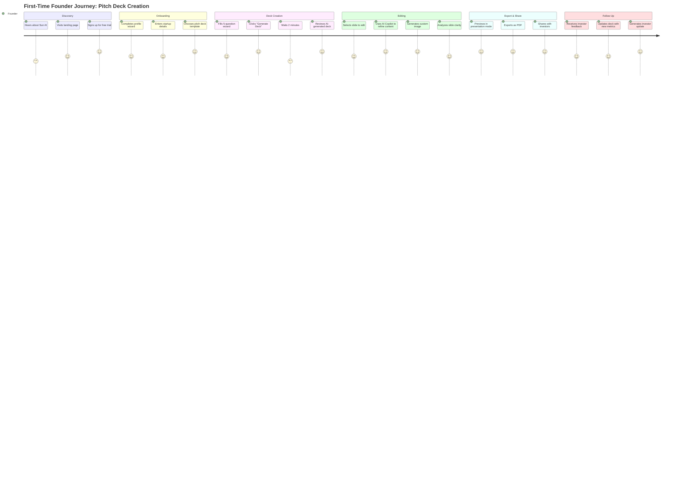
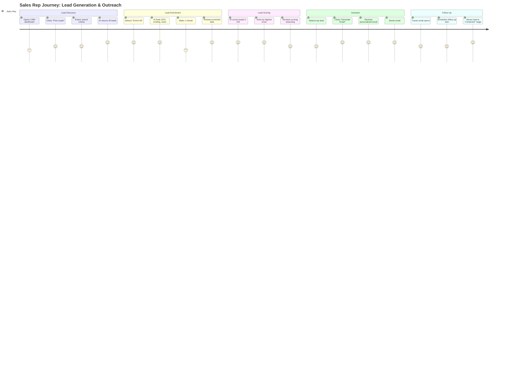
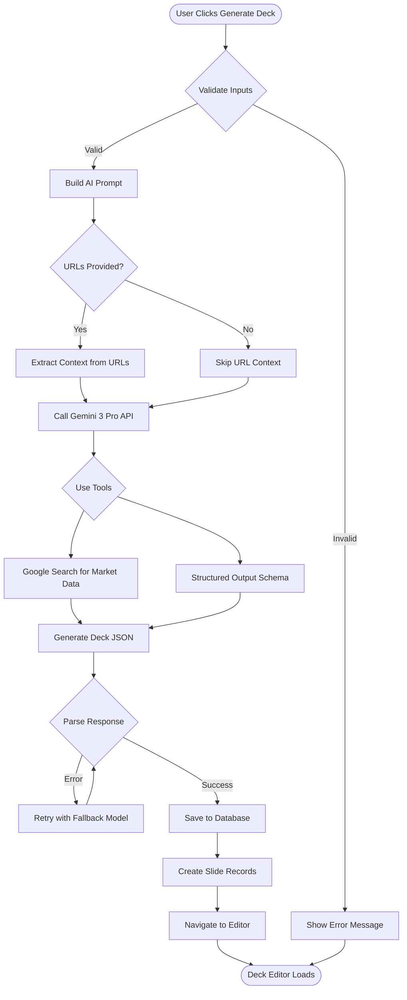
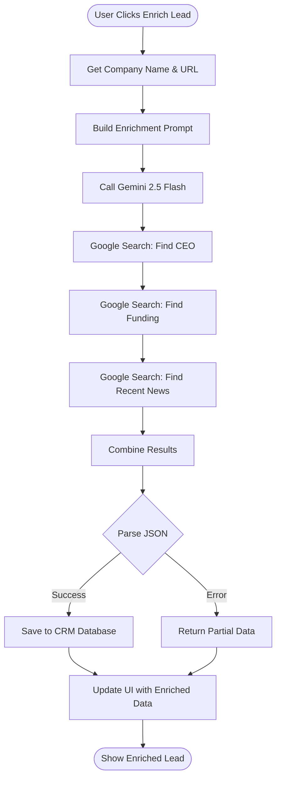
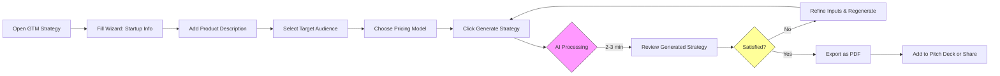
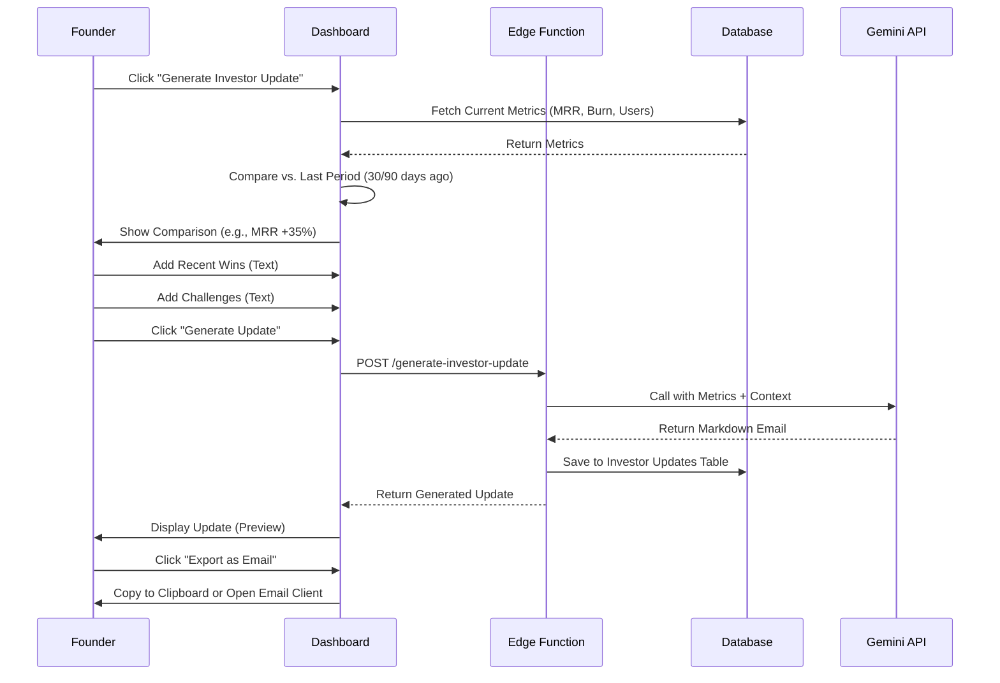
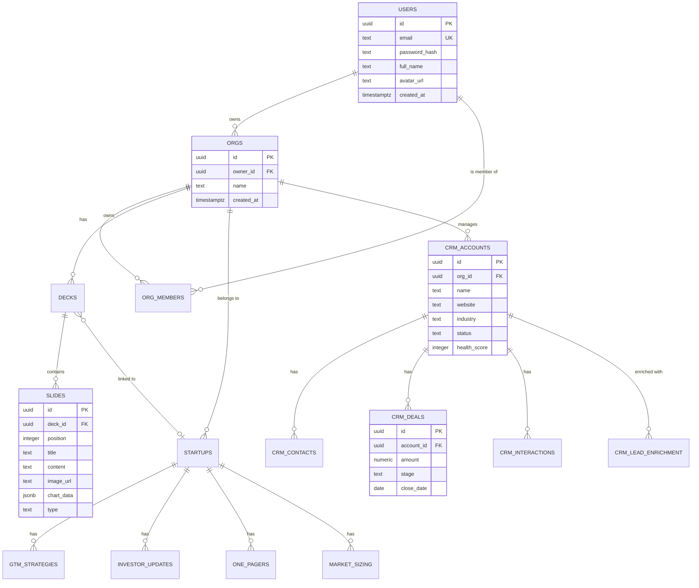
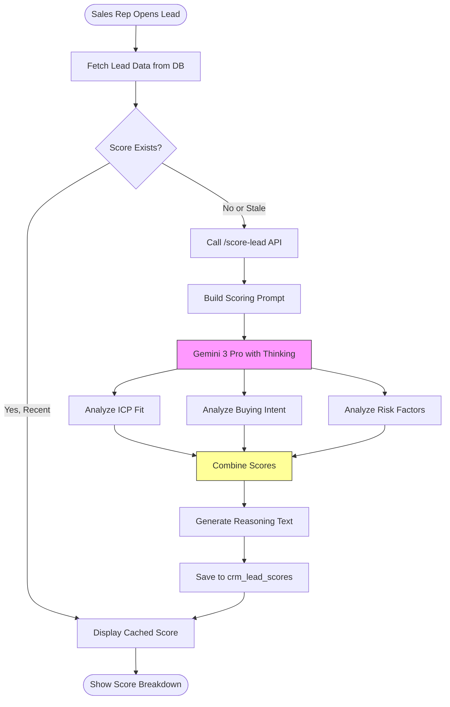

# Product Requirements Document (PRD)
# Sun AI - AI-Powered Startup Operating System

**Version:** 1.0  
**Last Updated:** 2025-01-19  
**Status:** Production Ready  
**Product Type:** AI-Powered SaaS Platform for Startups

---

## 1. Executive Summary

**Sun AI** is an intelligent startup operating system that automates the most time-consuming tasks founders face: creating investor-ready pitch decks, generating fundraising documents, managing customer relationships, and building go-to-market strategies. Powered by Google's Gemini AI (2.5 Flash & 3 Pro), the platform eliminates weeks of manual work by generating professional documents, analyzing data, and providing actionable insights in minutes.

**Core Value:** Transform raw startup data into investor-ready materials using advanced AI reasoning, structured outputs, and real-time data enrichment.

**Target Market:** Early-stage founders (Pre-seed to Series A) who need to move fast without hiring expensive consultants or agencies.

---

## 2. Problem Statement

### Current Pain Points:

1. **Pitch Deck Creation Takes Weeks**
   - Founders spend 40+ hours creating their first investor deck
   - Hiring designers costs $3,000-$10,000
   - Templates don't match their unique story

2. **Investor Documents Are Time-Sinks**
   - One-pagers, updates, and data rooms require different formats
   - Manual data updates lead to inconsistencies
   - No standardized way to calculate TAM/SAM/SOM

3. **CRM Systems Lack AI Intelligence**
   - Generic CRMs require manual data entry
   - No automated lead enrichment or scoring
   - No context-aware sales email generation

4. **Market Research Is Manual & Expensive**
   - Competitor analysis requires hours of research
   - Market sizing data is scattered across sources
   - No automated GTM strategy generation

### Quantified Impact:
- Average time to create pitch deck: **40 hours** → **2 minutes**
- Cost of investor materials: **$5,000-$15,000** → **$0 (automated)**
- Lead enrichment time: **30 min/lead** → **30 seconds/lead**

---

## 3. Target Users

### Primary Personas:

#### 1. **Solo Founder (Pre-seed)**
- **Age:** 25-35
- **Background:** Technical or product-focused
- **Pain:** No time/budget for design/copywriting
- **Goal:** Create professional pitch deck to raise $500K-$1M
- **Tech Savvy:** High (comfortable with AI tools)

**Example:** Sarah, 28, building a fintech app. Needs pitch deck for accelerator applications.

#### 2. **Early-Stage Startup Team (Seed)**
- **Team Size:** 2-5 people
- **Stage:** Product launched, some traction
- **Pain:** Updating investors monthly takes too long
- **Goal:** Automate investor updates and CRM
- **Budget:** $500-$2,000/month for tools

**Example:** John & Maria, raising $2M. Need investor updates, one-pagers, and GTM strategy.

#### 3. **Growth-Stage Founder (Series A)**
- **Team Size:** 10-30 employees
- **Stage:** Revenue-generating
- **Pain:** Need data rooms, market sizing, competitive analysis
- **Goal:** Professionalize fundraising process
- **Budget:** $5,000+/month

**Example:** David, CEO of SaaS company. Raising $10M Series A. Needs complete data room.

---

## 4. Core Features

### 4.1 **AI Pitch Deck Generator**
**Purpose:** Create investor-ready pitch decks in 2 minutes

**How It Works:**
1. Founder fills 5-question wizard (company, problem, solution, market, traction)
2. AI analyzes business context using Gemini 3 Pro
3. Generates 10-15 slides with narrative structure
4. Applies professional design template
5. Exports to PDF or editable format

**Inputs:**
- Business description (text)
- Company URLs (website, social media)
- Deck type (seed, series A, accelerator)
- Financial data (optional)
- Visual theme (modern, professional, creative)

**Outputs:**
- Complete pitch deck (10-15 slides)
- Slide types: Vision, Problem, Solution, Market, Product, Business Model, Traction, Competition, Team, Ask
- Downloadable as PDF
- Editable in web editor

**Real-World Example:**
> **Input:** "AI-powered event planning platform connecting brands with venues. $50K MRR, 500 events booked."
> 
> **Output:** Professional 12-slide deck with market sizing ($15B TAM), competitive positioning, financial projections, and visual branding.

---

### 4.2 **Interactive Deck Editor**
**Purpose:** Refine and customize AI-generated decks

**Features:**
- Visual slide editor (drag-drop text/images)
- AI Copilot for content refinement
- Image generation (Gemini Nano Banana)
- Slide analysis (clarity, impact, tone scores)
- Template switcher
- Real-time preview

**AI Features:**
- **Content Rewriting:** "Make this more investor-focused"
- **Headline Generation:** 5 headline variations per slide
- **Financial Projections:** Auto-generate from assumptions
- **Image Generation:** Create custom visuals from prompts

**Example Use Case:**
> Founder generates deck → Selects "Problem" slide → Asks AI: "Add more urgency" → AI rewrites with compelling statistics and emotional language.

---

### 4.3 **Smart Investor Docs Module**

#### **The "Perfect" One-Pager**
**Purpose:** Generate standard 1-page investor tear sheet

**Inputs:**
- Startup profile (from database)
- Recent metrics (MRR, burn rate, cash)
- URLs for additional context

**Outputs:**
- PDF one-pager with: Problem, Solution, Market, Traction, Team, Ask
- Formatted for email/PDF attachment
- Auto-updated when metrics change

**Example:**
> One-pager for SaaS startup: $100K MRR, 40% MoM growth, 18-month runway, raising $2M.

---

#### **Smart Investor Update**
**Purpose:** Draft monthly/quarterly update letters

**Features:**
- Auto-compares current vs. previous period
- Highlights wins/losses
- Generates narrative summary
- Formats as email or PDF

**Inputs:**
- Date range (last 30/90 days)
- Metrics (revenue, users, burn)
- Recent wins (text)
- Challenges (text)

**Outputs:**
- Markdown email ready to send
- Comparison tables (MoM growth)
- Visual charts (optional)

**Example:**
> "October Update: MRR grew 35% ($80K → $108K), new enterprise deal signed ($50K ARR), burn decreased 10%."

---

#### **Market Sizing Agent**
**Purpose:** Auto-calculate TAM, SAM, SOM with real data

**How It Works:**
1. User provides: Industry, target audience, location
2. AI uses Google Search to find credible sources
3. Calculates: ICP, Beachhead, TAM, SAM, SOM
4. Returns JSON with source URLs

**Inputs:**
- Industry (e.g., "Fitness Apps")
- Target audience (e.g., "25-40 urban professionals")
- Location (e.g., "US")

**Outputs:**
```json
{
  "icp": "25-40-year-old urban professionals who work out 3-5 times per week",
  "beachhead": "NYC fitness influencers",
  "tam": { "value": "$150B", "description": "Global fitness app market", "sourceUrl": "..." },
  "sam": { "value": "$10B", "description": "English-speaking fitness buyers", "sourceUrl": "..." },
  "som": { "value": "$50M", "description": "U.S. early adopters (1-5% of SAM)", "sourceUrl": "..." }
}
```

**Real-World Example:**
> Startup building fitness app → AI finds: TAM $150B (Statista), SAM $10B (US market), SOM $50M (realistic 3-year capture).

---

#### **Data Room Indexer**
**Purpose:** Generate data room readiness checklist

**Features:**
- Scans uploaded files or placeholders
- Generates "Readiness Score" (0-100%)
- Lists missing documents
- Provides templates for missing docs

**Checklist Includes:**
- Cap table
- Financial statements (3 years)
- Customer contracts
- IP documentation
- Board meeting minutes
- Employment agreements

---

### 4.4 **AI CRM & Sales Automation**

#### **Lead Generation Agent**
**Purpose:** Find prospects using AI-powered search

**How It Works:**
1. User enters: Industry, location, company size
2. AI uses Google Search to find companies
3. Returns structured list with website, LinkedIn, size

**Inputs:**
- Industry (e.g., "SaaS startups")
- Location (e.g., "San Francisco")
- Filters (employee count, funding stage)

**Outputs:**
- List of 20-50 leads
- Company name, website, LinkedIn, description
- Saved to CRM automatically

**Example:**
> Search: "Series A SaaS companies in SF, 10-50 employees" → Returns 30 qualified leads.

---

#### **Lead Enrichment Agent**
**Purpose:** Auto-enrich leads with CEO, funding, news

**Features:**
- Find CEO/founder name and LinkedIn
- Latest funding round and amount
- Recent news mentions
- Company description

**Inputs:**
- Company name
- Website URL (optional)

**Outputs:**
```json
{
  "ceo": "Jane Doe",
  "ceoLinkedIn": "linkedin.com/in/janedoe",
  "fundingRound": "Series A",
  "fundingAmount": "$10M",
  "latestNews": "Company launches new product feature",
  "newsUrl": "techcrunch.com/...",
  "description": "AI-powered analytics platform"
}
```

**Time Savings:** 30 min/lead → 30 seconds/lead

---

#### **Prospect Scoring Agent**
**Purpose:** Score leads using AI reasoning (0-100)

**Scoring Criteria:**
- **Fit Score:** How well they match ICP
- **Intent Score:** Likelihood to buy (based on news, hiring, funding)
- **Risk Score:** Red flags (negative news, layoffs)

**Outputs:**
```json
{
  "fitScore": 85,
  "intentScore": 70,
  "riskScore": 10,
  "reasoning": "Strong fit: Series A SaaS in target vertical. High intent: Just raised $10M. Low risk: Positive press coverage."
}
```

**Use Case:**
> Sort 100 leads by score → Focus on top 20 → Ignore bottom 30.

---

#### **Sales Outreach Agent**
**Purpose:** Generate context-aware cold emails

**How It Works:**
1. Select lead from CRM
2. AI reads: Company info, recent news, enriched data
3. Generates personalized email (3-5 sentences)
4. User reviews and sends

**Example Output:**
> "Hi Jane, saw you just raised $10M for your analytics platform. We help Series A SaaS companies like yours reduce customer churn by 30%. Quick 15-min call this week?"

**Personalization:** Uses company name, recent news, ICP match.

---

#### **Competitor Battlecard Agent**
**Purpose:** Analyze strengths/weaknesses vs competitors

**Inputs:**
- Your product description
- Competitor names (3-5)

**Outputs:**
- Feature comparison matrix
- Strengths vs. weaknesses
- Talking points for sales calls
- Objection handling

**Example:**
> Compare: "Your SaaS analytics tool" vs. "Mixpanel, Amplitude, Heap"
> → Matrix showing: Your strengths (simpler UI, lower price), Weaknesses (fewer integrations), Talking points.

---

### 4.5 **GTM Strategy Builder**
**Purpose:** Generate complete go-to-market strategy

**How It Works:**
1. Wizard collects: Startup info, product, target users, pricing
2. AI (Gemini 3 Pro with high thinking) reasons through GTM strategy
3. Generates structured plan with 90-day roadmap

**Inputs:**
- Startup name, industry, product description
- Target users, problem solved
- Pricing model (freemium, subscription, enterprise)
- Stage (MVP, Beta, v1)
- Website URL (optional)

**Outputs:**
```json
{
  "summary": "...",
  "targetCustomers": "...",
  "icpExample": "...",
  "valueProposition": "...",
  "positioning": "...",
  "channels": ["SEO", "Paid Ads", "Partnerships", "Community"],
  "activationPlan": "...",
  "pricing": "...",
  "retention": "...",
  "growthLoops": "...",
  "launchPlan90Days": [...],
  "successMetrics": [...],
  "risks": [...]
}
```

**Real-World Example:**
> SaaS startup selling to SMBs → GTM strategy:
> - Channels: SEO (blog content), Google Ads (competitor keywords), Partnerships (Shopify app store)
> - 90-day plan: Week 1-4 (landing page + SEO), Week 5-8 (ads campaign), Week 9-12 (partnerships)

---

### 4.6 **Founder Dashboard**
**Purpose:** Central hub for all startup metrics and AI tools

**Widgets:**
- **Financial Overview:** MRR, burn rate, runway, ARR
- **Metrics:** Users, revenue, growth rate, churn
- **CRM Pipeline:** Deal stages, win rate, average deal size
- **AI Activity:** Recent generations, cost tracking
- **Quick Actions:** Generate deck, update investors, score leads

**Data Sources:**
- Manual input (financial data)
- CRM system (deals, customers)
- AI runs (audit log)
- Integrated tools (Stripe, analytics)

---

## 5. Advanced Features / AI Features

### 5.1 **Gemini 3 Pro Features**

#### **Advanced Reasoning with Thinking**
- **Use Case:** Complex strategy documents (GTM, market sizing, competitive analysis)
- **Config:** `thinkingLevel: 'high'`
- **Benefit:** Deeper analysis, more nuanced recommendations

**Example:**
> Market sizing for niche B2B SaaS → AI reasons: "Global market $50B, but only 10% are English-speaking → SAM $5B. Your beachhead is vertical X → SOM $50M."

---

#### **Structured Outputs (JSON Schema)**
- **Use Case:** All AI generations (decks, one-pagers, GTM, CRM data)
- **Benefit:** Type-safe, predictable outputs
- **Format:** JSON matching pre-defined schemas

**Example Schema:**
```typescript
{
  type: "object",
  properties: {
    slides: {
      type: "array",
      items: {
        type: "object",
        properties: {
          type: { type: "string", enum: ["vision", "problem", "solution"] },
          title: { type: "string" },
          content: { type: "string" }
        }
      }
    }
  }
}
```

---

#### **Google Search Grounding**
- **Use Case:** Market data, competitor info, lead enrichment, news
- **Benefit:** Real-time, factual data (no hallucinations)
- **Tools:** `googleSearch: {}`

**Example:**
> "Find TAM for fitness apps" → AI searches Google → Returns: "$150B (Statista 2024)" with source URL.

---

#### **URL Context Tool**
- **Use Case:** Extract brand identity from URLs, analyze competitor websites
- **Benefit:** Automatic context extraction from web pages

**Example:**
> Input: "https://stripe.com"
> → AI extracts: Blue/purple color palette, clean typography, product-focused messaging.

---

#### **Image Generation (Nano Banana)**
- **Use Case:** Generate slide visuals, diagrams, icons
- **Model:** `gemini-2.5-flash-image`
- **Resolution:** 1024x1024 (1:1) or other aspect ratios

**Example:**
> Prompt: "Create a minimalist diagram showing 3-step user onboarding flow"
> → AI generates base64 image displayed in editor.

---

### 5.2 **AI Feature Matrix**

| Feature | AI Model | Tools Used | Output Format | Use Case |
|---------|----------|-----------|---------------|----------|
| **Pitch Deck Generation** | Gemini 2.5 Flash | Structured Output | JSON → Slides | Create full deck in 2 min |
| **Content Rewriting** | Gemini 2.5 Flash | Text Generation | Text | Refine slide content |
| **Market Sizing** | Gemini 3 Pro | Google Search, Thinking | JSON with sources | Calculate TAM/SAM/SOM |
| **Lead Enrichment** | Gemini 2.5 Flash | Google Search | JSON | Find CEO, funding, news |
| **Prospect Scoring** | Gemini 3 Pro | Thinking | JSON (scores) | Score leads 0-100 |
| **Cold Email Generation** | Gemini 2.5 Flash | Text Generation | Text | Personalized outreach |
| **GTM Strategy** | Gemini 3 Pro | Thinking, Google Search | JSON | Complete GTM plan |
| **Competitor Analysis** | Gemini 2.5 Flash | Google Search, URL Context | JSON | Battlecard matrix |
| **Image Generation** | Gemini 2.5 Flash Image | Image Generation | Base64 PNG | Slide visuals |
| **Slide Analysis** | Gemini 2.5 Flash | Text Analysis | JSON (scores) | Clarity/impact/tone |

---

## 6. Use Cases + Real World Examples

### Use Case 1: **Pre-Seed Founder Creating First Pitch Deck**

**Scenario:**
Sarah is a 28-year-old solo founder building a fintech app. She needs a pitch deck to apply to Y Combinator but has no design skills or budget.

**Journey:**
1. Opens Sun AI → "Create Pitch Deck"
2. Fills wizard: "AI-powered expense tracker for freelancers. Saves 5 hours/month on bookkeeping."
3. Adds website URL and financial data ($5K MRR, 200 users)
4. Clicks "Generate Deck" → 2 minutes later, 12-slide deck ready
5. Edits "Problem" slide using AI Copilot: "Make this more urgent"
6. Generates custom image for "Solution" slide
7. Exports as PDF → Submits to YC

**Result:** Professional deck in 30 minutes vs. 40 hours manually.

---

### Use Case 2: **Seed-Stage Startup Sending Monthly Investor Updates**

**Scenario:**
John raised $1M 6 months ago. His 10 investors expect monthly updates, but writing them takes 3 hours.

**Journey:**
1. Opens Sun AI → "Investor Update"
2. AI auto-pulls metrics from dashboard (MRR, burn, runway)
3. John adds: "Signed enterprise deal with Acme Corp ($50K ARR)"
4. AI generates update: "October Update: MRR grew 35%, new enterprise deal, burn decreased 10%"
5. Formats as email → Sends to 10 investors

**Result:** 3 hours → 10 minutes (saved 2.5 hours/month).

---

### Use Case 3: **Series A Founder Building GTM Strategy**

**Scenario:**
Maria is raising $5M Series A. Investors keep asking: "What's your GTM strategy?" She doesn't have a clear answer.

**Journey:**
1. Opens Sun AI → "GTM Strategy"
2. Fills wizard: Industry (B2B SaaS), Target (HR managers at 100-500 employee companies), Pricing (Freemium)
3. AI reasons using Gemini 3 Pro (high thinking)
4. Generates:
   - ICP: "HR managers at 100-500 employee companies struggling with manual onboarding"
   - Channels: SEO (blog content), LinkedIn Ads, partnerships (HR software)
   - 90-day plan: Launch landing page (Week 1-4), run ads (Week 5-8), close 3 partnerships (Week 9-12)
5. Exports as PDF → Adds to pitch deck

**Result:** Clear GTM strategy in 15 minutes vs. hiring consultant for $10K.

---

### Use Case 4: **Sales Team Using AI CRM for Lead Generation**

**Scenario:**
David's SaaS startup needs 100 qualified leads per month. Manual prospecting takes his sales team 40 hours/month.

**Journey:**
1. Opens CRM → "Find Leads"
2. Enters: "Series A SaaS companies in SF, 10-50 employees"
3. AI searches Google → Returns 30 leads
4. David clicks "Enrich All" → AI finds CEO, funding, recent news for each
5. AI scores leads → Top 10 scored 85+ (strong fit + high intent)
6. David selects top lead → Clicks "Generate Email"
7. AI drafts: "Hi Jane, saw you raised $10M. We help Series A SaaS reduce churn by 30%. Quick call?"
8. David reviews, tweaks, sends

**Result:** 40 hours/month → 5 hours/month (8x faster).

---

### Use Case 5: **Founder Preparing for Investor Meeting**

**Scenario:**
Lisa has a meeting with Sequoia next week. She needs: One-pager, updated deck, market sizing, and competitive analysis.

**Journey:**
1. **Day 1:** Generates one-pager (2 min) → Reviews, exports
2. **Day 2:** Updates pitch deck with Q4 metrics (5 min)
3. **Day 3:** Runs market sizing agent → TAM $50B, SAM $5B, SOM $100M (3 min)
4. **Day 4:** Generates competitor battlecard (5 min) → Prints for meeting
5. **Day 5:** Practices pitch using presentation mode

**Result:** Fully prepared in 1 hour vs. 2 weeks of manual work.

---

## 7. User Stories

### Epic 1: Pitch Deck Creation

#### User Story 1.1: Generate Deck from Wizard
**As a** founder  
**I want to** fill a simple 5-question wizard  
**So that** I can generate a complete pitch deck in 2 minutes

**Acceptance Criteria:**
- [ ] Wizard has 5 steps: Business, Details, Financials, Theme, Review
- [ ] AI generates 10-15 slides based on inputs
- [ ] Deck includes: Vision, Problem, Solution, Market, Product, Business Model, Traction, Competition, Team, Ask
- [ ] User is redirected to deck editor after generation

---

#### User Story 1.2: Edit Slide Content with AI Copilot
**As a** founder  
**I want to** ask AI to rewrite slide content  
**So that** I can refine messaging without manual editing

**Acceptance Criteria:**
- [ ] AI Copilot accepts natural language prompts ("Make this more investor-focused")
- [ ] AI rewrites content in <5 seconds
- [ ] User can accept, reject, or iterate on suggestions
- [ ] Changes are saved automatically

---

#### User Story 1.3: Generate Custom Images
**As a** founder  
**I want to** generate custom images for slides  
**So that** my deck has unique visuals instead of stock photos

**Acceptance Criteria:**
- [ ] User clicks "Generate Image" on any slide
- [ ] AI generates 1024x1024 image from prompt
- [ ] Image is displayed inline in slide
- [ ] User can regenerate or upload custom image

---

### Epic 2: Investor Documents

#### User Story 2.1: Generate One-Pager
**As a** founder  
**I want to** generate a one-page investor tear sheet  
**So that** I can email it to investors quickly

**Acceptance Criteria:**
- [ ] One-pager includes: Problem, Solution, Market, Traction, Team, Ask
- [ ] Data is auto-pulled from startup profile
- [ ] Formatted as PDF (email-ready)
- [ ] Updates automatically when metrics change

---

#### User Story 2.2: Calculate Market Sizing
**As a** founder  
**I want to** calculate TAM/SAM/SOM using real data  
**So that** I can answer investor questions accurately

**Acceptance Criteria:**
- [ ] User enters: Industry, target audience, location
- [ ] AI searches Google for credible sources
- [ ] Returns: ICP, Beachhead, TAM, SAM, SOM with source URLs
- [ ] Data is saved to startup profile

---

### Epic 3: CRM & Sales

#### User Story 3.1: Find Leads with AI
**As a** sales rep  
**I want to** search for qualified leads using AI  
**So that** I don't have to manually research companies

**Acceptance Criteria:**
- [ ] User enters: Industry, location, company size
- [ ] AI returns 20-50 leads with website, LinkedIn, description
- [ ] Leads are saved to CRM automatically
- [ ] User can enrich leads with one click

---

#### User Story 3.2: Score Leads Automatically
**As a** sales rep  
**I want to** see AI scores (0-100) for each lead  
**So that** I can prioritize high-intent prospects

**Acceptance Criteria:**
- [ ] AI scores: Fit (ICP match), Intent (buying signals), Risk (red flags)
- [ ] Scores displayed in CRM with reasoning
- [ ] User can sort/filter by score
- [ ] Scores update when new data is available

---

## 8. User Journey (Step-by-Step)

### Journey 1: **First-Time Founder Creating Pitch Deck**



---

### Journey 2: **Sales Rep Using AI CRM**



---

## 9. Workflows (System + User)

### Workflow 1: **Pitch Deck Generation (System)**



---

### Workflow 2: **Lead Enrichment (System)**



---

### Workflow 3: **GTM Strategy Generation (User)**



---

### Workflow 4: **Investor Update (User)**



---

## 10. Mermaid Diagrams

### 10.1 **Entity Relationship Diagram (ERD)**



---

### 10.2 **System Architecture (C4 Deployment)**

```mermaid
C4Deployment
    title Sun AI - Production Architecture (Google Cloud)

    Deployment_Node(browser, "User's Device") {
        Container(spa, "React SPA", "Vite + TypeScript", "User interface for all features")
    }

    Deployment_Node(gcp, "Google Cloud Platform") {
        Deployment_Node(cloud_run, "Cloud Run") {
            Container(api, "API Server", "Node.js / Express", "Handles auth, business logic, AI calls")
        }
        
        Deployment_Node(supabase_cloud, "Supabase Cloud") {
            Database(db, "PostgreSQL 15", "Stores users, decks, CRM, metrics")
            Container(edge_functions, "Edge Functions", "Deno", "AI generation endpoints")
        }
        
        Deployment_Node(storage, "Cloud Storage") {
            Container(assets, "Asset Bucket", "GCS", "Stores images, PDFs, exports")
        }
    }
    
    Deployment_Node(external, "External Services") {
        System_Ext(gemini, "Gemini API", "AI generation (2.5 Flash, 3 Pro, Nano Banana)")
        System_Ext(stripe, "Stripe", "Payment processing & billing")
    }
    
    Rel(spa, api, "Makes API calls", "HTTPS/REST")
    Rel(api, db, "Reads/writes data", "SQL")
    Rel(api, gemini, "Generates content", "HTTPS")
    Rel(spa, edge_functions, "Invokes AI functions", "HTTPS")
    Rel(edge_functions, db, "Saves results", "SQL")
    Rel(edge_functions, gemini, "Calls AI models", "HTTPS")
    Rel(api, stripe, "Processes payments", "HTTPS")
```

---

### 10.3 **Pitch Deck Generation Sequence**

```mermaid
sequenceDiagram
    participant User
    participant UI as Wizard UI
    participant Store as Zustand Store
    participant Edge as Edge Function
    participant Gemini as Gemini 3 Pro
    participant DB as Supabase DB
    
    User->>UI: Fills wizard (5 steps)
    UI->>Store: Save wizard data
    User->>UI: Click "Generate Deck"
    
    UI->>Edge: POST /generate-deck
    Note over Edge: Build AI prompt from wizard data
    
    Edge->>Gemini: generateContent({
        model: "gemini-3-pro-preview",
        tools: [googleSearch, urlContext],
        responseMimeType: "application/json"
    })
    
    Gemini->>Gemini: Search for market data
    Gemini->>Gemini: Extract URL context
    Gemini->>Gemini: Reason using thinking
    
    Gemini-->>Edge: Return JSON {slides: [...]}
    
    Edge->>DB: INSERT INTO decks
    Edge->>DB: INSERT INTO slides (10-15 rows)
    
    DB-->>Edge: Return deck_id
    Edge-->>UI: Return {deckId, slides}
    
    UI->>UI: Navigate to /pitch-decks/{deckId}/edit
    UI->>User: Display deck in editor
```

---

### 10.4 **CRM Lead Scoring Flow**



---

## 11. Website Pages (Purpose + Content)

### Page Structure:

| Page | URL | Purpose | Content | CTA |
|------|-----|---------|---------|-----|
| **Landing** | `/` | Convert visitors to signups | Hero: "Create investor-ready pitch decks in 2 minutes" + Features grid + Social proof + Pricing | "Start Free Trial" |
| **How It Works** | `/how-it-works` | Explain product workflow | 3-step process: Wizard → AI Generation → Edit & Export. Video demo. | "Try It Now" |
| **Pricing** | `/pricing` | Show plans and convert to paid | 3 tiers: Free (1 deck), Pro ($29/mo), Team ($99/mo). Feature comparison table. | "Start Free Trial" |
| **About** | `/about` | Build trust and credibility | Team bios, mission statement, testimonials from founders | "Contact Us" |
| **Blog** | `/blog` | SEO traffic and thought leadership | Articles: "How to pitch VCs", "Pitch deck templates", "Market sizing guide" | Email signup |
| **Services** | `/services` | Upsell consulting services | Custom deck design, pitch coaching, investor intro services | "Book Consultation" |

---

### Landing Page Sections:

1. **Hero Section**
   - Headline: "Create Investor-Ready Pitch Decks in 2 Minutes"
   - Subheadline: "AI-powered platform that turns your startup story into professional presentations"
   - CTA: "Start Free Trial" (prominent button)
   - Visual: Animated GIF showing deck generation

2. **Social Proof**
   - Logos: YC startups, accelerators, VCs
   - Testimonials: "Saved me 40 hours" - Founder, YC S23
   - Stats: "10,000+ decks generated, $500M+ raised"

3. **Features Grid** (3 columns)
   - **AI Deck Generator:** Complete pitch deck in minutes
   - **Smart CRM:** AI-powered lead generation and scoring
   - **Investor Docs:** One-pagers, updates, market sizing

4. **How It Works** (3 steps)
   - Step 1: Answer 5 questions about your startup
   - Step 2: AI generates professional deck
   - Step 3: Edit, customize, and export

5. **Use Cases** (tabs)
   - Fundraising (pitch decks, one-pagers)
   - Sales (CRM, lead gen, cold emails)
   - Strategy (GTM, market sizing, competitive analysis)

6. **Pricing Preview**
   - Quick tier comparison
   - "See Full Pricing" link

7. **CTA Section**
   - "Join 10,000+ founders building better pitch decks"
   - Email signup + "Start Free Trial"

---

## 12. Dashboard Pages (Purpose + Data Shown)

### Dashboard Navigation:

```
┌─────────────────────────────────────────────────┐
│  Sun AI Logo        [Search]     [User Menu]    │
├─────────────────────────────────────────────────┤
│ Sidebar                Main Content             │
│                                                  │
│ Dashboard                                        │
│ Pitch Decks                                      │
│ Investor Docs                                    │
│ CRM                                              │
│ GTM Strategy                                     │
│ Metrics                                          │
│ Settings                                         │
└─────────────────────────────────────────────────┘
```

---

### Page 1: **Dashboard (Home)**

**Purpose:** Central hub showing overview of all activities and metrics

**Widgets:**
1. **Welcome Banner**
   - "Welcome back, {Name}"
   - Quick actions: "Create Deck", "Generate Update", "Find Leads"

2. **Financial Metrics** (4 cards)
   - MRR: $50,000 (+35% MoM)
   - Burn Rate: $30,000/mo (-10% MoM)
   - Runway: 18 months
   - ARR: $600,000

3. **CRM Pipeline** (visual chart)
   - Horizontal bar: Leads → Qualified → Demo → Proposal → Closed
   - Deal counts per stage

4. **Recent Activity** (timeline)
   - "Pitch Deck created: Series A Deck" (2 hours ago)
   - "Investor Update sent to 10 investors" (1 day ago)
   - "30 leads enriched" (2 days ago)

5. **AI Usage** (chart)
   - Generations this month: 150
   - Cost estimate: $12.50
   - Tokens used: 2.5M

---

### Page 2: **Pitch Decks**

**Purpose:** Manage all pitch decks (create, edit, view)

**Layout:**
- Header: "Pitch Decks" + "Create New Deck" button
- Grid view: Deck cards (thumbnail, title, last edited, status)
- Filters: All / Drafts / Published / Archived

**Deck Card:**
- Thumbnail (first slide preview)
- Title: "Series A Deck - Q4 2024"
- Last edited: "2 hours ago"
- Actions: Edit, Duplicate, Export, Delete

**Data Shown:**
- Deck title, description, template, created date, last updated
- Slide count, status (draft/published)
- Quick actions: Present, Export PDF, Share Link

---

### Page 3: **Investor Docs**

**Purpose:** Generate and manage investor documents

**Tabs:**
1. **One-Pagers**
   - List of one-pagers with preview
   - "Generate New One-Pager" button

2. **Investor Updates**
   - Timeline of updates (monthly/quarterly)
   - "Generate Update" button
   - Comparison charts (MoM growth)

3. **Market Sizing**
   - Saved market analyses (TAM/SAM/SOM)
   - "Calculate Market Size" button
   - Visual breakdown (pie chart)

4. **Data Room**
   - Checklist of required documents
   - Readiness score (0-100%)
   - Upload missing docs

**Example One-Pager Card:**
- Title: "One-Pager - Series A"
- Date: "Dec 2024"
- Status: "Up to date" (green badge)
- Actions: View, Export PDF, Update

---

### Page 4: **CRM**

**Purpose:** Manage customer accounts, deals, and sales pipeline

**Layout:**
1. **KPI Row** (4 cards)
   - Total Accounts: 150
   - Active Deals: 25
   - Pipeline Value: $500K
   - Win Rate: 35%

2. **Pipeline Visualization**
   - Horizontal stacked bar: Lead → Qualified → Demo → Proposal → Closed Won
   - Click to filter table

3. **Account Table**
   - Columns: Name, Status, Health Score, Next Task, Last Contact
   - Filters: Status (Active/At Risk/Churned), Industry, Deal Stage
   - Search: Company name
   - Actions: Enrich, Score, Email, View Details

4. **Quick Actions Bar**
   - "Find Leads" (AI search)
   - "Import CSV"
   - "Add Account"

**Data Shown:**
- Account name, website, industry, status (active/at risk/churned)
- Health score (0-100, color-coded)
- Deal stage, amount, close date
- Last interaction, next task

---

### Page 5: **Prospecting**

**Purpose:** AI-powered lead generation and outreach

**Layout:**
1. **Search Panel** (left sidebar)
   - Industry dropdown
   - Location input
   - Company size range
   - Funding stage checkboxes
   - "Search Leads" button

2. **Results Grid** (main area)
   - Lead cards with: Company name, website, description, employee count
   - Actions: Enrich, Score, Add to CRM

3. **Selected Leads Panel** (right sidebar)
   - List of selected leads (checkboxes)
   - "Enrich All" button
   - "Score All" button
   - "Generate Email" button

**Data Shown:**
- Company name, website, LinkedIn, description
- Employee count, funding round, industry
- Enriched data: CEO, funding, recent news
- Lead score: Fit, Intent, Risk

---

### Page 6: **GTM Strategy**

**Purpose:** Generate and view go-to-market strategy

**Layout:**
1. **Wizard (if no strategy exists)**
   - 5-step form: Startup info, product, target users, pricing, stage
   - "Generate Strategy" button

2. **Strategy Dashboard (if strategy exists)**
   - Summary card
   - ICP card (ideal customer profile)
   - Value proposition card
   - Channels grid (SEO, Paid, Partnerships, Community)
   - 90-day roadmap (timeline)
   - Success metrics (table)
   - Risks & mitigations (list)

**Actions:**
- Regenerate Strategy
- Export as PDF
- Add to Pitch Deck
- Share with Team

---

### Page 7: **Metrics (Financial Overview)**

**Purpose:** Track financial and growth metrics

**Widgets:**
1. **Revenue Chart** (line chart)
   - MRR over time (12 months)
   - ARR projection

2. **Burn Rate** (stacked bar chart)
   - Monthly expenses by category (payroll, marketing, ops)
   - Runway indicator

3. **Growth Metrics** (4 cards)
   - Users: 5,000 (+20% MoM)
   - Churn Rate: 3% (-1% MoM)
   - LTV: $10,000
   - CAC: $1,500

4. **Unit Economics**
   - LTV/CAC Ratio: 6.7x
   - Payback Period: 8 months
   - Gross Margin: 75%

**Data Entry:**
- "Add Financial Data" button
- Form: MRR, burn rate, users, churn
- Auto-calculates: Runway, growth rate, projections

---

## 13. Data Model (Tables, Fields, Relationships)

### Table: `users`
| Field | Type | Constraints | Description |
|-------|------|-------------|-------------|
| `id` | UUID | PRIMARY KEY | User ID |
| `email` | TEXT | UNIQUE, NOT NULL | User email |
| `password_hash` | TEXT | NOT NULL | Hashed password |
| `full_name` | TEXT | | Full name |
| `avatar_url` | TEXT | | Avatar URL |
| `created_at` | TIMESTAMPTZ | DEFAULT NOW() | Creation timestamp |

---

### Table: `orgs`
| Field | Type | Constraints | Description |
|-------|------|-------------|-------------|
| `id` | UUID | PRIMARY KEY | Organization ID |
| `owner_id` | UUID | FOREIGN KEY (users.id) | Organization owner |
| `name` | TEXT | NOT NULL | Organization name |
| `created_at` | TIMESTAMPTZ | DEFAULT NOW() | Creation timestamp |

---

### Table: `startups`
| Field | Type | Constraints | Description |
|-------|------|-------------|-------------|
| `id` | UUID | PRIMARY KEY | Startup ID |
| `org_id` | UUID | FOREIGN KEY (orgs.id) | Owning organization |
| `name` | TEXT | NOT NULL | Startup name |
| `website_url` | TEXT | | Website URL |
| `tagline` | TEXT | | One-line description |
| `logo_url` | TEXT | | Logo URL |
| `industry` | TEXT | | Industry category |
| `stage` | TEXT | | Funding stage (seed, series A) |
| `created_at` | TIMESTAMPTZ | DEFAULT NOW() | Creation timestamp |

---

### Table: `decks`
| Field | Type | Constraints | Description |
|-------|------|-------------|-------------|
| `id` | UUID | PRIMARY KEY | Deck ID |
| `org_id` | UUID | FOREIGN KEY (orgs.id) | Owning organization |
| `startup_id` | UUID | FOREIGN KEY (startups.id), NULLABLE | Linked startup |
| `title` | TEXT | NOT NULL | Deck title |
| `description` | TEXT | | Deck description |
| `template` | TEXT | DEFAULT 'modern' | Template name |
| `deck_type` | TEXT | | seed, series-a, accelerator |
| `status` | TEXT | DEFAULT 'draft' | draft, published, archived |
| `created_at` | TIMESTAMPTZ | DEFAULT NOW() | Creation timestamp |
| `updated_at` | TIMESTAMPTZ | DEFAULT NOW() | Last update timestamp |

---

### Table: `slides`
| Field | Type | Constraints | Description |
|-------|------|-------------|-------------|
| `id` | UUID | PRIMARY KEY | Slide ID |
| `deck_id` | UUID | FOREIGN KEY (decks.id) | Parent deck |
| `position` | INTEGER | NOT NULL | Slide order (0-indexed) |
| `type` | TEXT | NOT NULL | vision, problem, solution, market, etc. |
| `title` | TEXT | | Slide title |
| `content` | TEXT | | Slide content (markdown) |
| `image_url` | TEXT | | Image URL or base64 data URI |
| `chart_data` | JSONB | | Chart configuration |
| `table_data` | JSONB | | Table data |
| `template` | TEXT | | Override template for this slide |
| `created_at` | TIMESTAMPTZ | DEFAULT NOW() | Creation timestamp |
| `updated_at` | TIMESTAMPTZ | DEFAULT NOW() | Last update timestamp |

---

### Table: `one_pagers`
| Field | Type | Constraints | Description |
|-------|------|-------------|-------------|
| `id` | UUID | PRIMARY KEY | One-pager ID |
| `startup_id` | UUID | FOREIGN KEY (startups.id) | Linked startup |
| `title` | TEXT | NOT NULL | One-pager title |
| `content` | JSONB | NOT NULL | Structured content |
| `pdf_url` | TEXT | | Generated PDF URL |
| `created_at` | TIMESTAMPTZ | DEFAULT NOW() | Creation timestamp |

---

### Table: `investor_updates`
| Field | Type | Constraints | Description |
|-------|------|-------------|-------------|
| `id` | UUID | PRIMARY KEY | Update ID |
| `startup_id` | UUID | FOREIGN KEY (startups.id) | Linked startup |
| `period_start` | DATE | NOT NULL | Period start date |
| `period_end` | DATE | NOT NULL | Period end date |
| `content` | TEXT | NOT NULL | Update content (markdown) |
| `metrics` | JSONB | | Metrics snapshot |
| `sent_at` | TIMESTAMPTZ | NULLABLE | When sent to investors |
| `created_at` | TIMESTAMPTZ | DEFAULT NOW() | Creation timestamp |

---

### Table: `market_sizing`
| Field | Type | Constraints | Description |
|-------|------|-------------|-------------|
| `id` | UUID | PRIMARY KEY | Market sizing ID |
| `startup_id` | UUID | FOREIGN KEY (startups.id) | Linked startup |
| `icp` | TEXT | | Ideal customer profile |
| `beachhead` | TEXT | | Beachhead market |
| `tam` | JSONB | | TAM (value, description, sourceUrl) |
| `sam` | JSONB | | SAM (value, description, sourceUrl) |
| `som` | JSONB | | SOM (value, description, sourceUrl) |
| `reasoning` | TEXT | | AI reasoning |
| `created_at` | TIMESTAMPTZ | DEFAULT NOW() | Creation timestamp |

---

### Table: `gtm_strategies`
| Field | Type | Constraints | Description |
|-------|------|-------------|-------------|
| `id` | UUID | PRIMARY KEY | GTM strategy ID |
| `startup_id` | UUID | FOREIGN KEY (startups.id) | Linked startup |
| `summary` | TEXT | | Strategy summary |
| `target_customers` | TEXT | | Target customer description |
| `icp_example` | TEXT | | ICP example |
| `value_proposition` | TEXT | | Value proposition |
| `positioning` | TEXT | | Positioning statement |
| `channels` | JSONB | | Marketing channels (array) |
| `activation_plan` | TEXT | | User activation plan |
| `pricing` | TEXT | | Pricing strategy |
| `retention` | TEXT | | Retention strategy |
| `growth_loops` | TEXT | | Growth loop description |
| `launch_plan_90_days` | JSONB | | 90-day roadmap (array) |
| `success_metrics` | JSONB | | Success metrics (array) |
| `risks` | JSONB | | Risks & mitigations (array) |
| `created_at` | TIMESTAMPTZ | DEFAULT NOW() | Creation timestamp |

---

### Table: `crm_accounts`
| Field | Type | Constraints | Description |
|-------|------|-------------|-------------|
| `id` | UUID | PRIMARY KEY | Account ID |
| `org_id` | UUID | FOREIGN KEY (orgs.id) | Owning organization |
| `name` | TEXT | NOT NULL | Company name |
| `website` | TEXT | | Company website |
| `linkedin` | TEXT | | LinkedIn URL |
| `industry` | TEXT | | Industry category |
| `employee_count` | TEXT | | Employee count range |
| `status` | TEXT | DEFAULT 'active' | active, at_risk, churned |
| `health_score` | INTEGER | | 0-100 health score |
| `extended_info` | JSONB | | Extended metadata |
| `created_at` | TIMESTAMPTZ | DEFAULT NOW() | Creation timestamp |

---

### Table: `crm_contacts`
| Field | Type | Constraints | Description |
|-------|------|-------------|-------------|
| `id` | UUID | PRIMARY KEY | Contact ID |
| `account_id` | UUID | FOREIGN KEY (crm_accounts.id) | Parent account |
| `name` | TEXT | NOT NULL | Contact name |
| `email` | TEXT | | Email address |
| `title` | TEXT | | Job title |
| `linkedin` | TEXT | | LinkedIn URL |
| `created_at` | TIMESTAMPTZ | DEFAULT NOW() | Creation timestamp |

---

### Table: `crm_deals`
| Field | Type | Constraints | Description |
|-------|------|-------------|-------------|
| `id` | UUID | PRIMARY KEY | Deal ID |
| `account_id` | UUID | FOREIGN KEY (crm_accounts.id) | Parent account |
| `name` | TEXT | NOT NULL | Deal name |
| `amount` | NUMERIC | | Deal value |
| `stage` | TEXT | NOT NULL | lead, qualified, demo, proposal, closed_won, closed_lost |
| `close_date` | DATE | | Expected/actual close date |
| `created_at` | TIMESTAMPTZ | DEFAULT NOW() | Creation timestamp |

---

### Table: `crm_lead_enrichment`
| Field | Type | Constraints | Description |
|-------|------|-------------|-------------|
| `id` | UUID | PRIMARY KEY | Enrichment ID |
| `account_id` | UUID | FOREIGN KEY (crm_accounts.id) | Parent account |
| `ceo_name` | TEXT | | CEO name |
| `ceo_linkedin` | TEXT | | CEO LinkedIn URL |
| `funding_round` | TEXT | | Latest funding round |
| `funding_amount` | TEXT | | Funding amount |
| `latest_news` | TEXT | | Recent news headline |
| `news_url` | TEXT | | News article URL |
| `created_at` | TIMESTAMPTZ | DEFAULT NOW() | Creation timestamp |

---

### Table: `crm_lead_scores`
| Field | Type | Constraints | Description |
|-------|------|-------------|-------------|
| `id` | UUID | PRIMARY KEY | Score ID |
| `account_id` | UUID | FOREIGN KEY (crm_accounts.id) | Parent account |
| `fit_score` | INTEGER | | ICP fit score (0-100) |
| `intent_score` | INTEGER | | Buying intent score (0-100) |
| `risk_score` | INTEGER | | Risk score (0-100) |
| `reasoning` | TEXT | | AI reasoning text |
| `created_at` | TIMESTAMPTZ | DEFAULT NOW() | Creation timestamp |

---

### Table: `ai_runs`
| Field | Type | Constraints | Description |
|-------|------|-------------|-------------|
| `id` | UUID | PRIMARY KEY | AI run ID |
| `user_id` | UUID | FOREIGN KEY (users.id) | User who triggered |
| `tool_name` | TEXT | NOT NULL | AI tool used (e.g., generate-deck) |
| `args_json` | JSONB | | Input arguments |
| `status` | TEXT | DEFAULT 'success' | success, error |
| `duration_ms` | INTEGER | | Execution time |
| `cost_estimate` | NUMERIC | | Estimated cost ($) |
| `created_at` | TIMESTAMPTZ | DEFAULT NOW() | Creation timestamp |

---

## 14. AI Functions (If Applicable)

### AI Function Matrix:

| Edge Function | Model | Tools | Input | Output | Use Case |
|--------------|-------|-------|-------|--------|----------|
| `generate-deck` | Gemini 3 Pro | Google Search, URL Context, Structured Output | Business context, URLs, financials | JSON (10-15 slides) | Pitch deck generation |
| `modify-slide-content` | Gemini 2.5 Flash | Text Generation | Slide content, prompt | Text | Content rewriting |
| `generate-image-preview` | Gemini 2.5 Flash Image | Image Generation | Image prompt, aspect ratio | Base64 PNG | Slide images |
| `analyze-slide` | Gemini 2.5 Flash | Text Analysis | Slide content | JSON (clarity, impact, tone scores) | Slide quality analysis |
| `generate-one-pager` | Gemini 2.5 Flash | Structured Output | Startup profile, metrics | JSON → PDF | Investor one-pager |
| `generate-investor-update` | Gemini 2.5 Flash | Text Generation | Metrics, wins, challenges | Markdown email | Monthly updates |
| `generate-market-sizing` | Gemini 3 Pro | Google Search, Thinking | Industry, location, audience | JSON (TAM/SAM/SOM) | Market sizing |
| `generate-gtm-strategy` | Gemini 3 Pro | Google Search, Thinking, Structured Output | Startup info, product, pricing | JSON (complete GTM) | GTM strategy |
| `generate-leads` | Gemini 2.5 Flash | Google Search | Industry, location, filters | JSON (20-50 leads) | Lead generation |
| `enrich-lead` | Gemini 2.5 Flash | Google Search | Company name, website | JSON (CEO, funding, news) | Lead enrichment |
| `score-lead` | Gemini 3 Pro | Thinking | Lead data, ICP definition | JSON (fit, intent, risk) | Lead scoring |
| `generate-cold-email` | Gemini 2.5 Flash | Text Generation | Lead data, product info | Text (email draft) | Sales outreach |
| `generate-battlecard` | Gemini 2.5 Flash | Google Search, URL Context | Product, competitors | JSON (comparison matrix) | Competitive analysis |

---

### Example: `generate-market-sizing` Edge Function

**File:** `supabase/functions/generate-market-sizing/index.ts`

**Inputs:**
```typescript
interface MarketSizingRequest {
  startupId: string;
  industry: string;
  targetAudience: string;
  location: string;
}
```

**AI Prompt:**
```typescript
const prompt = `Calculate the Market Size for a startup in the **${industry}** space, targeting **${targetAudience}** in **${location}**.

1. Define the ICP: Who is the perfect customer?
2. Identify the Beachhead: What is the specific entry market?
3. Calculate TAM: Global market size (find sources).
4. Calculate SAM: Serviceable market based on language/geography.
5. Calculate SOM: Realistic 3-year capture target (e.g., 1-5% of SAM).

Return the result as a JSON object matching the MarketSizeAnalysis schema, including source URLs.`;
```

**AI Call:**
```typescript
const response = await ai.models.generateContent({
  model: 'gemini-3-pro-preview',
  contents: prompt,
  config: {
    thinkingLevel: 'high',
    tools: [{ googleSearch: {} }],
    responseMimeType: 'application/json',
    responseSchema: marketSizingSchema
  }
});
```

**Output Schema:**
```typescript
const marketSizingSchema = {
  type: Type.OBJECT,
  properties: {
    icp: { type: Type.STRING, description: "Ideal customer profile" },
    beachhead: { type: Type.STRING, description: "Beachhead market" },
    tam: {
      type: Type.OBJECT,
      properties: {
        value: { type: Type.STRING },
        description: { type: Type.STRING },
        sourceUrl: { type: Type.STRING }
      }
    },
    sam: {
      type: Type.OBJECT,
      properties: {
        value: { type: Type.STRING },
        description: { type: Type.STRING },
        sourceUrl: { type: Type.STRING }
      }
    },
    som: {
      type: Type.OBJECT,
      properties: {
        value: { type: Type.STRING },
        description: { type: Type.STRING },
        sourceUrl: { type: Type.STRING }
      }
    },
    reasoning: { type: Type.STRING }
  },
  required: ["icp", "beachhead", "tam", "sam", "som", "reasoning"]
};
```

**Database Save:**
```typescript
const { data, error } = await supabase
  .from('market_sizing')
  .insert({
    startup_id: startupId,
    ...parsedResponse
  });
```

---

## 15. Success Criteria

### Business Success:

| Metric | Target (Month 6) | Measurement |
|--------|------------------|-------------|
| **Active Users** | 5,000 | Monthly Active Users (MAU) |
| **Decks Generated** | 10,000 | Total decks created |
| **Conversion Rate** | 15% | Free → Paid |
| **MRR** | $50,000 | Monthly Recurring Revenue |
| **Churn Rate** | <5% | Monthly churn |
| **NPS** | >50 | Net Promoter Score |

---

### Technical Success:

| Metric | Target | Measurement |
|--------|--------|-------------|
| **Page Load Time** | <2s | Time to Interactive (TTI) |
| **API Response Time** | <500ms | P95 latency |
| **AI Generation Time** | <3 min | Pitch deck generation |
| **Uptime** | 99.9% | Monthly uptime |
| **Error Rate** | <0.1% | Failed API calls |
| **Mobile Performance** | >90/100 | Lighthouse score |

---

### User Success:

| Metric | Target | Measurement |
|--------|--------|-------------|
| **Time to First Deck** | <5 min | Time from signup to first deck |
| **User Satisfaction** | >4.5/5 | Post-generation survey |
| **Feature Adoption** | >60% | Users who try AI Copilot |
| **Export Rate** | >80% | Decks exported as PDF |
| **Share Rate** | >40% | Decks shared via link |

---

## 16. Risks + Constraints

### Technical Risks:

1. **AI Model Availability**
   - **Risk:** Gemini API outages or rate limits
   - **Mitigation:** Fallback to cached responses, implement exponential backoff, use multiple API keys

2. **Cost Overruns**
   - **Risk:** AI token costs exceed budget ($0.50/deck target)
   - **Mitigation:** Implement aggressive caching, use cheaper models (2.5 Flash vs 3 Pro), optimize prompts

3. **Data Loss**
   - **Risk:** User loses deck edits due to session storage failure
   - **Mitigation:** Auto-save to database every 30 seconds, implement conflict resolution

4. **Performance Degradation**
   - **Risk:** Slow page loads with 1000+ slides in one deck
   - **Mitigation:** Implement pagination, lazy loading, virtualized lists

---

### Business Risks:

1. **Low Conversion Rate**
   - **Risk:** Free users don't convert to paid
   - **Mitigation:** Implement paywalls (3 decks free, then $29/mo), upsell during generation

2. **Competitive Pressure**
   - **Risk:** Canva, Pitch, Beautiful.ai add AI features
   - **Mitigation:** Focus on vertical-specific features (investor docs, CRM), move faster

3. **User Trust**
   - **Risk:** Founders don't trust AI-generated content
   - **Mitigation:** Show citations, allow manual editing, provide AI confidence scores

4. **Legal/IP Issues**
   - **Risk:** Generated content violates copyright
   - **Mitigation:** Add disclaimers, use original templates, cite sources

---

### Operational Risks:

1. **Customer Support Overload**
   - **Risk:** Too many support tickets as users scale
   - **Mitigation:** Build comprehensive docs, in-app tutorials, AI chatbot support

2. **Data Privacy**
   - **Risk:** User data leaks or compliance violations (GDPR)
   - **Mitigation:** Implement RLS, encryption at rest, annual audits

3. **Scaling Infrastructure**
   - **Risk:** Database or API limits hit at 10K users
   - **Mitigation:** Use Supabase autoscaling, implement CDN, optimize queries

---

### Constraints:

1. **Budget:** $5,000/month for infrastructure (Supabase, Gemini API, hosting)
2. **Team Size:** 2 developers, 1 designer (part-time)
3. **Timeline:** MVP in 3 months, full feature set in 6 months
4. **Technology:** Must use Supabase (PostgreSQL + Edge Functions), React, TypeScript

---

## 17. Suggested Improvements

### Phase 1 (Immediate - Month 1-3):

1. **Mobile App**
   - React Native app for iOS/Android
   - Offline mode for deck editing
   - Push notifications for investor updates

2. **Collaboration Features**
   - Real-time collaborative editing (like Google Docs)
   - Comments and feedback on slides
   - Version history and change tracking

3. **Template Marketplace**
   - User-submitted templates
   - Industry-specific templates (SaaS, eCommerce, Biotech)
   - Premium templates ($10-$50)

4. **Analytics Dashboard**
   - Track deck views and time spent per slide
   - Identify "drop-off" slides (where investors stop)
   - A/B test different slide orders

---

### Phase 2 (Growth - Month 4-6):

5. **Investor Database Integration**
   - Search for VCs by stage, industry, location
   - Direct submission to investor portals
   - Track investor outreach status

6. **Presentation Mode Enhancements**
   - Speaker notes (visible to founder, not on screen)
   - Live Q&A integration (collect questions during pitch)
   - Recording and playback

7. **Advanced AI Features**
   - Voice-to-deck (speak your pitch, AI generates deck)
   - Video pitch generator (AI avatar presents deck)
   - Slide-by-slide coaching (AI feedback on delivery)

8. **Integrations**
   - Stripe (auto-pull revenue data)
   - Google Analytics (auto-pull user metrics)
   - HubSpot/Salesforce (sync CRM data)
   - Notion (export as Notion pages)

---

### Phase 3 (Scale - Month 7-12):

9. **White-Label Solution**
   - Sell to accelerators, VCs, consultants
   - Custom branding and templates
   - Multi-tenant architecture

10. **Fundraising CRM**
    - Track investor conversations
    - Follow-up reminders
    - Deal room for due diligence

11. **AI Pitch Coach**
    - Practice mode (record yourself pitching)
    - AI analyzes: pace, filler words, confidence
    - Provides feedback and scores

12. **Community Features**
    - Founder forums
    - Pitch deck teardowns (weekly reviews)
    - Expert consultations (paid)

---

### Low-Hanging Fruit (Quick Wins):

- **Export to PowerPoint:** Generate .pptx files (not just PDF)
- **Dark Mode:** User preference toggle
- **Keyboard Shortcuts:** Speed up editing (Cmd+S to save, etc.)
- **Undo/Redo:** Full editing history
- **Duplicate Slide:** Quick slide copying
- **Slide Library:** Save custom slides for reuse
- **Email Templates:** Pre-written investor outreach emails
- **Pricing Calculator:** Help founders calculate valuation/dilution

---

## 18. Implementation Notes (Frontend + Backend)

### Frontend (React + TypeScript + Vite)

**Tech Stack:**
- **Framework:** React 19
- **Routing:** React Router v7
- **Styling:** Tailwind CSS
- **State Management:** Zustand (wizard), Context API (deck editor, auth)
- **Forms:** Native HTML5 + validation
- **Charts:** Custom SVG components
- **Icons:** Lucide React (or Heroicons)

**Key Libraries:**
```json
{
  "react": "^19.2.0",
  "react-router-dom": "^7.9.5",
  "zustand": "^4.5.2",
  "@supabase/supabase-js": "^2.45.0",
  "@google/genai": "^1.29.0",
  "tailwindcss": "^3.4.3"
}
```

**Folder Structure:**
```
src/
├── screens/          # Page components (Landing, Dashboard, DeckEditor)
├── components/       # Reusable UI (Header, Sidebar, SlideOutline)
│   ├── ui/          # Atomic components (Button, Input, Card)
│   ├── crm/         # CRM-specific (CustomerTable, LeadCard)
│   ├── investor/    # Investor docs (OnePagerCard, UpdateTimeline)
│   └── common/      # Shared (LoadingSpinner, ErrorBoundary)
├── contexts/        # React Context (AuthContext, DeckEditorContext)
├── services/        # API calls (deckService, crmService, ai/)
├── hooks/           # Custom hooks (useAuth, useTypewriter)
├── stores/          # Zustand stores (wizardStore)
├── lib/             # Utilities (supabaseClient, database.types)
└── styles/          # Tailwind config, CSS
```

---

### Backend (Supabase + PostgreSQL + Edge Functions)

**Tech Stack:**
- **Database:** PostgreSQL 15 (Supabase Cloud)
- **Auth:** Supabase Auth (email/password, OAuth)
- **Storage:** Supabase Storage (images, PDFs)
- **API:** Supabase Edge Functions (Deno runtime)
- **AI:** Google Gemini API (2.5 Flash, 3 Pro, Nano Banana)

**Edge Functions (Deno):**
```
supabase/functions/
├── generate-deck/            # Pitch deck generation
├── modify-slide-content/     # Content rewriting
├── generate-image-preview/   # Image generation
├── analyze-slide/            # Slide analysis
├── generate-one-pager/       # One-pager generation
├── generate-investor-update/ # Investor updates
├── generate-market-sizing/   # Market sizing
├── generate-gtm-strategy/    # GTM strategy
├── generate-leads/           # Lead generation
├── enrich-lead/              # Lead enrichment
├── score-lead/               # Lead scoring
├── generate-cold-email/      # Email drafts
├── generate-battlecard/      # Competitor analysis
└── _shared/                  # Shared utilities (errors, cors)
```

**Database Schema:**
- 20+ tables (users, orgs, decks, slides, startups, crm_accounts, etc.)
- Row-Level Security (RLS) enabled on all tables
- Indexes on frequently queried columns (deck_id, org_id, user_id)
- Foreign key constraints for referential integrity

---

### Security & Auth:

**Authentication:**
- Supabase Auth (JWT tokens)
- Email/password + OAuth (Google, GitHub)
- Row-Level Security (RLS) policies

**RLS Policies:**
```sql
-- Example: Users can only read their own org's decks
CREATE POLICY "Users can read own org decks"
  ON decks FOR SELECT
  USING (org_id IN (
    SELECT org_id FROM org_members WHERE user_id = auth.uid()
  ));
```

**API Security:**
- All Edge Functions validate JWT
- Gemini API key stored in Supabase Secrets (never exposed to frontend)
- CORS headers restrict origins
- Rate limiting on AI endpoints (10 requests/minute)

---

### Deployment:

**Frontend:**
- Build: `npm run build`
- Deploy: Google Cloud Run (containerized)
- CDN: Cloud CDN for static assets
- Domain: Custom domain with SSL

**Backend:**
- Supabase: Managed PostgreSQL + Edge Functions
- Secrets: Stored in Supabase Secrets (GEMINI_API_KEY, etc.)
- Monitoring: Supabase Dashboard + PostHog analytics

**CI/CD:**
- GitHub Actions for automated testing
- Deploy on merge to `main` branch
- Staging environment for QA

---

### Performance Optimizations:

1. **Caching:**
   - Cache AI responses (deck generations) for 24 hours
   - Use `sessionStorage` for unsaved deck edits
   - CDN caching for static assets (images, fonts)

2. **Lazy Loading:**
   - Code splitting by route (React.lazy)
   - Lazy load images (native loading="lazy")
   - Virtualized lists for 100+ slides

3. **Database Optimization:**
   - Indexes on deck_id, org_id, user_id
   - Materialized views for dashboard metrics
   - Connection pooling (Supabase default)

4. **AI Optimization:**
   - Use cheapest models when possible (2.5 Flash vs 3 Pro)
   - Batch AI requests (multiple slides at once)
   - Implement request deduplication

---

### Testing Strategy:

**Frontend:**
- Unit tests: React Testing Library
- E2E tests: Playwright (user journeys)
- Visual tests: Chromatic (component snapshots)

**Backend:**
- Unit tests: Deno test framework
- Integration tests: Test Edge Functions with mock AI responses
- Database tests: Test RLS policies

**Manual Testing:**
- QA checklist for each release (see .cursor/rules/testing-pitchdeck.mdc)
- User acceptance testing (UAT) with 10 beta users

---

### Monitoring & Observability:

**Metrics Tracked:**
- Page load time (Web Vitals)
- API response time (P50, P95, P99)
- Error rate (frontend + backend)
- AI token usage and cost
- User engagement (DAU, MAU, retention)

**Tools:**
- Supabase Dashboard (database, Edge Function logs)
- PostHog (product analytics, session replay)
- Sentry (error tracking)
- Google Analytics (traffic, conversions)

---

### Cost Estimates:

| Service | Cost/Month | Notes |
|---------|-----------|-------|
| Supabase Pro | $25 | Database + Edge Functions |
| Gemini API | $500-$2,000 | 10K decks @ $0.05-$0.20/deck |
| Cloud Run | $100 | Frontend hosting |
| Cloud Storage | $50 | Images, PDFs |
| PostHog | $0 | Free tier (10K events/mo) |
| **Total** | **$675-$2,175** | Scales with usage |

**Revenue Targets:**
- MRR: $50,000 (Month 6)
- ARPU: $29-$99/mo
- Break-even: 25 paying users ($675 / $27 = 25)

---

## 19. Conclusion

**Sun AI** is a comprehensive AI-powered startup operating system designed to eliminate weeks of manual work for founders. By automating pitch deck creation, investor document generation, CRM management, and GTM strategy, the platform enables founders to focus on building their product and talking to customers instead of creating presentations.

**Key Differentiators:**
1. **Speed:** Generate pitch decks in 2 minutes vs. 40 hours manually
2. **Intelligence:** Gemini 3 Pro with advanced reasoning for complex tasks
3. **Completeness:** End-to-end solution (pitch → fundraise → sell → scale)
4. **Accuracy:** Real-time data enrichment using Google Search grounding

**Next Steps:**
1. **Week 1-4:** Build core pitch deck generator + editor
2. **Week 5-8:** Add investor docs module (one-pagers, updates, market sizing)
3. **Week 9-12:** Launch CRM + sales automation features
4. **Month 4-6:** Add GTM strategy, competitive analysis, advanced AI features

**Success Milestones:**
- Month 1: 100 beta users, 500 decks generated
- Month 3: 1,000 users, 5,000 decks, $5K MRR
- Month 6: 5,000 users, 25,000 decks, $50K MRR

---

**Document Version:** 1.0  
**Last Updated:** 2025-01-19  
**Status:** Production Ready

