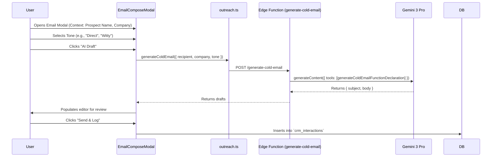

# 📧 Engineering Blueprint: AI Sales Outreach & Email Integration

**Document Status:** ✅ Implemented - 2024-09-08
**System Goal:** To enable users to draft, refine, and log sales emails directly from the CRM and Prospecting screens using Gemini 3.

---

## 1. Architecture

The system extends the existing AI architecture to handle unstructured communication generation.

## 2. Implementation Checklist

| Component | Type | Status |
| :--- | :--- | :--- |
| **`generateColdEmailFunctionDeclaration`** | Prompt Schema | ✅ Completed |
| **`outreach.ts`** | Frontend Service | ✅ Completed |
| **`generate-cold-email`** | Edge Function | ✅ Completed |
| **`EmailComposeModal.tsx`** | UI Component | ✅ Completed |
| **`Prospecting.tsx` Integration** | Screen Update | ✅ Completed |
| **`CustomerCRM.tsx` Integration** | Screen Update | ✅ Completed |

## 3. Key Features

1.  **Context Awareness:** The AI knows who the prospect is and what their company does (passed from the Prospecting screen).
2.  **Tone Selection:** Users can toggle between "Professional", "Friendly", or "Direct".
3.  **Seamless Logging:** Sending an email automatically creates a `crm_interaction` record.

---
