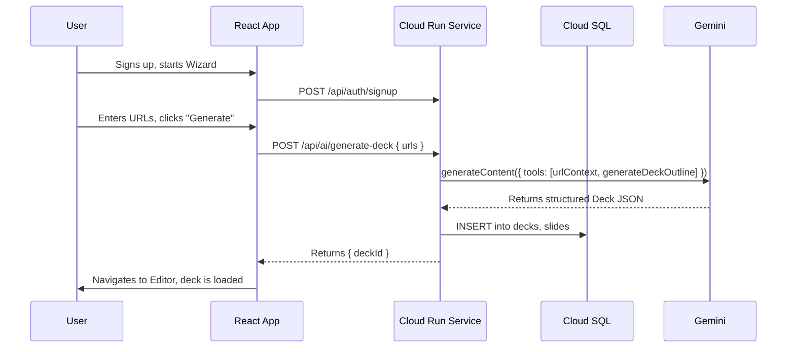
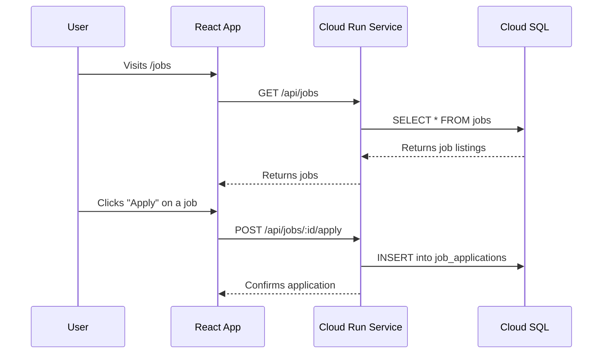
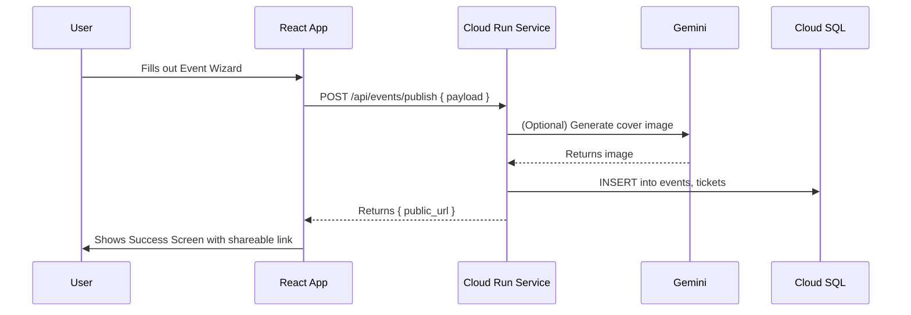
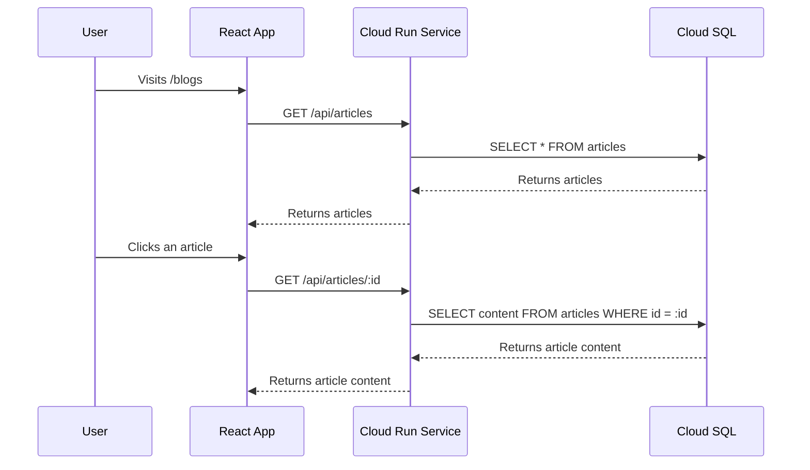
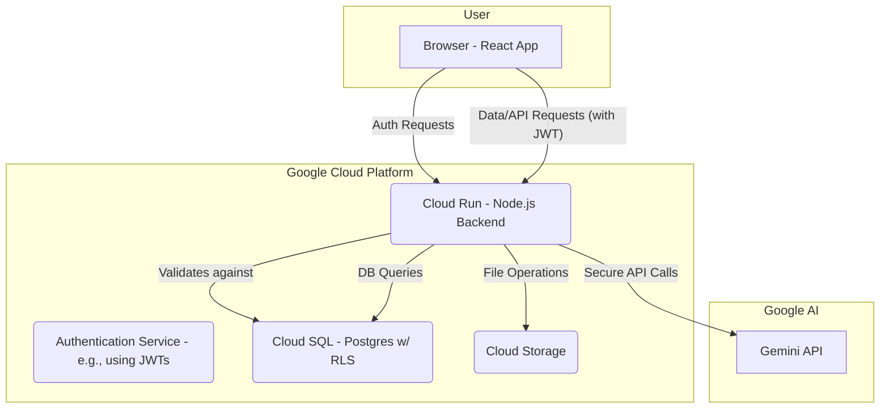

# ☀️ Product Requirements Document: The Sun AI Ecosystem

**Document Status:** Published - 2024-08-19 (Revised for Custom Backend)
**Author:** Senior AI Product Strategist
**Version:** 1.1

---

## 1. Executive Summary

**Sun AI's mission** is to be the indispensable, all-in-one platform that empowers the startup journey. We provide founders, job seekers, and community members with the intelligent tools they need to create investor-ready pitch decks, discover career opportunities, organize and attend events, and access expert insights—all within a single, cohesive ecosystem.

Our core value proposition is simple: **"From idea to investor in one platform."**

### Key Success Metrics
- **Time-to-Deck:** A new user can generate a complete, 10-slide pitch deck draft in under 10 minutes.
- **AI Success Rate:** ≥ 90% of all AI generation tasks (deck creation, image generation, event automation) complete successfully without user-facing errors.
- **User Activation:** ≥ 40% of new sign-ups create their first pitch deck or event within their first session.

---

## 2. Core Features

| Feature | Purpose & User Value | Technical Requirements & Dependencies |
| :--- | :--- | :--- |
| **Pitch Deck Wizard** | The core AI engine. Transforms a user's raw idea (text or URL) into a professional, 10-slide pitch deck, saving founders dozens of hours. | **Frontend:** React, `WizardSteps.tsx`, `DeckEditor.tsx`. **Backend:** Custom backend (Node.js on Cloud Run), Cloud SQL DB. **AI:** Gemini 2.5 (`urlContext`, Function Calling for structured output). |
| **AI Jobs Board** | A curated career platform. Allows startups to post jobs and helps talent find roles with AI-powered matching and profile suggestions. | **Frontend:** React, `Jobs.tsx`, `JobDetail.tsx`. **Backend:** Cloud SQL DB for `jobs` and `job_applications` tables. **AI:** (Future) Gemini for matching skills to job descriptions. |
| **Events Platform** | An end-to-end event management tool. Organizers can create, publish, and manage community events, with AI assistance for generating promotional content and visuals. | **Frontend:** React, `EventWizard.tsx`, `EventDetail.tsx`. **Backend:** Custom backend endpoint (`/api/events/publish`), Cloud SQL DB. **AI:** Gemini for generating event descriptions, social media copy, and cover images (`imagen-4.0-generate-001`). |
| **Articles Hub** | A knowledge base for founders. Provides expert guides, startup playbooks, and community-submitted articles, with AI-generated summaries for quick insights. | **Frontend:** React, `Blogs.tsx`, `BlogDetail.tsx`. **Backend:** Cloud SQL DB for `articles` table. **AI:** Gemini for summarizing long-form content. |

---

## 3. User Journeys

### Founder: Pitch Deck Creation

### Job Seeker: Find & Apply

### Event Organizer: Create & Publish

### Reader: Discover & Learn

---

## 4. Real-World Use Cases

(Remains the same as original PRD)

---

## 5. System & Data Requirements

-   **Core Database Tables:** `users`, `organizations`, `decks`, `slides`, `jobs`, `job_applications`, `events`, `event_registrations`, `articles`, `media_assets`.
-   **Relationships:**
    -   `users` 1:n `decks` (via `organizations`)
    -   `users` 1:n `events` (via `organizations`)
    -   `users` 1:n `job_applications`
-   **Data Flow:** The application will use a single Cloud SQL-managed PostgreSQL database. The schema defined in `01-docs/01-database.md` will serve as the single source of truth.
-   **Security & Storage:**
    -   **RLS:** All tables containing user or organization data will have Row-Level Security enabled, managed by the backend.
    -   **Privacy:** Personally Identifiable Information (PII) will be handled in accordance with our Privacy Policy.
    -   **AI Output Storage:** AI-generated media (e.g., deck images, event covers) will be stored in Google Cloud Storage under a structured path, such as `media/{org_id}/decks/{deck_id}/{slide_id}.webp`.

---

## 6. Architecture & Flow Diagrams

### High-Level System Architecture

---

## 7. KPIs & Production-Readiness Criteria

| Category | Criteria | How to Measure |
| :--- | :--- | :--- |
| ✅ **Functionality** | Each module (Decks, Jobs, Events, Articles) completes its core user journey without error. | Manual E2E testing and automated Playwright tests. |
| 🔒 **Security** | RLS policies are verified; all AI API keys are exclusively on the server-side. | Manual security audit and automated RLS tests. |
| ⚡ **Performance** | P95 latency for AI generation < 10s. Core page loads (LCP) < 3s. 99.9% uptime. | Google Cloud Monitoring, Vercel Analytics, and external monitoring (e.g., UptimeRobot). |
| 📊 **Observability**| All critical errors are logged. Key user actions are tracked as events. | Google Cloud Logging for errors, analytics platform (e.g., PostHog) for user behavior. |
| 💾 **Data Safety** | Daily automated database backups are enabled. Cloud Storage has correct public/private bucket policies. | Google Cloud console configuration review. |