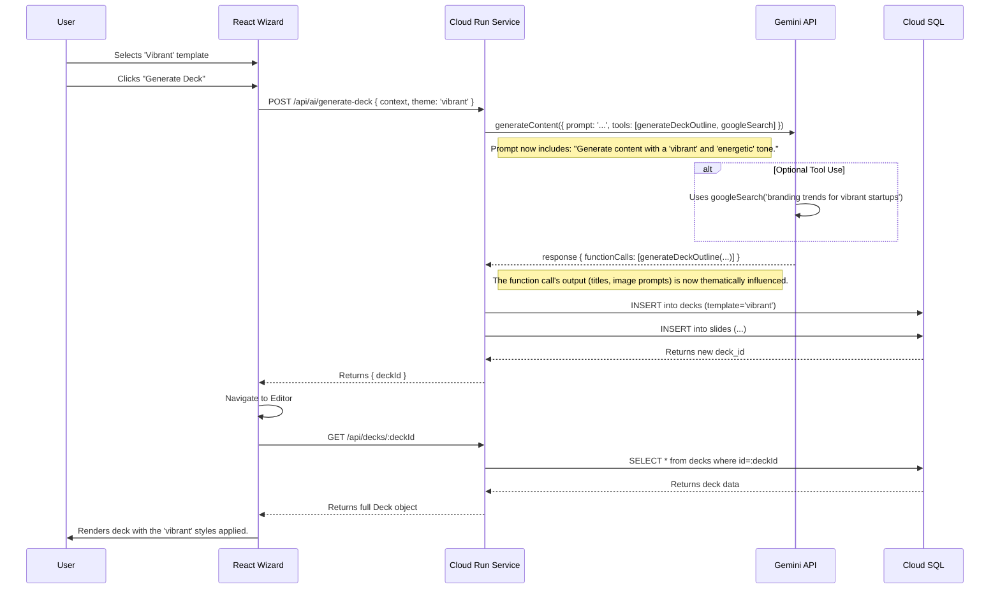

# 🚀 Engineering & Product Plan: The Intelligent, AI-Powered Template System

**Document Status:** Planning - 2024-08-25
**Author:** Senior AI Systems Architect, Google Studio
**System Goal:** To plan, structure, and implement a new system that allows users to choose a visual template (e.g., "Vibrant," "Pastel," "Modern") *before* AI generation. The AI will then tailor the generated content, tone, and visual prompts to match the selected theme, creating a more cohesive and personalized final pitch deck.

---

### **Step 1 — Goal & Context**

*   **Main Purpose:** The goal is to build an **Intelligent, AI-Aware Template System**. This feature moves beyond applying a simple "skin" after the fact. It integrates the user's aesthetic choice into the core of the AI generation process, making the AI a "thematic co-creator."

*   **Real-World Use Case:** This feature is critical for the **sun ai startup** platform. A founder's brand identity is crucial, and their pitch deck should reflect it. A fintech startup might want a "Tech" or "Pro" theme, while a wellness brand might prefer a "Pastel" theme. By allowing users to choose upfront, we deliver a final product that feels bespoke and aligned with their vision from the very first draft, dramatically reducing the need for manual style edits.

---

## User Journey & AI Workflow Diagrams

### User Journey Flowchart

This diagram illustrates the updated user path, incorporating the new template selection step in the wizard.

```mermaid
graph TD
    A[Dashboard] -->|Clicks 'Create New Deck'| B(Wizard);
    subgraph "Wizard Screen"
        B --> C{Step 1: Enter Context (Text/URL)};
        C --> D[Step 2: Select a Template (e.g., 'Vibrant')];
    end
    D -->|Clicks 'Generate Deck'| E(Generating Screen);
    E -->|AI Generation with Theme Context| F(Deck Editor);
    F -->|User sees deck rendered with 'Vibrant' theme| G[Review & Present];
```

### AI Generation Sequence Diagram

This diagram details the technical flow of how the selected theme is used in a secure, full-stack architecture with Gemini tools.



---

### **Step 2 — Key Tasks & Implementation Plan**

1.  **Setup Phase**
    *   **Environment & Dependencies:** The existing project setup is sufficient. No new major dependencies are required.
    *   **API Keys & Auth:** No changes required. The system will use the existing authentication and API key management.

2.  **Core Logic**
    *   **AI Flow:** The user journey is updated as shown in the diagrams above. The chosen `template` key is passed to a secure backend endpoint, which orchestrates the AI generation.
    *   **Prompt Design & AI Tools:** This is where we incorporate advanced Gemini features. Instead of simply injecting the theme name, we adopt a multi-tool strategy.
        *   **Function Calling (Reliability):** We will continue to use a `generateDeckOutline` function call. This is the **most critical best practice**, as it guarantees a reliable, structured JSON output, preventing application errors. The prompt that *leads* to this function call will be thematically enhanced.
        *   **Google Search (Contextual Enrichment):** The backend can use the theme to perform a targeted Google search to inform the generation. For a 'Tech' theme, it might search for "modern tech company branding trends" to generate more relevant and creative `imageUrl` prompts. This is a form of **tool chaining**.
        *   **Gemini Thinking (Quality):** For nuanced themes like "professional but playful," we can enable `thinkingConfig`. This allows the model more time to reason about how to best blend these concepts in the generated content, resulting in a higher-quality output.
    *   **Data Structure:** The `Deck` interface's `template: string` property is sufficient.

3.  **Frontend**
    *   **Screens:**
        *   `WizardSteps.tsx`: Will be modified to include a new `TemplateSelector` component.
        *   `GeneratingScreen.tsx`: Will be modified to receive the `selectedTemplate` key and pass it to the AI service.
    *   **Components:**
        *   A new `TemplateSelector.tsx` component will be created to display visual previews of each template.

4.  **Backend**
    *   **Client-Side First:** This phase can be prototyped client-side, but the final implementation must be in a secure backend.
    *   **Full-Stack Architecture:** The selected `template` key will be part of the JSON payload sent to the `/api/ai/generate-deck` endpoint. The backend will be responsible for all prompt engineering, tool usage, and secure calls to the Gemini API.

5.  **AI Integration (Gemini Tools)**
    *   The `generateFullDeck` logic (now on the backend) will be updated to accept a `template` key and dynamically modify its prompt and tool configuration (`googleSearch`, `thinkingConfig`) before calling the Gemini API.

6.  **Testing & Validation**
    *   **Unit Tests:** Test the `TemplateSelector` component's state management.
    *   **Integration Tests:** Verify that the selected template key is correctly passed from the wizard to the backend service.
    *   **E2E (End-to-End) Smoke Tests:** Perform a full user flow for each new template. Verify that the final deck in the editor is rendered with the correct visual styles.

7.  **Deployment**
    *   Standard deployment process. No special infrastructure is required.

---

### **Step 3 — Files & Folder Setup**

*   **Files to be Created:**
    *   `/01-docs/09-templates-plan.md` (this document)
    *   `/components/TemplateSelector.tsx` (New component to display and manage template selection)

*   **Files to be Modified:**
    *   `/screens/WizardSteps.tsx`: To integrate the `TemplateSelector` component.
    *   `/screens/GeneratingScreen.tsx`: To pass the selected template key to the AI service.
    *   `/services/aiService.ts`: To update the `generateFullDeck` function to be template-aware (or, in the full-stack model, this file calls the backend).
    *   `/styles/templates.ts`: To add the new `vibrant`, `pastel`, `modern`, `tech`, and `pro` template definitions.

*   **Files to be Tested:**
    *   All newly created and modified files listed above.

---

### **Step 4 — Success Criteria**

Define what “working 100% correctly” means:

*   **UI displays correctly:** The `WizardSteps` screen shows clear, visual previews of all available templates.
*   **State is managed:** A user can click to select a template, and their choice is visually confirmed and stored.
*   **AI context is updated:** The selected template demonstrably influences the AI-generated content. For example, a "Tech" theme results in more formal text and `imageUrl` prompts related to "blueprints" or "circuits," while a "Pastel" theme yields softer language and suggests "organic shapes."
*   **Data saves correctly:** The `Deck` object created by the AI has its `template` property set to the user's chosen key (e.g., `"vibrant"`).
*   **Frontend integration is validated:** When the `DeckEditor` loads the deck, it correctly applies the visual styles for the selected template from `styles/templates.ts`.

---

### **Step 5 — Production-Ready Checklist**

✅ **Environment variables configured:** No new variables are needed for this feature.
✅ **Error handling:** The system defaults to the "default" template if an invalid key is somehow passed to the AI service.
✅ **Clear logging & monitoring setup:** (For full-stack) The backend logs which templates are most frequently chosen to inform future design decisions.
✅ **Security rules & RLS applied:** N/A for this feature.
✅ **Deployment verified:** The feature is tested and confirmed to be working in a staging environment before production release.

---

### **Step 6 — Improvements**

*   **AI-Powered Template Suggestion:** An advanced feature where the AI analyzes the user's initial business description and automatically suggests the most appropriate template. For example, if the description contains "sustainable" and "organic," it might suggest the "Pastel" theme.
*   **Multi-Tool Generation:** Combine `googleSearch` to find the user's company website with `urlContext` to crawl it, providing deep, automatic thematic context without requiring the user to paste URLs.
*   **Custom Color Palettes:** Allow users to provide a primary brand color, and have the AI generate a complete, harmonious color palette for a custom template on the fly.
