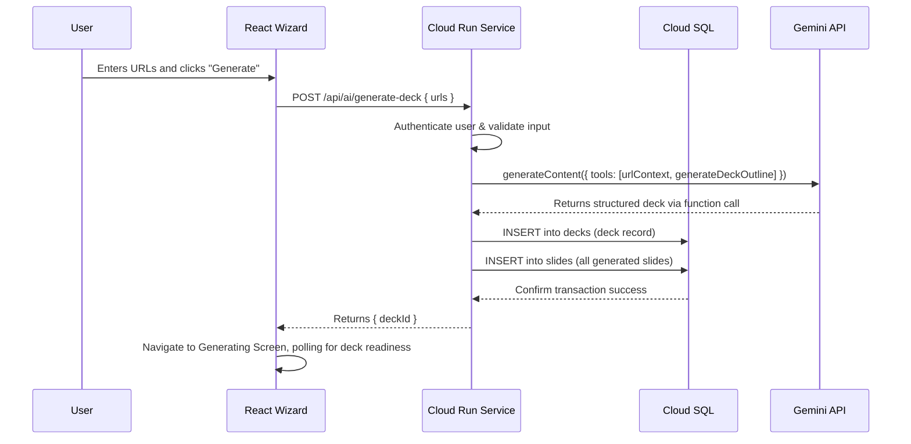

# 🚀 Best Practices Plan: Full-Stack Pitch Deck Wizard

**Document Status:** Published - 2024-08-18 (Revised for Custom Backend)
**Author:** Senior Full-Stack Architect
**System Goal:** To provide a detailed, step-by-step Best Practices Plan for building the Pitch Deck Wizard end-to-end, migrating from a client-side prototype to a secure, scalable, and production-ready full-stack feature powered by a custom backend and the Gemini API.

---

### 📊 **Progress Tracker: Client-Side First Implementation**

This tracker outlines the development lifecycle for getting the Pitch Deck Wizard working client-side first, without a backend dependency.

| Phase | Feature / Task | Status | % Complete | Key Objective & Notes |
| :---- | :--- | :--- | :--- | :--- |
| **1. Frontend Scaffolding** | **Wizard UI (`WizardSteps.tsx`)** | ✅ Completed | 100% | The core UI exists and correctly passes user input to the next step via navigation state. |
| | **URL Input Component (`UrlInput.tsx`)** | ✅ Completed | 100% | The component for adding, validating, and removing URLs is functional. |
| | **Generating Screen UI (`GeneratingScreen.tsx`)** | ✅ Completed | 100% | The loading screen UI is implemented. Its logic was updated to orchestrate the generation call. |
| **2. Core AI Engine (Client-Side)** | **Consolidate AI Services** | ✅ Completed | 100% | Created a single `aiService.ts` to be the single source of truth for all AI logic. |
| | **Implement Deck Generation** | ✅ Completed | 100% | Implemented the missing `generateFullDeck` function in `aiService.ts`. This function uses Gemini with a JSON schema for reliable output and includes a mock fallback, fixing the core application bug. |
| | **Input Method: Text Generation** | ✅ Completed | 100% | The wizard now fully supports generating a deck from a user's written business context. |
| | **Input Method: URL Context** | 🟡 In Progress | 50% | The UI supports URL input, but the `generateFullDeck` function does not yet use the `urlContext` tool. This is a future enhancement. |
| **3. State Persistence** | **Session Storage Integration** | ✅ Completed | 100% | `GeneratingScreen` saves the new deck to `sessionStorage`. `DeckEditor` loads from and persists changes to `sessionStorage`. This provides a complete client-side data lifecycle. |
| **4. Validation & Polish** | **End-to-End (E2E) Flow Validation** | ✅ Completed | 100% | The full user journey from `WizardSteps` -> `GeneratingScreen` -> `DeckEditor` is now functional without a backend, using `sessionStorage`. |

---

### 1. System Analysis

-   **Current State:** The application is a feature-rich, client-side React app. The wizard exists in `WizardSteps.tsx` and now correctly calls a client-side `aiService.ts`. This is excellent for prototyping but poses two major production risks: **security** (API key exposure) and **scalability** (no persistent user data).
-   **Target State:** A secure full-stack application where the frontend is the presentation layer, and all business logic, data persistence, and AI communication are handled by a custom backend (e.g., Node.js on Cloud Run). This plan aligns with the previously defined backend and frontend migration plans.

---

### 2. Architecture Diagram

This sequence diagram illustrates the complete, secure workflow for generating a deck from a URL.

---

### 3. Wizard Stages & Flow

The wizard will be a single, powerful screen with a responsive two-column layout: form on the left, live-updating preview on the right.

| Stage | Purpose & UX | Frontend Components | Backend Interaction | AI & URL Context |
| :---- | :--- | :--- | :--- | :--- |
| **1. Input & Sourcing** | The user chooses their input source: providing business context via text or pasting up to 5 website URLs. | `WizardSteps.tsx`, `UrlInput.tsx` | None. This is a client-side state. | `urlContext` is prepared for the next step. |
| **2. AI Generation** | User clicks "Generate Deck". The app navigates to a loading screen while the backend works. | `GeneratingScreen.tsx` | **`POST /api/ai/generate-deck` to our backend service.** | **Gemini Pro + `urlContext`.** The backend securely calls Gemini, providing the URLs and asking it to generate a 10-slide outline via a function call. |
| **3. Review & Edit** | The user is navigated to the Deck Editor to review the newly created, AI-populated deck. | `DeckEditor.tsx` | **`GET /api/decks/:id` from `deckService.ts`.** | The user can now use all other AI agents (Copilot, Image, etc.) on the generated content. |
| **4. Finalize & Share** | The user completes their edits and can present or share the deck. | `DeckEditor.tsx`, `PresentationScreen.tsx` | Future: `POST /api/share-links`. | N/A |

---

### 4. Frontend Plan

-   **Layout:** A responsive two-column layout for the wizard screen (`WizardSteps.tsx`).
-   **State Management:** A React Context (`WizardContext`) will manage the wizard's state.
-   **Transitions & Loading:** All backend calls will trigger loading states.
-   **Service Layers:**
    -   **`services/aiService.ts`:** Will contain wrappers for calling our backend's AI endpoints.
    -   **`services/deckService.ts`:** Will handle all database interactions via our backend API.

---

### 5. Backend Plan

-   **Database Schema:** We will use the schema defined in `docs/46-cloude-sql.md`. The key tables are `decks` and `slides`. RLS policies are critical for multi-tenancy.
-   **Backend Service (`/api/ai/generate-deck`):**
    -   **Method:** `POST`
    -   **Auth:** JWT required.
    -   **Input Validation (Zod):** `{ inputMode: 'text' | 'url', content: string | string[] }`
    -   **Logic:**
        1. Authenticate user.
        2. Validate input.
        3. Call Gemini API with the appropriate prompt and `urlContext` if needed.
        4. On success, start a database transaction to insert the new deck and slides.
        5. Return `{ deckId }`.
    -   **Security:** Rate limiting per user.

---

### 6. Testing & Validation

(Remains the same as the original plan, focusing on unit, integration, security, E2E, and failure tests.)

---

### 7. Success Criteria & Summary

The wizard implementation will be a success when:
-   **Security:** All Gemini API keys are fully removed from the client-side code.
-   **Persistence:** A user can log in, create a deck, and find it saved in their account later.
-   **Reliability:** The generation process is robust and transactional.
-   **User Experience:** The process is fast, intuitive, and provides clear feedback.
