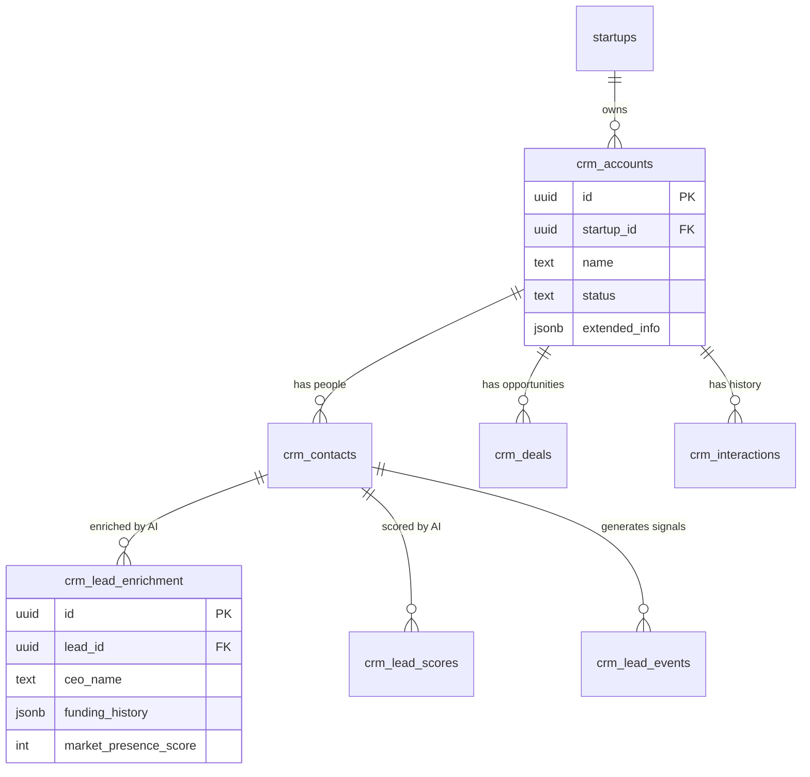
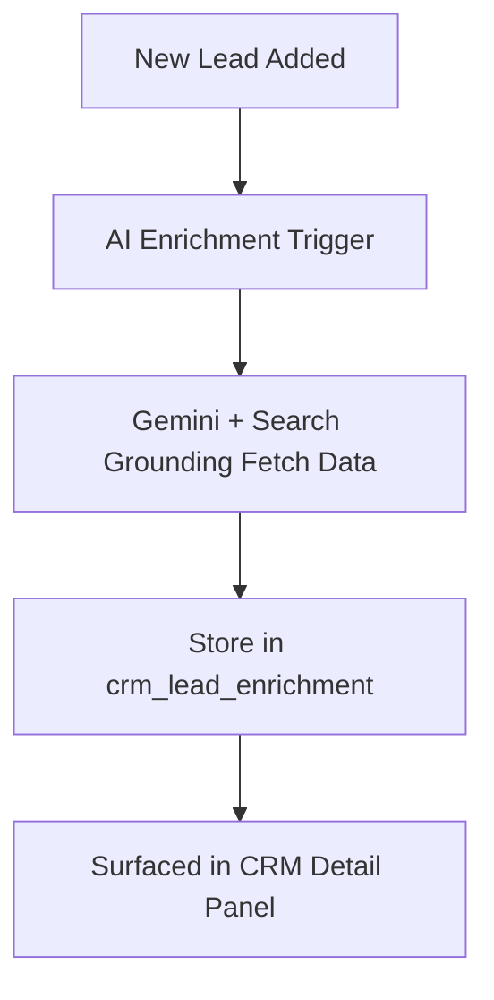

# 🗄️ Master Database Schema: CRM & AI Prospecting Module

**Document Status:** Production Specification - 2024-09-10  
**Author:** Lead Database Architect  
**Goal:** Define the authoritative data model for the Customer CRM, Sales Pipeline, and AI Prospecting engine.

---

## 1. System Architecture Overview

The CRM module is designed as a **multi-tenant system** rooted in the `startups` table. All CRM data (`accounts`, `contacts`, `deals`) belongs to a specific startup, ensured by Row-Level Security (RLS).

This schema supports two distinct operational modes:
1.  **Core CRM:** Manual entry and management of business relationships.
2.  **AI Intelligence Layer:** Automated enrichment, scoring, and insights powered by Gemini 3 and Google Search Grounding.

### Entity Relationship Diagram (ERD)



---

## 2. Core CRM Data Model

### 2.1. `crm_accounts` (Companies)
**Purpose:** The central entity representing a business relationship (Customer, Partner, or Investor).

| Column | Type | Description |
| :--- | :--- | :--- |
| `id` | `uuid` | Primary Key. |
| `startup_id` | `uuid` | Foreign Key to `startups`. Critical for RLS. |
| `name` | `text` | Company name (e.g., "Acme Corp"). |
| `domain` | `text` | Website domain. Used for auto-enrichment. |
| `segment` | `text` | 'Enterprise', 'SMB', 'Mid-Market'. |
| `status` | `text` | 'Lead', 'Trial', 'Active', 'Churned'. |
| `mrr` | `numeric` | Monthly Recurring Revenue value. |
| `health_score` | `int` | 0–100 calculated metric of account health. |
| `owner_id` | `uuid` | FK to `auth.users`. The team member responsible. |
| `last_enriched_at`| `timestamptz`| Timestamp of last Gemini enrichment run. |

**Usage:** Used in the main CRM dashboard list view and the primary detail panel.

---

### 2.2. `crm_contacts` (People)
**Purpose:** Individuals associated with an account. The primary target for outreach.

| Column | Type | Description |
| :--- | :--- | :--- |
| `id` | `uuid` | Primary Key. |
| `account_id` | `uuid` | Foreign Key to `crm_accounts`. |
| `email` | `text` | Primary contact method. |
| `first_name` | `text` | Personal name. |
| `last_name` | `text` | Family name. |
| `role` | `text` | Job title (e.g., "CTO", "VP of Sales"). |
| `linkedin_url` | `text` | Profile link for research. |

**Usage:** Displayed in the "Contacts" tab of the Customer Detail Panel.

---

### 2.3. `crm_deals` (Opportunities)
**Purpose:** Tracks potential revenue through a sales pipeline.

| Column | Type | Description |
| :--- | :--- | :--- |
| `id` | `uuid` | Primary Key. |
| `account_id` | `uuid` | Foreign Key to `crm_accounts`. |
| `amount` | `numeric` | Estimated deal value ($). |
| `stage` | `text` | 'Qualified', 'Proposal', 'Negotiation', 'Closed Won'. |
| `probability` | `int` | 0–100% likelihood of closing. |
| `expected_close` | `date` | Target date for conversion. |
| `ai_score` | `int` | AI-predicted probability (0-100) based on deal signals. |
| `ai_reasoning` | `text` | Explanation for the AI score. |

**Usage:** Visualized in the Kanban board and Deal Pipeline charts.

---

### 2.4. `crm_interactions` (Activity Log)
**Purpose:** An immutable history of touchpoints with a customer.

| Column | Type | Description |
| :--- | :--- | :--- |
| `id` | `uuid` | Primary Key. |
| `account_id` | `uuid` | Foreign Key to `crm_accounts`. |
| `type` | `text` | 'Email', 'Call', 'Meeting', 'Note'. |
| `summary` | `text` | Content or summary of the interaction. |
| `sentiment` | `text` | AI-analyzed sentiment ('Positive', 'Neutral', 'Negative'). |
| `occurred_at` | `timestamptz` | When the interaction happened. |

---

## 3. AI Intelligence Layer Schema

These tables store data generated by Gemini 3 and Google Search Grounding. They are "read-heavy" for the UI but "write-heavy" for the background agents.

### 3.1. `crm_lead_enrichment` (Deep Research)
**Purpose:** Stores high-fidelity data fetched from the web to augment lead profiles.

| Column | Type | Content / Description |
| :--- | :--- | :--- |
| `lead_id` | `uuid` | FK to `crm_contacts`. |
| `ceo_name` | `text` | Verified CEO name. |
| `recent_news` | `jsonb` | Array of recent news articles `{title, url, date}`. |
| `funding_history`| `jsonb` | Array of funding rounds `{round, amount, investors}`. |
| `hiring_trends` | `jsonb` | Struct `{trend: 'up/down', roles: ['eng', 'sales']}`. |
| `market_score` | `int` | 0-100 score based on news volume and authority. |
| `gemini_summary` | `text` | A concise, AI-written overview of the company. |

**Enrichment Flow:**


---

### 3.2. `crm_lead_scores` (Predictive Scoring)
**Purpose:** Stores the output of the "Scoring Agent" which uses Gemini Reasoning to qualify leads.

| Column | Type | Content / Description |
| :--- | :--- | :--- |
| `lead_id` | `uuid` | FK to `crm_contacts`. |
| `overall_score` | `int` | 0-100 aggregate score. |
| `fit_breakdown` | `jsonb` | Scores for specific dimensions: `{industry: 90, size: 40, tech: 80}`. |
| `intent_signals` | `jsonb` | Detected signals (e.g., "Hiring Sales VP"). |
| `risk_factors` | `jsonb` | Detected risks (e.g., "Recent layoffs"). |
| `next_actions` | `jsonb` | AI-recommended next steps (e.g., "Email CTO"). |

**Scoring Logic:**
The score is a weighted average of:
1.  **ICP Fit (40%):** Industry, Size, Region match.
2.  **Intent (40%):** Hiring trends, Funding news, Website keywords.
3.  **Engagement (20%):** (Future) Email opens, clicks.

**Scoring Flow:**
```mermaid
flowchart TD
    A[Lead Updated / Enriched] --> B[Score Processor]
    B --> C[Gemini 3 Reasoning (Step-by-Step)]
    C --> D[Store Score in crm_lead_scores]
    D --> E[Update Lead Priority / Sort Order]
```

---

## 4. Security & Access Control (RLS)

The architecture relies on **PostgreSQL Row-Level Security (RLS)** to enforce multi-tenancy.

### Strategy
*   **Data Isolation:** Every query automatically filters by `startup_id`. A user belonging to Startup A can *never* query rows belonging to Startup B.
*   **Role-Based Access:**
    *   **Owners/Admins:** Full CRUD access.
    *   **Editors:** Can update Deals and Contacts but cannot delete Accounts.
    *   **Viewers:** Read-only access to all CRM data.

### Implementation Concept
```sql
-- Concept only
CREATE POLICY "Tenant Isolation" ON crm_accounts
USING (startup_id IN (SELECT startup_id FROM team_members WHERE user_id = auth.uid()));
```

---

## 5. Automation & Triggers

### 5.1. Timestamp Maintenance
*   **Logic:** Any update to a row in any CRM table must automatically update the `updated_at` column to `NOW()`.
*   **Mechanism:** PostgreSQL `BEFORE UPDATE` triggers.

### 5.2. Enrichment Staleness
*   **Logic:** If `last_enriched_at` is older than 30 days, the UI should flag the record as "Stale" or trigger a background re-enrichment job.

### 5.3. Interaction Rollups
*   **Logic:** When a new row is added to `crm_interactions`, the parent `crm_account.last_interaction_at` field should be updated to the current timestamp. This ensures sorting by "Last Contacted" is efficient without complex joins.

---

## 6. Indexing Strategy

To ensure performance at scale, the following fields must be indexed:

*   **Foreign Keys:** `startup_id`, `account_id`, `owner_id`. (Critical for RLS performance).
*   **Search Fields:** `name`, `domain`, `email` (using GIN/Trigram indexes for fuzzy search).
*   **Sorting Fields:** `created_at`, `last_interaction_at`, `health_score` (B-Tree indexes).
*   **JSONB Fields:** `extended_info` (GIN index) to allow querying specific enriched data points.

---

## 7. Future Roadmap (Expansion)

1.  **Predictive Close-Likelihood:** Use historical deal data to train a custom model that predicts the probability of a deal closing based on interaction patterns.
2.  **Smart Follow-up Recommendations:** An agent that scans `crm_interactions` for unanswered emails and automatically queues draft follow-ups.
3.  **Buying Intent Heatmap:** Visualizing which accounts are surging in activity/intent based on web signals.
4.  **Company Tech Stack Detection:** Expanding enrichment to detect what software a prospect is already using (e.g., "Uses Salesforce", "Uses AWS").
5.  **Multi-Touch Attribution:** Tracking which marketing channel (LinkedIn, Blog, Referral) originated the high-value deals.
