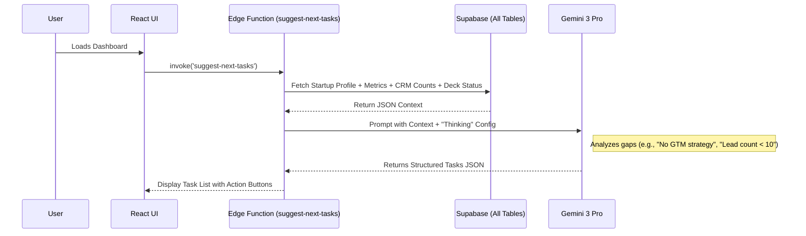

# 🧠 Engineering Blueprint: Gemini 3 Strategic Task Advisor

**Document Status:** Planning - 2025-01-21
**System Goal:** To implement an "AI Co-Founder" agent that proactively analyzes the startup's data (CRM, Decks, Financials) using Gemini 3 Reasoning to generate a prioritized, actionable to-do list.

---

## 1. The Concept: From Static Dashboard to Active Advisor

Currently, the dashboard displays data. The **Task Advisor** will interpret that data. Instead of waiting for the user to decide what to do, Gemini 3 will look at the gaps in their profile and business and suggest the highest-leverage actions.

**The "Thinking" Workflow:**
1.  **Ingest Context:** Gather Profile, Deck status, CRM counts, Financial health.
2.  **Reasoning (Gemini 3):** Evaluate the startup stage vs. completeness. Identify bottlenecks (e.g., "High burn but no investors in pipeline").
3.  **Output:** A structured list of Core and Advanced tasks, some of which can be **auto-executed** by AI.

---

## 2. Architecture & Data Flow



---

## 3. The Context Payload (What Gemini Analyzes)

To make intelligent decisions, Gemini needs a snapshot of the business:

```json
{
  "profile": { "stage": "Seed", "industry": "Fintech", "completeness": 0.6 },
  "assets": { "has_pitch_deck": true, "deck_last_edited": "2024-08-01", "has_data_room": false },
  "crm": { "lead_count": 5, "pipeline_value": 0, "last_interaction": "14 days ago" },
  "financials": { "runway_months": 4, "burn_rate": 15000 }
}
```

---

## 4. Task Categories & Logic

### A. Core Tasks (Foundational Gaps)
*Logic:* If these are missing, the startup isn't ready to operate.
*   **Profile:** "Complete your startup tagline and mission."
*   **Pitch Deck:** "Create your first Seed Pitch Deck."
*   **Team:** "Add your co-founders to the Team section."

### B. Growth & Sales (CRM Driven)
*Logic:* If the foundation is set but the pipeline is empty.
*   **Prospecting:** "Your CRM is empty. Find 10 leads in the Fintech space." (Action: Link to `/prospecting`)
*   **Outreach:** "5 Leads are stuck in 'New' status. Draft cold emails."
*   **Enrichment:** "Enrich your top 3 accounts with CEO data."

### C. Advanced/Strategic (Gemini Thinking)
*   **Financial:** "Runway is < 6 months. Generate a Fundraising One-Pager."
*   **Competitive:** "You haven't analyzed competitors. Generate a Battlecard."
*   **GTM:** "Create a Go-To-Market strategy for your Series A launch."

---

## 5. AI-Automated Tasks ("One-Click Actions")

These are special tasks where the `action` property triggers an AI agent directly.

| Task Title | Button Label | Underlying AI Tool |
| :--- | :--- | :--- |
| "Find 10 new leads" | **Auto-Prospect** | `generate-leads` |
| "Analyze Competitors" | **Generate Battlecard** | `generate-battlecard` |
| "Draft Investor Update" | **Write Update** | `generate-investor-update` |
| "Fix Pitch Deck Story" | **Analyze Deck** | `analyze-slide` |

---

## 6. Gemini 3 Prompt Strategy

We will use **Structured Outputs** to ensure the UI can render the tasks safely.

**Prompt:**
> "You are a startup advisor. Analyze the following startup state.
> **Thinking Process:**
> 1. Check for critical gaps (missing deck, low runway).
> 2. Evaluate sales activity (stale leads).
> 3. Prioritize tasks based on the 'Seed' stage goal.
>
> **Output Schema:**
> Return a JSON object with:
> - `analysis_summary`: A 1-sentence observation.
> - `core_tasks`: Array of `{ title, description, link }`.
> - `advanced_tasks`: Array of `{ title, description, link }`.
> - `ai_recommendations`: Array of `{ title, action_id }` for tasks you can automate."

---

## 7. Implementation Checklist

- [ ] **Backend:** Create `suggest-next-tasks` Edge Function.
- [ ] **Frontend:** Create `TaskAdvisorWidget.tsx` component for the Dashboard.
- [ ] **Integration:** Connect `useStartup` and `useCRM` hooks to the prompt context.
- [ ] **UI:** Render tasks as a checklist with "Dismiss" and "Do It" buttons.
- [ ] **Latency:** Use a loading skeleton as Gemini "Thinks" (approx 3-5s).
