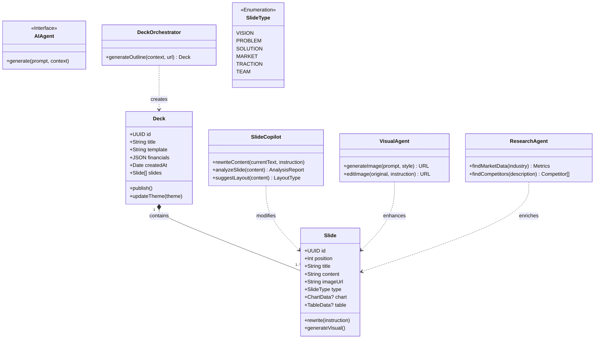
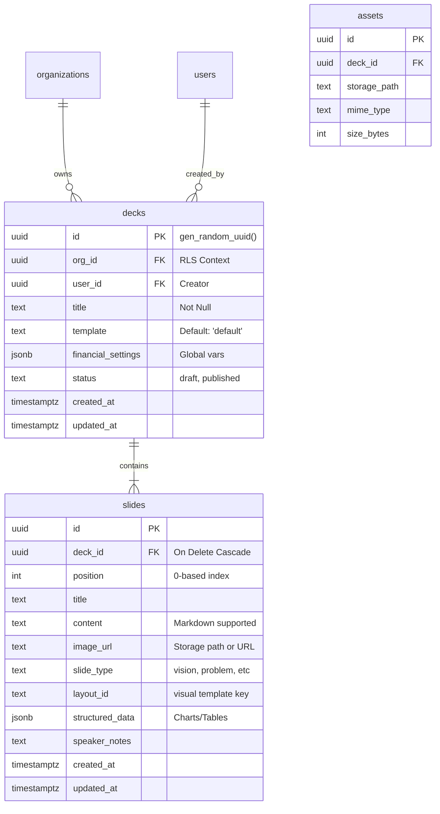

# 🗄️ Architecture: Pitch Deck Engine (Supabase)

**Document Status:** Published - 2025-01-22
**Target System:** Supabase (PostgreSQL 15+) + Edge Functions
**Scope:** Data Modeling, Security, and AI Orchestration for the Pitch Deck Module.

---

## 1. System Data Flow Diagram (DFD)

This diagram illustrates the flow of data from the user's input through the secure backend and AI processing layers, finally persisting into the database.

```mermaid
dataflow
    subgraph "Client Layer (React)"
        User[User]
        Wizard[Wizard UI]
        Editor[Deck Editor UI]
    end

    subgraph "Secure Backend (Supabase Edge)"
        Gateway[API Gateway]
        FnDeck[generate-deck Function]
        FnSlide[slide-ai Function]
        FnImage[image-ai Function]
    end

    subgraph "Intelligence Layer (Google Cloud)"
        GeminiPro[Gemini 3 Pro (Reasoning)]
        Imagen[Imagen 4.0 (Visuals)]
        Search[Google Search (Grounding)]
    end

    subgraph "Persistence Layer (PostgreSQL)"
        DB[(Supabase DB)]
        Bucket[Storage Bucket]
    end

    User -->|Inputs Context| Wizard
    Wizard -->|POST Payload| Gateway
    Gateway -->|Route: /generate| FnDeck
    
    FnDeck -->|Structured Prompt| GeminiPro
    GeminiPro -->|JSON Structure| FnDeck
    
    FnDeck -->|Insert Deck/Slides| DB
    
    User -->|Edit Request| Editor
    Editor -->|Invoke Agent| FnSlide
    FnSlide -->|Reasoning/Rewrite| GeminiPro
    FnSlide -->|Update Content| DB
    
    Editor -->|Request Visual| FnImage
    FnImage -->|Prompt| Imagen
    Imagen -->|Image Data| FnImage
    FnImage -->|Upload Asset| Bucket
    FnImage -->|Update URL| DB
    
    DB -->|Realtime Sync| Editor
```

---

## 2. Class Diagram (Logical & AI Model)

This diagram bridges the gap between the application structure, the database entities, and the AI Agent interfaces. It represents how the system is modeled conceptually.



---

## 3. Entity Relationship Diagram (ERD)

The physical database schema designed for PostgreSQL.



---

## 4. Database Schema Definitions

### A. Table: `public.decks`
The root entity for a presentation.

| Column | Type | Constraints | Description |
| :--- | :--- | :--- | :--- |
| `id` | `uuid` | `PK`, `DEFAULT gen_random_uuid()` | Unique identifier. |
| `org_id` | `uuid` | `FK(orgs.id)`, `NOT NULL` | Tenant ownership (Multi-tenancy). |
| `user_id` | `uuid` | `FK(auth.users.id)`, nullable | The creator of the deck. |
| `startup_id` | `uuid` | `FK(startups.id)`, nullable | Link to startup profile. |
| `title` | `text` | `NOT NULL` | Internal title of the deck. |
| `template` | `text` | `DEFAULT 'default'` | Visual theme key (e.g., 'vibrant'). |
| `status` | `text` | `CHECK(in 'draft', 'published')`, `DEFAULT 'draft'` | Lifecycle state. |
| `meta` | `jsonb` | `DEFAULT '{}'` | Extra context (e.g., source URLs, generation metadata). |
| `description` | `text` | nullable | Deck description. |
| `slides` | `jsonb` | `DEFAULT '[]'` | JSONB storage alternative (dual storage pattern). |
| `theme_config` | `jsonb` | nullable | Theme and styling configuration. |
| `last_accessed_at` | `timestamptz` | `DEFAULT now()` | Last time deck was accessed. |
| `created_at` | `timestamptz` | `DEFAULT now()` | Creation timestamp. |
| `updated_at` | `timestamptz` | `DEFAULT now()` | Last update timestamp. |

### B. Table: `public.slides`
The content units. Order is managed by `position`.

| Column | Type | Constraints | Description |
| :--- | :--- | :--- | :--- |
| `id` | `uuid` | `PK`, `DEFAULT gen_random_uuid()` | Unique identifier. |
| `deck_id` | `uuid` | `FK(decks.id)`, `ON DELETE CASCADE` | Parent deck. |
| `position` | `int` | `NOT NULL` | Ordering index (0-based). |
| `type` | `text` | `CHECK(in 'vision', 'problem', 'solution', 'market', 'product', 'traction', 'competition', 'team', 'ask', 'roadmap', 'generic')` | Semantic type for AI context. |
| `title` | `text` | `NOT NULL` | Slide header. |
| `content` | `text` | nullable | Bullet points or body text (Markdown supported). |
| `image_url`| `text` | nullable | URL to image asset (Storage path or external URL). |
| `template` | `text` | nullable | Slide-level template override. |
| `chart_data`| `jsonb`| nullable | Structured data for dynamic charts. |
| `table_data`| `jsonb`| nullable | Structured data for pricing tables. |
| `speaker_notes` | `text` | nullable | Presentation notes for speaker mode. |
| `created_at` | `timestamptz` | `DEFAULT now()` | Creation timestamp. |
| `updated_at` | `timestamptz` | `DEFAULT now()` | Last update timestamp. |

---

## 5. Security: Row Level Security (RLS)

We strictly enforce data isolation at the database row level.

```sql
-- Enable RLS
ALTER TABLE public.decks ENABLE ROW LEVEL SECURITY;
ALTER TABLE public.slides ENABLE ROW LEVEL SECURITY;

-- Policy: Role-Based Access Control (Actual Implementation)
-- More sophisticated than simple org-based access - includes role checks

-- Decks: View access for all org members
CREATE POLICY "authenticated_users_can_view_org_decks" ON public.decks
FOR SELECT
USING (
    EXISTS (
        SELECT 1 FROM org_members
        WHERE org_members.org_id = decks.org_id
        AND org_members.user_id = auth.uid()
    )
);

-- Decks: Create access for editors and above
CREATE POLICY "Editors and above can create decks" ON public.decks
FOR INSERT
WITH CHECK (
    EXISTS (
        SELECT 1 FROM org_members
        WHERE org_members.org_id = decks.org_id
        AND org_members.user_id = auth.uid()
        AND org_members.role IN ('owner', 'admin', 'editor')
    )
);

-- Decks: Update access for editors and above
CREATE POLICY "Editors and above can update decks" ON public.decks
FOR UPDATE
USING (
    EXISTS (
        SELECT 1 FROM org_members
        WHERE org_members.org_id = decks.org_id
        AND org_members.user_id = auth.uid()
        AND org_members.role IN ('owner', 'admin', 'editor')
    )
);

-- Decks: Delete access for admins and above
CREATE POLICY "Admins and above can delete decks" ON public.decks
FOR DELETE
USING (
    EXISTS (
        SELECT 1 FROM org_members
        WHERE org_members.org_id = decks.org_id
        AND org_members.user_id = auth.uid()
        AND org_members.role IN ('owner', 'admin')
    )
);

-- Slides: Inherited access policies (same role-based pattern)
-- Slides inherit access from parent deck via org_members join
```

---

## 6. Performance: Indexes

To ensure sub-100ms query times for the editor.

```sql
-- Optimize fetching a full deck with slides
CREATE INDEX idx_slides_deck_id_position ON public.slides(deck_id, position);

-- Unique constraint: One slide per position per deck
CREATE UNIQUE INDEX slides_deck_id_position_key ON public.slides(deck_id, position);

-- Optimize finding user's decks
CREATE INDEX idx_decks_org_id ON public.decks(org_id);
CREATE INDEX idx_decks_user_id ON public.decks(user_id);
CREATE INDEX idx_decks_startup_id ON public.decks(startup_id);

-- Full-text search indexes (enhanced beyond basic requirements)
CREATE INDEX idx_decks_title_fts ON public.decks USING gin (to_tsvector('english', title));
CREATE INDEX idx_slides_content_fts ON public.slides USING gin (to_tsvector('english', (title || ' ' || COALESCE(content, ''))));
```

---

## 7. Automation: Triggers

Automatic maintenance of timestamps.

```sql
-- Trigger Function
CREATE OR REPLACE FUNCTION update_updated_at()
RETURNS TRIGGER AS $$
BEGIN
    NEW.updated_at = now();
    RETURN NEW;
END;
$$ language 'plpgsql';

-- Apply to Tables
CREATE TRIGGER update_decks_timestamp
    BEFORE UPDATE ON public.decks
    FOR EACH ROW EXECUTE PROCEDURE update_updated_at();

CREATE TRIGGER update_slides_timestamp
    BEFORE UPDATE ON public.slides
    FOR EACH ROW EXECUTE PROCEDURE update_updated_at();
```

---

## 8. Edge Functions (Backend Logic)

These functions serve as the secure API gateway for the frontend.

### `generate-deck`
*   **Method:** `POST`
*   **Input:** `{ businessContext: string, companyDetails?: object, deckType: string, theme: string, orgId?: uuid, userId?: uuid, startupId?: uuid, urls?: string[] }`
*   **Role:** Orchestrator. Calls Gemini 3 Pro to generate structure, then inserts rows into `decks` and `slides` tables in a transaction.
*   **Authentication:** Optional - if `authorization` header provided, extracts user and org_id automatically. Falls back to provided `orgId`/`userId` or sessionStorage mode.
*   **Output:** `{ generatedDeck: object, deckId: uuid, savedToDatabase: boolean }`
*   **Database Persistence:** 
    - If `org_id` available: Saves deck and slides to database, returns database ID
    - If no `org_id`: Returns generated deck structure (fallback to sessionStorage)
*   **Transaction Safety:** Deck insert and slides insert are atomic - if slides fail, deck is rolled back

### `slide-ai`
*   **Method:** `POST`
*   **Input:** `{ action: string, slideId: string, ...args }`
*   **Role:** Micro-service for slide-level agents (Rewrite, Analyze, Chart, Research). Returns processed data to frontend *or* updates DB directly.

### `image-ai`
*   **Method:** `POST`
*   **Input:** `{ action: 'generate' | 'edit', prompt: string, ... }`
*   **Role:** Wraps Imagen 4.0 / Gemini Flash Image. Handles Base64 conversion and Storage upload logic.

---

## 9. Implementation Notes (2025-01-22)

### Database Persistence
The `generate-deck` Edge Function now **saves decks to the database** when `org_id` is available:

1. **With Authentication:** If `authorization` header is provided, function extracts `user_id` and `org_id` from `org_members` table
2. **Without Authentication:** Falls back to provided `orgId`/`userId` in payload, or returns deck structure for sessionStorage mode
3. **Transaction Safety:** Deck and slides inserts are atomic - if slides fail, deck is rolled back
4. **Backward Compatibility:** Frontend still supports sessionStorage mode for development/testing

### Enhanced Features Beyond Documentation
- **Role-based RLS:** More sophisticated than documented (owner/admin/editor/viewer roles)
- **Full-text search:** Indexes enable search across deck titles and slide content
- **Dual storage:** `decks.slides` JSONB field allows alternative storage pattern
- **Startup linking:** `decks.startup_id` links decks to startup profiles
- **Usage tracking:** `last_accessed_at` field for analytics

### Migration Status
- ✅ `status` field added (defaults to 'draft')
- ✅ `meta` field added (stores generation metadata, source URLs)
- ✅ `speaker_notes` field added to slides
- ✅ `user_id` FK constraint added (nullable, references auth.users)
