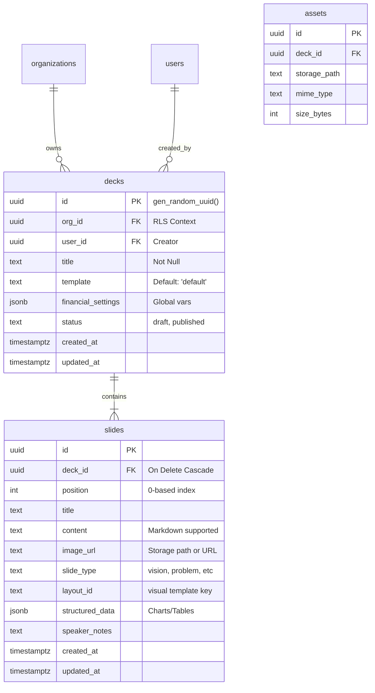

# 🗄️ Architecture: Pitch Deck Engine (Supabase)

**Document Status:** Published - 2025-01-22
**Target System:** Supabase (PostgreSQL 15+) + Edge Functions
**Scope:** Data Modeling, Security, and AI Orchestration for the Pitch Deck Module.

---

## 1. System Data Flow Diagram (DFD)

This diagram illustrates the flow of data from the user's input through the secure backend and AI processing layers, finally persisting into the database.

```mermaid
dataflow
    subgraph "Client Layer (React)"
        User[User]
        Wizard[Wizard UI]
        Editor[Deck Editor UI]
    end

    subgraph "Secure Backend (Supabase Edge)"
        Gateway[API Gateway]
        FnDeck[generate-deck Function]
        FnSlide[slide-ai Function]
        FnImage[image-ai Function]
    end

    subgraph "Intelligence Layer (Google Cloud)"
        GeminiPro[Gemini 3 Pro (Reasoning)]
        Imagen[Imagen 4.0 (Visuals)]
        Search[Google Search (Grounding)]
    end

    subgraph "Persistence Layer (PostgreSQL)"
        DB[(Supabase DB)]
        Bucket[Storage Bucket]
    end

    User -->|Inputs Context| Wizard
    Wizard -->|POST Payload| Gateway
    Gateway -->|Route: /generate| FnDeck
    
    FnDeck -->|Structured Prompt| GeminiPro
    GeminiPro -->|JSON Structure| FnDeck
    
    FnDeck -->|Insert Deck/Slides| DB
    
    User -->|Edit Request| Editor
    Editor -->|Invoke Agent| FnSlide
    FnSlide -->|Reasoning/Rewrite| GeminiPro
    FnSlide -->|Update Content| DB
    
    Editor -->|Request Visual| FnImage
    FnImage -->|Prompt| Imagen
    Imagen -->|Image Data| FnImage
    FnImage -->|Upload Asset| Bucket
    FnImage -->|Update URL| DB
    
    DB -->|Realtime Sync| Editor
```

---

## 2. Class Diagram (Logical & AI Model)

This diagram bridges the gap between the application structure, the database entities, and the AI Agent interfaces. It represents how the system is modeled conceptually.


---

## 3. Entity Relationship Diagram (ERD)

The physical database schema designed for PostgreSQL.



---

## 4. Database Schema Definitions

### A. Table: `public.decks`
The root entity for a presentation.

| Column | Type | Constraints | Description |
| :--- | :--- | :--- | :--- |
| `id` | `uuid` | `PK`, `DEFAULT gen_random_uuid()` | Unique identifier. |
| `org_id` | `uuid` | `FK(organizations.id)`, `NOT NULL` | Tenant ownership (Multi-tenancy). |
| `user_id` | `uuid` | `FK(users.id)`, `NOT NULL` | The creator of the deck. |
| `title` | `text` | `NOT NULL` | Internal title of the deck. |
| `template` | `text` | `DEFAULT 'default'` | Visual theme key (e.g., 'vibrant'). |
| `status` | `text` | `CHECK(in 'draft', 'published')` | Lifecycle state. |
| `meta` | `jsonb` | `DEFAULT '{}'` | Extra context (e.g., source URLs). |

### B. Table: `public.slides`
The content units. Order is managed by `position`.

| Column | Type | Constraints | Description |
| :--- | :--- | :--- | :--- |
| `id` | `uuid` | `PK`, `DEFAULT gen_random_uuid()` | Unique identifier. |
| `deck_id` | `uuid` | `FK(decks.id)`, `ON DELETE CASCADE` | Parent deck. |
| `position` | `int` | `NOT NULL` | Ordering index. |
| `type` | `text` | `CHECK(in 'vision', ...)` | Semantic type for AI context. |
| `title` | `text` | `NOT NULL` | Slide header. |
| `content` | `text` | - | Bullet points or body text. |
| `image_url`| `text` | - | URL to image asset. |
| `chart_data`| `jsonb`| - | Structured data for dynamic charts. |
| `table_data`| `jsonb`| - | Structured data for pricing tables. |

---

## 5. Security: Row Level Security (RLS)

We strictly enforce data isolation at the database row level.

```sql
-- Enable RLS
ALTER TABLE public.decks ENABLE ROW LEVEL SECURITY;
ALTER TABLE public.slides ENABLE ROW LEVEL SECURITY;

-- Policy: Organization Isolation
-- Users can only access decks belonging to their organization.
CREATE POLICY "Org Access Policy" ON public.decks
FOR ALL
USING (
    org_id IN (
        SELECT organization_id 
        FROM public.organization_members 
        WHERE user_id = auth.uid()
    )
);

-- Policy: Inherited Access for Slides
-- Users access slides if they have access to the parent deck.
CREATE POLICY "Deck Inheritance Policy" ON public.slides
FOR ALL
USING (
    deck_id IN (
        SELECT id 
        FROM public.decks 
        WHERE org_id IN (
            SELECT organization_id 
            FROM public.organization_members 
            WHERE user_id = auth.uid()
        )
    )
);
```

---

## 6. Performance: Indexes

To ensure sub-100ms query times for the editor.

```sql
-- Optimize fetching a full deck
CREATE INDEX idx_slides_deck_id ON public.slides(deck_id);

-- Optimize ordering slides
CREATE INDEX idx_slides_deck_position ON public.slides(deck_id, position);

-- Optimize finding user's decks
CREATE INDEX idx_decks_org_id ON public.decks(org_id);
CREATE INDEX idx_decks_user_id ON public.decks(user_id);
```

---

## 7. Automation: Triggers

Automatic maintenance of timestamps.

```sql
-- Trigger Function
CREATE OR REPLACE FUNCTION update_updated_at()
RETURNS TRIGGER AS $$
BEGIN
    NEW.updated_at = now();
    RETURN NEW;
END;
$$ language 'plpgsql';

-- Apply to Tables
CREATE TRIGGER update_decks_timestamp
    BEFORE UPDATE ON public.decks
    FOR EACH ROW EXECUTE PROCEDURE update_updated_at();

CREATE TRIGGER update_slides_timestamp
    BEFORE UPDATE ON public.slides
    FOR EACH ROW EXECUTE PROCEDURE update_updated_at();
```

---

## 8. Edge Functions (Backend Logic)

These functions serve as the secure API gateway for the frontend.

### `generate-deck`
*   **Method:** `POST`
*   **Input:** `{ context: string, urls: string[], theme: string }`
*   **Role:** Orchestrator. Calls Gemini to generate structure, then inserts rows into `decks` and `slides` in a single transaction.

### `slide-ai`
*   **Method:** `POST`
*   **Input:** `{ action: string, slideId: string, ...args }`
*   **Role:** Micro-service for slide-level agents (Rewrite, Analyze, Chart, Research). Returns processed data to frontend *or* updates DB directly.

### `image-ai`
*   **Method:** `POST`
*   **Input:** `{ action: 'generate' | 'edit', prompt: string, ... }`
*   **Role:** Wraps Imagen 4.0 / Gemini Flash Image. Handles Base64 conversion and Storage upload logic.
