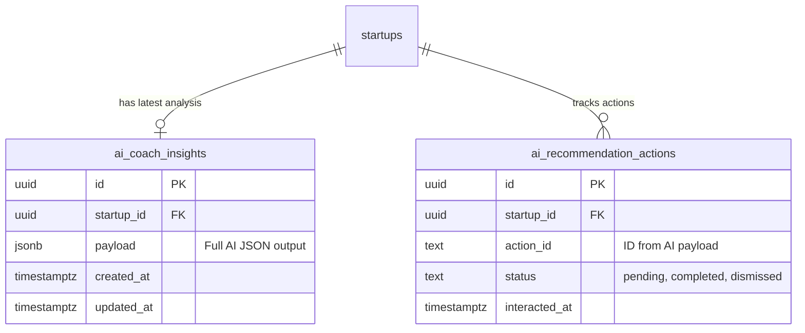

# 🤖 AI Startup Coach: Implementation Plan & Architecture

**Document Status:** Planning - 2025-01-23
**Author:** Lead AI Architect & Product Strategist
**System Goal:** To implement a proactive, always-on "AI Startup Coach" powered by **Google Gemini 3 Pro**. This agent analyzes the full spectrum of startup data (CRM, Financials, Fundraising, Market) to deliver high-level strategic insights, critical alerts, and actionable recommendations.

---

### 📊 Implementation Progress Tracker

| Phase | Task | Status | % Complete |
| :--- | :--- | :---: | :---: |
| **1. Data & Schema** | Define `ai_coach_insights` & `ai_recommendation_actions` tables | ✅ | 100% |
| | Define RLS policies & Indexes | ✅ | 100% |
| | Implement `get_startup_context` helper function (SQL/RPC) | 🟡 | 50% |
| **2. AI Engine** | Create `generate-coach-insights` Edge Function | 🟡 | 50% |
| | Integrate Gemini 3 Pro with Thinking & Search Grounding | 🔴 | 0% |
| | Design "Venture Partner" Prompt & JSON Schemas | 🔴 | 0% |
| **3. Frontend UI** | Build `StartupCoachSidebar` Component | 🔴 | 0% |
| | Implement Insight Cards & Action Handlers | 🔴 | 0% |
| **4. Integration** | Connect Dashboard to Coach Engine | 🔴 | 0% |
| | Implement Caching & Refresh Logic | 🔴 | 0% |

---

## 1. Purpose: The "Always-On" Venture Partner

The **AI Startup Coach** solves the problem of data overload. Founders have metrics scattered across dashboards. The Coach synthesizes this into narrative insights.

**Core Capabilities:**
*   **Pattern Recognition:** "Your pipeline velocity has dropped 15% since last month."
*   **Financial Health:** "Burn rate improved by 11%, extending runway to 14 months."
*   **Relationship Management:** "Follow up with Lightspeed — it's been 5 days since their last email."
*   **Strategic Timing:** "Momentum is building. It's the perfect time to update your Traction slide."
*   **Market Intelligence:** "Competitor X just raised Series B. Update your battlecards."

---

## 2. Data & Schema Architecture

This section defines the persistence layer required to store AI analysis and track user engagement with recommendations.

### Entity Relationship Diagram (ERD)



### Database Schema Definitions

#### Table 1: `public.ai_coach_insights`
Stores the most recent, holistic analysis generated by the AI. Designed as a singleton per startup (one row per startup, updated periodically) to serve as a cache.

| Column | Type | Description |
| :--- | :--- | :--- |
| `id` | `uuid` | Primary Key. |
| `startup_id` | `uuid` | Foreign Key to `public.startups`. Unique constraint ensures 1:1 relationship. |
| `payload` | `jsonb` | Stores the structured `CoachResponse` (insights, alerts, recommendations). |
| `created_at` | `timestamptz` | Creation timestamp. |
| `updated_at` | `timestamptz` | Last analysis timestamp. |

**Indexes:**
*   `CREATE UNIQUE INDEX idx_coach_insights_startup ON public.ai_coach_insights(startup_id);`

#### Table 2: `public.ai_recommendation_actions`
Tracks the lifecycle of specific recommendations provided by the coach. This allows the UI to hide "dismissed" suggestions or celebrate "completed" ones.

| Column | Type | Description |
| :--- | :--- | :--- |
| `id` | `uuid` | Primary Key. |
| `startup_id` | `uuid` | Foreign Key to `public.startups`. |
| `action_id` | `text` | A unique identifier for the recommendation (e.g., `update_traction_slide_2024_01`). |
| `status` | `text` | Enum: `pending`, `completed`, `dismissed`. |
| `interacted_at` | `timestamptz` | When the user last interacted with this item. |

**Indexes:**
*   `CREATE INDEX idx_rec_actions_startup ON public.ai_recommendation_actions(startup_id);`

### Row-Level Security (RLS) Policies

Strict isolation is enforced to ensure founders only see insights for their own startup.

**Policy: `ai_coach_insights`**
*   **SELECT:** Allow if `auth.uid()` is a member of the linked `startup_id`.
    ```sql
    (startup_id IN (SELECT startup_id FROM public.team_members WHERE user_id = auth.uid()))
    ```
*   **INSERT/UPDATE:** Generally handled by **Service Role** (Edge Functions), but can allow owners to trigger regens.

**Policy: `ai_recommendation_actions`**
*   **ALL:** Allow if `auth.uid()` is a member of the linked `startup_id`.

### Automation & Triggers

*   **`handle_updated_at`**: Standard trigger to update `updated_at` on `ai_coach_insights` modification.

---

## 3. Feature Specification

### A. Insights Feed (The "Pulse")
A dynamic feed of cards highlighting significant changes or trends.
*   **Growth:** User acquisition spikes, retention dips.
*   **Finance:** Burn rate alerts, revenue milestones.
*   **Product:** Usage anomalies.

### B. Smart Alerts (The "Watchdog")
Critical notifications that require immediate attention.
*   **Runway Alert:** "Cash out date is nearing the 6-month danger zone."
*   **Stalled Deals:** "3 deals in 'Negotiation' have had no activity for 10 days."
*   **Data Gaps:** "Your Data Room is missing IP Assignment agreements."

### C. Actionable Recommendations (The "Playbook")
One-click actions derived from the insights.
*   **"Draft Update":** "Draft an investor update highlighting your 20% MoM growth."
*   **"Enrich Lead":** "We found 5 new contacts at Acme Corp. Add them?"
*   **"Market Research":** "Research pricing changes in the Fintech sector."

---

## 4. Data Inputs & Context Window

To "think" like a partner, Gemini needs a holistic view. We will aggregate data from:

| Source | Specific Data Points |
| :--- | :--- |
| **CRM** | Active pipeline value, stalled deals (>14 days), recent interactions, key contact activity. |
| **Financials** | Current MRR, Net Burn, Cash Balance, Runway (calculated), MoM growth rates. |
| **Pitch Decks** | Last updated date, slide completion status, deck versions. |
| **Market (External)** | Competitor news, industry funding trends (via Google Search Tool). |
| **Platform** | User session data, feature usage frequency. |

---

## 5. AI Model Configuration (Gemini 3)

We leverage the cutting-edge capabilities of **Gemini 3 Pro**.

*   **Model:** `gemini-3-pro-preview`
*   **Configuration:**
    *   `thinking_level: "high"`: Essential for correlating distinct data points (e.g., "High burn" + "Low pipeline" = "Fundraising Risk").
    *   `tools: [{ googleSearch: {} }]`: To ground advice in current market reality.
*   **Structured Output:** Strict JSON schema to ensure the UI renders perfectly every time.

---

## 6. System Architecture & Data Flow

```mermaid
graph TD
    subgraph "Client Layer"
        Dashboard[Dashboard UI]
        Sidebar[AI Coach Sidebar Component]
    end

    subgraph "Supabase Backend"
        DB[(Postgres DB)]
        Edge[Edge Functions]
        Cron[pg_cron Schedule]
    end

    subgraph "Intelligence Layer"
        Gemini[Gemini 3 Pro]
        Search[Google Search]
    end

    %% Reads
    Dashboard -->|Mount| Sidebar
    Sidebar -->|Select * FROM ai_coach_insights| DB
    
    %% Writes / Generation
    Cron -->|Trigger Daily| Edge
    Sidebar -->|Click Refresh| Edge
    
    Edge -->|1. RPC: get_startup_context()| DB
    DB -->>|Returns JSON Context| Edge
    
    Edge -->|2. Generate(Context, Prompt)| Gemini
    Gemini -->|3. Grounding| Search
    Gemini -->>|4. Returns Insights JSON| Edge
    
    Edge -->|5. UPSERT ai_coach_insights| DB
    DB -->>|Realtime Update| Sidebar
```

### Edge Function: `generate-coach-insights`
1.  **Authentication:** Verify JWT and get User ID.
2.  **Context Fetching:** Execute `get_startup_context(startup_id)` RPC to get a consolidated JSON blob of CRM, Finance, and Deck data.
3.  **Reasoning:** Call Gemini 3 with `thinking_level="high"`.
4.  **Persistence:** Save the result to `ai_coach_insights`.
5.  **Response:** Return the fresh data to the client.

---

## 7. AI Prompts & Schemas

### System Instruction
> "You are an expert Venture Partner and Startup Coach. Your goal is to analyze a startup's raw data and synthesize it into strategic insights.
> 
> **Reasoning Rules:**
> 1.  **Connect the Dots:** Don't just report numbers. Explain *why* they matter (e.g., 'Revenue is up, BUT churn is also up -> Fix the leaky bucket').
> 2.  **Be Direct:** Use concise, executive-level language.
> 3.  **Prioritize:** Only report significant deviations or opportunities.
> 4.  **External Context:** Use Google Search to check if macro market trends explain internal metrics."

### Output Schema (`CoachResponse`)
```json
{
  "insights": [
    {
      "type": "positive" | "negative" | "neutral",
      "category": "growth" | "finance" | "fundraising",
      "title": "Momentum is building",
      "description": "You've moved 2 applications to 'Interview' stage this week. Conversion rate is 15% above average.",
      "metric_highlight": "+15% Conv."
    }
  ],
  "alerts": [
    {
      "severity": "high" | "medium",
      "message": "Follow up with Lightspeed",
      "subtext": "It's been 5 days since your last email."
    }
  ],
  "recommendations": [
    {
      "action_id": "update_traction_slide",
      "label": "Update your Traction Slide",
      "reason": "Sequoia often looks for MoM growth clearly labeled."
    }
  ],
  "match_score": 85
}
```

---

## 8. UI/UX Layout Specification

### The "Coach Sidebar"
A persistent right-hand panel on the dashboard.

*   **Header:** "AI Coach" with a "Refresh" button (and "Last updated X ago").
*   **Section 1: Insights (Cards)**
    *   Visual style: Light background cards with colored accents (Green for positive, Red for alerts).
    *   Iconography: Trend arrows, warning signs.
*   **Section 2: Suggestions (List)**
    *   "Lightbulb" icon for ideas.
    *   Clickable items that trigger workflows (e.g., opens Email Composer).
*   **Section 3: Recommended for You**
    *   Investor matches or relevant tools.
    *   "Apply" or "View" buttons.

**Visual Style:**
Matches the existing design system: `#FBF8F5` background, rounded corners, `#E87C4D` (Orange) accents for primary actions.

---

## 9. Implementation Roadmap

### Week 1: Data Modeling + Schemas
- [x] Create `ai_coach_insights` table in Supabase.
- [x] Write `get_startup_context` SQL function to aggregate data efficiently.
- [x] Define TypeScript interfaces for the Coach response.

### Week 2: Core Edge Functions + Insight Engine
- [ ] Scaffold `generate-coach-insights` Edge Function.
- [ ] Implement Gemini 3 integration with `thinking_config`.
- [ ] Refine prompts with real-world test cases.

### Week 3: AI Prompt Tuning + Search Integration
- [ ] Integrate `googleSearch` tool for market context.
- [ ] Implement caching strategies to minimize API costs (e.g., refresh every 6 hours or on manual trigger).
- [ ] Validate structured output reliability.

### Week 4: UI/UX + React Components
- [ ] Build `StartupCoachSidebar` React component.
- [ ] Create sub-components: `InsightCard`, `AlertBanner`, `ActionItem`.
- [ ] Integrate with Dashboard layout.

### Week 5: Testing + RLS + Evaluation Metrics
- [ ] Implement "Action Handlers" (e.g., clicking "Draft Email" opens the modal).
- [ ] Add loading skeletons and error states.
- [ ] Conduct user testing for insight relevance.

### Week 6: Launch + Monitoring + Iteration
- [ ] Deploy Edge Functions to production.
- [ ] Monitor usage via Supabase logs.
- [ ] Iterate on prompts based on user feedback.

---

## 10. Success Criteria

1.  **Relevance:** Users rate insights as "Helpful" > 80% of the time (via simple thumbs up/down UI).
2.  **Performance:** Dashboard loads instantly (cached insights), Refresh takes < 5s.
3.  **Engagement:** > 30% of sessions involve clicking a Coach recommendation.
4.  **Accuracy:** Zero hallucinated metrics (math is verified via code execution or strictly pulled from DB).

---

## ✅ Production Readiness Checklist

| Category | Criteria |
| :--- | :--- |
| **Task Specification** | Requirements for "Coach" engine are clearly defined in this doc. |
| **Clean Code** | Functions will be modular (`services/ai/coach.ts`), separating UI from Logic. |
| **Responsive Design** | Sidebar will collapse/expand on mobile or slide over content. |
| **Testing** | Mock data provided for offline development; Edge Function logs enabled. |
| **Code Reviews** | All prompts reviewed for safety and hallucination risk. |
| **Deployment** | Env vars (`GEMINI_API_KEY`) set in Supabase Secrets. |
