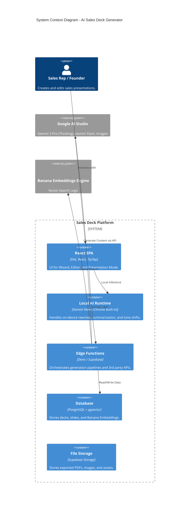
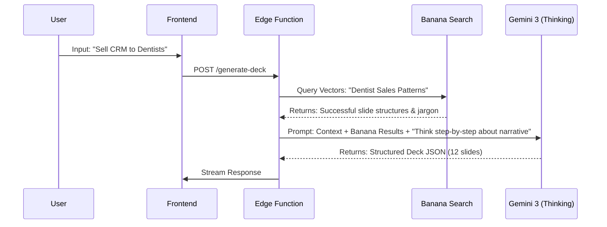
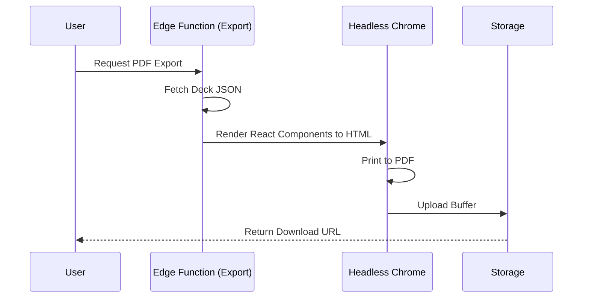

# 💼 AI Sales Presentation Deck Generator: System Architecture

Here is the comprehensive system plan for the **AI Sales Presentation Deck Generator**, architected for production using the specified Google AI stack and Supabase infrastructure.

## 1. High-Level Architecture (C4 Model)

This diagram illustrates the hybrid cloud/local architecture. We leverage the cloud for heavy lifting (Deck Generation) and the device for latency-sensitive editing (Copilot).



---

## 2. Data Model & Supabase Tables

We need a relational model with vector support for the Banana Embeddings system.

### Tables Schema

1.  **`users`** (Managed by Supabase Auth)
    *   `id` (UUID, PK)
    *   `email`, `full_name`, `avatar_url`

2.  **`brand_kits`** (Personalization)
    *   `id` (UUID, PK)
    *   `user_id` (FK)
    *   `colors` (JSONB: `{ primary: "#...", secondary: "#..." }`)
    *   `fonts` (JSONB: `{ heading: "Inter", body: "Roboto" }`)
    *   `tone_guide` (Text: "Professional, witty, concise")

3.  **`decks`**
    *   `id` (UUID, PK)
    *   `user_id` (FK)
    *   `title` (Text)
    *   `status` (Enum: `draft`, `generating`, `completed`)
    *   `meta` (JSONB: target_audience, industry, goal)

4.  **`slides`**
    *   `id` (UUID, PK)
    *   `deck_id` (FK)
    *   `order_index` (Int)
    *   `type` (Enum: `title`, `problem`, `solution`, `data`, `team`)
    *   `layout_id` (String: reference to template)
    *   `content` (JSONB: Structured data for the slide)
    *   `speaker_notes` (Text)

5.  **`banana_vectors`** (The "Banana" Knowledge Base)
    *   `id` (UUID, PK)
    *   `content_chunk` (Text: Slide text or layout description)
    *   `embedding` (vector(768): Generated via Gemini Embeddings)
    *   `metadata` (JSONB: `{ industry: "SaaS", success_rate: 0.9, slide_type: "Pricing" }`)
    *   *Index:* HNSW index for fast cosine similarity search.

6.  **`exports`**
    *   `id` (UUID)
    *   `deck_id` (FK)
    *   `format` (PDF/PNG/JSON)
    *   `url` (Storage URL)

---

## 3. AI Pipelines

### A. The Deck Generation Pipeline (Cloud)
Using **Gemini 3 Pro (Thinking Mode)** for high-level strategy.



### B. The "Banana" Retrieval Pipeline
This ensures we use proven slide structures rather than hallucinating layouts.
1.  **Input:** User Industry + Slide Type (e.g., "Healthcare" + "Pricing").
2.  **Embed:** Convert input to vector using Gemini Text Embedding.
3.  **Search:** Query `banana_vectors` for high-performing examples.
4.  **Context Injection:** Feed the top 3 examples into the context window of the generator model.

### C. The "Nano Copilot" Pipeline (Local)
Using **Gemini Nano** for zero-latency edits.
1.  **User Action:** Highlight text -> Click "Make Professional".
2.  **Process:** `window.ai.languageModel.generate("Rewrite this text to be professional: " + selection)`
3.  **Output:** Instant text replacement in the DOM. No server cost.

---

## 4. Slide Logic & Templates

All slides adhere to a strict JSON schema to ensure the frontend renderer (React) never breaks.

**Slide JSON Structure:**
```json
{
  "slide_id": "uuid",
  "type": "ROI_Calculator",
  "layout": "split_left_image_right_data",
  "brand_override": null,
  "content": {
    "headline": "Save 20 hours per week",
    "subhead": "Automate patient intake forms",
    "bullet_points": ["Reduce manual entry", "HIPAA compliant", "Instant sync"],
    "visual_prompt": "A futuristic digital clipboard transforming into data streams",
    "chart_data": {
      "labels": ["Manual", "Automated"],
      "values": [40, 2]
    }
  }
}
```

**Slide Types:**
1.  **The Hook:** Problem statement / Emotional resonance.
2.  **The Villain:** Why current solutions fail.
3.  **The Hero:** Product reveal.
4.  **The Proof:** Metrics / Case Studies (populated via Banana search).
5.  **The Ask:** Pricing / Next Steps.

---

## 5. UI/UX Layout Structure

### A. Create Deck Wizard
*   **Input:** Chat interface. "Who are you selling to?" "What is your product?"
*   **Style Selector:** Visual cards (Minimal, Bold, Corporate).
*   **Banana Toggle:** "Use historical success data?" (Toggles RAG).

### B. The Editor (Main View)
*   **Left Sidebar:** Slide sorter (drag & drop).
*   **Center Stage:** WYSIWYG Editor. Components are React blocks mapped to the JSON structure.
    *   *Click to Edit:* Text fields.
    *   *Magic Button:* On every block, triggers Gemini 3 Flash for "Regenerate this specific section."
*   **Right Sidebar (AI Copilot):**
    *   **Nano Chat:** "Summarize this slide."
    *   **Visuals:** "Generate chart from this text."

---

## 6. Edge Functions (Deno)

### `/generate-deck`
*   **Model:** Gemini 3 Pro (Thinking Mode).
*   **Logic:** 
    1. Embeds user prompt.
    2. RAG search against `banana_vectors`.
    3. Constructs a "System Prompt" containing brand guidelines + RAG results.
    4. Generates JSON.
    5. Inserts rows into `decks` and `slides`.

### `/rewrite-slide`
*   **Model:** Gemini 3 Flash (Fast).
*   **Input:** Slide JSON + Instruction ("Make it funnier").
*   **Output:** Updated Slide JSON.

### `/generate-chart`
*   **Model:** Gemini 3 Pro (Function Calling).
*   **Input:** Unstructured text/data.
*   **Output:** Chart.js compatible JSON configuration.

### `/nano-prepare`
*   **Logic:** Fetches the whole deck, strips formatting, and sends a compressed text version to the client for Gemini Nano to ingest as "context" for the session.

---

## 7. Banana Embeddings Plan

**What gets embedded?**
We do not embed generic templates. We embed **Semantic Concepts**:
1.  **Objection Handling:** "Too expensive" -> Retrieve slides that effectively reframe ROI.
2.  **Industry Jargon:** "Fintech" -> Retrieve slides using correct terminology (KYC, AML).
3.  **Layout Logic:** "Comparison" -> Retrieve layouts that effectively compare A vs B.

**Storage:**
Supabase `pgvector`.
**Query:** `cosine_distance`.

---

## 8. Integration Plan

### Gemini 3 (Google AI Studio)
*   We use the REST API.
*   **Thinking Mode:** Enabled for the initial deck generation to ensure logical flow (e.g., "Does the solution actually solve the stated problem?").
*   **Structured Output:** We enforce `response_mime_type: "application/json"` and provide a JSON schema to Gemini to guarantee the slide format is valid.

### Gemini Nano (Local)
*   We use the Chrome Built-in AI API (`window.ai`).
*   **Graceful Degradation:** If Nano is not available on the user's browser, the UI falls back to calling a server-side Gemini Flash function for the Copilot sidebar.

---

## 9. Workflow Diagrams

### Full User Workflow

```mermaid
flowchart TD
    Start[User: "Create Deck"] --> Wizard[Wizard UI]
    Wizard -->|Inputs| Edge[Edge: /generate-deck]
    
    subgraph Backend Logic
        Edge --> Embed[Embed Input]
        Embed --> VectorDB[(Banana Vectors)]
        VectorDB -->|Context| Prompt[Context Assembly]
        Prompt --> Gem3[Gemini 3 Thinking]
        Gem3 -->|JSON| DB[(Supabase DB)]
    end
    
    DB --> Editor[Editor UI]
    
    subgraph Editor Loop
        Editor -->|Edit Text| Nano[Gemini Nano (Local)]
        Editor -->|Regenerate Visuals| GemFlash[Gemini Flash]
        Editor -->|Export| PDF[PDF Generation]
    end
```

### Export Pipeline



---

## 🚀 Additional Gemini 3 & Google AI Studio Features

To make this system cutting-edge, integrate these specific Google AI Studio features:

1.  **Grounding with Google Search:**
    *   *Use Case:* In the "Market" slide, use Grounding to fetch *actual, real-time* market size numbers (TAM/SAM/SOM) for 2024/2025, citing sources automatically.
    *   *Config:* `tools: [{ google_search: {} }]`.

2.  **Multimodal Input (Audio/Video):**
    *   *Use Case:* Allow the user to upload a 2-minute loom video or audio recording of them rambling about their product.
    *   *Implementation:* Send the media file directly to Gemini 1.5/3 Pro context window to extract the pitch structure.

3.  **Gemini Code Execution:**
    *   *Use Case:* For the "ROI Calculator" slide. Instead of asking the LLM to do math (which it is bad at), ask Gemini to write and execute Python code to calculate the financial projections based on user inputs, ensuring 100% mathematical accuracy in the deck.
