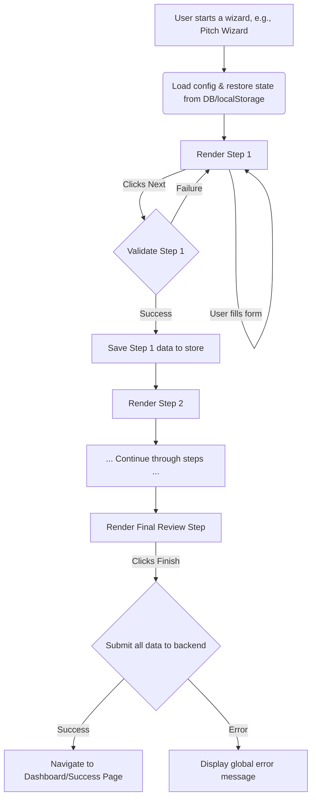

# Solar: MVP Wizard Engine Specification

**Document Status:** Published & Production-Ready
**Version:** 1.0

This document provides the complete technical specification for a minimal, reusable, and configuration-driven wizard engine for the Solar MVP. This single engine will power all four wizards (Pitch, Event, Profile, Startup) to ensure consistency and rapid development.

---

### Core Principles

-   **Configuration Over Code:** Wizards are defined by JavaScript configuration objects, not by creating new, monolithic wizard components. This makes adding a new wizard as simple as creating a new config file.
-   **Shared Shell, Unique Steps:** A single, reusable `<WizardEngine />` component provides the "shell" (navigation, controls, preview panel). The content of each step is a unique, self-contained component.
-   **Decoupled State Management:** The wizard's state is managed globally using **Zustand**. This decouples the state from the UI, making it easy to persist, debug, and access from any component.

---

### 1. Step-based Navigation System

The engine is driven by an array of step objects in a configuration file. The engine manages the `currentStep` index and renders the appropriate component.

**Example Wizard Configuration (`/pages/app/wizards/pitch/config.ts`):**
```typescript
import { Step1_CompanyBasics } from './steps/Step1_CompanyBasics';
import { Step2_ProblemSolution } from './steps/Step2_ProblemSolution';
// ... import other step components

export const pitchWizardConfig = {
  id: 'pitch', // Unique ID for this wizard type
  title: 'Pitch Deck Wizard',
  steps: [
    {
      id: 'basics',
      title: 'Company Basics',
      component: Step1_CompanyBasics,
    },
    {
      id: 'problem_solution',
      title: 'Problem & Solution',
      component: Step2_ProblemSolution,
    },
    // ... more steps
    {
      id: 'review',
      title: 'Review & Submit',
      component: Step_Review,
    }
  ]
};
```

---

### 2. Form Input & Validation

-   **Form Handling:** Each step's component will use **`react-hook-form`** for efficient, performant form state management.
-   **Validation:** **Zod** will be used to define validation schemas for each form. `react-hook-form` integrates seamlessly with Zod.
-   **Data Flow:** On successful validation and submission of a step's form, the data is saved to the global Zustand store before proceeding to the next step. This ensures each step is validated before moving on.

---

### 3. Persistent State Strategy (Two Layers)

To provide a seamless and reliable user experience, we will use a two-layer persistence strategy.

#### Layer 1: Instant UI State (`localStorage`)
-   **Mechanism:** The entire Zustand store is automatically saved to `localStorage` on every state change.
-   **Purpose:** This handles page refreshes instantly. If the user accidentally reloads the page, the wizard's state (current step and all form data) is immediately restored from `localStorage`.

#### Layer 2: Cross-Device Draft Saving (Database)
-   **Mechanism:** Use a `useDebounce` hook to save the `formData` from the Zustand store to the `wizard_sessions` table in Supabase every 2-3 seconds of inactivity.
-   **Purpose:** This persists the user's draft to the backend. They can close their browser, switch devices, and when they return to the wizard, their draft can be loaded from the database.

---

### 4. Component Hierarchy & Folder Structure

```
/src
├── components/
│   └── wizards/
│       ├── WizardEngine.tsx      # The main shell component
│       ├── WizardControls.tsx    # Next, Back, Finish buttons
│       └── WizardPreview.tsx     # The right-side preview panel
├── pages/
│   └── app/
│       └── wizards/
│           ├── pitch/
│           │   ├── config.ts         # Wizard definition
│           │   └── steps/
│           │       ├── Step1_CompanyBasics.tsx
│           │       └── Step2_ProblemSolution.tsx
│           └── event/
│               ├── config.ts
│               └── steps/
│                   └── Step1_EventDetails.tsx
└── state/
    └── wizardStore.ts      # The global Zustand store
```

---

### 5. UI Layout & Controls

-   **Layout:** A responsive two-column layout.
    -   **Left Column (70%):** Contains the active step's form fields.
    -   **Right Column (30%):** Contains the `WizardPreview` component, which shows a live-updating preview of the final output (e.g., a pitch deck slide, an event card).
-   **Controls (`WizardControls.tsx`):**
    -   **`Back`:** Decrements the `currentStep` index. Disabled on the first step.
    -   **`Next`:** Triggers the current step's form validation. On success, it saves the data to the store and increments the `currentStep` index.
    -   **`Finish`:** Appears only on the last step. It triggers the final submission to the backend (e.g., creating the records in `pitch_decks` and `slides`).

---

### 6. Example Code Snippets

**Zustand Store (`/state/wizardStore.ts`):**
```typescript
import { create } from 'zustand';
import { persist } from 'zustand/middleware';

interface WizardState {
  currentStep: number;
  formData: Record<string, any>;
  setFormData: (data: Record<string, any>) => void;
  goToNextStep: () => void;
  // ... other actions
}

export const useWizardStore = create<WizardState>()(
  persist(
    (set) => ({
      currentStep: 0,
      formData: {},
      setFormData: (data) => set((state) => ({ formData: { ...state.formData, ...data } })),
      goToNextStep: () => set((state) => ({ currentStep: state.currentStep + 1 })),
      // ...
    }),
    {
      name: 'solar-wizard-storage', // name of the item in localStorage
    }
  )
);
```

**Wizard Engine (`/components/wizards/WizardEngine.tsx`):**
```tsx
import { useWizardStore } from '@/state/wizardStore';

const WizardEngine = ({ config }) => {
  const { currentStep } = useWizardStore();
  
  const ActiveStepComponent = config.steps[currentStep]?.component;

  if (!ActiveStepComponent) {
    return <div>Wizard step not found.</div>;
  }

  return (
    <div className="wizard-layout">
      <div className="wizard-form-panel">
        <ActiveStepComponent />
        <WizardControls />
      </div>
      <div className="wizard-preview-panel">
        <WizardPreview />
      </div>
    </div>
  );
};
```

---

### 7. UI Flow from Start to Submit

This diagram shows the complete user journey through the wizard engine.



---

### 8. Best Practices for React + Vite + shadcn/ui

-   **Naming Conventions:** Use clear, descriptive names: `WizardEngine`, `useWizardStore`, `pitchWizardConfig`.
-   **Component Reusability:** Build generic components like `WizardControls` and `WizardPreview` that can be used across all wizards.
-   **Performance:** `react-hook-form` is used to minimize re-renders on input changes.
-   **Styling:** Use `shadcn/ui` components (`Button`, `Input`, `Card`) as the building blocks for forms to maintain design consistency with the rest of the Solar platform.
