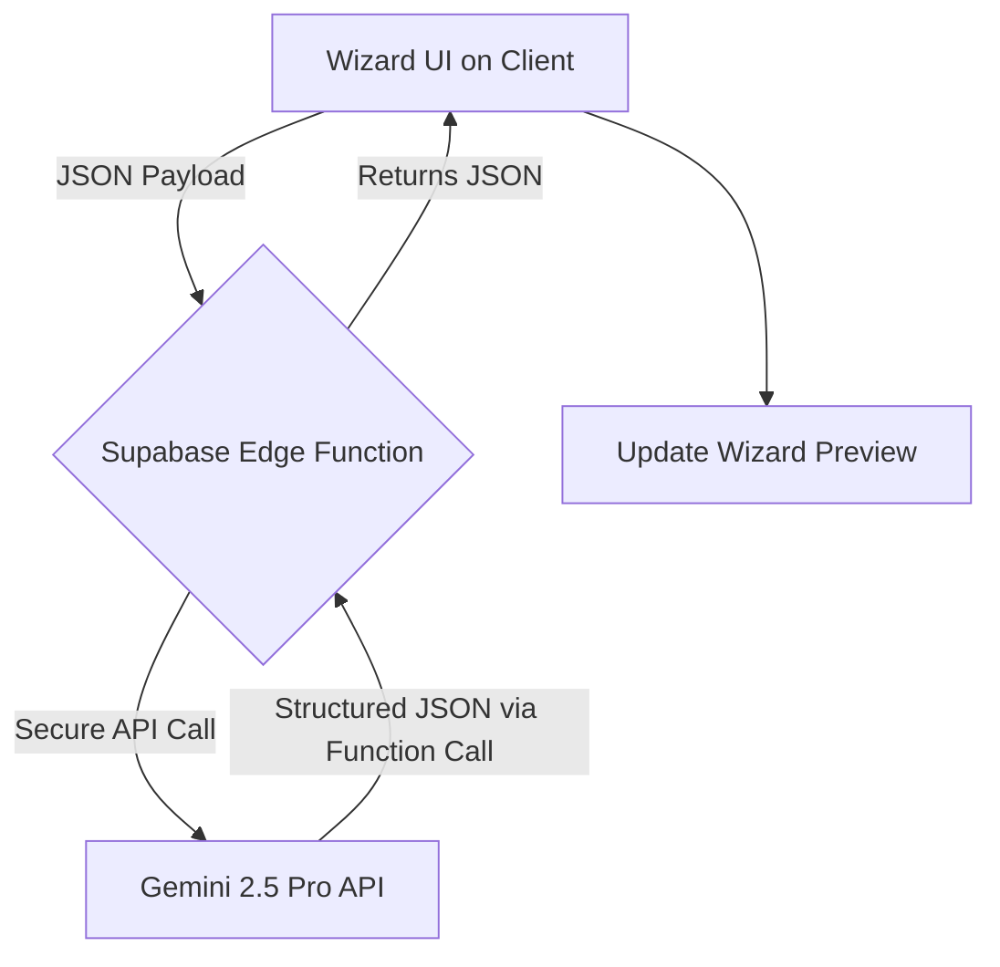

# Solar: MVP AI Integration Guide (Gemini 2.5)

**Document Status:** Published & Production-Ready
**Version:** 1.0

This document provides the minimal, secure, and production-ready implementation plan for integrating Gemini AI into the Solar MVP wizards.

---

### Core Principle: No Client-Side AI

To ensure security and protect our API keys, **all calls to the Gemini API MUST be handled by Supabase Edge Functions.** The frontend React application will **never** call the Gemini API directly or have access to any API keys. This is the most critical architectural rule.

---

### 1. Minimal AI Features for MVP

For the MVP, we will implement only two core generative features:

1.  **`generate_pitch`:** Takes the payload from the Pitch Wizard and generates a structured 10-slide pitch deck outline.
2.  **`generate_event`:** Takes basic event details and generates a compelling title and description.

---

### 2. AI Flow & Architecture

The data flow is simple, secure, and robust.



---

### 3. Environment & Secrets Handling

The Gemini API key **MUST** be stored as a secret in your Supabase project.

1.  **Set the Secret:** Run this command locally after linking your project.
    ```bash
    supabase secrets set GEMINI_API_KEY <your-google-ai-studio-api-key>
    ```
2.  **Access in Function:** The key will be available in the Deno environment.
    ```typescript
    // Inside any Edge Function
    const apiKey = Deno.env.get('GEMINI_API_KEY');
    ```

---

### 4. Implementation: `generate-pitch` Edge Function

This function will power the Pitch Deck Wizard's AI generation.

-   **Path:** `supabase/functions/generate-pitch/index.ts`

#### Request Body
The function will expect a JSON payload matching the output of the wizard's Zustand store.

```json
{
  "companyName": "Innovate AI",
  "problem": "Businesses struggle to analyze customer feedback.",
  "solution": "We provide an AI-powered platform to automatically categorize and summarize feedback."
}
```

#### Prompt Schema (Function Calling)
We will use **Function Calling** with `gemini-2.5-pro` to guarantee a reliable, structured JSON response.

```typescript
// Inside the Edge Function
import { GoogleGenAI, FunctionDeclaration, Type } from "@google/genai";

const createPitchDeckFunction: FunctionDeclaration = {
  name: 'createPitchDeck',
  description: 'Creates a 10-slide pitch deck outline from company info.',
  parameters: {
    type: Type.OBJECT,
    properties: {
      slides: {
        type: Type.ARRAY,
        items: {
          type: Type.OBJECT,
          properties: {
            title: { type: Type.STRING },
            content: { type: Type.STRING, description: "Bullet points separated by newlines." }
          },
          required: ["title", "content"]
        }
      }
    },
    required: ["slides"]
  }
};
```

#### Edge Function Code (`index.ts`)
```typescript
import { GoogleGenAI, FunctionDeclaration, Type } from "@google/genai";

// Define the function declaration as shown above
const createPitchDeckFunction: FunctionDeclaration = { /* ... */ };

const RETRY_COUNT = 1; // Single retry

serve(async (req) => {
  // 1. Handle CORS and Auth
  if (req.method === 'OPTIONS') {
    return new Response('ok', { headers: corsHeaders });
  }
  // const user = await getUserFromRequest(req); // Your auth logic here

  try {
    const { companyName, problem, solution } = await req.json();

    // 2. Initialize Gemini with secure API key
    const apiKey = Deno.env.get('GEMINI_API_KEY');
    if (!apiKey) {
      throw new Error("GEMINI_API_KEY is not set.");
    }
    const ai = new GoogleGenAI({ apiKey });

    // 3. Craft the Prompt
    const prompt = `You are a world-class venture capital analyst. Analyze the following company details and generate a compelling 10-slide pitch deck outline by calling the "createPitchDeck" function.
    - Company: ${companyName}
    - Problem: ${problem}
    - Solution: ${solution}`;

    let response;
    for (let i = 0; i <= RETRY_COUNT; i++) {
        try {
            console.log(`Attempt ${i+1} for generate-pitch...`);
            response = await ai.models.generateContent({
              model: 'gemini-2.5-pro',
              contents: prompt,
              config: {
                tools: [{ functionDeclarations: [createPitchDeckFunction] }]
              }
            });
            
            // If we get a response, break the loop
            if (response?.functionCalls?.length > 0) {
              break;
            }
        } catch (error) {
            console.error(`Attempt ${i+1} failed:`, error);
            if (i === RETRY_COUNT) throw error; // Rethrow after final attempt
        }
    }

    // 4. Validate and Return Response
    const functionCall = response?.functionCalls?.[0];

    if (functionCall?.name === 'createPitchDeck' && functionCall.args) {
      // Success: return the structured JSON
      return new Response(JSON.stringify(functionCall.args), {
        headers: { ...corsHeaders, 'Content-Type': 'application/json' },
        status: 200,
      });
    }

    // Failure: AI did not return the expected function call
    console.error("Gemini did not return the expected function call.", response);
    throw new Error("AI failed to generate a valid deck structure.");

  } catch (error) {
    // 5. Global Error Handling
    console.error('Error in generate-pitch function:', error);
    return new Response(JSON.stringify({ error: error.message }), {
      headers: { ...corsHeaders, 'Content-Type': 'application/json' },
      status: 500,
    });
  }
});
```

---

### 5. Implementation: `generate-event` Edge Function

This function follows the same secure pattern for the Event Wizard.

-   **Path:** `supabase/functions/generate-event/index.ts`
-   **Request Body:** `{ "title": "AI Networking Night", "audience": "Developers and Founders" }`
-   **Function Declaration:** `createEventContent` with `title` and `description` properties.
-   **Code:** The implementation is nearly identical to `generate-pitch`, but uses a different prompt and function declaration.

---

### 6. Frontend Integration

The frontend's role is simple: call the Edge Function and handle the response.

**Example (`/services/pitchService.ts`):**
```typescript
import { supabase } from '@/lib/supabaseClient';

export async function generatePitchDeck(payload: { companyName: string; problem: string; solution: string; }) {
  const { data, error } = await supabase.functions.invoke('generate-pitch', {
    body: payload,
  });

  if (error) {
    throw new Error('Failed to generate pitch deck: ' + error.message);
  }

  // The 'data' is already a parsed JSON object
  return data;
}
```

This architecture provides a secure, reliable, and scalable foundation for all AI features in the Solar MVP.
