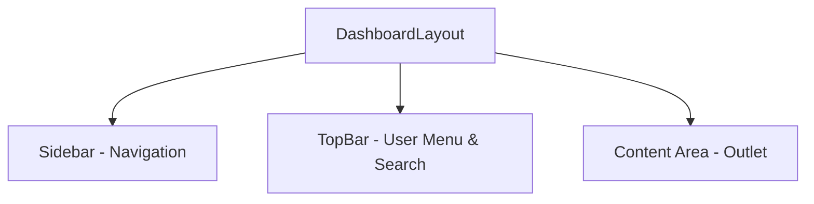

# Solar: Authenticated Dashboard Specification

**Document Status:** Published & Production-Ready
**Version:** 1.0
**Author:** Lead UX Architect

---

## 1. Executive Summary & Goal

The Solar Dashboard is the user's mission control center. Its primary goal is to provide a seamless, intuitive, and powerful interface for users to manage their startups, create and refine pitch decks, organize events, and track their progress within the ecosystem.

This specification outlines the minimal, production-ready architecture for the dashboard, focusing on a modular component system, clear data flows, and a robust user experience that handles all states gracefully.

---

## 2. Core Dashboard Architecture

The dashboard uses a modern, responsive three-part layout that is consistent across all authenticated pages.

-   **Main Sidebar (Collapsible):** The primary navigation component. It provides access to all major sections of the application. It will be collapsible to maximize content space and will persist its state (`open`/`closed`) in `localStorage`.
-   **Top Bar / Header:** Contains the current user's profile menu (with links to Profile/Settings and Logout), notifications, and a global search bar. On mobile, it will also contain the hamburger menu toggle for the sidebar.
-   **Content Area:** The main flexible container where the content for each page is rendered. It is responsible for its own scrolling.

---

## 3. Core vs. Advanced Feature Map

This map defines the scope for the MVP and outlines future enhancements.

| Scope | Feature | Real-World Example |
| :--- | :--- | :--- |
| **Core** | **Dashboard Home:** "At-a-glance" view of recent activity and quick actions. | A user logs in and immediately sees their next upcoming event and a button to continue editing their last pitch deck. |
| **Core** | **CRUD for Decks & Events:** Full create, read, update, and delete functionality for a user's own pitch decks and events. | A user creates a new pitch deck, edits its content, and can later delete it from their "My Pitch Decks" page. |
| **Core** | **Profile & Startup Management:** Users can edit their personal profile and the profile of the startup they own. | A founder updates their startup's tagline, which is then reflected on their public profile page. |
| **Core** | **State Handling:** All pages have defined `loading`, `empty`, and `error` states. | When fetching decks, the user sees a loading skeleton. If they have no decks, they see an `EmptyState` component with a "Create Your First Deck" CTA. |
| **Advanced**| **Real-time Notifications:** A live notification system for events, mentions, or feedback. | A user receives a real-time notification when someone registers for their event. |
| **Advanced**| **Global Search:** A powerful search bar in the top bar that can find decks, events, or users across the platform. | A user types "Innovate AI" and sees results for the startup profile, related pitch decks, and upcoming events. |
| **Advanced**| **Analytics & Insights:** A dedicated analytics section showing view counts for decks, event attendance rates, etc. | A founder can see which slide in their pitch deck is viewed the most by people who have the shareable link. |

---

## 4. Core Component Library

The dashboard will be built with a set of reusable components to ensure consistency.

-   **`StatCard`:** A small card to display a single, key metric with an icon (e.g., "Total Decks: 5").
-   **`DataTable`:** A responsive table component with sorting, filtering, and pagination for displaying lists of resources like decks or events.
-   **`ResourceCard`:** A grid-view card for displaying a summary of a deck or event, with a thumbnail and key details.
-   **`Modal`:** A generic modal component for confirmation dialogs (e.g., "Are you sure you want to delete this deck?") or simple forms.
-   **`EmptyState`:** A component to be displayed when a list is empty, containing a message, an icon, and a primary CTA (e.g., "You have no events. Create One!").
-   **`LoadingSkeleton`:** Placeholder components that mimic the shape of the content being loaded.
-   **`ErrorState`:** A component to display when an API call fails, containing an error message and a "Retry" button.

---

## 5. Page Specifications

### A. Dashboard Home
-   **Purpose:** To provide a personalized, "at-a-glance" overview and a launchpad into the rest of the application.
-   **Route:** `/dashboard`
-   **Data Requirements:**
    -   `GET /api/me/stats`: Aggregated counts (total decks, upcoming events).
    -   `GET /api/events/upcoming?limit=3`: The user's next 3 upcoming events.
    -   `GET /api/decks?sort=updated_at&limit=3`: The user's 3 most recently edited decks.
    -   `GET /api/me/activity?limit=5`: A feed of recent activity (e.g., "You created a new event").
-   **Content Sections & Components:**
    1.  **Welcome Header:** "Welcome back, [User Name]!"
    2.  **Stats Bar:** A row of 3-4 `StatCard` components.
    3.  **Quick Actions:** A section with prominent buttons for the most common actions ("Create New Deck," "Create New Event").
    4.  **Upcoming Events:** A list or small cards showing the user's next few events.
    5.  **Recent Decks:** A list or grid of `ResourceCard` components for recently edited decks.

### B. My Pitch Decks
-   **Purpose:** To be the central hub for a user to create, view, manage, and delete all of their pitch decks.
-   **Route:** `/dashboard/decks`
-   **Data Requirements:**
    -   `GET /api/decks`: A paginated list of all decks owned by the user, with search and filter parameters.
-   **Content Sections & Components:**
    1.  **Header:** "My Pitch Decks" title and a primary "Create New Deck" CTA button.
    2.  **Toolbar:** A set of controls including a search input, sort dropdown (e.g., "Last Modified," "Alphabetical"), and a view toggle (grid vs. list).
    3.  **Deck Display:**
        -   **Grid View (Default):** A responsive grid of `ResourceCard` components.
        -   **List View:** A `DataTable` showing deck title, number of slides, last modified date, and an actions menu (Edit, Present, Delete).
    4.  **States:** The page must handle `loading` (skeletons), `empty` (`EmptyState` component), and `error` states.

### C. My Events
-   **Purpose:** To allow users to manage all the events they have created.
-   **Route:** `/dashboard/events`
-   **Data Requirements:**
    -   `GET /api/events/my-events`: A paginated list of all events created by the user.
-   **Content Sections & Components:**
    1.  **Header:** "My Events" title and a "Create New Event" CTA.
    2.  **Toolbar:** Search and sort controls, similar to the decks page. A filter for "Upcoming" vs. "Past" events.
    3.  **Event Display:** A `DataTable` is preferred here, showing Event Title, Date, Location, Registrations, Status (Published/Draft), and an actions menu (Edit, View Public Page, Delete).
    4.  **States:** The page must handle `loading`, `empty`, and `error` states.

### D. My Startups
-   **Purpose:** To allow a user to create and manage the profile(s) for their startup(s).
-   **Route:** `/dashboard/startups`
-   **Data Requirements:**
    -   `GET /api/startups/my-startups`: A list of all startups owned by the user.
-   **Content Sections & Components:**
    1.  **Header:** "My Startups" title and a "Create New Startup" CTA.
    2.  **Startup List:** A list of `ResourceCard` components, one for each startup. Each card shows the startup's logo, name, and tagline, with an "Edit" button.
    3.  **`EmptyState`:** If the user has no startups, prompt them to create their first one.

### E. My Profile
-   **Purpose:** To allow a user to manage their personal account settings and public profile information.
-   **Route:** `/dashboard/profile`
-   **Data Requirements:**
    -   `GET /api/me/profile`: The current user's profile data.
    -   `PATCH /api/me/profile`: Endpoint to update the user's profile.
-   **Content Sections & Components:**
    1.  **Header:** "My Profile."
    2.  **Profile Form:** A form with fields for `Full Name`, `Username`, `Avatar URL`, and `Bio`.
    3.  **Account Settings:** A separate section for account-related actions like changing the email or password.
    4.  **Save Button:** A primary button to save any changes made to the form.

---

## 6. Routing Structure

The routing will be nested under a protected `/dashboard` path.

-   `/dashboard` → `DashboardHome`
-   `/dashboard/decks` → `MyPitchDecks`
-   `/dashboard/events` → `MyEvents`
-   `/dashboard/startups` → `MyStartups`
-   `/dashboard/profile` → `MyProfile`
-   *(Wizards will have their own nested routes like `/wizard/pitch/new`)*

All of these routes will be wrapped in a `ProtectedRoute` component that verifies the user is authenticated before rendering.
