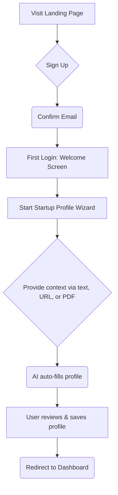
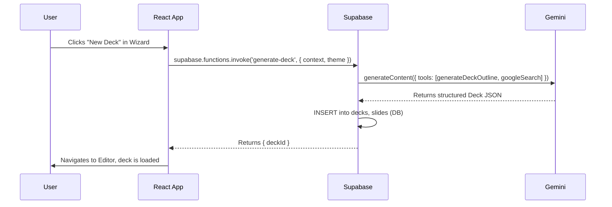
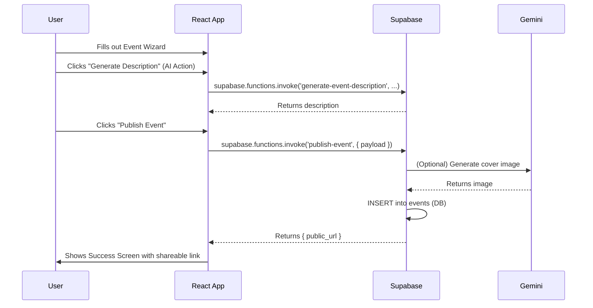
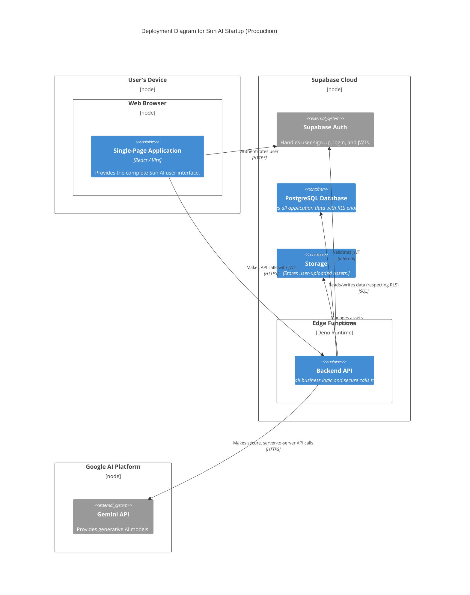

# ☀️ Product Requirements Document: The Sun AI Ecosystem

**Document Status:** Published - 2024-08-29
**Author:** Lead AI Product Architect
**Version:** 2.0 (Full-Stack Production Blueprint)

---

## 1. Executive Summary

**Sun AI** is an intelligent, all-in-one ecosystem designed to empower the startup journey. It serves founders, startup teams, investors, and community builders by providing a suite of AI-powered tools and resources that streamline critical, time-consuming tasks.

The core problem we solve is the fragmentation and friction of the early-stage startup process. Founders waste hundreds of hours wrestling with presentation tools, searching for talent, organizing events, and navigating the complex venture landscape.

Sun AI matters because it centralizes these workflows into a single, cohesive platform, leveraging the power of Google's Gemini AI to automate content creation, enhance decision-making, and foster community. Our vision is to be the indispensable operating system for the next generation of innovators, allowing them to move **from idea to investor-ready in one platform.**

---

## 2. Vision Statement

Our long-term mission is to democratize access to the tools and resources needed to build successful companies. We envision a future where any founder with a great idea can articulate their vision, build a community, and connect with capital, regardless of their background or design skills. Sun AI will be the intelligent co-pilot that makes this possible, transforming the startup landscape into a more equitable and efficient ecosystem.

---

## 3. Goals & Success Metrics

| Category | Metric | Goal / Target |
| :--- | :--- | :--- |
| **User Activation** | **Time-to-First-Deck:** Time from signup to generating the first 10-slide draft. | **< 10 minutes** |
| | **Core Action Rate:** % of new signups who create a deck, post a job, or create an event in their first session. | **≥ 40%** |
| **User Engagement** | **Weekly Active Users (WAU):** Number of unique users logging in per week. | Grow by 15% MoM |
| | **AI Tool Adoption:** % of active users who use at least one AI feature per session. | **> 70%** |
| **Conversion** | **Freemium-to-Paid Conversion Rate:** % of active free users who upgrade to a paid plan. | **≥ 5%** |
| **AI Performance** | **AI Task Success Rate:** % of AI generation tasks that complete successfully without error. | **≥ 95%** |
| | **AI Task Latency (P95):** 95th percentile of response time for AI actions. | **< 5s** for text, **< 20s** for images |

---

## 4. User Personas

| Persona | Description | Needs & Goals | Real-World Example |
| :--- | :--- | :--- | :--- |
| **"The Founder"** | Early-stage startup founder, often with a technical background but limited design or marketing experience. | Quickly create a professional pitch deck to secure seed funding. Find a technical co-founder. | *Maria is building a SaaS product. She needs a compelling deck for YC interviews next month but has no design skills.* |
| **"The Job Seeker"** | A talented engineer or designer looking to join a high-growth, mission-driven AI startup. | Discover relevant job opportunities. Showcase their skills and experience in a compelling way. | *David is a frontend engineer who wants to work on cutting-edge AI products. He's looking for remote roles at seed-stage companies.* |
| **"The Community Builder"** | An organizer, accelerator manager, or VC who runs events to foster the startup ecosystem. | Easily create, promote, and manage events like workshops, demo days, and networking mixers. | *Alex runs an AI accelerator and needs a simple tool to manage their cohort's demo day and promote it to investors.* |
| **"The Investor"**| An angel investor or VC analyst looking for their next investment. | Discover and evaluate high-potential startups. Track interesting companies and founders. | *Samantha is an analyst at a VC firm. She uses the platform to browse founder profiles and review public pitch decks.* |

---

## 5. User Journeys

### Onboarding & Profile Creation

### Pitch Deck Creation Flow

### Event Creation & Publishing Flow

---

## 6. Features & Requirements

### Core Features
| Feature | Description & Purpose | Acceptance Criteria | Dependencies |
| :--- | :--- | :--- | :--- |
| **User Authentication** | Secure user sign-up, login, and session management. | Users can create an account, log in, and access protected routes. Session persists across page loads. | Supabase Auth, `users` table, `ProtectedRoute`. |
| **Founder Dashboard** | A centralized hub for accessing all features and viewing key metrics. | Displays user's decks, upcoming events, and quick action cards. Layout is responsive. | `Dashboard.tsx`, `decks` & `events` tables. |
| **Pitch Deck Wizard** | AI-powered wizard to generate a 10-slide deck from text, URL, or document context. | User can choose an input method and a visual theme. The AI generates a complete, structured deck. | `WizardSteps.tsx`, `TemplateSelector.tsx`, `generate-deck` Edge Function. |
| **Deck Editor** | A comprehensive editor for refining AI-generated decks. | Users can edit text, generate images, change layouts, and use all AI Copilot tools. Changes are persisted. | `DeckEditor.tsx`, `AIToolbox.tsx`, multiple AI Edge Functions, `decks` & `slides` tables. |
| **Presentation Mode** | A full-screen, distraction-free mode for presenting decks. | Supports keyboard and on-screen navigation. Renders all content, including charts and tables, correctly. | `PresentationScreen.tsx`. |

### Advanced & AI-Powered Features
| Feature | Description & Purpose | Acceptance Criteria | Dependencies |
| :--- | :--- | :--- | :--- |
| **AI Copilot Suite**| A suite of AI tools in the editor for rewriting content, analyzing slides, and performing research. | Includes content modification, slide analysis (clarity, impact, tone), and grounded web research with sources. | `AICopilot.tsx`, `AnalysisPanel.tsx`, `ResearchResultPanel.tsx`, multiple AI Edge Functions. |
| **Visual Agent**| AI tools for generating and editing images within the deck editor. | Users can generate images from prompts and perform in-place edits using text commands. | `ImageEditorPanel.tsx`, `generate-slide-image` & `edit-slide-image` Edge Functions, Gemini Flash Image model. |
| **Data Visualization Agent** | AI that automatically transforms text-based data into charts and tables. | Users can convert bullet points into bar charts, pie charts, or pricing tables with a single click. | `Chart.tsx`, `Table.tsx`, `suggest-chart` & `generate-pricing-table` Edge Functions. |
| **Event Wizard AI**| An AI assistant for creating community events. | Automates generation of event descriptions, titles, cover images, social media copy, and structured agendas. | `EventWizard.tsx`, multiple `event-*` Edge Functions, Gemini & Imagen models. |
| **Video Generator** | A tool for generating short videos from text prompts and images using the Veo model. | Users must select an API key. The tool supports prompt and image inputs and generates a downloadable MP4 video. | `VideoGenerator.tsx`, `window.aistudio` API, Gemini Veo model. |

---

## 7. Gemini AI Integration Plan

| Capability | Implementation Strategy | Example Prompt / Function Call |
| :--- | :--- | :--- |
| **Structured Outputs** | **Function Calling** is the primary method for all tasks requiring structured output to ensure 100% reliability. | `const tools = [{ functionDeclarations: [generateDeckOutlineFunctionDeclaration] }];` |
| **URL Context** | Used in the Pitch Deck Wizard to allow the AI to crawl user-provided websites for context. | `config: { tools: [{ urlContext: {} }] }` |
| **Grounding (Search & Maps)** | **Google Search:** Powers the AI Research Assistant for up-to-date, sourced answers.   **Google Maps:** Powers the "Suggest Venues" feature in the Event Wizard. | `tools: [{ googleSearch: {} }]`   `tools: [{ googleMaps: {} }]` |
| **Image Generation** | The `generateImages` API with the `imagen-4.0-generate-001` model is used for high-quality visuals. | `ai.models.generateImages({ model: 'imagen-4.0-generate-001', prompt: '...' })` |
| **Image Editing**| Multimodal input (image + text) with `gemini-2.5-flash-image` is used for in-place image refinement. | `contents: { parts: [imagePart, textPart] }` |
| **Video Generation**| The `generateVideos` API with `veo-3.1-fast-generate-preview` is used. Polling is required to get the final result. | `let operation = await ai.models.generateVideos({ model: 'veo-3.1-fast-generate-preview', prompt: '...' });` |

---

## 8. Supabase Architecture & Best Practices

The definitive schema, policies, and best practices are outlined in **`01-docs/05-supabase-schema.md`**.
- **Schema:** A comprehensive PostgreSQL schema with tables for `users`, `decks`, `slides`, `events`, `jobs`, etc.
- **Security:** **Row-Level Security (RLS)** is enabled on all data tables. Policies ensure users can only access and manage their own data.
- **Authentication:** Supabase Auth is used for managing users, sessions, and JWTs.
- **Storage:** Supabase Storage will be used for user-uploaded assets (logos, images).
- **Edge Functions:** All business logic and all calls to the Gemini API are encapsulated in secure, server-side Deno Edge Functions. This is a critical security measure to protect API keys.

---

## 9. System Architecture Overview

The system follows a modern, secure, full-stack architecture.

---

## 10. UI/UX Requirements

- **Design System:** The application uses a custom design system built on Tailwind CSS.
    - **Colors:** `brand-blue`, `brand-orange`, `brand-mustard`.
    - **Typography:** `Sora` font family.
    - **Spacing:** 8-point grid system.
- **Layout:** A responsive, mobile-first design is implemented across the application.
- **Component Library:** A rich set of reusable components ensures a consistent look and feel.
- **Motion Design:** Subtle animations (`fade-in-up`, `AnimatedCounter`) are used to enhance the user experience without being distracting.
- **States:** All components must have clear `loading`, `empty`, `error`, and `success` states.

---

## 11. Roadmap

| Phase | Timeline | Key Milestones & Features |
| :--- | :--- | :--- |
| **Phase 1: Full-Stack Migration (MVP)** | Month 1-2 | - Implement Supabase Auth, DB, and Storage. - Migrate all client-side AI logic to secure Edge Functions. - Achieve 100% production readiness for the core Pitch Deck feature. |
| **Phase 2: Community & Growth** | Month 3-4 | - Fully implement the backend for the Jobs Board, Events Platform, and Articles Hub. - Launch a "Freemium" subscription plan with limits on AI usage. |
| **Phase 3: Advanced AI & Enterprise** | Month 5-6 | - Implement "Gemini Thinking" and "File Search" for the Wizard. - Build a "Pitch Practice" mode using the Gemini Live API. - Launch an "Enterprise" plan for accelerators and VCs. |

---

## 12. Risks & Mitigations

| Risk | Category | Mitigation Plan |
| :--- | :--- | :--- |
| **AI Model Costs** | Technical | Implement strict, per-user rate limiting on all Edge Functions. Add caching for repeatable AI tasks. Monitor usage dashboards closely. |
| **AI Prompt Drift**| AI Model | Implement a versioning system for prompts and a testing suite that validates the output of critical AI functions against a set of golden examples. |
| **Low User Adoption**| Product | Focus on a seamless onboarding experience. Use in-app guides and email campaigns to educate users on the value of the AI tools. |
| **Data Privacy**| Security | Adhere strictly to the RLS model. Conduct regular security audits of the database schema and Edge Function code. |
| **Performance Bottlenecks**| Technical | Add database indexes to all frequently queried columns. Implement pagination for all lists. Monitor database and function performance with Supabase's built-in tools. |

