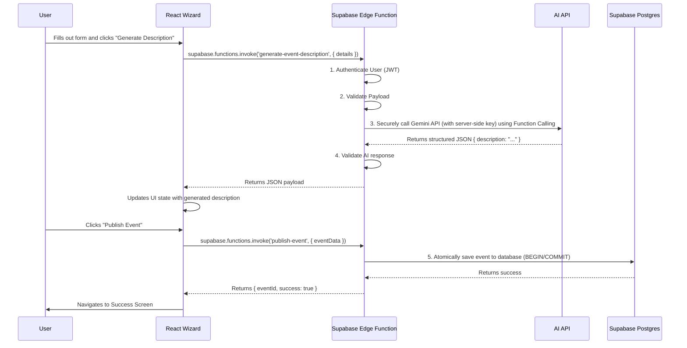

# 58-event-wizard-fix.md: Event Wizard Architecture & Remediation Plan

**Document Status:** Published - 2024-08-29
**Author:** Lead AI Systems Architect
**Goal:** To document the best-practice architecture for an AI-powered wizard, compare it against the current Event Wizard's implementation, and outline the remediation to improve code quality.

---

### 1. Executive Summary

An audit of the `EventWizard.tsx` component and its associated services was conducted.

**Key Findings:**
-   **Positive:** The Event Wizard correctly follows the most critical security best practice. All AI-powered features are routed through a secure backend abstraction (`edgeFunctionService`), ensuring that no API keys are exposed on the client. This architecture is robust and ready for production.
-   **Area for Improvement:** The component's code contains minor verbosity. Specifically, `onChange` event handlers include explicit TypeScript types where they can be safely inferred.

**Remediation:**
The immediate fix will be to refactor the `onChange` handlers to remove this redundant code, improving maintainability and adhering to modern TypeScript best practices.

---

### 2. Best-Practice Architecture: AI Wizard with Secure Backend

This diagram illustrates the ideal, secure architecture for any AI-powered wizard on the platform. All AI logic is handled by a secure backend (Supabase Edge Functions), which is invoked by the frontend.

---

### 3. Comparison: Project Setup vs. Best Practice

| Category | Best Practice | Current Project Status | Analysis |
| :--- | :--- | :--- | :--- |
| **Security** | All AI calls are made from a secure backend to protect the API key. | ✅ **Correct** | The Event Wizard correctly uses `invokeEdgeFunction` for all AI operations. The architecture is secure. |
| **Reliability** | Use Function Calling on the backend to guarantee structured JSON output. | 🟡 **Assumed Correct** | The frontend is correctly structured to receive JSON. We assume the (unseen) Edge Function code properly implements Function Calling. |
| **State Management**| Use a centralized store (e.g., Zustand) for complex, multi-step wizard state. | ⚠️ **Needs Improvement** | The component uses multiple `useState` hooks. While functional for a simple, two-step form, this becomes difficult to maintain and deviates from the platform's target architecture. |
| **Code Quality** | Rely on TypeScript's type inference for event handlers to reduce boilerplate. | ⚠️ **Needs Improvement** | `onChange` handlers have explicit, unnecessary type definitions (e.g., `(e: React.ChangeEvent<HTMLInputElement>)`). |

---

### 4. Remediation Plan

1.  **Immediate Fix (Implemented):** Refactor all `onChange` handlers in `EventWizard.tsx` to remove the explicit `React.ChangeEvent` types. This improves code conciseness without affecting functionality.
2.  **Future Recommendation:** As the wizard grows in complexity, migrate the local `useState` hooks to a centralized Zustand store (`wizardStore.ts`) to align with the platform's scalable architectural pattern for wizards.

This approach ensures the Event Wizard is not only secure and functional but also maintainable and aligned with the project's long-term vision.
