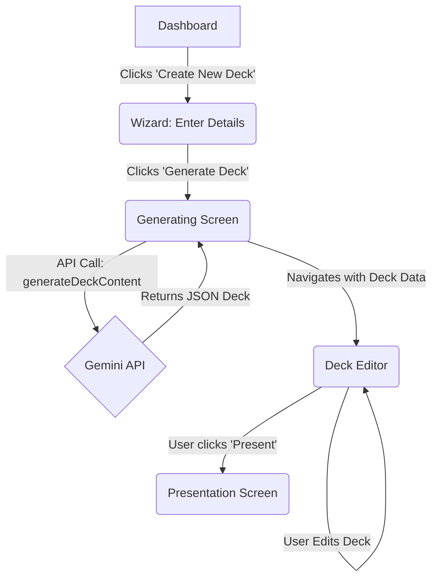
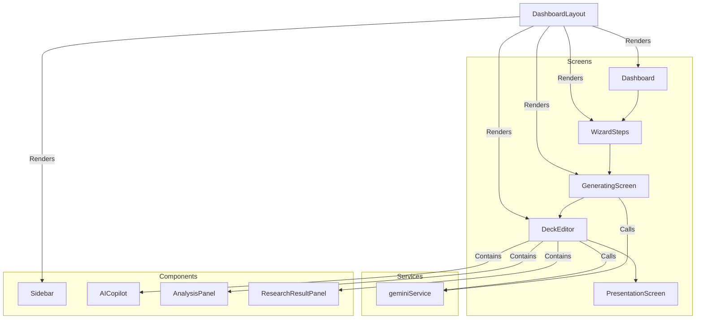

# Implementation Plan: Pitch Deck Engine AI Core

**Document Status:** Updated - 2024-07-30

This document outlines the phased approach to implement the core AI functionality for the sun ai startup platform. The initial generation and visual agents are complete, and this plan now details the next steps.

---

## Guiding Principles

- **Iterative Development:** We will implement one core AI feature at a time, ensuring each piece is functional before moving to the next.
- **Frontend First:** All state is managed on the client-side. Supabase/Clerk integration is deferred to Phase 3.
- **Service Abstraction:** All Gemini API calls will remain within `services/geminiService.ts` to maintain a clean architecture.

---

## ✅ Phase 2.1: Initial Deck Generation (Complete)

**Goal:** Enable a user to input company details into the wizard and receive a fully generated, editable pitch deck.

- **Status:** Implemented. The wizard captures user input, passes it to the `GeneratingScreen`, which calls `geminiService.generateDeckContent` and loads the resulting deck into the editor.

## ✅ Phase 2.2: Visual Agent - AI Image Generation (Complete)

**Goal:** Dynamically generate and display relevant images for each slide.

- **Status:** Implemented. The `DeckEditor` can identify image prompts, call `geminiService.generateSlideImage`, and render the resulting base64 image. State is managed locally for the session.

---

## ✅ Phase 2.3: Editor Agent - AI Content Modification (Complete)

**Goal:** Allow users to use AI to rewrite, shorten, or expand slide content via the AI Copilot.

**Status:** Implemented. The `AICopilot` component is now fully wired to the `modifySlideContent` service function. Users can input a command, and the AI will revise the selected slide's title and content, which is then reflected immediately in the editor.

---

## ✅ Phase 2.4: Analyst Agent - AI Feedback (Complete)

**Goal:** Provide users with AI-driven analysis on the clarity, impact, and tone of their slides.

**Status:** Implemented. The `AnalysisPanel` is now fully dynamic. The "Get Detailed Feedback" button calls a new `analyzeSlide` service function, displays a loading state, and renders structured feedback from the AI for the currently selected slide.

---

## ✅ Phase 2.5: Research Agent - Web Search (Complete)

**Goal:** Enable users to research topics and get up-to-date information directly within the editor.

**Status:** Implemented. The `ResearchResultPanel` is now fully functional. It calls the `researchTopic` service which uses the Gemini API with the `googleSearch` tool. The UI displays the AI's summary and a list of clickable source links returned from the grounding metadata.

---

## 🟡 Phase 3: Polish & Production Readiness (Next Up)

**Goal:** Transition from a client-side prototype to a robust, multi-user application.

### Step 1: User Authentication & Persistence
- **Task:** Integrate a service like Clerk for user sign-up/login and Supabase for database storage.
- **Implementation:**
    - Replace `sessionStorage` with database calls to fetch and save user-owned decks.
    - Protect routes to ensure only authenticated users can create and edit decks.

### Step 2: Advanced Editor Features
- **Task:** Implement features like drag-and-drop slide reordering.

### Step 3: Export & Sharing
- **Task:** Implement functionality to export decks to PDF/PPTX and create shareable presentation links.

---

## Architecture & Data Flow Diagrams

(No changes from the previous version, as the high-level flow remains the same.)

### User Flow

### Component Interaction

