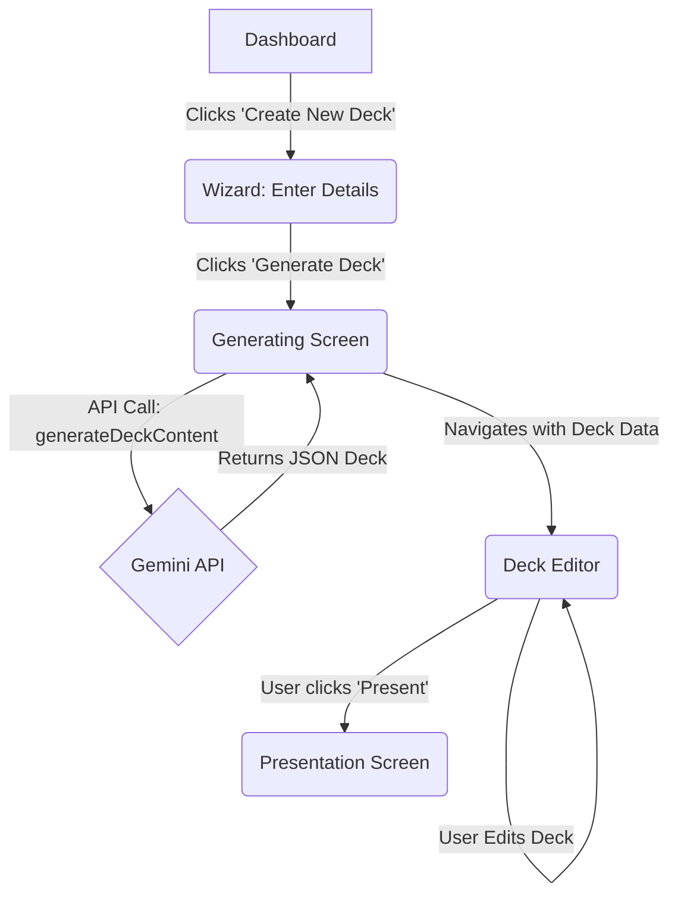
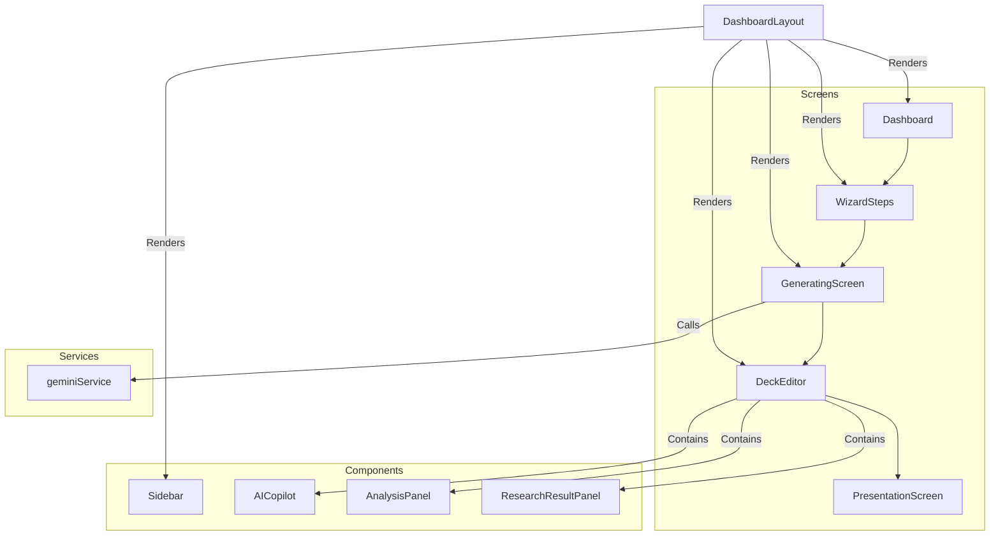

# Implementation Plan: Pitch Deck Engine AI Core

**Document Status:** Initial Draft - 2024-07-29

This document outlines the phased approach to implement the core AI functionality for the Sun AI Pitch Deck Engine, focusing on a minimal, iterative path to a working feature.

---

## Guiding Principles

- **Iterative Development:** We will implement one core AI feature at a time, ensuring each piece is functional before moving to the next.
- **Frontend First:** For now, all state will be managed on the client-side. Supabase/Clerk integration is deferred to Phase 3.
- **Service Abstraction:** All Gemini API calls will remain within `services/geminiService.ts` to maintain a clean architecture.

---

## Phase 2.1: Initial Deck Generation

**Goal:** Enable a user to input company details into the wizard and receive a fully generated, editable pitch deck.

### Step 1: Enhance the Wizard UI

- **File:** `screens/WizardSteps.tsx`
- **Task:** Replace the placeholder content with a simple form.
- **Components:**
    - A `<textarea>` for the user to paste or write their company brief, business plan, or other details.
    - A "Generate Deck" `<button>`.
- **State Management:**
    - Use `React.useState` to hold the value of the textarea.
    - Use `react-router-dom`'s `useNavigate` hook to pass the form data to the generating screen via location state.

### Step 2: Wire up the Generation Service

- **File:** `screens/GeneratingScreen.tsx`
- **Task:** Trigger the AI generation process and handle the response.
- **Logic:**
    - Use `useLocation` to retrieve the company details from the wizard step.
    - In a `useEffect` hook, call the `generateDeckContent` function from `geminiService.ts`.
    - Display loading indicators while the service is running.
    - On success, navigate to the `DeckEditor`, passing the entire generated deck object via location state.
    - On error, display a user-friendly error message.

### Step 3: Display the Generated Deck

- **File:** `screens/DeckEditor.tsx`
- **Task:** Modify the editor to display the newly generated deck instead of the static mock data.
- **Logic:**
    - Use `useLocation` to check for a `generatedDeck` object in the location state.
    - If it exists, initialize the component's `deck` state with this data.
    - If it does not exist (e.g., user navigates directly to the editor URL), fall back to the `mockDeck`.

---

## Phase 2.2: Visual Agent - AI Image Generation

**Goal:** Dynamically generate and display relevant images for each slide.

### Step 1: Create Image Generation Service

- **File:** `services/geminiService.ts`
- **Task:** Add a new function, `generateSlideImage`, that takes a text prompt (the `imageUrl` search query from the slide data).
- **Implementation:**
    - Use the `gemini-2.5-flash-image` model to generate an image.
    - The function should return a base64-encoded image string.

### Step 2: Integrate into Deck Editor

- **File:** `screens/DeckEditor.tsx`
- **Task:** Update the slide view to handle image generation.
- **Logic:**
    - When a slide is displayed, check the `imageUrl` property.
    - If it's a full URL (like from Unsplash), display it directly.
    - If it's a text prompt (from our generated deck), display a placeholder and a "Generate Image" button.
    - When the button is clicked, call `generateSlideImage`, show a loading state, and then display the returned image.
    - Update the local `deck` state to store the new base64 image URL so it persists during the session.

---

## Architecture & Data Flow Diagrams

### User Flow

### Component Interaction

