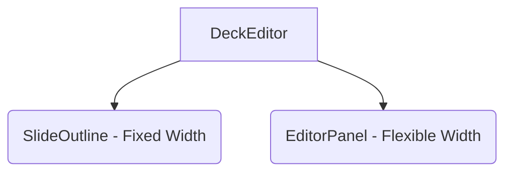
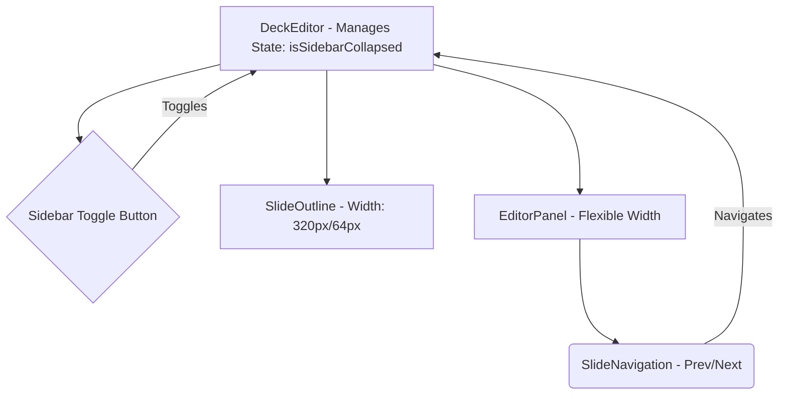

# Implementation Plan: Full-Screen Editor & Collapsible Sidebar

**Document Status:** Planning - 2024-08-05

**System Goal:** Transform the current two-column Sun AI Deck Editor into a more focused, full-screen editor window with a collapsible slide outline and intuitive navigation arrows. This will maximize editing space while maintaining easy access to the deck's structure.

---

## 1. File Impact Analysis

This section identifies the necessary changes to existing files and outlines the new components required to build the enhanced editor experience.

### Files to be Modified

| File                           | Reason for Modification                                                                                                                                                                                          |
| ------------------------------ | ---------------------------------------------------------------------------------------------------------------------------------------------------------------------------------------------------------------- |
| `screens/DeckEditor.tsx`       | **Major Overhaul.** Will now manage the `isSidebarCollapsed` state. It will orchestrate the layout changes, handle keyboard shortcuts for navigation and toggling, and pass new props to its children.            |
| `components/SlideOutline.tsx`  | **Major Overhaul.** Will be refactored to support two states: expanded (current view) and collapsed (icon/number view). It will receive an `isCollapsed` prop to conditionally render its content and animate its width. |
| `components/EditorPanel.tsx`   | **Enhancement.** Will be updated to include new `SlideNavigation` controls (Previous/Next arrows). Its container will grow to fill the space when the sidebar collapses.                                         |
| `CHANGELOG.md`                 | **Update.** Add an entry for the new layout redesign feature.                                                                                                                                                    |

### Files to be Created

No new files are strictly necessary. The toggle button and navigation controls can be created as small, internal components within `DeckEditor.tsx` and `EditorPanel.tsx` respectively to minimize file churn for this focused refactor.

### Architectural Diagram (Before vs. After)

**Before (Static Two-Column):**

**After (Dynamic Layout):**

---

## 2. Implementation Plan

This is a step-by-step guide to executing the refactor.

1.  **Add State in `DeckEditor.tsx`:**
    *   Introduce a new state variable: `const [isSidebarCollapsed, setIsSidebarCollapsed] = useState(false);`.
    *   Create a handler function `const toggleSidebar = () => setIsSidebarCollapsed(!isSidebarCollapsed);`.

2.  **Implement Keyboard Shortcuts in `DeckEditor.tsx`:**
    *   Enhance the existing `useEffect` for keyboard events to handle `ArrowLeft`, `ArrowRight`, and `Tab` (or another key like `[`).
    *   `ArrowLeft`/`ArrowRight` will call the `handlePrev` and `handleNext` slide navigation functions.
    *   `e.metaKey && '['` (Cmd + [) will call `toggleSidebar`.

3.  **Create the Toggle Button:**
    *   Inside `DeckEditor.tsx`, add a button positioned absolutely or fixed, likely at the top-left edge of the `EditorPanel`.
    *   Use Lucide icons like `PanelLeftClose` and `PanelLeftOpen` to indicate the action.
    *   The `onClick` handler will be `toggleSidebar`.

4.  **Refactor `SlideOutline.tsx` for Collapsed State:**
    *   Pass `isCollapsed={isSidebarCollapsed}` as a prop.
    *   The root `div` will conditionally change its width: `w-[320px]` when expanded, `w-16` (`64px`) when collapsed. Add Tailwind's `transition-all duration-300` for smooth animation.
    *   Conditionally render the content. If `isCollapsed`, show a simple list of clickable slide numbers/icons. If not, show the full preview.

5.  **Add Navigation to `EditorPanel.tsx`:**
    *   Pass `onPrevSlide` and `onNextSlide` handlers from `DeckEditor.tsx`.
    *   At the bottom of the panel, add a `SlideNavigation` section.
    *   This section will contain "Previous" and "Next" buttons, using `ChevronLeft` and `ChevronRight` icons.
    *   Disable the buttons appropriately when on the first or last slide.

---

## 3. UI & Style Guidelines

-   **Sidebar Width:** `w-[320px]` (expanded), `w-16` (collapsed).
-   **Collapsed Sidebar:** Displays a vertical list of slide numbers inside styled boxes. The active slide number should be highlighted.
-   **Animations:** Use `transition-all duration-300 ease-in-out` on the sidebar width and editor panel margin for a smooth collapse/expand effect. Slide transitions can use `opacity-0` to `opacity-100` for a subtle fade.
-   **Navigation Arrows:** Use `shadcn/ui` `Button` component with `variant="outline"` and `size="icon"`. Position them at the bottom-center of the `EditorPanel`.
-   **Full Slide View:** The `EditorPanel` will naturally expand. Ensure its content remains centered and does not stretch unpleasantly. The max-width of the slide preview (`max-w-4xl`) should be maintained.

---

## 4. Features & Use Cases

| Feature           | Description                                                        | Real-World Example                                                              |
| ----------------- | ------------------------------------------------------------------ | ------------------------------------------------------------------------------- |
| Collapsible Sidebar | Expands or hides the slide outline list to maximize editing space. | A designer focusing on a complex slide hides the list to edit without distraction. |
| Full-Slide View   | The editor panel expands to fill the available area.               | The primary, focused mode for content creation, similar to Google Slides.       |
| Keyboard Navigation | Left/right arrow keys change slides instantly.                     | A user quickly cycles through the deck to check for consistency.                |
| Responsive Layout | The sidebar could auto-collapse on tablet or smaller screen sizes. | Ensures the workspace remains usable and uncluttered on devices like an iPad.     |

---

## 5. Best Practices

-   **State Management:** Keep `DeckEditor.tsx` as the single source of truth for `selectedSlide` and `isSidebarCollapsed` to avoid complex state synchronization.
-   **Accessibility:**
    *   Add `aria-label="Toggle sidebar"`, `aria-label="Next slide"`, etc., to all icon buttons.
    *   Ensure the toggle state is announced by screen readers using `aria-expanded`.
-   **Transitions:** Use CSS transitions for performance. Animate `width` or `margin` instead of layout-intensive properties where possible.
-   **Component Responsibility:** `SlideOutline` manages its own collapsed/expanded view, but `DeckEditor` controls the *state*. `EditorPanel` focuses on displaying the slide and its controls.

---

## 6. Success Criteria

-   [ ] The sidebar smoothly animates between a `320px` width and a `64px` width.
-   [ ] The editor panel expands/shrinks to fill the remaining space without layout shifts.
-   [ ] Clicking the toggle button or using the keyboard shortcut correctly changes the sidebar state.
-   [ ] The collapsed sidebar correctly displays slide numbers and highlights the active one.
-   [ ] The navigation arrows in the editor panel correctly change the `selectedSlide`.
-   [ ] Keyboard arrow keys successfully navigate between slides.
-   [ ] All existing functionality (editing, AI tools) remains intact.

---

## 7. Production-Ready Checklist

| Category          | Criteria                                                                               |
| ----------------- | -------------------------------------------------------------------------------------- |
| **Code**          | All modified components have clear prop types. No new linting warnings are introduced.   |
| **UI/UX**         | Transitions are smooth (< 300ms). Controls are intuitive. Spacing is consistent.          |
| **Performance**   | No noticeable lag when toggling the sidebar or navigating slides.                        |
| **Accessibility** | All new interactive elements are keyboard-navigable and have proper ARIA labels.         |
| **Testing**       | Manually test: sidebar toggle, slide navigation (arrows & keys), responsive behavior.    |
| **Regressions**   | Verify that all AI panel functionalities still work as expected.                         |
