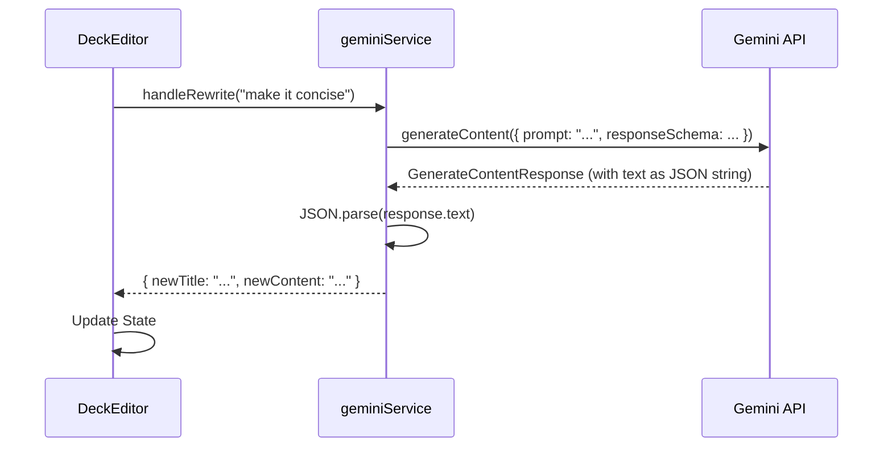
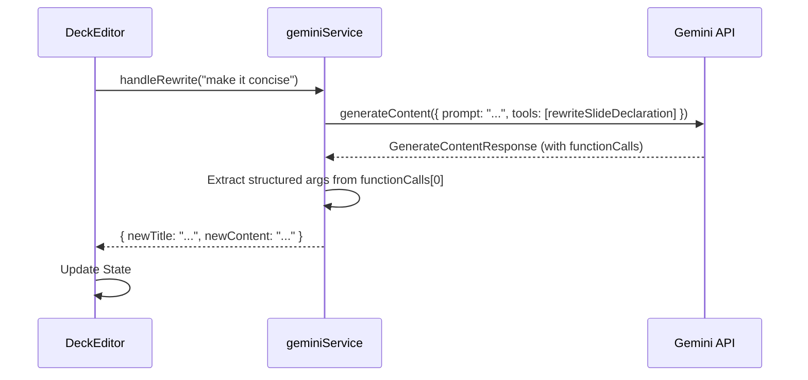

# Implementation Plan: Function Calling for an Intelligent Editor

**Document Status:** Planning - 2024-08-06

**System Goal:** To evolve the sun ai startup platform from a prompt-driven content generator into an intelligent, action-oriented editor by strategically implementing function calling. This will make the application more reliable, powerful, and capable of complex, multi-step workflows.

---

## 1. Why This Change is Critical

Currently, our application relies on prompting the Gemini model to return a perfectly formatted JSON string, which we then parse. This approach is functional but brittle; a minor deviation in the model's output format can break the application.

**Function calling** solves this problem. Instead of asking for text, we give the model a set of tools (functions) it can use. The model's job shifts from formatting text to deciding which tool to call and with what arguments. The Gemini API then returns a structured `functionCall` object, eliminating parsing errors and making our system dramatically more reliable.

### Architectural Shift

Our core logic will change from a "generate and parse" model to a "request and execute" model.

**Before: JSON Parsing (Current State)**

**After: Function Calling (Target State)**

---

## 2. Phased Implementation Plan

We will implement this change in two phases, starting with refactoring our core, existing features before adding new capabilities. All changes will be centralized in `services/geminiService.ts`.

### Phase 1: Core Workflow Refactor

**Goal:** Convert the most critical, existing AI features to use function calling, hardening our application's foundation.

#### Task 1.1: Refactor `generateDeckContent`
- **Status:** ✅ **Complete**
- **Description:** Replace the JSON schema-based deck generation with a `generateDeckOutline` function call.
- **Success Criteria:** Deck generation is now driven by a reliable function call, significantly reducing the chance of failure due to model output formatting.

#### Task 1.2: Refactor `modifySlideContent` (AI Copilot)
- **Status:** ✅ **Complete**
- **Description:** Convert the AI Copilot's rewrite capability to use a `rewriteSlide` function call.
- **Success Criteria:** The AI Copilot's rewrite actions are now predictable and robust.

#### Task 1.3: Refactor `analyzeSlide` (Analyst Agent)
- **Status:** ✅ **Complete**
- **Description:** Change the slide analysis to use an `analyzeSlideContent` function call.
- **Success Criteria:** The Analysis panel receives structured data directly from function call arguments, completely eliminating manual JSON parsing.

#### Task 1.4: Refactor Image Generation & Editing (Visual Agent)
- **Status:** ✅ **Complete**
- **Description:** Convert the existing image generation and editing workflows to use a chain of function calls for increased reliability and quality. This involves separating the creative brief from the generation and editing actions.
- **Success Criteria:** Image generation is more consistent and context-aware. The editing process is robust and reliable.

---

### Phase 2: Advanced & New Functionality

**Goal:** Leverage our new, robust function calling architecture to introduce powerful features that were previously impractical.

#### Task 2.1: Implement `chooseLayout`
- **Status:** ✅ **Complete**
- **Description:** Create a new feature that allows the AI to suggest and apply a contextually appropriate visual layout for a slide.
- **Success Criteria:** Users can automatically apply a contextually appropriate layout to any slide, automating a key design decision.

#### Task 2.2: Implement `chartSuggester`
- **Status:** ✅ **Complete**
- **Description:** Implement a "Data-to-Slide" feature where the AI can detect numerical data in a slide's text and transform it into a structured bar chart.
- **Steps:**
    1.  Defined a `chartSuggesterFunctionDeclaration` that outputs a chart type and structured data.
    2.  Created a "Suggest Chart" button in the `EditorPanel.tsx`.
    3.  When clicked, the `suggestChart` service function is called.
    4.  If the AI finds data, it returns a chart object which is then rendered by a new `Chart.tsx` component, replacing the slide's bullet points.
- **Success Criteria:** Users can automatically visualize data points from their text, transforming a text slide into a data slide with one click.

---

### Phase 3: Intelligent Suggestions & Proactive Assistance

**Goal:** Transform the editor from a reactive tool to a proactive partner by suggesting context-aware actions to the user.

#### Task 3.1: Implement Context-Aware Suggestion Functions
- **Status:** ✅ **Complete**
- **Description:** Create a suite of functions that analyze the current slide's content and suggest relevant, high-impact actions for the user.
- **Steps:**
    1.  **`suggestImprovements`:** Implemented to power the AI Copilot suggestions.
    2.  **`suggestImagePrompts`:** Implemented to power the Image Editor suggestions.
    3.  **`suggestResearchTopics`:** Implemented to power the Research Assistant suggestions.
- **Success Criteria:** The AI can generate a list of 3-5 relevant, short suggestions for each of the core AI tabs (Copilot, Image, Research).

---

## 3. Production Readiness Checklist

Before these changes are considered complete, the following must be verified:

| Category          | Criteria                                                                                                              | Status |
| ----------------- | --------------------------------------------------------------------------------------------------------------------- | ------ |
| **Code Quality**  | All function declarations are strongly typed using `Type` enum from `@google/genai`. No `any` types are used.           | 🟢     |
| **Error Handling**| `geminiService.ts` functions now include `try...catch` blocks that specifically handle cases where `response.functionCalls` is missing or empty. | 🟢     |
| **UI/UX**         | All features that trigger function calls provide clear loading states to the user.                                    | 🟢     |
| **Token Usage**   | Acknowledge that function declarations add to the input token count. Monitor for any performance impact.                | 🟡     |
| **Testing**       | Manually verify the end-to-end flow for all refactored and new functions.                                             | 🟢     |
| **Regressions**   | Confirm that all existing application functionality (presentation mode, saving, etc.) works as expected after the refactor. | 🟢     |