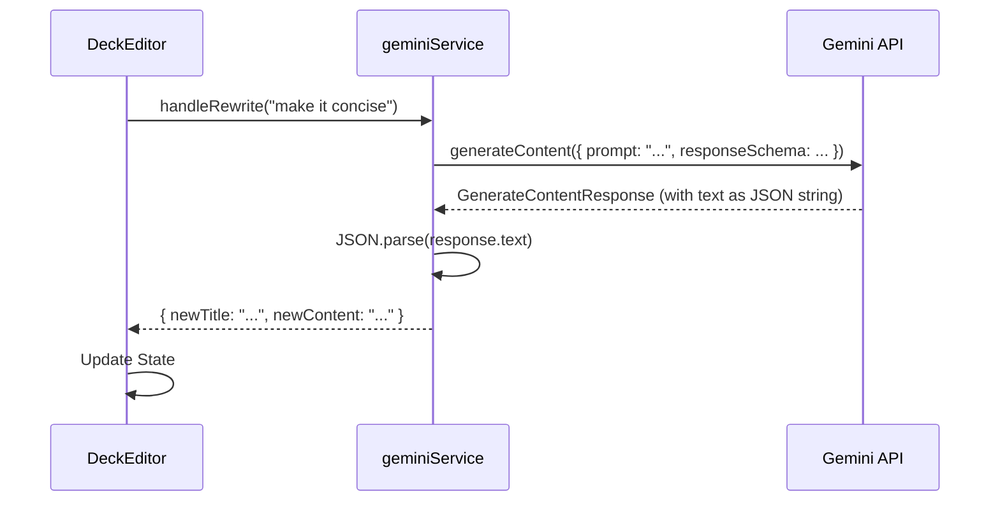
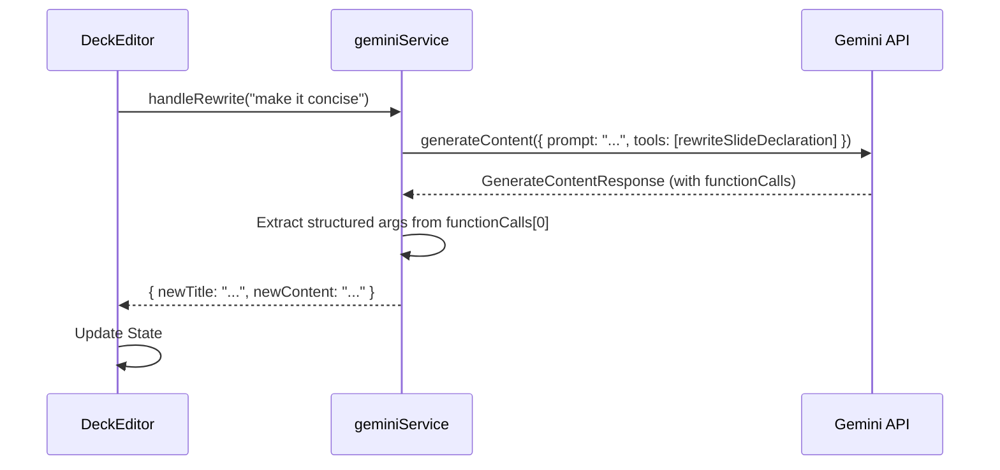

# Implementation Plan: Function Calling for an Intelligent Editor

**Document Status:** Planning - 2024-08-06

**System Goal:** To evolve the Sun AI Pitch Deck Engine from a prompt-driven content generator into an intelligent, action-oriented editor by strategically implementing function calling. This will make the application more reliable, powerful, and capable of complex, multi-step workflows.

---

## 1. Why This Change is Critical

Currently, our application relies on prompting the Gemini model to return a perfectly formatted JSON string, which we then parse. This approach is functional but brittle; a minor deviation in the model's output format can break the application.

**Function calling** solves this problem. Instead of asking for text, we give the model a set of tools (functions) it can use. The model's job shifts from formatting text to deciding which tool to call and with what arguments. The Gemini API then returns a structured `functionCall` object, eliminating parsing errors and making our system dramatically more reliable.

### Architectural Shift

Our core logic will change from a "generate and parse" model to a "request and execute" model.

**Before: JSON Parsing (Current State)**

**After: Function Calling (Target State)**

---

## 2. Phased Implementation Plan

We will implement this change in two phases, starting with refactoring our core, existing features before adding new capabilities. All changes will be centralized in `services/geminiService.ts`.

### Phase 1: Core Workflow Refactor

**Goal:** Convert the most critical, existing AI features to use function calling, hardening our application's foundation.

#### Task 1.1: Refactor `generateDeckContent`
- **Description:** Replace the JSON schema-based deck generation with a `generateDeckOutline` function call.
- **Steps:**
    1.  In `geminiService.ts`, define a `generateDeckOutlineFunctionDeclaration` that mirrors the existing `deckSchema`.
    2.  Modify the `generateDeckContent` function:
        -   Remove `responseMimeType` and `responseSchema` from the `config`.
        -   Add a `tools` property to the `config` containing the new function declaration.
    3.  Update the function logic to check for `response.functionCalls`.
    4.  Instead of `JSON.parse(response.text)`, get the deck data directly from `response.functionCalls[0].args`.
- **Success Criteria:** Deck generation is now driven by a reliable function call, significantly reducing the chance of failure due to model output formatting.

#### Task 1.2: Refactor `modifySlideContent` (AI Copilot)
- **Description:** Convert the AI Copilot's rewrite capability to use a `rewriteSlide` function call.
- **Steps:**
    1.  Define a `rewriteSlideFunctionDeclaration` mirroring the `modifiedSlideSchema`.
    2.  Update `modifySlideContent`: remove the schema and add the `rewriteSlide` tool to the config.
    3.  Extract `newTitle` and `newContent` from the returned `functionCall.args`.
- **Success Criteria:** The AI Copilot's rewrite actions are now predictable and robust.

#### Task 1.3: Refactor `analyzeSlide` (Analyst Agent)
- **Description:** Change the slide analysis to use an `analyzeSlideContent` function call.
- **Steps:**
    1.  Define an `analyzeSlideContentFunctionDeclaration` based on the `analysisSchema`.
    2.  Update `analyzeSlide`: remove the schema and add the new tool to the config.
    3.  Construct the `SlideAnalysis` object directly from `functionCall.args`.
- **Success Criteria:** The Analysis panel receives structured data directly from function call arguments, completely eliminating manual JSON parsing.

#### Task 1.4: Refactor Image Generation & Editing (Visual Agent)
- **Description:** Convert the existing image generation and editing workflows to use a chain of function calls for increased reliability and quality. This involves separating the creative brief from the generation and editing actions.
- **Steps:**
    1.  Define an `imageBriefFunctionDeclaration` to generate a detailed creative brief (style, palette, keywords) based on slide content.
    2.  Define a `generateImageFromBriefFunctionDeclaration` that takes a brief and generates an image.
    3.  Define an `editImageFunctionDeclaration` for iterative refinements.
    4.  Update `generateSlideImage`:
        -   First, call the model with the `imageBrief` tool to get a structured brief.
        -   Then, call the model again with the brief and the `generateImageFromBrief` tool.
    5.  Update `editSlideImage`:
        -   Refactor to use the new `editImage` function call, passing the image and a text prompt.
- **Success Criteria:** Image generation is more consistent and context-aware. The editing process is robust and reliable.

---

### Phase 2: Advanced & New Functionality

**Goal:** Leverage our new, robust function calling architecture to introduce powerful features that were previously impractical.

#### Task 2.1: Implement `chooseLayout`
- **Description:** Create a new feature that allows the AI to suggest and apply a contextually appropriate visual layout for a slide.
- **Steps:**
    1.  Define a `chooseLayoutFunctionDeclaration`. Its parameters should include a `layoutName` property, which can be an `enum` of the keys in our `styles/templates.ts` (e.g., `['default', 'professional']`).
    2.  Create a new "Auto-Layout" button in the `EditorPanel.tsx`.
    3.  When clicked, a new service function `suggestLayout(slide: Slide)` will be called. This function sends the slide's content to the model along with the `chooseLayout` tool.
    4.  The app will receive the function call and update the slide's state with the chosen layout. (Note: This may require a minor data model change to allow per-slide templates).
- **Success Criteria:** Users can automatically apply a contextually appropriate layout to any slide, automating a key design decision.

#### Task 2.2: Implement `chartSuggester`
- **Description:** Add a tool that can detect data within a slide's text and suggest a visual chart representation.
- **Steps:**
    1.  Define a `chartSuggesterFunctionDeclaration` with parameters like `chartType` (`'bar'`, `'line'`), `labels` (array of strings), and `data` (array of numbers).
    2.  Create a new "Visualize Data" feature in the `AIToolbox`.
    3.  When triggered, a new service function will send the slide content to the model with the `chartSuggester` tool.
    4.  The app will receive the function call's arguments and use them to render a placeholder chart image or integrate with a charting library.
- **Success Criteria:** Users can transform text-based data into visual charts with a single click, dramatically improving the quality of data-heavy slides.

#### Task 2.3: Implement `styleHarmonize`
- **Description:** Create a "Brand Harmony" tool that adjusts all images in a deck to match a consistent visual style (palette, contrast).
- **Steps:**
    1.  Define a `styleHarmonizeFunctionDeclaration` with parameters for target palette, contrast, etc.
    2.  Create a UI element (e.g., "Harmonize All Images" button).
    3.  The associated service function will iterate through all slides, calling the model with the `styleHarmonize` tool for each image.
- **Success Criteria:** Users can achieve deck-wide visual consistency with a single action.

#### Task 2.4: Implement Smart Cropping and Accessibility Checks
- **Description:** Add functions to intelligently crop images for different layouts and ensure text overlays are accessible.
- **Steps:**
    1.  Define `layoutCropFunctionDeclaration` to perform a smart 16:9 crop that keeps the focal point visible.
    2.  Define `contrastAccessibilityCheckFunctionDeclaration` to verify that text placed over an image meets AA contrast standards.
    3.  Integrate these checks into the editor, perhaps as automated steps after an image is added or as a pre-flight check before presenting/exporting.
- **Success Criteria:** All images are well-composed within the slide layout, and text is always readable, improving professionalism and accessibility.

---

## 3. Production Readiness Checklist

Before these changes are considered complete, the following must be verified:

| Category          | Criteria                                                                                                              | Status |
| ----------------- | --------------------------------------------------------------------------------------------------------------------- | ------ |
| **Code Quality**  | All function declarations are strongly typed using `Type` enum from `@google/genai`. No `any` types are used.           | 🔴     |
| **Error Handling**| `geminiService.ts` functions now include `try...catch` blocks that specifically handle cases where `response.functionCalls` is missing or empty. | 🔴     |
| **UI/UX**         | All features that trigger function calls provide clear loading states to the user.                                    | 🟡     |
| **Token Usage**   | Acknowledge that function declarations add to the input token count. Monitor for any performance impact.                | 🔴     |
| **Testing**       | Manually verify the end-to-end flow for all refactored and new functions.                                             | 🔴     |
| **Regressions**   | Confirm that all existing application functionality (presentation mode, saving, etc.) works as expected after the refactor. | 🔴     |