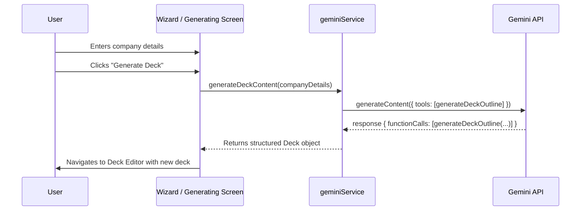
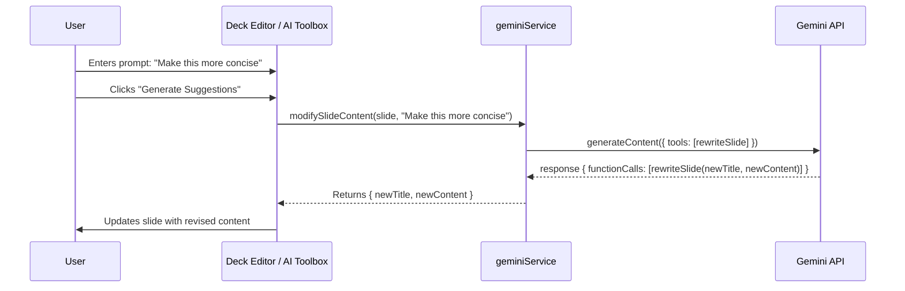
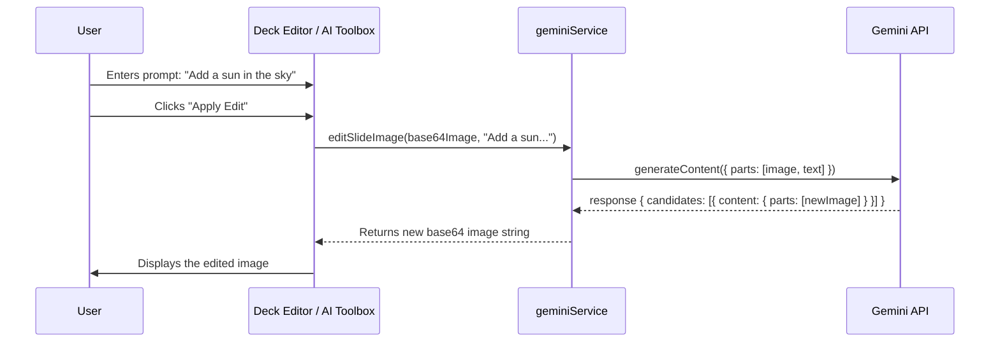
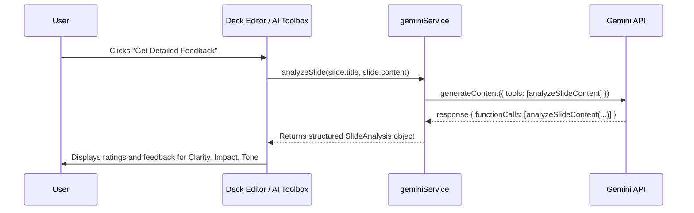
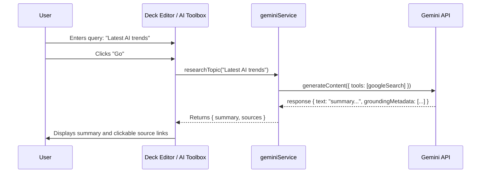
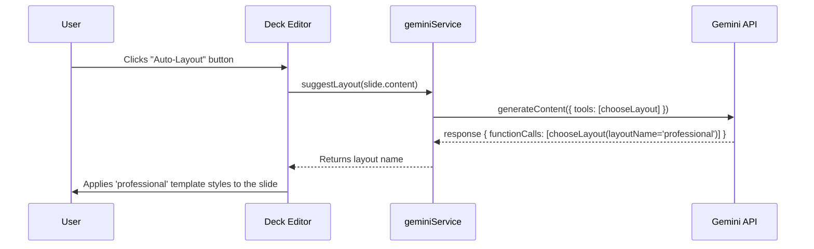
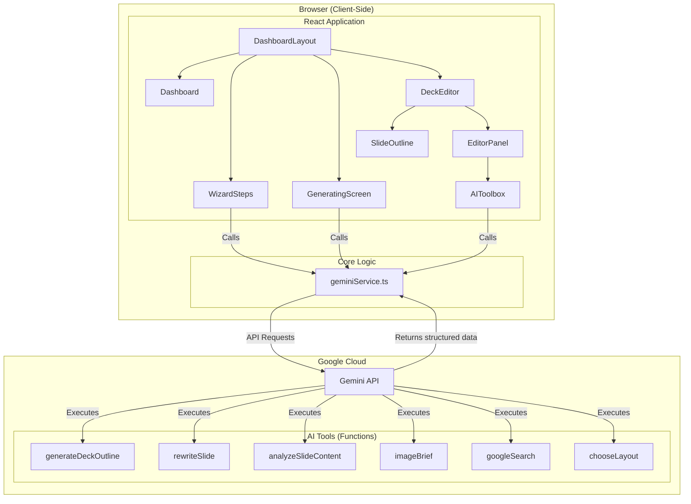
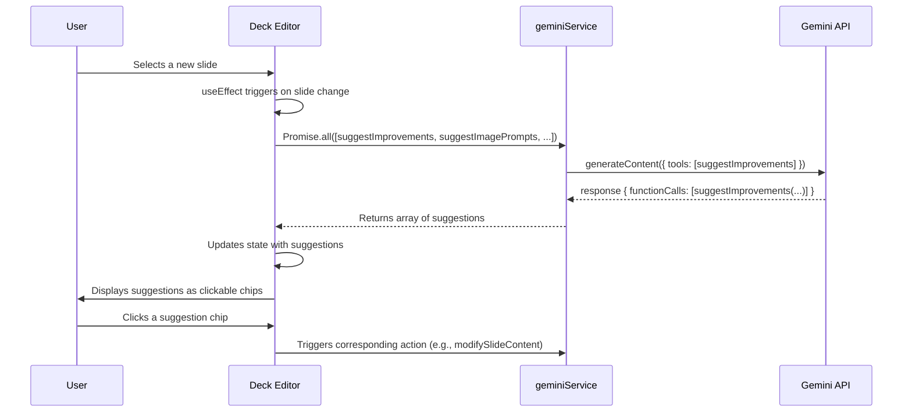

# System Architecture & AI Workflows

**Document Status:** Planning - 2024-08-06

This document provides a comprehensive set of diagrams illustrating the complete user journey, system architecture, and detailed AI agent workflows for the Sun AI Pitch Deck Engine. It visually represents the function-calling architecture that powers the application's intelligent features.

---

### 1. High-Level User Journey

This flowchart shows the typical path a user takes from starting the application to presenting a finished deck.

```mermaid
graph TD
    A[Dashboard] -->|Clicks 'Create New Deck'| B(Wizard: Enter Details);
    B -->|Clicks 'Generate Deck'| C(Generating Screen);
    C -->|AI Generates Deck Outline| D(Deck Editor);
    D -- User edits content, images, and layout --> D;
    D -->|AI Agents Assist (Copilot, Visuals, Analysis)| D;
    D -->|Clicks 'Present'| E(Presentation Screen);
    E -->|Clicks 'Exit'| D;
```

---

### 2. Deck Generation Sequence Diagram

This diagram details the initial creation of the deck, highlighting the `generateDeckOutline` function call.



---

### 3. Content Editing (Copilot) Sequence Diagram

This illustrates how the AI Copilot refines slide content using the `rewriteSlide` function call.



---

### 4. Image Generation Workflow

This flowchart shows the advanced, two-step process for generating a high-quality, context-aware image.

```mermaid
flowchart TD
    A[1. Start with Slide Content] --> B{2. Call AI with `imageBrief` tool};
    B --> C[3. AI returns a structured brief<br/>(e.g., style, palette, keywords)];
    C --> D{4. Call AI with Brief + generate image prompt};
    D --> E[5. AI returns a final, high-quality image];
```

---

### 5. Image Editing Sequence Diagram

This diagram shows how a user can iteratively refine an existing image. While this doesn't use a function call, it shows the multi-modal text + image input.



---

### 6. Slide Analysis Sequence Diagram

This shows the "Analyst Agent" providing structured feedback on a slide using the `analyzeSlideContent` function call.



---

### 7. Research Assistant Sequence Diagram

This illustrates how the "Research Agent" uses the `googleSearch` tool to provide grounded answers with sources.



---

### 8. Automated Layout Suggestion Workflow

This diagram shows the future-state capability of the AI suggesting a layout for a slide.



---

### 9. Overall System Architecture

This diagram provides a master map of how all the components of the Sun AI Pitch Deck Engine interact.



---

### 10. Context-Aware Suggestion Workflow

This sequence diagram shows how the application proactively generates suggestions for the user whenever they select a new slide.


