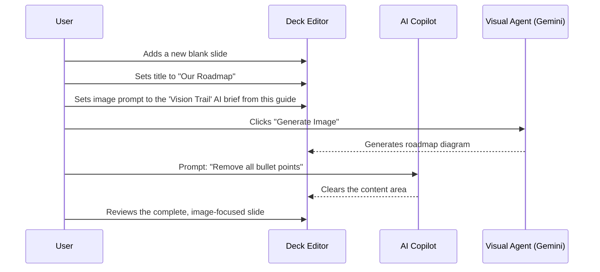

# 🗺️ Strategic Guide: Visualizing Your Product Roadmap

**Document Status:** Published - 2024-08-06

**Goal:** To help you select a visually compelling, story-driven roadmap that looks professional in a pitch deck and can be effectively generated by AI. A great roadmap tells a story of momentum and vision.

---

### 🧠 Core Principles for an Effective Roadmap

Before choosing a style, remember these best practices for clarity and impact, especially when presenting to investors:

-   **✅ Simplicity is Key:** Limit milestones to 4-6 key achievements. Avoid operational clutter.
-   **✅ Action-Oriented:** Start each milestone with a strong verb (e.g., Launch, Achieve, Secure, Expand).
-   **✅ Show Momentum:** Use status colors to clearly indicate progress (e.g., Completed, In Progress, Planned).
-   **✅ Tell a Story:** The sequence should build a logical narrative from product launch to market dominance.
-   **✅ Accessibility:** Ensure colors have a high contrast ratio (≥ 4.5:1) to be legible for everyone.

---

## 🎨 Visual Roadmap Options

Here are three distinct options for visualizing your milestones, each with its own strengths and ideal use case.

| Option                 | Layout                             | Best For                                     | Description                                                                                                                                                             | Score (Pitch Deck) |
| ---------------------- | ---------------------------------- | -------------------------------------------- | ----------------------------------------------------------------------------------------------------------------------------------------------------------------------- | ------------------ |
| 1. **The Vision Trail**  | Horizontal Milestone Rail          |  Investor Pitch Decks, Executive Summaries   | A clean, linear timeline focusing on key achievements. It tells a clear story of progress and future ambition. Simple, elegant, and easy to grasp in seconds.                  | **95 / 100**         |
| 2. **The Execution Grid** | Gantt-Lite / Phase Bands           | Internal Product Roadmaps, Team Alignment    | Shows the duration and potential overlap of initiatives. More detailed and operational, focusing on "how long" rather than just "what." Can be too complex for a high-level pitch. | **75 / 100**         |
| 3. **The Strategy Lanes** | Swimlanes                          | Company-Wide Strategy, Departmental Plans    | Organizes milestones into parallel workstreams (e.g., Product, Marketing, Growth). Excellent for showing how different functions contribute to the overall vision.           | **80 / 100**         |

---

## 🏆 Recommendation for Investor Pitch Decks

For an investor pitch deck, **"The Vision Trail" is the clear winner.**

Its strength lies in its simplicity and powerful narrative focus. Investors need to quickly understand your journey and your destination. The linear, milestone-driven format cuts through the noise and presents a confident, forward-looking vision. It's professional, uncluttered, and keeps the focus on high-impact business goals rather than internal project management details.

---

## 🤖 AI Diagram Generation Briefs

Use these briefs with an AI image generator to create a visual foundation for your chosen roadmap style.

### 1. The Vision Trail

*   **🎨 Style:** Clean, minimalist, professional.
*   **💡 Gemini Brief:**
    > "A minimalist timeline roadmap on a light beige background (`#FBF8F5`). A single, clean horizontal line runs from left to right. Four circular nodes are evenly spaced on the line, with simple, recognizable icons inside: a rocket, a group of people, a dollar sign, and a globe. The first circle is green, the second is brand orange (`#E87C4D`), and the last two are gray. A vertical dashed orange line labeled 'Now' passes through the second circle. Below each circle, add a short label: 'Launch MVP', '10K Users', 'Series A', 'Global Expansion'."

    

### 2. The Execution Grid

*   **🎨 Style:** Structured, corporate, data-informed.
*   **💡 Gemini Brief:**
    > "A simple, modern Gantt chart on a white background. The X-axis is divided into four sections labeled Q1, Q2, Q3, and Q4. There are four horizontal bars. The first bar, 'Launch MVP', fills the Q1 block in a solid green color. The second bar, 'User Growth', spans Q2 and Q3 and is filled 50% with brand orange (`#E87C4D`). The third and fourth bars, 'Fundraising' and 'Expansion', are in Q3 and Q4 respectively and are light gray. Use clean, sans-serif fonts."

    

### 3. The Strategy Lanes

*   **🎨 Style:** Strategic, organized, comprehensive.
*   **💡 Gemini Brief:**
    > "A swimlane diagram with three horizontal lanes against a light gray background. The lanes are labeled 'Product', 'Growth', and 'Corporate'. A timeline above is labeled Q1, Q2, Q3, Q4. In the 'Product' lane under Q1, there is a green card that says 'Launch MVP'. In the 'Growth' lane under Q2, there is an orange card that says 'Achieve 10K Users'. In the 'Corporate' lane under Q3, there is a gray card that says 'Secure Series A'. The design should be clean, with rounded corners on the cards."

    

---

## 🚀 Implementation Plan: Creating Your Roadmap Slide

This section provides a step-by-step plan for translating the strategic choice above (e.g., "The Vision Trail") into a finished, professional slide within the Sun AI Deck Editor.

### Workflow Diagram

This diagram illustrates how you'll use both the AI Copilot (for text) and the Visual Agent (for the image) to construct the slide.

### Plan Steps

1.  **Select or Create a Slide:** Start with a blank slide or a slide you want to convert into your roadmap. A layout with a large image area is ideal.
2.  **Set the Slide Title:** Manually set the title to something clear and forward-looking, like "Our Roadmap to Market Leadership" or "The Path to 1M Users."
3.  **Generate the Roadmap Visual:**
    *   Copy the AI Diagram Brief for your chosen style (e.g., "The Vision Trail") from the section above.
    *   In the `DeckEditor`, if the slide doesn't have an image, it will have an image prompt area. If it already has an image, you can use the AI Copilot to set the `imageUrl` field with a prompt like: `Set the image prompt to "A minimalist timeline roadmap..."`.
    *   Click the **Generate Image** button. The Visual Agent will create the roadmap diagram and place it on the slide.
4.  **Clear Content for Visual Focus:** A roadmap diagram is powerful on its own. Use the **AI Copilot** with a simple prompt like `"Remove all bullet points"` to create a clean, visually-driven slide.
5.  **Refine (Optional):** If the generated image isn't perfect, use the **Image** tab in the AI Toolbox to apply edits. For example: `"Change the second node's color to blue"` or `"Make the text labels larger."`

### ✅ Success Criteria

Your roadmap slide is complete when it meets these criteria:

-   [ ] The slide has a clear, compelling title.
-   [ ] It features a high-quality, AI-generated visual that accurately represents your key milestones.
-   [ ] The visual is the hero of the slide, with minimal or no additional text to distract from it.
-   [ ] The style (e.g., "Vision Trail") aligns with the audience (e.g., investors).

### Production-Ready Checklist

Before presenting this slide, do a final review:

-   [ ] **Storytelling:** Does the roadmap tell a clear and ambitious story?
-   [ ] **Clarity:** Is the current status ("Now" marker, status colors) easy to understand at a glance?
-   [ ] **Consistency:** Does the visual style of the diagram match the overall look and feel of your deck?
-   [ ] **Accuracy:** Do the milestone labels correctly reflect your business goals?
