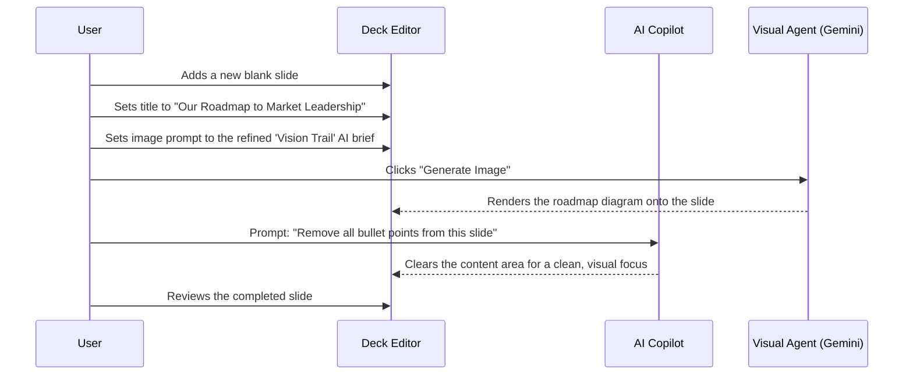

# 🗺️ Implementation Plan: The "Vision Trail" Roadmap Slide

**Document Status:** Published - 2024-08-06

**Goal:** This document provides a complete, step-by-step implementation plan for creating a professional, AI-generated "Vision Trail" roadmap slide. This is the recommended style for investor pitches due to its narrative clarity and visual focus.

---

### Best Practice: Function Call vs. Visual Prompt

A key strategic decision in an AI-native application is choosing the right tool for the job. For generating a stylized visual like a roadmap, we have two primary options:

1.  **Function Calling (`createRoadmap`):** The AI's job would be to understand the user's intent and return structured data (e.g., an array of milestones with labels and statuses). We would then need to write frontend code to render this data into a visual diagram.
2.  **Multi-Modal Visual Prompt (Current Method):** The AI's job is to act as a creative partner. We provide it with a detailed, descriptive brief, and it uses its generative capabilities to create a complete visual asset.

**🏆 Recommendation:** For creating a static, stylized visual asset like the "Vision Trail," a **multi-modal visual prompt is the superior and recommended best practice.**

-   **Why?** It leverages the model's greatest strength: creative visual generation. It provides near-infinite flexibility for style, composition, and detail without requiring complex frontend rendering logic. A function call is better suited for tasks that require structured, predictable *data* output, such as generating a chart from a table.

---

### 🎨 Color Palette & Design System

To ensure brand consistency, all visuals should adhere to the following color palette.

| Element         | Hex Code    | Tailwind Class     | Description               |
| --------------- | ----------- | ------------------ | ------------------------- |
| Background      | `#FBF8F5`   | `bg-[#FBF8F5]`     | Light beige               |
| Accent / Active | `#E87C4D`   | `bg-[#E87C4D]`     | Brand orange              |
| Completed       | `#10B981`   | `bg-emerald-500`   | Green for success status  |
| Planned         | `#6B7280`   | `bg-gray-500`      | Gray for future milestones|
| Text / Lines    | `#1F2937`   | `text-gray-800`    | Dark, readable text       |

---

### 🚀 Implementation Workflow

This section provides the step-by-step tasks for creating the roadmap slide in the Deck Editor.

#### Workflow Diagram

This diagram illustrates the user's interaction with the editor's AI agents to construct the slide.

#### Plan Steps & Tasks

1.  **Prepare the Slide:**
    *   **Task:** Add a new, blank slide to your deck.
    *   **Task:** Set a clear, forward-looking title (e.g., "Our 2024 Strategic Roadmap").
2.  **Craft the AI Brief:**
    *   **Task:** Copy the refined Gemini brief below. This brief is optimized with our design system's color palette and best practices.
    *   **Task:** Paste the brief into the slide's image prompt area.

    > **Refined Gemini Brief:**
    > "A minimalist timeline roadmap on a light beige background (`#FBF8F5`). A single, clean horizontal line (`#1F2937`) runs from left to right. Four circular nodes are evenly spaced on the line, with simple, recognizable icons inside. The first circle is green (`#10B981`), the second is brand orange (`#E87C4D`), and the last two are gray (`#6B7280`). A vertical dashed orange line labeled 'Now' passes through the second circle. Below each circle, add a short, dark gray label: 'Launch MVP', '10K Users', 'Series A', 'Global Expansion'."
3.  **Generate the Visual:**
    *   **Task:** Click the **"Generate Image"** button. The Visual Agent will create the roadmap diagram based on your brief.
4.  **Refine the Layout:**
    *   **Task:** A roadmap diagram is most powerful when it is the sole focus. Use the **AI Copilot** with a simple prompt: `"Remove all bullet points and clear the content area."` This will create a clean, visually-driven slide.
5.  **Iterate (Optional):**
    *   **Task:** If minor adjustments are needed, use the **Image** tab in the AI Toolbox. For example: `"Make the icons inside the circles larger."`

### ✅ Success Criteria

The roadmap slide is successfully implemented when:

-   [ ] The slide features a high-quality, AI-generated "Vision Trail" diagram.
-   [ ] The color palette of the diagram correctly uses the brand's defined colors (orange accent, green for completed, etc.).
-   [ ] The slide layout is clean and uncluttered, with the visual as the primary focus.
-   [ ] The narrative of the roadmap (Launch → Growth → Scale) is clear and easy to understand in under 5 seconds.

### Production-Ready Checklist

Before presenting this slide, perform a final quality check:

| Category          | Criteria                                                                                                                              |
| ----------------- | ------------------------------------------------------------------------------------------------------------------------------------- |
| **Storytelling**  | Does the roadmap tell a logical and ambitious story of progress and future vision?                                                    |
| **Clarity**       | Is the current status (e.g., the "Now" marker) instantly recognizable?                                                                  |
| **Consistency**   | Does the visual style (fonts, icons, colors) feel cohesive with the rest of your pitch deck?                                            |
| **Accuracy**      | Do the milestone labels accurately reflect your strategic goals and timeline?                                                           |
| **Accessibility** | Are the text labels legible against the background? (The provided palette ensures high contrast for readability).                      |