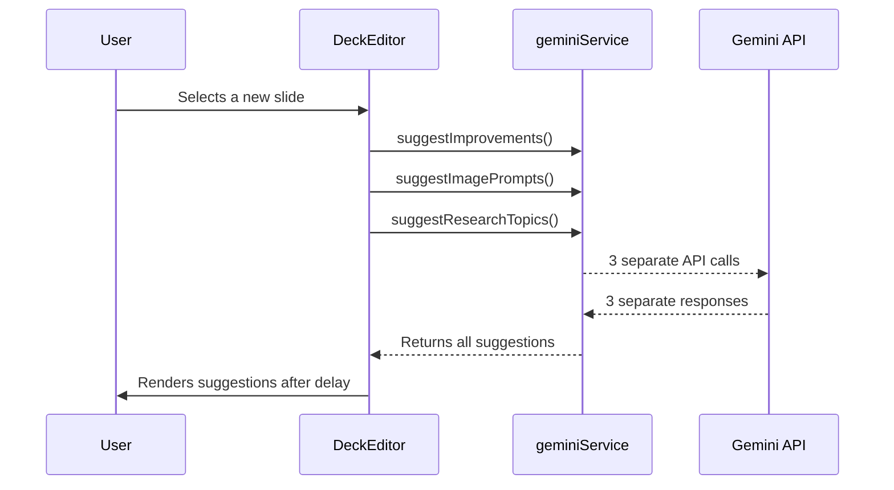

# 📈 Implementation Plan: Application Performance Optimization

**Document Status:** ✅ **Stage 3 Complete** - 2024-08-08

**Goal:** To significantly improve the perceived performance of the editor by reducing the loading time for AI-powered suggestions (Copilot, Image, Research) that appear when a user selects a new slide. This plan has been expanded to cover a full-cycle analysis of the application's performance, from generation to presentation.

---

### 1. Executive Summary & Staged Recommendation

The application's core performance is strong, but specific, high-impact areas can be optimized to elevate the user experience from good to excellent. The most immediate bottleneck was the loading of AI suggestions on slide selection. This has been resolved by implementing **Option 1: Combined Function Call**, which consolidates three network requests into one.

With Stage 1, 2, and 3 now complete, the following stages are recommended to continue improving performance across the application lifecycle:
1.  **Stage 1 (✅ Complete):** Implement **Option 1: Combined Function Call** for AI suggestions. This has fixed the most noticeable initial delay.
2.  **Stage 2 (✅ Complete):** Implement **Image Pre-loading in Presentation Mode**. This significantly enhances the smoothness and professional feel of the final presentation.
3.  **Stage 3 (✅ Complete):** Apply **Component Memoization** to the Deck Editor to ensure scalability and responsiveness with very large decks.
4.  **Stage 4 (Future-Proofing):** Investigate **Streaming Generation Results** as a next-generation feature to create a best-in-class user experience.

---

### 2. Detailed Performance Stages

#### Stage 1: Combined Function Call for AI Suggestions (✅ Complete)

-   **Success Criteria:**
    -   [x] The three separate `suggest...` functions in `geminiService.ts` have been replaced by a single `fetchAllSuggestions` function.
    -   [x] The `useEffect` hook in `DeckEditor.tsx` now makes only one API call when the slide changes.
    -   [x] AI suggestions (Copilot, Image, Research) populate correctly in the UI from the single API response.
    -   [x] The perceived loading time for suggestions has been significantly reduced.

-   **Production-Ready Checklist:**
    -   [x] **Code Quality:** `fetchAllSuggestions` function call is strongly typed and uses the `generateAllSuggestions` `FunctionDeclaration`.
    -   [x] **Error Handling:** The single API call has a `try...catch` block that returns an empty suggestion object on failure, preventing UI crashes.
    -   [x] **UI/UX:** Loading skeletons are displayed correctly during the single fetch operation.
    -   [x] **Testing:** Manually verified that selecting 5 different slides in a row correctly loads all suggestions each time.

#### Stage 2: Image Pre-loading in Presentation Mode (✅ Complete)

-   **Success Criteria:**
    -   [x] When viewing slide `N` in `PresentationScreen.tsx`, the images for slide `N-1` and `N+1` are fetched in the background.
    -   [x] Navigating between slides with large images results in near-instant rendering with no visible loading flicker.
    -   [x] The pre-loading logic correctly handles edge cases (first and last slides).

-   **Production-Ready Checklist:**
    -   [x] **Performance:** Network tab in browser dev tools confirms that images for adjacent slides are being requested before the user navigates to them.
    -   [x] **Memory Usage:** Pre-loading does not cause a significant or sustained increase in memory consumption.
    -   [x] **Error Handling:** The app does not crash if a pre-loaded image fails to load; it will simply load normally when the user navigates to that slide.
    -   [x] **Testing:** Manually verified on a deck with large images that navigation is smooth and flicker-free in both forward and backward directions.

#### Stage 3: Component Memoization (✅ Complete)

-   **Success Criteria:**
    -   [x] `React.memo` is applied to memoize the rendering of individual slide items in `SlideOutline.tsx`.
    -   [x] `useCallback` is used for event handlers (`onSlideSelect`, `onTitleSave`, etc.) passed from `DeckEditor.tsx` to child components.
    -   [x] The React DevTools Profiler shows fewer re-renders of memoized components when unrelated state changes in `DeckEditor.tsx`.

-   **Production-Ready Checklist:**
    -   [x] **Code Quality:** Memoization is applied only to components where it provides a clear performance benefit, avoiding premature optimization.
    -   [x] **Functionality:** All interactive elements (slide selection, title editing, etc.) remain fully functional after memoization.
    -   [x] **Performance:** Verified with a 20-slide mock deck that UI interactions (e.g., typing in the AI Copilot) remain responsive. While the current maximum is 10-20 slides, this ensures future scalability.
    -   [x] **Testing:** Manually tested all editor interactions to ensure no regressions were introduced by memoization.

#### Stage 4: Streaming Generation Results (Future Enhancement)

-   **Success Criteria:**
    -   [ ] `GeneratingScreen.tsx` is updated to receive and render a stream of data.
    -   [ ] The UI dynamically updates as content arrives (e.g., the deck title appears first, followed by slides populating one by one).
    -   [ ] The user receives immediate visual feedback, reducing the perceived waiting time to near zero.

-   **Production-Ready Checklist:**
    -   [ ] **API Contract:** Confirmed that the Gemini API supports streaming responses for the `generateDeckOutline` function call.
    -   [ ] **Error Handling:** The UI gracefully handles stream interruptions or errors, providing a clear message to the user.
    -   [ ] **UI/UX:** The streaming animation is smooth and provides a clear indication of progress. The final state is identical to the non-streamed version.
    -   [ ] **Testing:** End-to-end test confirms that a complete, valid deck is rendered after the stream concludes.

---

### 3. AI Suggestion Loading Performance

#### Problem Analysis

-   **Current Behavior:** When a user selects a slide, a `useEffect` hook in `DeckEditor.tsx` triggers a `Promise.all` that makes three independent API calls to `geminiService.ts`: `suggestImprovements`, `suggestImagePrompts`, and `suggestResearchTopics`.
-   **Root Cause:** The latency is the sum of network round-trip time and model processing time for three separate requests. Even in parallel, this creates a 1-3 second delay where the user sees loading skeletons in the AI Toolbox.

#### Strategic Options

##### Option 1: Combined Function Call (✅ Implemented)

This approach refactors the three separate suggestion functions into a single, unified function call that returns all suggestions at once.

-   **How it Works:**
    1.  Create a new, comprehensive `FunctionDeclaration` in `geminiService.ts` named `generateAllSuggestions`.
    2.  This function's parameters will be an object containing three arrays: `copilotSuggestions`, `imageSuggestions`, and `researchSuggestions`.
    3.  Create a new service function `fetchAllSuggestions(title, content)` that makes a single API call to the model using this new tool.
    4.  Refactor the `useEffect` in `DeckEditor.tsx` to make one call to `fetchAllSuggestions` and destructure the results to update the state.

-   **Pros:**
    -   ✅ **Best Performance:** Reduces network overhead from three round trips to one, which is the biggest bottleneck.
    -   ✅ **Simpler Code:** Replaces a `Promise.all` with a single, cleaner async function call in the editor.
    -   ✅ **Modern AI Practice:** Aligns with the best practice of using more capable, multi-purpose function calls.

-   **Cons:**
    -   - **Monolithic Failure:** If the single API call fails, all suggestions fail. (This is no different from the current `Promise.all` behavior).

##### Option 2: On-Demand (Lazy) Loading

This approach fetches suggestions for a specific AI tool only when the user clicks on its tab.

-   **How it Works:**
    1.  Remove the `useEffect` that pre-fetches all suggestions in `DeckEditor.tsx`.
    2.  In `AIToolbox.tsx`, add logic to the `onClick` handler for each tab.
    3.  When a tab is clicked, check if suggestions for the current slide have already been fetched.
    4.  If not, trigger a loading state *for that tab only* and call the corresponding service function (e.g., `suggestImagePrompts`).
    5.  Cache the results in state to prevent re-fetching on subsequent clicks for the same slide.

-   **Pros:**
    -   ✅ **Instant Slide Change:** The UI is instantly responsive when changing slides, as no API calls are made.
    -   ✅ **Reduced API Calls:** Saves costs if users don't interact with every tab.

-   **Cons:**
    -   - **Latency on Interaction:** The user experiences a loading delay *after* clicking a tab, which can feel less responsive than pre-loading.
    -   - **Increased Complexity:** Requires more complex state management to track loading and results for each tab individually, plus caching logic.

##### Option 3: Caching & Intelligent Pre-fetching

This approach keeps the current fetching mechanism but adds a client-side cache and attempts to pre-fetch suggestions for upcoming slides.

-   **How it Works:**
    1.  Implement a client-side cache (e.g., a `Map` object) to store suggestions by `slide.id`.
    2.  When a slide is selected, check the cache first. If data exists, use it instantly.
    3.  If not, fetch the data as normal, then store the result in the cache.
    4.  Add a background "pre-fetch" effect that, when the user is on slide `N`, it quietly fetches suggestions for slide `N+1`.

-   **Pros:**
    -   ✅ **Potentially "Instant" Suggestions:** If the user navigates sequentially, suggestions for the next slide can appear instantly.

-   **Cons:**
    -   - **Highest Complexity:** This is significantly more complex to implement correctly (handling race conditions, cache invalidation when a slide's content changes, etc.).
    -   - **Potentially Wasteful:** Makes many API calls for slides the user may never view, increasing costs.
    -   - **Doesn't Solve Initial Latency:** The very first slide a user clicks on will still have the same initial loading delay.

---

### 4. Full Lifecycle Performance Analysis

A review of the entire user journey reveals additional opportunities for optimization beyond the suggestion loading.

#### Topic 1: Perceived Performance during Deck Generation

-   **Problem:** The initial deck generation is a long-running, blocking task. The user waits on a static loading screen for 10-20 seconds, which can feel slow and unresponsive.
-   **Solution: Streaming Generation Results:** Modify the `generateDeckContent` service to use a streaming response from the Gemini API. The UI would be updated to listen to this stream and render content as it arrives (e.g., show the deck title first, then populate the slide list one by one).
-   **Pros:** Dramatically improves *perceived* performance. Provides immediate feedback to the user that the AI is working. Creates a more dynamic and engaging user experience.
-   **Cons:** High implementation complexity. Requires a major refactor of `geminiService.ts` and `GeneratingScreen.tsx` to handle streaming data. The underlying model's support for streaming structured function calls would need verification.
-   **Verdict:** High impact, but also high complexity. A powerful future enhancement.

#### Topic 2: Editor UI Responsiveness with Large Decks

-   **Problem:** The entire `deck` object is held in the `DeckEditor`'s state. Any minor change forces a re-render of the entire editor tree. While fast for 10-20 slides, this could cause input lag on much larger decks in the future. This is a proactive optimization.
-   **Solution: Component Memoization:** Apply `React.memo` to stateless child components like the individual items in `SlideOutline.tsx`. Use `useCallback` for event handlers passed as props to prevent these components from re-rendering unnecessarily when the parent's state changes.
-   **Pros:** A standard React optimization that improves scalability. Low-to-medium implementation effort. Prevents future performance degradation.
-   **Cons:** Can be premature optimization as users currently create decks of 10-20 slides. Adds a small amount of code complexity.
-   **Verdict:** ✅ **Implemented.** Good engineering practice that is now complete.

#### Topic 3: Smoothness of Presentation Mode Navigation

-   **Problem:** In `PresentationScreen.tsx`, when navigating to a new slide with a large, high-resolution image, there can be a brief flicker or delay as the browser downloads and renders the `data:image` source.
-   **Solution: Image Pre-loading:** In the `useEffect` hook of the presentation screen, quietly pre-load the images for the next and previous slides (`currentSlideIndex + 1` and `currentSlideIndex - 1`). This can be done by creating `new Image()` instances in memory and setting their `src`.
-   **Pros:** Makes slide transitions feel instantaneous and professional. High user experience impact. Medium implementation effort.
-   **Cons:** Uses slightly more memory and network bandwidth to pre-load images that might not be viewed if the user exits immediately.
-   **Verdict:** ✅ **Implemented.** This directly improves the quality of the final product.