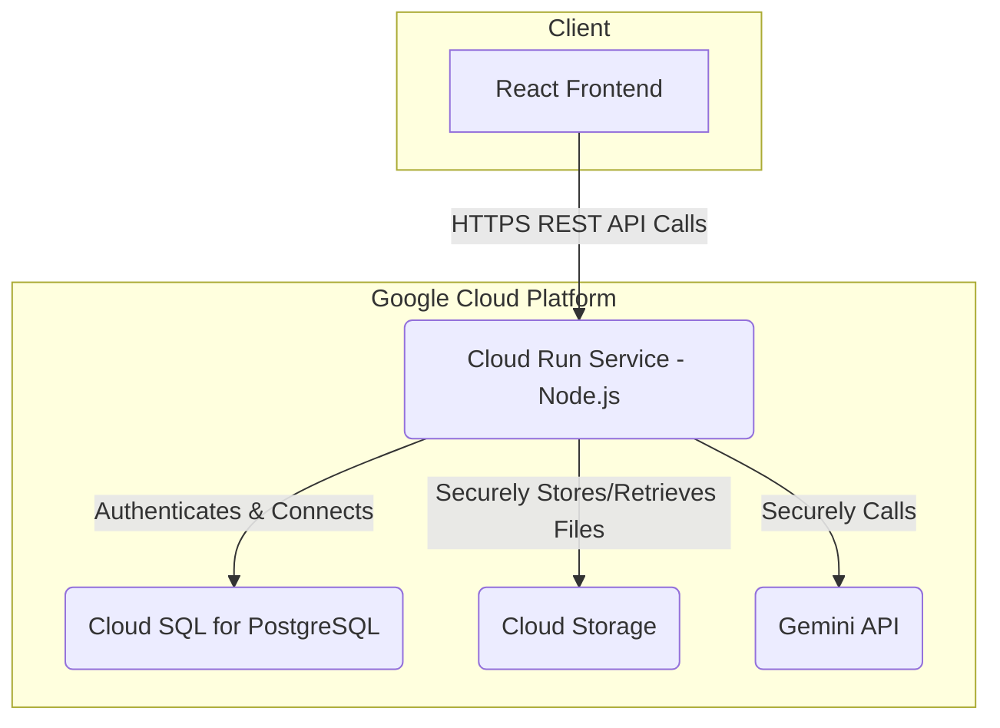

# 🏛️ Backend Architecture Plan: Cloud Run & Cloud SQL

**Document Status:** Published - 2024-08-16 (Revised for Cloud SQL)
**System Goal:** To provide a complete backend design and implementation plan for a secure, scalable, and production-ready architecture using Google Cloud Run for the application server and Cloud SQL for the PostgreSQL database.

---

This document outlines the entire backend, from the API architecture and security model to the database connection and deployment strategy.

### 1. System Architecture

The backend will be a custom Node.js (Express) application deployed as a containerized service on Google Cloud Run. This service will be responsible for handling all API requests, authenticating users, executing business logic (including secure calls to the Gemini API), and interacting with the Cloud SQL database.

- **Cloud Run Service:** A stateless Node.js application that exposes a REST API. It will handle authentication via JWTs and contain all business logic.
- **Cloud SQL for PostgreSQL:** A fully managed relational database that will store all application data (users, decks, slides, etc.).
- **Cloud Storage:** Used for storing user-generated assets like uploaded images or generated PDF exports.
- **Secret Manager:** Google Cloud's Secret Manager will be used to securely store the `GEMINI_API_KEY` and database credentials, which will be injected into the Cloud Run service as environment variables.

### 2. Database Schema

The definitive database schema, data model, and RLS policies are defined in **`docs/46-cloude-sql.md`**. This document serves as the single source of truth for the PostgreSQL database structure.

### 3. API Endpoints (RESTful)

The Node.js service will expose a series of RESTful endpoints. All endpoints (except auth) will be protected and require a valid JWT.

- **Authentication**
  - `POST /api/auth/signup`
  - `POST /api/auth/login`
- **Decks**
  - `GET /api/decks` - Get all decks for the authenticated user.
  - `POST /api/decks` - Create a new empty deck.
  - `GET /api/decks/:id` - Get a single deck with its slides.
  - `PUT /api/decks/:id` - Update a deck's metadata (e.g., title).
  - `DELETE /api/decks/:id` - Delete a deck.
- **AI Generation (Async)**
  - `POST /api/ai/generate-deck` - The main endpoint for deck generation. Accepts text or URLs, creates the initial deck record, and returns a `deckId` for polling. This will then asynchronously generate the slides.
- **AI Copilot**
  - `POST /api/ai/slides/:id/rewrite` - Rewrite content for a specific slide.
  - `POST /api/ai/slides/:id/generate-image` - Generate an image for a slide.

### 4. Security Model

- **Authentication:** JWTs will be used for authenticating API requests. The Node.js server will validate the token on every protected request.
- **Authorization (RLS):** To enforce multi-tenancy at the database layer, we will use PostgreSQL's Row-Level Security. Before executing a query, the application will set a session variable for the current user's ID (e.g., `SET app.current_user_id = '...'`). The RLS policies defined in the schema will use this variable to filter data.
- **Secret Management:** All secrets (API keys, database passwords) will be stored in Google Cloud Secret Manager and accessed by the Cloud Run service at runtime. **No secrets will ever be exposed to the client-side application.**

### 5. Implementation & Migration Plan

1.  **Phase 1 (Infrastructure):**
    -   Provision a new Cloud SQL for PostgreSQL instance on GCP.
    -   Create a new Cloud Storage bucket.
    -   Set up Secret Manager with the required API keys and credentials.
2.  **Phase 2 (Database Schema):**
    -   Apply the full database schema from `docs/46-cloude-sql.md` to the new Cloud SQL instance using migration files.
3.  **Phase 3 (Backend Development):**
    -   Develop the Node.js (Express) application with the API endpoints defined above.
    -   Implement JWT-based authentication and middleware.
    -   Implement the logic to connect to Cloud SQL securely (using the Cloud SQL Auth Proxy is recommended).
    -   Move all AI logic from the client-side `geminiService.ts` into this new backend service.
4.  **Phase 4 (Deployment):**
    -   Containerize the Node.js application using a `Dockerfile`.
    -   Deploy the container image to Google Cloud Run, ensuring it's configured with the correct environment variables from Secret Manager.
5.  **Phase 5 (Frontend Cutover):**
    -   Refactor the frontend application to call the new Cloud Run API endpoints, as detailed in `docs/39-supabase-frontend-plan.md`.