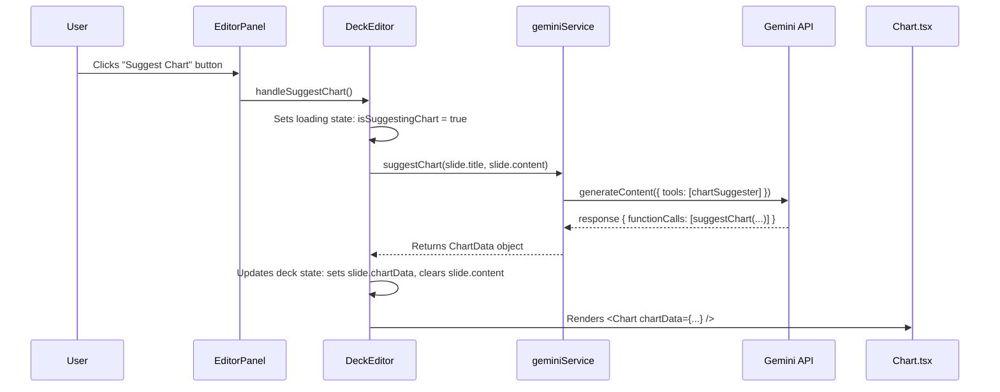

# 📈 Implementation Plan: AI-Powered Data Visualization

**Document Status:** Published - 2024-08-11
**System Goal:** To implement a "Data-to-Slide" feature where the application can intelligently detect numerical data within a slide's text, suggest a suitable chart visualization, and render it dynamically in both the editor and presentation modes.

---

### 1. Executive Summary & Goal

The core goal is to transform static, text-based data slides (e.g., Traction, Market Size, Financials) into compelling, professional data visualizations with a single click. This feature will leverage our existing function-calling architecture to create a seamless user experience, making data presentation both effortless and beautiful.

The implementation will follow these key principles:
1.  **AI-First:** The AI will be responsible for data extraction and chart suggestion.
2.  **Performance-Aware:** We will prioritize a lightweight solution to avoid bloating the application bundle.
3.  **Seamless Integration:** The new feature will feel like a natural extension of the existing editor workflow.

---

### 2. Chart Library Recommendation

After evaluating options like Chart.js, Recharts, and D3, the recommendation is to **build a custom, lightweight chart component** for the initial implementation.

-   **Justification:**
    -   **Minimalism & Performance:** Our immediate need is for simple bar charts. A full library like Recharts (~150KB gzipped) or D3 is overkill and would significantly increase our bundle size. A custom SVG-based component will have a near-zero performance footprint.
    -   **Brand Consistency:** A custom component gives us 100% control over styling, animations, and tooltips, ensuring the charts perfectly match the Sun AI design system (e.g., using the `#E87C4D` brand orange).
    -   **Scoped Complexity:** We can build exactly what we need for bar charts now and choose to integrate a larger library later if more complex chart types (e.g., scatter plots, radar charts) become a requirement.

---

### 3. Data Model & Architecture

#### 3.1 Data Model Changes (`data/decks.ts`)

The `Slide` interface will be updated to include an optional `chartData` property.

```typescript
// in data/decks.ts

// NEW INTERFACE
export interface ChartData {
  type: 'bar'; // Currently only bar charts are supported
  data: { label: string; value: number }[];
}

// UPDATED SLIDE INTERFACE
export interface Slide {
  id: string;
  title: string;
  content: string; // Will be empty if chartData exists
  imageUrl?: string;
  template?: keyof typeof templates;
  chartData?: ChartData; // NEW PROPERTY
}
```

#### 3.2 Architectural Workflow

The new workflow will be triggered by a user action in the `EditorPanel`.



---

### 4. AI Service Layer (`services/geminiService.ts`)

#### 4.1. Function Declaration for `chartSuggester`

This new declaration will instruct the model on how to structure the chart data.

```typescript
// in services/geminiService.ts

const chartSuggesterFunctionDeclaration: FunctionDeclaration = {
    name: 'suggestChart',
    description: 'Analyzes slide content for data points and suggests a suitable bar chart representation.',
    parameters: {
        type: Type.OBJECT,
        properties: {
            type: { type: Type.STRING, description: "The type of chart. Must be 'bar'." },
            data: {
                type: Type.ARRAY,
                description: 'An array of data objects for the chart.',
                items: {
                    type: Type.OBJECT,
                    properties: {
                        label: { type: Type.STRING, description: 'The label for the data point (e.g., a year or category).' },
                        value: { type: Type.NUMBER, description: 'The numerical value for the data point.' },
                    },
                    required: ['label', 'value'],
                },
            },
        },
        required: ['type', 'data'],
    },
};
```

#### 4.2. New Service Function `suggestChart`

This function will orchestrate the call to the Gemini API.

```typescript
// in services/geminiService.ts

export const suggestChart = async (title: string, content: string): Promise<ChartData | null> => {
    try {
        const prompt = `
            You are a data visualization expert. Analyze the following slide content for numerical data that can be represented as a bar chart. If suitable data is found (at least 2 data points), call the 'suggestChart' function. Otherwise, do not call the function.

            **Slide Title:** "${title}"
            **Slide Content:** "${content}"

            Look for patterns like "Metric: Value", "Category: Amount", or "Year: Number". Extract these into labels and values.
        `;

        const response = await ai.models.generateContent({
            model: "gemini-2.5-pro",
            contents: prompt,
            config: {
                tools: [{ functionDeclarations: [chartSuggesterFunctionDeclaration] }],
            },
        });
        
        const functionCall = response.functionCalls?.[0];

        if (functionCall?.name === 'suggestChart' && functionCall.args) {
            const chartResult = functionCall.args as unknown as ChartData;
            // Only return if we have a meaningful chart with at least 2 bars
            if (chartResult.data?.length > 1) { 
                return { type: 'bar', data: chartResult.data };
            }
        }
        
        return null; // No suitable chart found

    } catch (error) {
        console.error("Error suggesting chart with Gemini:", error);
        throw new Error("Failed to suggest a chart. Please try again.");
    }
};
```

---

### 5. Step-by-Step Frontend Implementation Plan

1.  **Task 1: Update Data Model (`data/decks.ts`)**
    *   Add the `ChartData` interface as defined in section 3.1.
    *   Add the optional `chartData?: ChartData;` property to the `Slide` interface.

2.  **Task 2: Create the `Chart.tsx` Component**
    *   Create a new file: `components/Chart.tsx`.
    *   This component will accept `chartData` as a prop.
    *   It will render an SVG element.
    *   Inside the SVG, it will map over `chartData.data` to render `<rect>` elements for the bars and `<text>` elements for the labels.
    *   Use inline `<style>` or CSS-in-JS to add simple, elegant animations (e.g., bars growing on render).

3.  **Task 3: Update `DeckEditor.tsx` (State Management)**
    *   Add new state variables:
        ```typescript
        const [isSuggestingChart, setIsSuggestingChart] = useState(false);
        const [chartError, setChartError] = useState<string | null>(null);
        ```
    *   Create the `handleSuggestChart` callback function. This function will:
        *   Set `isSuggestingChart(true)` and `setChartError(null)`.
        *   Call `suggestChart()` from `geminiService`.
        *   On success, update the `deck` state:
            *   Find the selected slide.
            *   Set its `chartData` to the result.
            *   **Crucially, set its `content` to an empty string** to replace the text with the chart.
        *   On failure, set `chartError` with an appropriate message.
        *   Finally, set `isSuggestingChart(false)`.
    *   Pass the new state and handler down to `EditorPanel`.

4.  **Task 4: Update `EditorPanel.tsx` (UI & Rendering)**
    *   Add a "Suggest Chart" button near the "Auto-Layout" button.
    *   Disable this button if `isSuggestingChart` is true or if `selectedSlide.chartData` already exists.
    *   Display a loading state on the button when `isSuggestingChart` is true.
    *   In the main slide preview area, add conditional rendering logic:
        ```tsx
        {selectedSlide.chartData ? (
            <Chart chartData={selectedSlide.chartData} />
        ) : (
            <ul className={templateStyles.content}>
                {/* existing bullet point rendering logic */}
            </ul>
        )}
        ```

5.  **Task 5: Update `PresentationScreen.tsx`**
    *   In the slide rendering logic, apply the same conditional rendering as in `EditorPanel` to show the `<Chart />` component if `activeSlide.chartData` is present.

---

### 6. UI/UX Flow for the User

1.  **Initial State:** A user has a slide with text content containing data, e.g., "Traction: 5k waitlist users, 200+ decks created."
2.  **Action:** The user clicks the "Suggest Chart" button, which is enabled because the slide has no chart yet.
3.  **Feedback:** The button enters a loading state ("Analyzing...").
4.  **Transformation:** After a few seconds, the AI returns the data. The bullet points in the slide preview disappear and are replaced by a rendered bar chart showing "Waitlist" and "Decks Created" bars.
5.  **Final State:** The chart is now part of the slide. The "Suggest Chart" button becomes disabled to prevent re-generation. The user can now proceed to edit other slides or enter presentation mode, where the chart will be displayed.

---

### 7. Production Readiness Checklist

| Category          | Criteria                                                                                                                                                               |
| ----------------- | ---------------------------------------------------------------------------------------------------------------------------------------------------------------------- |
| **Code Quality**  | New components and functions are strongly typed. The custom chart component is modular and reusable.                                                                    |
| **UI/UX**         | The loading state is clear and non-blocking. The transition from text to chart is smooth. The chart itself is clean, readable, and well-animated.                       |
| **Error Handling**| The `handleSuggestChart` function includes a `try...catch` block. If the AI fails to find data or an error occurs, a user-friendly message is shown via the `chartError` state. |
| **Functionality** | The end-to-end flow is tested and confirmed to work. The chart renders correctly in both the editor and the presentation screen.                                           |
| **Accessibility** | The custom chart component should include basic accessibility features, such as `<title>` and `<desc>` tags within the SVG for screen readers.                          |
| **Regressions**   | Verify that adding this feature does not break existing AI functionality like Copilot or Image Generation.                                                               |
