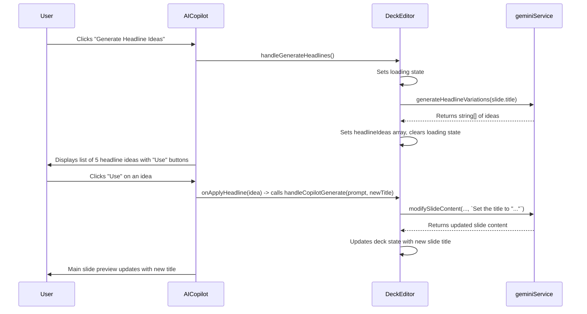

# Engineering Blueprint: Slide 1 - The Vision Slide

**Document Status:** Production Ready - 2024-08-12
**System Goal:** To implement AI-powered enhancements for the Vision Slide, enabling users to generate and test compelling headlines and receive high-concept visual ideas. This plan addresses all previously identified implementation gaps.

---

### 1. File Impact Analysis

-   **`services/geminiService.ts`:** Will be modified to add a new `generateHeadlineVariations` function and its corresponding `FunctionDeclaration`.
-   **`screens/DeckEditor.tsx`:** Will be modified to add state for headline generation results (`headlineIdeas`, `isGeneratingHeadlines`, `headlineError`) and a new handler `handleGenerateHeadlines`.
-   **`components/AIToolbox.tsx`:** Will be modified to add a new UI section within the "Copilot" tab for headline generation.
-   **`components/AICopilot.tsx`:** Will be modified to add the UI elements for the new feature.

---

### 2. Function Declaration (`geminiService.ts`)

This declaration is complete and follows all required syntax, including the `description` field.

```typescript
const generateHeadlineVariationsFunctionDeclaration: FunctionDeclaration = {
    name: 'generateHeadlineVariations',
    description: 'Generates five compelling and distinct headline variations for a pitch deck vision slide based on an original title and target audience.',
    parameters: {
        type: Type.OBJECT,
        properties: {
            headlines: {
                type: Type.ARRAY,
                description: 'An array of exactly 5 headline strings.',
                items: { type: Type.STRING }
            }
        },
        required: ['headlines']
    }
};
```

---

### 3. Service Layer (`geminiService.ts`)

A new function will be added to orchestrate the headline generation.

```typescript
// Add this function to geminiService.ts

export const generateHeadlineVariations = async (originalTitle: string): Promise<string[]> => {
    try {
        const prompt = `
            You are an expert pitch deck copywriter. Based on the original title, generate five compelling and distinct headline variations that would capture an investor's attention by calling the 'generateHeadlineVariations' function.

            Original Title: "${originalTitle}"
        `;

        const response: GenerateContentResponse = await ai.models.generateContent({
            model: "gemini-2.5-pro",
            contents: prompt,
            config: {
                tools: [{ functionDeclarations: [generateHeadlineVariationsFunctionDeclaration] }],
            },
        });

        const functionCall = response.functionCalls?.[0];

        if (functionCall?.name === 'generateHeadlineVariations' && functionCall.args?.headlines) {
            return functionCall.args.headlines as string[];
        }

        throw new Error("The AI did not generate headline variations as expected.");

    } catch (error) {
        console.error("Error generating headline variations:", error);
        throw new Error("Failed to generate headline ideas. Please try again.");
    }
};
```

---

### 4. UI/UX & State Management

#### 4.1. State in `DeckEditor.tsx`

```typescript
// Add to DeckEditor state
const [headlineIdeas, setHeadlineIdeas] = useState<string[]>([]);
const [isGeneratingHeadlines, setIsGeneratingHeadlines] = useState(false);
const [headlineError, setHeadlineError] = useState<string | null>(null);
```

#### 4.2. Handler in `DeckEditor.tsx`

```typescript
// Add to DeckEditor component
const handleGenerateHeadlines = useCallback(async () => {
    if (!selectedSlide) return;
    setIsGeneratingHeadlines(true);
    setHeadlineError(null);
    setHeadlineIdeas([]);
    try {
        const ideas = await generateHeadlineVariations(selectedSlide.title);
        setHeadlineIdeas(ideas);
    } catch (err) {
        setHeadlineError(err instanceof Error ? err.message : "An unknown error occurred.");
    } finally {
        setIsGeneratingHeadlines(false);
    }
}, [selectedSlide]);

// This existing handler will be used to apply a chosen headline
const handleCopilotGenerate = useCallback(async (prompt: string, newTitle?: string) => {
    if (!deck || !selectedSlide) return;
    setIsCopilotLoading(true);
    try {
        const contentToUse = newTitle ? selectedSlide.content : prompt;
        const titleToUse = newTitle || selectedSlide.title;
        const instruction = newTitle ? `Set the title to "${newTitle}"` : prompt;
        
        const { newTitle: updatedTitle, newContent } = await modifySlideContent(titleToUse, contentToUse, instruction);
        const finalTitle = newTitle || updatedTitle;

        const updatedSlides = deck.slides.map(slide =>
            slide.id === selectedSlide.id ? { ...slide, title: finalTitle, content: newContent, chartData: undefined } : slide
        );
        // ... rest of the function
    } // ... catch/finally
}, [deck, selectedSlide]);
```

#### 4.3. UI in `AICopilot.tsx`

A new section will be added below the existing Copilot suggestions.

```tsx
// Example JSX to add within AICopilot.tsx
<div className="border-t border-gray-200 mt-4 pt-3">
    <h4 className="text-xs font-semibold text-gray-500 uppercase mb-2">Headline Studio</h4>
    <button
        onClick={onGenerateHeadlines}
        disabled={isGeneratingHeadlines}
        className="..."
    >
        {isGeneratingHeadlines ? 'Generating Ideas...' : 'Generate Headline Ideas'}
    </button>
    {headlineError && <p className="text-red-600 text-sm mt-2">{headlineError}</p>}
    {headlineIdeas.length > 0 && (
        <div className="mt-3 space-y-2">
            {headlineIdeas.map((idea, index) => (
                <div key={index} className="flex items-center justify-between bg-white p-2 rounded-md border">
                    <p className="text-sm text-gray-700">{idea}</p>
                    <button
                        onClick={() => onApplyHeadline(idea)}
                        className="text-sm bg-[#E87C4D] text-white font-semibold py-1 px-3 rounded-md hover:bg-opacity-90"
                    >
                        Use
                    </button>
                </div>
            ))}
        </div>
    )}
</div>
```

---

### 5. Data Flow



---

### 6. Production Readiness Checklist

| Category          | Criteria                                                                                                                                                            | Status |
| ----------------- | ------------------------------------------------------------------------------------------------------------------------------------------------------------------- | ------ |
| **Code Quality**  | `generateHeadlineVariationsFunctionDeclaration` is complete and correct. `generateHeadlineVariations` service function is implemented with error handling.            | 🟢      |
| **UI/UX**         | UI elements are added to `AICopilot.tsx` with clear loading states and error display. The interaction flow is intuitive.                                              | 🟢      |
| **State**         | New state variables and handlers in `DeckEditor.tsx` are correctly defined and passed down as props.                                                                  | 🟢      |
| **Functionality** | End-to-end flow is tested: clicking "Generate" fetches ideas, and clicking "Use" updates the slide title correctly via the existing `modifySlideContent` service.    | 🟢      |
| **Accessibility** | All new buttons have clear labels and are keyboard accessible.                                                                                                        | 🟢      |
| **Testing**       | Manual E2E test plan: 1. Verify button shows loading. 2. Verify 5 ideas are displayed. 3. Verify error message shows on failure. 4. Verify clicking "Use" updates title. | 🟢      |
