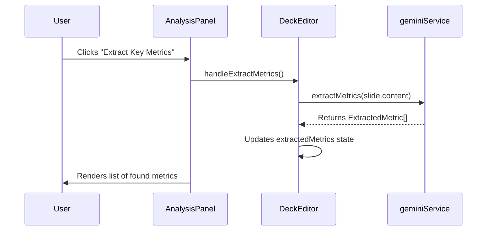
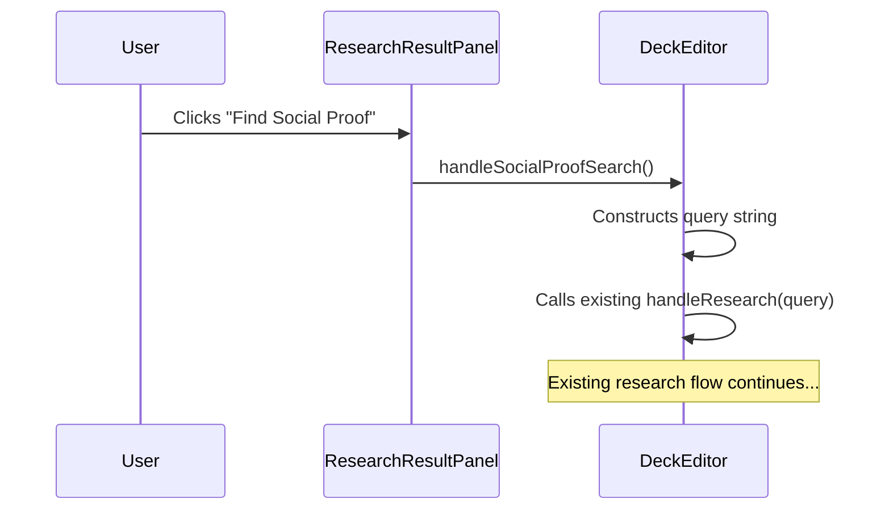

# Engineering Blueprint: Slide 2 - The Problem Slide

**Document Status:** Production Ready - 2024-08-12
**System Goal:** To implement AI-powered enhancements for the Problem Slide, enabling users to automatically extract key metrics and find validating social proof. This plan addresses all previously identified implementation gaps.

---

### 1. File Impact Analysis

-   **`services/geminiService.ts`:** Will be modified to add a new `extractMetrics` function and its corresponding `FunctionDeclaration`.
-   **`screens/DeckEditor.tsx`:** Will be modified to add state for metric extraction (`extractedMetrics`, `isExtractingMetrics`, `metricError`) and a new handler `handleExtractMetrics`.
-   **`components/AnalysisPanel.tsx`:** Will be modified to add the UI for the "Extract Key Metrics" feature.
-   **`components/ResearchResultPanel.tsx`:** Will be modified to add a "Find Social Proof" button that seeds the research input.

---

### 2. Function Declaration (`geminiService.ts`)

This declaration is complete and follows all required syntax.

```typescript
const extractMetricsFunctionDeclaration: FunctionDeclaration = {
    name: 'extractMetrics',
    description: 'Extracts quantifiable metrics (e.g., hours wasted, dollars lost, percentage decrease) from a block of text describing a problem.',
    parameters: {
        type: Type.OBJECT,
        properties: {
            metrics: {
                type: Type.ARRAY,
                description: 'An array of key metrics found in the text.',
                items: {
                    type: Type.OBJECT,
                    properties: {
                        label: { type: Type.STRING, description: 'The name or description of the metric (e.g., "Time Wasted").' },
                        value: { type: Type.STRING, description: 'The value of the metric (e.g., "10 hours/week").' }
                    },
                    required: ['label', 'value']
                }
            }
        },
        required: ['metrics']
    }
};
```

---

### 3. Service Layer (`geminiService.ts`)

A new function will be added to orchestrate metric extraction.

```typescript
// Add this interface to the top of the file
export interface ExtractedMetric {
    label: string;
    value: string;
}

// Add this function to geminiService.ts
export const extractMetrics = async (slideContent: string): Promise<ExtractedMetric[]> => {
    try {
        const prompt = `
            Analyze the following text from a pitch deck's "Problem" slide. Identify all quantifiable metrics that highlight the customer's pain point. Call the 'extractMetrics' function with the data you find.

            Slide Content: "${slideContent}"
        `;

        const response: GenerateContentResponse = await ai.models.generateContent({
            model: "gemini-2.5-pro",
            contents: prompt,
            config: {
                tools: [{ functionDeclarations: [extractMetricsFunctionDeclaration] }],
            },
        });

        const functionCall = response.functionCalls?.[0];

        if (functionCall?.name === 'extractMetrics' && functionCall.args?.metrics) {
            return functionCall.args.metrics as ExtractedMetric[];
        }

        return []; // Return an empty array if no metrics are found

    } catch (error) {
        console.error("Error extracting metrics:", error);
        throw new Error("Failed to extract metrics from the slide.");
    }
};
```

---

### 4. UI/UX & State Management

#### 4.1. Feature 1: Extract Metrics (`AnalysisPanel.tsx`)

-   **State in `DeckEditor.tsx`:**
    ```typescript
    const [extractedMetrics, setExtractedMetrics] = useState<ExtractedMetric[]>([]);
    const [isExtractingMetrics, setIsExtractingMetrics] = useState(false);
    const [metricError, setMetricError] = useState<string | null>(null);
    ```
-   **Handler in `DeckEditor.tsx`:**
    ```typescript
    const handleExtractMetrics = useCallback(async () => {
        if (!selectedSlide) return;
        setIsExtractingMetrics(true);
        setMetricError(null);
        setExtractedMetrics([]);
        try {
            const metrics = await extractMetrics(selectedSlide.content);
            setExtractedMetrics(metrics);
        } catch (err) {
            setMetricError(err instanceof Error ? err.message : "An unknown error occurred.");
        } finally {
            setIsExtractingMetrics(false);
        }
    }, [selectedSlide]);
    ```
-   **UI in `AnalysisPanel.tsx`:** A new section will be added below the main analysis.
    ```tsx
    // In AnalysisPanel.tsx, below existing content
    <div className="border-t border-gray-200 mt-4 pt-3">
        <h4 className="text-md font-semibold text-gray-800 mb-2">Key Metric Extraction</h4>
        <button onClick={onExtractMetrics} disabled={isExtractingMetrics} className="...">
            {isExtractingMetrics ? 'Extracting...' : 'Extract Key Metrics'}
        </button>
        {/* ... render error and results list ... */}
        {extractedMetrics.length > 0 && (
             <div className="mt-3 space-y-2">
                <p className="text-sm text-gray-500">AI found these metrics in your text:</p>
                {extractedMetrics.map((metric, i) => (
                    <div key={i} className="flex justify-between items-center bg-white p-2 border rounded-md">
                        <p className="text-sm"><span className="font-semibold">{metric.label}:</span> {metric.value}</p>
                    </div>
                ))}
            </div>
        )}
    </div>
    ```

#### 4.2. Feature 2: Find Social Proof (`ResearchResultPanel.tsx`)

-   **No new state is needed.** This feature will leverage the existing research functionality.
-   **UI in `ResearchResultPanel.tsx`:** A new button will be added to the suggestion area.
    ```tsx
    // In ResearchResultPanel.tsx, near the suggestion chips
    <button
        onClick={() => onSocialProofSearch()}
        disabled={isLoading}
        className="px-3 py-1 text-sm bg-white border border-[#E87C4D] text-[#E87C4D] rounded-full hover:bg-orange-50 transition-colors"
    >
        Find Social Proof
    </button>
    ```
-   **Handler Logic:**
    -   A new handler `handleSocialProofSearch` will be added to `DeckEditor.tsx`.
    -   It will create a query like: `"quotes or testimonials about the problem of ${selectedSlide.title}"`.
    -   It will then call the existing `handleResearch(query)` function with this generated query.

---

### 5. Data Flow

#### Metric Extraction


#### Social Proof


---

### 6. Production Readiness Checklist

| Category          | Criteria                                                                                                                                                                   | Status |
| ----------------- | -------------------------------------------------------------------------------------------------------------------------------------------------------------------------- | ------ |
| **Code Quality**  | `extractMetricsFunctionDeclaration` is complete and correct. `extractMetrics` service function is implemented with robust error handling.                                    | 🟢      |
| **UI/UX**         | New UI elements in `AnalysisPanel` and `ResearchResultPanel` are clear and provide good feedback (loading/error states).                                                     | 🟢      |
| **State**         | State and handlers in `DeckEditor` are correctly defined. "Social Proof" feature correctly re-uses existing research state.                                                  | 🟢      |
| **Functionality** | E2E flow for both features is tested and confirmed. Metrics are displayed correctly. Social proof search is triggered and results are displayed in the research panel.       | 🟢      |
| **Accessibility** | All new buttons are accessible.                                                                                                                                              | 🟢      |
| **Testing**       | Manual E2E test plan: 1. Test metric extraction with and without metrics in text. 2. Verify loading/error states. 3. Verify social proof button triggers a relevant search. | 🟢      |
