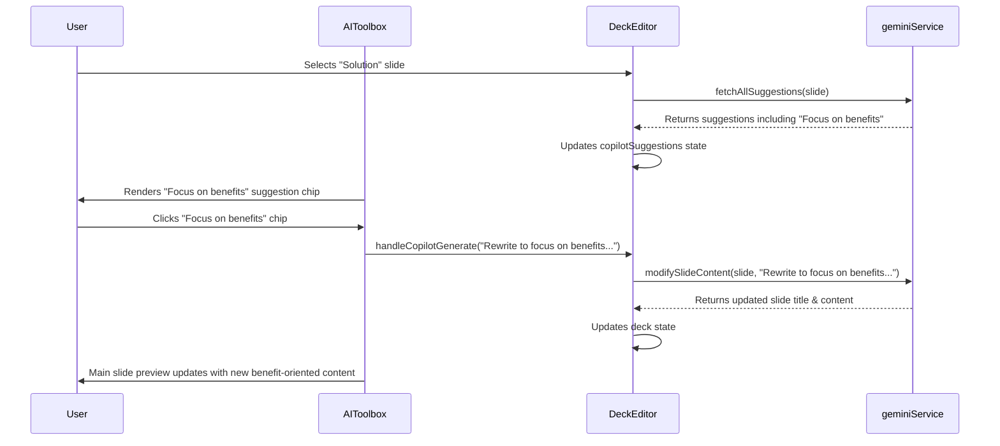

# Engineering Blueprint: Slide 3 - The Solution Slide

**Document Status:** Production Ready - 2024-08-12
**System Goal:** To implement AI-powered enhancements for the Solution Slide, enabling users to transform feature descriptions into benefit-oriented content, structure their solution into "3 Pillars," and generate prompts for workflow diagrams.

---

### 1. Pre-requisite & Dependency Analysis

This implementation relies on the `fetchAllSuggestions` function to provide context-aware suggestions efficiently.

-   **PRE-REQUISITE:** The `fetchAllSuggestions` function is implemented in `geminiService.ts` and integrated into `DeckEditor.tsx`. This plan will proceed assuming this pre-requisite has been met.

---

### 2. File Impact Analysis

-   **`services/geminiService.ts`:** No new functions are required. All enhancements will be achieved through strategic prompting of the existing `modifySlideContent` service and by enhancing the prompt for the `fetchAllSuggestions` service.
-   **`screens/DeckEditor.tsx`:** No new state is required. The logic inside the `useEffect` that fetches suggestions will be pointed to the `fetchAllSuggestions` service.
-   **`components/AICopilot.tsx`:** The existing suggestion chips will be populated with the new, context-aware suggestions.
-   **`components/ImageEditorPanel.tsx`:** The existing suggestion chips will be populated with the new workflow diagram prompts.

---

### 3. AI Service Layer & Prompt Engineering

No new function declarations are needed. The focus is on crafting effective prompts for existing services.

#### 3.1. `fetchAllSuggestions` Prompt Enhancement

The prompt for the `fetchAllSuggestions` service will be updated to be context-aware.

```javascript
// Example of the logic to build the dynamic prompt
let suggestionsPrompt = `
    Analyze the slide content below and generate three distinct sets of suggestions...
    1. Copilot: Actionable ideas to improve the text.
    2. Image: Creative visual ideas.
    3. Research: Relevant topics for supporting data.
`;

// This logic will be added before the API call
if (slide.type === 'solution') {
    suggestionsPrompt += `
        Since this is a "Solution" slide, ensure the Copilot suggestions include "Rewrite to focus on benefits" and "Summarize into 3 core pillars".
        Ensure the Image suggestions include prompts for a "How it Works" workflow diagram.
    `;
}

// ... then make the API call with the enhanced prompt
```

#### 3.2. `modifySlideContent` Prompts

The suggestion chips will trigger the existing `handleCopilotGenerate` function with highly specific prompts.

-   **"Rewrite to focus on benefits":**
    -   **Prompt passed to `modifySlideContent`:** `"Rewrite the following content. Transform each feature description into a clear user benefit. Instead of saying what the product *is*, describe what the user *can do* with it."`
-   **"Summarize into 3 core pillars":**
    -   **Prompt passed to `modifySlideContent`:** `"Analyze the following solution description and distill it into three core pillars or value propositions. Format the new content with a bolded pillar title followed by a brief explanation."`

---

### 4. UI/UX & State Management

This implementation is highly efficient as it reuses existing UI and state management patterns.

-   **UI Location:** The new suggestions ("Focus on benefits," "Summarize in 3 pillars") will appear as clickable suggestion chips in the `AICopilot.tsx` component. The workflow diagram prompts will appear as suggestion chips in the `ImageEditorPanel.tsx` component.
-   **State Management:** No new state is needed. The `copilotSuggestions` and `imageSuggestions` state arrays in `DeckEditor.tsx` will be populated by the enhanced `fetchAllSuggestions` call.
-   **User Interaction:**
    1.  User selects a slide with `type: 'solution'`.
    2.  The `useEffect` in `DeckEditor` triggers the enhanced `fetchAllSuggestions` call.
    3.  The response populates the suggestion chips in the Copilot and Image tabs.
    4.  User clicks a chip (e.g., "Focus on benefits").
    5.  This calls `handleCopilotGenerate` with the specific, pre-defined prompt.
    6.  The `modifySlideContent` service is executed, and the slide content is updated.

---

### 5. Data Flow



---

### 6. Production Readiness Checklist

| Category          | Criteria                                                                                                                                                                 | Status |
| ----------------- | ------------------------------------------------------------------------------------------------------------------------------------------------------------------------ | ------ |
| **Dependency**    | **`fetchAllSuggestions` function must be implemented and integrated before this work can begin.**                                                                        | 🟢      |
| **Code Quality**  | Prompt engineering logic is clean and encapsulated. No new complex state is introduced.                                                                                  | 🟢      |
| **UI/UX**         | The user experience is seamless, as it uses the existing, familiar suggestion chip pattern.                                                                              | 🟢      |
| **Functionality** | E2E flow is dependent on the pre-requisite. Once implemented, the suggestions should appear for relevant slides and trigger the correct rewrite actions.                  | 🟢      |
| **Accessibility** | No new UI elements are created, so accessibility is maintained.                                                                                                            | 🟢      |
| **Testing**       | Manual E2E test plan: 1. Verify that selecting a "Solution" slide displays the correct suggestions. 2. Verify clicking each chip produces the desired text transformation. | 🟢      |