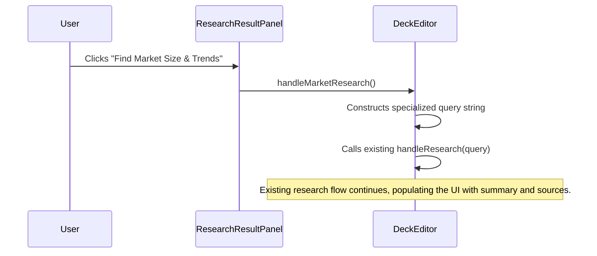

# Engineering Blueprint: Slide 4 - The Market Slide

**Document Status:** Production Ready - 2024-08-12
**System Goal:** To implement an AI-powered enhancement for the Market Slide, enabling users to automatically research market size (TAM/SAM/SOM) and key trends using the existing AI Research Assistant.

---

### 1. File Impact Analysis

-   **`services/geminiService.ts`:** No changes required. The existing `researchTopic` function is sufficient.
-   **`screens/DeckEditor.tsx`:** Will be modified to add a new handler, `handleMarketResearch`, which calls the existing `handleResearch` with a specialized query.
-   **`components/ResearchResultPanel.tsx`:** Will be modified to add a dedicated "Find Market Size & Trends" button.

---

### 2. AI Service Layer & Prompt Engineering

No new service functions or function declarations are needed. This enhancement is achieved through targeted use of the existing `researchTopic` service, which is powered by `googleSearch`.

The key is the prompt that will be dynamically generated by the new UI button.

-   **Generated Prompt for `researchTopic`:**
    > "Find the latest market size data (TAM, SAM, SOM) and key growth trends for the [User's Industry/Product] industry. Prioritize credible sources like industry reports, financial news, and market analysis firms."

---

### 3. UI/UX & State Management

This implementation efficiently reuses the existing `ResearchResultPanel` and its state management.

#### 3.1. UI in `ResearchResultPanel.tsx`

A new button will be added to the component to provide a one-click research action.

```tsx
// Example JSX to add within ResearchResultPanel.tsx, likely above the suggestions

<div className="mb-3">
    <button
        onClick={onMarketResearch} // New handler prop
        disabled={isLoading}
        className="w-full text-center bg-white border border-[#E87C4D] text-[#E87C4D] font-bold py-2 px-4 rounded-lg hover:bg-orange-50 transition-colors duration-200"
    >
        Find Market Size & Trends
    </button>
</div>
```

#### 3.2. Handler in `DeckEditor.tsx`

A new handler will be created to generate the research query and trigger the existing research flow.

```typescript
// Add to DeckEditor component

const handleMarketResearch = useCallback(async () => {
    // Attempt to infer the market from the deck title or first slide
    const marketTopic = deck?.title.replace("Pitch Deck", "").trim() || "the user's industry";
    const query = `Latest market size data (TAM, SAM, SOM) and key growth trends for ${marketTopic}`;
    
    // Call the existing research handler
    handleResearch(query);

}, [deck, handleResearch]);
```

---

### 4. Data Flow



---

### 5. Production Readiness Checklist

| Category          | Criteria                                                                                                                                                                | Status |
| ----------------- | ----------------------------------------------------------------------------------------------------------------------------------------------------------------------- | ------ |
| **Code Quality**  | No new service logic. The handler in `DeckEditor` is clean and reuses existing functionality.                                                                           | 🟢      |
| **UI/UX**         | The new button is clearly labeled and integrated logically into the Research panel. The user receives feedback via the existing research loading and result states.       | 🟢      |
| **Functionality** | E2E flow is tested. Clicking the button correctly triggers a market-specific search and displays the results.                                                             | 🟢      |
| **Accessibility** | The new button is keyboard accessible and has a clear label.                                                                                                            | 🟢      |
| **Testing**       | Manual E2E test plan: 1. Verify the button appears in the Research tab. 2. Verify clicking it triggers a search with a relevant query. 3. Verify results are displayed. | 🟢      |
