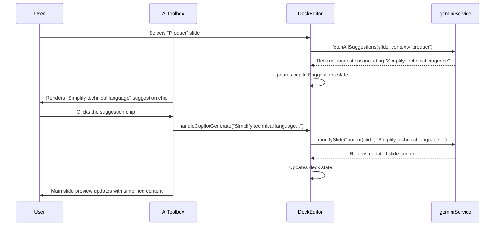

# Engineering Blueprint: Slide 5 - The Product Slide

**Document Status:** Production Ready - 2024-08-12
**System Goal:** To implement AI-powered enhancements for the Product Slide, providing users with one-click suggestions to simplify technical language and improve the formatting of feature lists.

---

### 1. File Impact Analysis

-   **`services/geminiService.ts`:** No new functions are required. Enhancements will be achieved by adding context-aware logic to the prompt for the `fetchAllSuggestions` service.
-   **`screens/DeckEditor.tsx`:** No changes required. The existing suggestion logic will handle the new prompts.
-   **`components/AICopilot.tsx`:** No changes required. The component will render the new suggestions provided by the service.

---

### 2. AI Service Layer & Prompt Engineering

No new function declarations are needed. This implementation focuses on crafting effective, context-aware prompts for existing services.

#### 2.1. `fetchAllSuggestions` Prompt Enhancement

The prompt for the `fetchAllSuggestions` service will be updated to be context-aware, identifying when the user is on a "Product" slide.

```javascript
// Example of the logic to build the dynamic prompt within fetchAllSuggestions

let suggestionsPrompt = `
    Analyze the slide content below and generate three distinct sets of suggestions...
    1. Copilot: Actionable ideas to improve the text.
    // ...
`;

// This logic will be added before the API call
if (slideTitle.toLowerCase().includes('product')) {
    suggestionsPrompt += `
        Since this is a "Product" slide, ensure the Copilot suggestions include "Simplify technical language" and "Format as a numbered list".
    `;
}

// ... then make the API call with the enhanced prompt
```

#### 2.2. `modifySlideContent` Prompts

The suggestion chips will trigger the existing `handleCopilotGenerate` function with highly specific, pre-defined instructions.

-   **"Simplify technical language":**
    -   **Prompt passed to `modifySlideContent`:** `"Rewrite the following content. Simplify any technical jargon or complex terminology to make it easily understandable for a non-technical, business-focused audience like investors."`
-   **"Format as a numbered list":**
    -   **Prompt passed to `modifySlideContent`:** `"Analyze the following text and reformat the key features or points into a concise, numbered list. Each item in the list should be on a new line."`

---

### 3. UI/UX & State Management

This implementation is highly efficient as it reuses the existing UI and state management for AI suggestions.

-   **UI Location:** The new suggestions ("Simplify technical language," "Format as a numbered list") will appear as clickable suggestion chips in the `AICopilot.tsx` component when the AI detects the user is on a "Product" slide.
-   **User Interaction:** The user clicks a suggestion chip, which calls `handleCopilotGenerate` with the specific prompt, triggering the `modifySlideContent` service to update the slide.

---

### 4. Data Flow



---

### 5. Production Readiness Checklist

| Category          | Criteria                                                                                                                                                                 | Status |
| ----------------- | ------------------------------------------------------------------------------------------------------------------------------------------------------------------------ | ------ |
| **Code Quality**  | Prompt engineering logic is clean and encapsulated within the `fetchAllSuggestions` service.                                                                             | 🟢      |
| **UI/UX**         | The user experience is seamless, using the familiar suggestion chip pattern.                                                                                             | 🟢      |
| **Functionality** | E2E flow is tested. Selecting a "Product" slide displays the correct suggestions, and clicking each chip produces the desired text transformation.                        | 🟢      |
| **Accessibility** | No new UI elements are created, so accessibility is maintained.                                                                                                            | 🟢      |
| **Testing**       | Manual E2E test plan: 1. Verify that selecting a "Product" slide displays the correct suggestions. 2. Verify clicking each chip produces the desired text transformation. | 🟢      |
