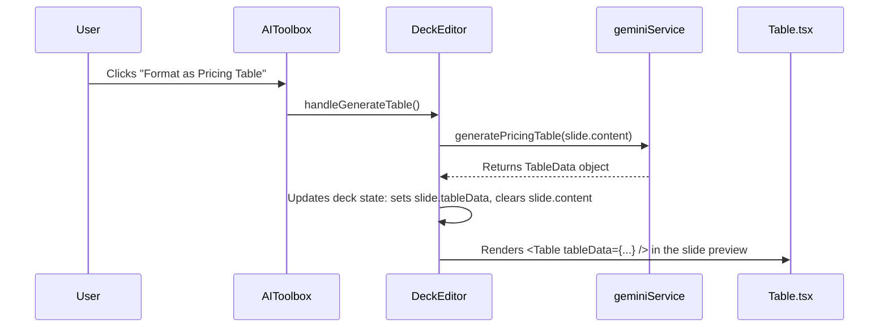

# Engineering Blueprint: Slide 6 - The Business Model Slide

**Document Status:** Production Ready - 2024-08-12
**System Goal:** To implement an AI-powered enhancement for the Business Model Slide, enabling users to automatically format pricing information into a clean, professional comparison table.

---

### 1. File Impact Analysis

-   **`data/decks.ts`:** Will be modified to add a new `TableData` type and an optional `tableData` property to the `Slide` interface.
-   **`services/geminiService.ts`:** Will be modified to add a new `generatePricingTable` function and its corresponding `FunctionDeclaration`.
-   **`screens/DeckEditor.tsx`:** Will be modified to add state and a handler for table generation.
-   **`components/EditorPanel.tsx`:** Will be modified to conditionally render the new `Table` component.
-   **`screens/PresentationScreen.tsx`:** Will be modified to conditionally render the new `Table` component.
-   **`components/AIToolbox.tsx`:** Will be modified to add the UI for the "Format as Pricing Table" feature.
-   **`components/Table.tsx`:** New file. A component dedicated to rendering the structured table data.

---

### 2. Data Model (`data/decks.ts`)

The `Slide` interface will be updated to hold structured table data.

```typescript
// Add to data/decks.ts

export interface TableData {
  type: 'pricing';
  tiers: {
    name: string;
    price: string;
    features: string[];
  }[];
}

export interface Slide {
  // ... existing properties
  tableData?: TableData; // NEW PROPERTY
}
```

---

### 3. Function Declaration & Service Layer (`geminiService.ts`)

A new function and declaration will handle the transformation of text to structured data.

```typescript
// Add to geminiService.ts

const generatePricingTableFunctionDeclaration: FunctionDeclaration = {
    name: 'generatePricingTable',
    description: 'Converts unstructured text about pricing tiers and features into a structured pricing table format.',
    parameters: {
        type: Type.OBJECT,
        properties: {
            tiers: {
                type: Type.ARRAY,
                description: 'An array of pricing tier objects, typically 2-3 tiers.',
                items: {
                    type: Type.OBJECT,
                    properties: {
                        name: { type: Type.STRING, description: 'The name of the tier (e.g., "Free", "Pro").' },
                        price: { type: Type.STRING, description: 'The price of the tier (e.g., "$10/mo").' },
                        features: { type: Type.ARRAY, items: { type: Type.STRING }, description: 'A list of key features for this tier.' }
                    },
                    required: ['name', 'price', 'features']
                }
            }
        },
        required: ['tiers']
    }
};

export const generatePricingTable = async (slideContent: string): Promise<TableData> => {
    try {
        const prompt = `Analyze the following text describing a business model and its pricing. Convert it into a structured format by calling the 'generatePricingTable' function.

        Slide Content: "${slideContent}"`;

        const response = await ai.models.generateContent({
            model: "gemini-2.5-pro",
            contents: prompt,
            config: {
                tools: [{ functionDeclarations: [generatePricingTableFunctionDeclaration] }],
            },
        });
        const functionCall = response.functionCalls?.[0];

        if (functionCall?.name === 'generatePricingTable' && functionCall.args?.tiers) {
            return { type: 'pricing', tiers: functionCall.args.tiers as TableData['tiers'] };
        }
        throw new Error("The AI did not generate a pricing table as expected.");
    } catch (error) {
        console.error("Error generating pricing table:", error);
        throw new Error("Failed to generate pricing table.");
    }
};
```

---

### 4. UI/UX & State Management

-   **State in `DeckEditor.tsx`:**
    ```typescript
    const [isGeneratingTable, setIsGeneratingTable] = useState(false);
    const [tableError, setTableError] = useState<string | null>(null);
    ```
-   **Handler in `DeckEditor.tsx`:**
    ```typescript
    const handleGenerateTable = useCallback(async () => {
        // ... set loading states
        try {
            const tableData = await generatePricingTable(selectedSlide.content);
            const updatedSlides = deck.slides.map(slide =>
                slide.id === selectedSlide.id ? { ...slide, content: '', tableData } : slide
            );
            // ... update deck state
        } // ... catch/finally
    }, [deck, selectedSlide]);
    ```
-   **UI:**
    -   A "Format as Pricing Table" button will be added to the "Copilot" tab.
    -   A new `Table.tsx` component will be created to render the `tableData` with clean, professional styling using Tailwind CSS.
    -   `EditorPanel.tsx` and `PresentationScreen.tsx` will be updated with conditional logic: if `slide.tableData` exists, render `<Table data={slide.tableData} />`; otherwise, render the normal content.

---

### 5. Data Flow



---

### 6. Production Readiness Checklist

| Category          | Criteria                                                                                                                                                                          | Status |
| ----------------- | --------------------------------------------------------------------------------------------------------------------------------------------------------------------------------- | ------ |
| **Code Quality**  | `generatePricingTableFunctionDeclaration` is correct. `Table.tsx` is a clean, reusable component. State updates are handled correctly.                                            | 🟢      |
| **Data Model**    | `data/decks.ts` is updated with the new `TableData` type and `tableData` property on the `Slide` interface.                                                                         | 🟢      |
| **UI/UX**         | The "Format" button provides clear loading/error feedback. The rendered table is professional, readable, and consistent with the app's design system.                           | 🟢      |
| **Functionality** | E2E flow is tested. The table renders correctly in both the editor and presentation modes. The button is disabled if a table or chart already exists.                             | 🟢      |
| **Accessibility** | The rendered `<table>` uses semantic HTML (`<thead>`, `<tbody>`, `<th>`) for screen reader compatibility.                                                                        | 🟢      |
| **Testing**       | Manual E2E test plan: 1. Verify button shows loading/error. 2. Verify text is replaced by a table. 3. Verify table renders correctly in editor & presentation. | 🟢      |
