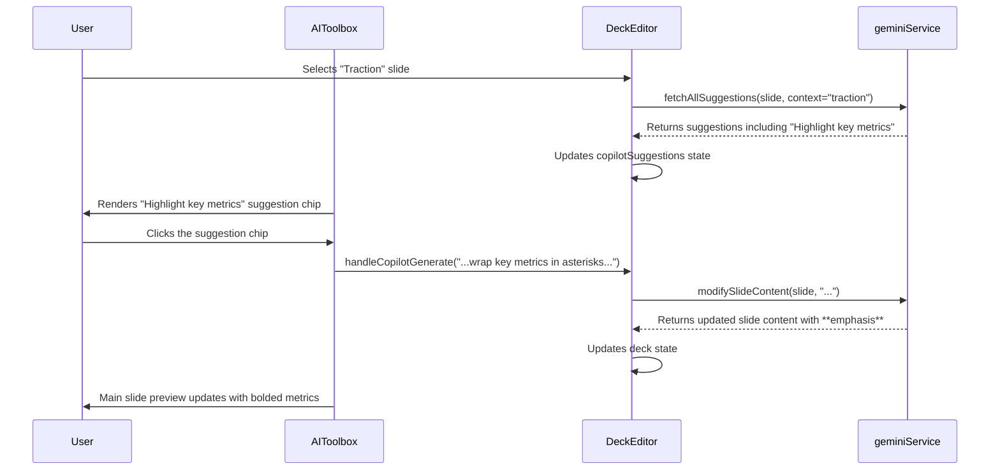

# Engineering Blueprint: Slide 7 - The Traction Slide

**Document Status:** Production Ready - 2024-08-12
**System Goal:** To implement AI-powered enhancements for the Traction Slide, enabling users to automatically highlight key metrics and format testimonials for maximum impact.

---

### 1. File Impact Analysis

-   **`services/geminiService.ts`:** No new functions required. Enhancements will be achieved by adding context-aware logic to the prompt for the `fetchAllSuggestions` service.
-   **`screens/DeckEditor.tsx`:** No changes required. The existing suggestion logic will handle the new prompts.
-   **`components/AICopilot.tsx`:** No changes required. The component will render the new suggestions provided by the service.

---

### 2. AI Service Layer & Prompt Engineering

This implementation focuses on crafting effective, context-aware prompts for the existing `modifySlideContent` service, triggered by the `fetchAllSuggestions` call.

#### 2.1. `fetchAllSuggestions` Prompt Enhancement

The prompt for the `fetchAllSuggestions` service will be updated to be context-aware, identifying when the user is on a "Traction" slide.

```javascript
// Example of the logic to build the dynamic prompt within fetchAllSuggestions

// ... existing prompt setup ...

// This logic will be added before the API call
if (slideTitle.toLowerCase().includes('traction')) {
    suggestionsPrompt += `
        Since this is a "Traction" slide, ensure the Copilot suggestions include "Highlight key metrics" and "Format as a testimonial".
    `;
}

// ... then make the API call with the enhanced prompt
```

#### 2.2. `modifySlideContent` Prompts

The suggestion chips will trigger the existing `handleCopilotGenerate` function with highly specific, pre-defined instructions.

-   **"Highlight key metrics":**
    -   **Prompt passed to `modifySlideContent`:** `"Analyze the following text and identify the most impressive metrics or data points. Rewrite the content, wrapping these key metrics in asterisks to emphasize them. For example, 'We achieved 50% growth' should become 'We achieved **50% growth**.'"`
    -   **Frontend Rendering:** The application will need a simple utility to parse markdown-style bolding. When rendering slide content, text like `**text**` will be replaced with `<strong>text</strong>`.

-   **"Format as a testimonial":**
    -   **Prompt passed to `modifySlideContent`:** `"Rewrite the following content to format it as a professional testimonial. The new format should be a blockquote containing the main quote, followed by a new line with an em-dash and the attribution (person's name and title)."`

---

### 3. UI/UX & State Management

This implementation reuses the existing UI and state management for AI suggestions, making it highly efficient.

-   **UI Location:** The new suggestions ("Highlight key metrics," "Format as a testimonial") will appear as clickable suggestion chips in the `AICopilot.tsx` component when on a "Traction" slide.
-   **User Interaction:** The user clicks a suggestion chip, which calls `handleCopilotGenerate` with the specific prompt, triggering the `modifySlideContent` service to update the slide.

---

### 4. Data Flow



---

### 5. Production Readiness Checklist

| Category          | Criteria                                                                                                                                                                             | Status |
| ----------------- | ------------------------------------------------------------------------------------------------------------------------------------------------------------------------------------ | ------ |
| **Code Quality**  | Prompt engineering logic is clean and encapsulated within the `fetchAllSuggestions` service.                                                                                         | 🟢      |
| **UI/UX**         | The user experience is seamless, using the familiar suggestion chip pattern.                                                                                                         | 🟢      |
| **Functionality** | E2E flow is tested. Selecting a "Traction" slide displays the correct suggestions, and clicking each chip produces the desired text transformation. Markdown is rendered correctly. | 🟢      |
| **Accessibility** | No new UI elements are created, so accessibility is maintained. `<strong>` tags are semantic and accessible.                                                                       | 🟢      |
| **Testing**       | Manual E2E test plan: 1. Verify that selecting a "Traction" slide displays the correct suggestions. 2. Verify clicking each chip produces the desired text transformation.          | 🟢      |