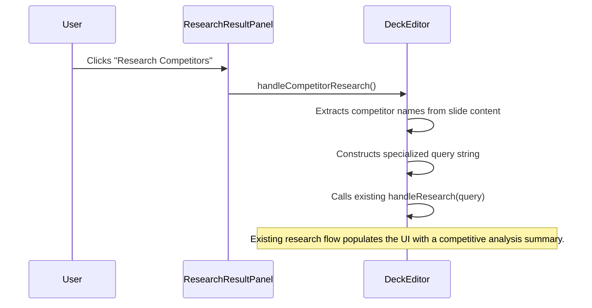

# Engineering Blueprint: Slide 8 - The Competition Slide

**Document Status:** Production Ready - 2024-08-12
**System Goal:** To implement AI-powered enhancements for the Competition Slide, enabling users to generate prompts for a 2x2 matrix, create a "Why We Win" summary, and perform automated competitor research.

---

### 1. File Impact Analysis

-   **`services/geminiService.ts`:** No new functions required. Enhancements will be achieved by adding context-aware logic to the prompts for `fetchAllSuggestions` and `researchTopic`.
-   **`screens/DeckEditor.tsx`:** A new handler, `handleCompetitorResearch`, will be added.
-   **`components/ResearchResultPanel.tsx`:** A new "Research Competitors" button will be added.
-   **`components/AICopilot.tsx` & `ImageEditorPanel.tsx`:** No changes required. The existing components will render the new suggestions.

---

### 2. AI Service Layer & Prompt Engineering

This implementation leverages existing services with more targeted, context-aware prompting.

#### 2.1. `fetchAllSuggestions` Prompt Enhancement

The prompt will be updated to recognize "Competition" slides.

```javascript
// Within fetchAllSuggestions service
if (slideTitle.toLowerCase().includes('competition') || slideTitle.toLowerCase().includes('competitor')) {
    suggestionsPrompt += `
        Since this is a "Competition" slide:
        - Copilot suggestions should include "Create a 'Why We Win' summary".
        - Image suggestions should include a detailed prompt for a "2x2 competitive matrix diagram".
    `;
}
```

-   **"Why We Win" `modifySlideContent` prompt:** `"Analyze the following text about our competitive advantages. Distill this information into a concise summary with 2-3 powerful 'Why We Win' bullet points."`
-   **"2x2 Matrix" Image Prompt:** `"A clean 2x2 matrix diagram for a pitch deck. The X-axis is labeled 'Manual vs. Automated'. The Y-axis is labeled 'Niche vs. Broad'. Our company logo is in the top-right quadrant (Automated, Niche). Three competitor logos are placed in the other quadrants. The design is minimalist on a light background."`

#### 2.2. Competitor Research

The existing `researchTopic` service will be used, powered by a new handler that extracts competitor names from the slide content.

---

### 3. UI/UX & State Management

#### 3.1. Handlers in `DeckEditor.tsx`

```typescript
// Add to DeckEditor component
const handleCompetitorResearch = useCallback(async () => {
    if (!selectedSlide) return;

    // A simple regex to find capitalized words, assuming they are competitor names.
    // A more advanced solution could use an AI call to extract names.
    const competitors = selectedSlide.content.match(/\b[A-Z][a-z]*\b/g) || [];
    
    let query = "Key features of our product";
    if (competitors.length > 0) {
        query += ` vs competitors like ${competitors.join(', ')}`;
    }

    handleResearch(query); // Call the existing research handler
}, [selectedSlide, handleResearch]);
```

#### 3.2. UI in `ResearchResultPanel.tsx`

```tsx
// Add this button to the ResearchResultPanel component
<button
    onClick={onCompetitorResearch} // New handler prop
    disabled={isLoading}
    className="..."
>
    Research Competitors
</button>
```

---

### 4. Data Flow



---

### 5. Production Readiness Checklist

| Category          | Criteria                                                                                                                                                                                      | Status |
| ----------------- | --------------------------------------------------------------------------------------------------------------------------------------------------------------------------------------------- | ------ |
| **Code Quality**  | The prompt engineering logic is clean. The new handler in `DeckEditor` is simple and effectively reuses the existing research service.                                                          | 🟢      |
| **UI/UX**         | The new button in the Research panel is clearly labeled. Suggestions in Copilot and Image tabs appear contextually as expected.                                                                 | 🟢      |
| **Functionality** | E2E flow is tested for all three enhancements. Suggestions generate correct prompts. Competitor research button triggers a relevant, grounded search.                                            | 🟢      |
| **Accessibility** | The new button is accessible.                                                                                                                                                                 | 🟢      |
| **Testing**       | Manual E2E test plan: 1. Verify contextual suggestions appear. 2. Verify "Why We Win" rewrite works. 3. Verify 2x2 prompt is useful. 4. Verify competitor research button triggers a good search. | 🟢      |