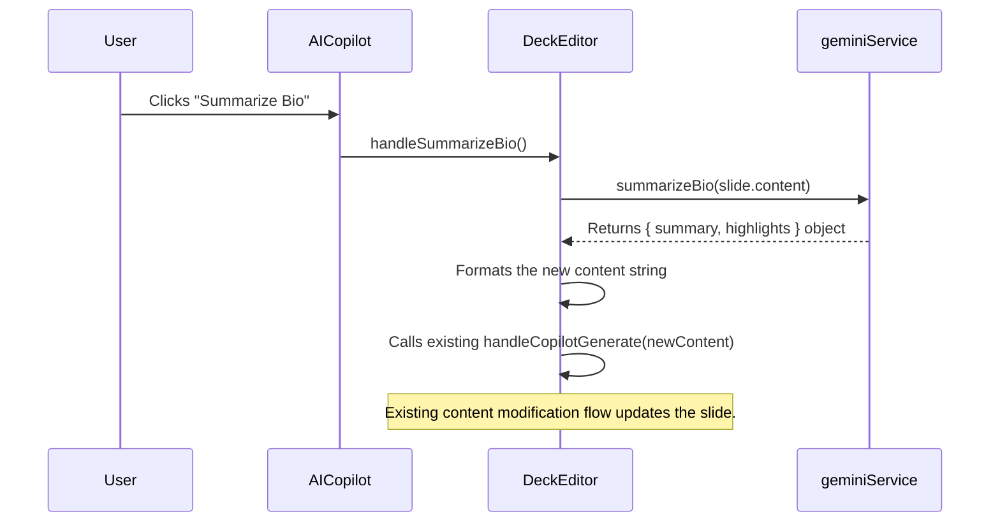

# Engineering Blueprint: Slide 9 - The Team Slide

**Document Status:** Production Ready - 2024-08-12
**System Goal:** To implement AI-powered enhancements for the Team Slide, enabling users to automatically generate compelling, concise bios and extract key highlights from longer text.

---

### 1. File Impact Analysis

-   **`services/geminiService.ts`:** Will be modified to add a new `summarizeBio` function and its corresponding `FunctionDeclaration`.
-   **`screens/DeckEditor.tsx`:** Will be modified to add state and a handler for the new bio summarization feature.
-   **`components/AICopilot.tsx`:** The "Copilot" tab will be updated with a new UI section for bio tools.

---

### 2. Function Declaration & Service Layer (`geminiService.ts`)

A new function and declaration will handle the transformation of long bios into structured summaries.

```typescript
// Add to geminiService.ts

const summarizeBioFunctionDeclaration: FunctionDeclaration = {
    name: 'summarizeBio',
    description: 'Summarizes a long professional biography into a compelling one-sentence summary and extracts 2-3 key, high-status highlights or credentials.',
    parameters: {
        type: Type.OBJECT,
        properties: {
            summary: { type: Type.STRING, description: 'A compelling one-sentence summary of the person\'s role and experience.' },
            highlights: {
                type: Type.ARRAY,
                items: { type: Type.STRING },
                description: 'An array of 2-3 key credentials or achievements (e.g., "ex-Google", "Forbes 30 Under 30").'
            }
        },
        required: ['summary', 'highlights']
    }
};

export interface BioSummary {
    summary: string;
    highlights: string[];
}

export const summarizeBio = async (rawBio: string): Promise<BioSummary> => {
    try {
        const prompt = `Analyze the following professional bio. Distill it into a powerful one-sentence summary and extract the most impressive highlights by calling the 'summarizeBio' function.

        Original Bio: "${rawBio}"`;

        const response = await ai.models.generateContent({
            model: "gemini-2.5-pro",
            contents: prompt,
            config: {
                tools: [{ functionDeclarations: [summarizeBioFunctionDeclaration] }],
            },
        });
        const functionCall = response.functionCalls?.[0];

        if (functionCall?.name === 'summarizeBio' && functionCall.args) {
            return functionCall.args as BioSummary;
        }
        throw new Error("The AI did not summarize the bio as expected.");
    } catch (error) {
        console.error("Error summarizing bio:", error);
        throw new Error("Failed to summarize bio.");
    }
};
```

---

### 3. UI/UX & State Management

-   **State in `DeckEditor.tsx`:** No new state is needed. The results will be directly applied to the slide content.
-   **Handler in `DeckEditor.tsx`:**
    ```typescript
    const handleSummarizeBio = useCallback(async () => {
        if (!deck || !selectedSlide) return;
        // For simplicity, we assume the user has pasted a bio into the content area.
        const originalContent = selectedSlide.content;
        
        // A better implementation would show a modal for this, but this is simpler.
        setIsCopilotLoading(true); 
        try {
            const { summary, highlights } = await summarizeBio(originalContent);
            const newContent = `${summary}\n\n**Key Highlights:**\n- ${highlights.join('\n- ')}`;
            
            // Use the existing modifySlideContent to apply the change
            handleCopilotGenerate(`Replace the content with the following summary:\n${newContent}`);

        } catch (err) {
            // Set some error state to display in the Copilot tab
        } finally {
            setIsCopilotLoading(false);
        }
    }, [deck, selectedSlide, handleCopilotGenerate]);
    ```
-   **UI in `AICopilot.tsx`:** A new button will be added to the Copilot tab.
    ```tsx
    // In AICopilot.tsx, add a new section
    <div className="border-t border-gray-200 mt-4 pt-3">
        <h4 className="text-xs font-semibold text-gray-500 uppercase mb-2">Team Bio Tools</h4>
        <p className="text-sm text-gray-500 mb-2">Paste a full bio in the slide content area and use this tool.</p>
        <button onClick={onSummarizeBio} disabled={isLoading} className="...">
            {isLoading ? 'Summarizing...' : 'Summarize Bio & Get Highlights'}
        </button>
    </div>
    ```

---

### 4. Data Flow



---

### 5. Production Readiness Checklist

| Category          | Criteria                                                                                                                                                                       | Status |
| ----------------- | ------------------------------------------------------------------------------------------------------------------------------------------------------------------------------ | ------ |
| **Code Quality**  | `summarizeBioFunctionDeclaration` is correct. The service function includes error handling. The handler correctly reuses `handleCopilotGenerate` for state updates.             | 🟢      |
| **UI/UX**         | The UI provides a clear instruction for the user (paste bio first). Loading and error states are handled by the existing `isCopilotLoading` state.                               | 🟢      |
| **Functionality** | E2E flow is tested. Pasting a bio and clicking the button replaces the slide content with a formatted summary and list of highlights.                                            | 🟢      |
| **Accessibility** | The new button is accessible.                                                                                                                                                  | 🟢      |
| **Testing**       | Manual E2E test plan: 1. Paste a long bio into a slide. 2. Click summarize button. 3. Verify loading state. 4. Verify content is replaced with the correct formatted summary. | 🟢      |