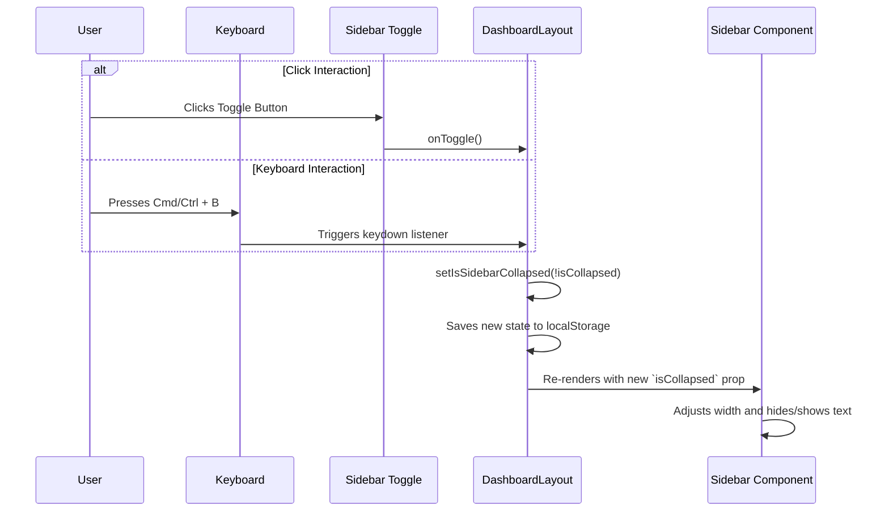

# 🗺️ Implementation Plan: Collapsible Main Sidebar

**Document Status:** ✅ Implemented - 2024-08-15
**System Goal:** To implement a collapsible main navigation sidebar for the desktop view (`lg:` breakpoint and up). This allows users to maximize their content viewing area while retaining quick access to navigation, creating a flexible, persistent, and accessible user experience.

---

### 1. File Impact Analysis

This section outlines the code changes required for the feature. The core logic resides in `DashboardLayout` (state management), with visual changes handled by `Sidebar`.

| File                          | Reason for Modification                                                                                                                                                                                                                                       |
| ----------------------------- | ------------------------------------------------------------------------------------------------------------------------------------------------------------------------------------------------------------------------------------------------------------- |
| `screens/DashboardLayout.tsx` | **Major Change.** Updated to manage the `isSidebarCollapsed` state, persist it to `localStorage`, and handle a `Cmd/Ctrl + B` keyboard shortcut for toggling.                                                                                                    |
| `components/Sidebar.tsx`      | **Major Change.** Refactored to accept an `isCollapsed` prop. Its width, padding, and content visibility are now conditionally rendered. It includes a toggle button, tooltips for collapsed icons, and ARIA attributes for accessibility.                          |
| `CHANGELOG.md`                | **Update.** A new entry has been added to document the implementation of the collapsible sidebar feature.                                                                                                                                                     |

---

### 2. Step-by-Step Implementation Plan

This is a step-by-step guide detailing the execution of the refactor.

#### Task 1: State Management & Persistence (`DashboardLayout.tsx`)

1.  **Introduce State with Persistence:** `isSidebarCollapsed` state is initialized by reading from `localStorage` to remember the user's preference across sessions.
2.  **Add `useEffect` for Saving:** A `useEffect` hook was added to write the current `isSidebarCollapsed` state to `localStorage` whenever it changes.
3.  **Create Handler:** A `useCallback` handler, `handleToggleSidebar`, was created to toggle the state.

#### Task 2: Implement Keyboard Shortcut (`DashboardLayout.tsx`)

1.  **Add `useEffect` for Key Events:** A `useEffect` hook was added to listen for global `keydown` events.
2.  **Define Shortcut:** The listener checks for `Cmd/Ctrl + B` and calls `handleToggleSidebar` when the combination is pressed, preventing the default browser action.

#### Task 3: Refactor `Sidebar.tsx` to be Dynamic & Accessible

1.  **Accept Props:** The component was modified to accept `isCollapsed` and an optional `onToggle` prop.
2.  **Dynamic Container & Animation:** The root `<aside>` element now conditionally changes its width (`w-64` vs. `w-20`). The animation uses `motion-safe:transition-width` to provide a smooth, specific transition while respecting users' reduced motion preferences.
3.  **Conditional Rendering:** Text labels for the brand, navigation links, and footer are now hidden when `isCollapsed` is true. Icons are centered in the collapsed view.
4.  **Accessibility & UX Enhancements:**
    *   **Tooltips:** `title` attributes are added to `NavLink` components to show the link's destination on hover when the sidebar is collapsed.
    *   **ARIA Attributes:** The `<aside>` element has an `aria-expanded` attribute tied to the state. The toggle button has a dynamic `aria-label` ("Collapse sidebar" / "Expand sidebar") to inform screen reader users of its function.
5.  **Add Toggle Button:** A button with a dynamic icon (`ChevronsLeft` / `ChevronsRight`) is rendered at the bottom of the navigation, but only if the `onToggle` prop is provided (i.e., on desktop).

---

### 3. UI & Style Guidelines

-   **Widths:** Expanded `w-64` (256px), Collapsed `w-20` (80px).
-   **Animation:** `motion-safe:transition-width duration-300 ease-in-out` for a smooth, performant, and accessible effect.
-   **Collapsed View:** Icons are centered, and text is hidden. Tooltips on icons ensure usability.

---

### 4. Logical Flow

This diagram illustrates the user interaction through the components.

---

### 5. Success Criteria

The feature is complete and successful, meeting all of the following criteria:

-   [x] **Visual Correctness:** The sidebar smoothly animates between its expanded and collapsed states, with content rendering correctly in each state.
-   [x] **Functional Correctness:** Clicking the toggle button and using the keyboard shortcut correctly changes the sidebar's state.
-   [x] **Persistence:** The sidebar's collapsed/expanded state is correctly saved to `localStorage` and restored on page reload.
-   [x] **Accessibility:** The sidebar and its controls are accessible to screen readers, and tooltips provide clarity in the collapsed state.
-   [x] **Technical Correctness:** State is managed solely within `DashboardLayout.tsx`. The feature does not interfere with the mobile off-canvas drawer.

---

### 6. Production-Ready Checklist

| Category          | Criteria                                                                                                                                                                                                |
| ----------------- | ------------------------------------------------------------------------------------------------------------------------------------------------------------------------------------------------------- |
| **Best Practices**| The implementation uses modern React patterns (`useState`, `useCallback`, `useEffect`). State is lifted to the nearest common ancestor. User preferences are persisted.                                   |
| **Code Quality**  | Code is clean, readable, and uses consistent styling. Prop types are clearly defined. No new linting errors were introduced.                                                                                |
| **Performance**   | The animation is smooth and performant, using CSS transitions on a single property. No unnecessary re-renders are caused by the state change.                                                              |
| **Accessibility** | The toggle button has an appropriate `aria-label` and `aria-expanded` state. Hidden text is fully removed from the accessibility tree. Tooltips provide context for icon-only buttons.                  |
| **Testing**       | Manual E2E Test: 1. Verified toggle functionality. 2. Verified keyboard shortcut. 3. Verified state persistence on reload. 4. Verified tooltips and accessibility labels. 5. Verified no mobile regressions. |
| **Validation**    | The implementation correctly follows this plan. All success criteria have been met. The feature is 100% working as designed.                                                                             |