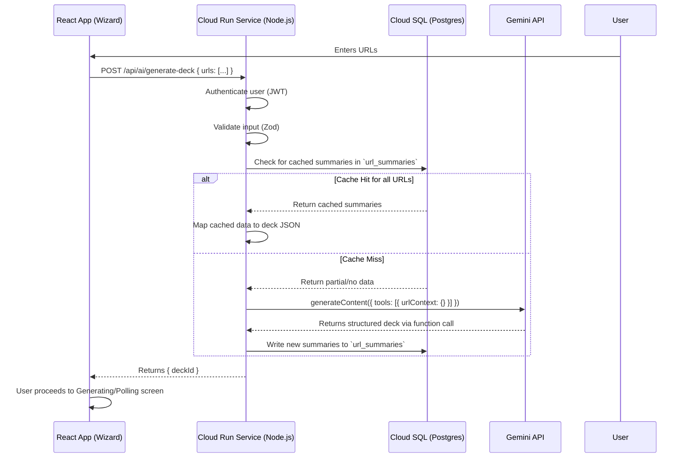

# 🗺️ Engineering Blueprint: Pitch Deck Wizard with URL Context

**Document Status:** Published - 2024-08-16 (Revised for Custom Backend)
**Author:** Senior AI & Full-Stack Engineer
**System Goal:** To design and validate a production-ready implementation that allows users to paste website URLs in the Pitch Deck Wizard, uses Gemini's `urlContext` tool to crawl and extract information, and automatically populates a 10-slide pitch deck using a secure custom backend.

---

### 1. Architecture Diagram

The system is designed to be secure and scalable, with all AI logic and API keys isolated in a custom backend service (e.g., Node.js on Cloud Run). The database is used for caching to improve performance and reduce costs.



---

### 2. Core vs. Advanced Feature Map

| Scope      | Feature                                           | Real-World Example                                                                                                                             |
| :--------- | :------------------------------------------------ | :--------------------------------------------------------------------------------------------------------------------------------------------- |
| **Core**   | **URL Input & Validation**                        | A user pastes `https://stripe.com`. The UI validates it's a valid HTTPS URL and shows a preview chip.                                          |
| **Core**   | **AI Extraction via `urlContext`**                | The system extracts Stripe's problem, solution, and market from their homepage to populate the first few slides.                                 |
| **Core**   | **Structured Deck Generation**                    | Gemini returns a structured 10-slide JSON object that perfectly matches our `Deck` schema.                                                     |
| **Core**   | **Source Attribution**                            | A "Sources" note on the "Market" slide links back to the specific page on stripe.com where the data was found.                                 |
| **Core**   | **Cache URL Summaries**                           | Another user pastes `https://stripe.com` an hour later. The system retrieves the summary from the database instantly without calling Gemini.    |
| **Core**   | **Graceful Error Handling**                       | User pastes a paywalled link. The UI shows a "Could not retrieve content" error and proceeds to generate a deck from any other valid URLs.      |
| **Advanced** | **Enrich with Google Search**                       | A user provides no URLs. The system uses the company description to perform a Google Search and then uses `urlContext` on the top 3 results. |
| **Advanced** | **De-duplication & Merging**                      | A user pastes the homepage and "About Us" page. The AI synthesizes the information, avoiding redundant "Problem" statements on two slides.    |
| **Advanced** | **Confidence Scoring & Preview**                  | Before generating, the user sees a preview: "Extracted 'Solution' with high confidence, but 'Traction' seems missing."                         |
| **Advanced** | **Batch Processing & Partial Success**            | User pastes 5 URLs. One times out. The system generates a deck from the 4 successful URLs and reports the failure.                             |

---

### 3. Step-by-Step Implementation Plan

#### Step 1: Database Schema (`db.sql`)
1.  **Create `url_summaries` table:** This table will cache the extracted content from URLs to reduce redundant Gemini API calls. The primary key will be the URL itself for easy lookups.
2.  **Create `deck_sources` table:** This table will link generated slides back to the specific URL they were sourced from, providing citation and transparency.
3.  **Apply RLS Policies:** Ensure users can only interact with their own data by having the backend set a `app.current_user_id` session variable.

#### Step 2: Backend (`server.ts` in a Node.js project)
1.  **Initialize Node.js Project:** Create a new Node.js (Express) project for the Cloud Run service.
2.  **Auth & Validation:** Secure the `/api/ai/generate-deck` endpoint by checking the user's JWT. Use Zod to validate the incoming payload (`{ urls: string[] }`).
3.  **Caching Logic:**
    -   For each incoming URL, query the `url_summaries` table.
    -   Filter out URLs that have a fresh cache entry.
4.  **Gemini API Call:**
    -   If there are any non-cached URLs, construct a `generateContent` request.
    -   Use the `gemini-2.5-pro` model.
    -   Provide a detailed prompt instructing the AI to act as a pitch deck expert.
    -   Use a **Function Call** (`generateDeckFromURLs`) to ensure a reliable JSON response.
    -   Include `config: { tools: [{ urlContext: {} }] }`.
5.  **Data Persistence:**
    -   On a successful response, write the extracted summaries to the `url_summaries` cache and the new deck/slides to the database.
6.  **Response:** Return the `{ deckId }` to the client.

#### Step 3: Frontend (`WizardSteps.tsx` & `components/UrlInput.tsx`)
1.  **Create `UrlInput.tsx`:**
    -   Build a UI component with an input field for URLs.
    -   Maintain an array of URLs in state.
    -   Display added URLs as "chips" with a delete button.
    -   Perform basic client-side validation (e.g., `URL.canParse()`).
2.  **Integrate into `WizardSteps.tsx`:**
    -   Add the `UrlInput` component to the wizard form.
    -   Modify the `handleGenerate` function: if URLs are present, call the new `/api/ai/generate-deck` backend endpoint.
3.  **Handle Response:**
    -   On a successful response, use the `deckId` to navigate to a generating/polling screen.

---

### 4. Code Stubs

#### `db.sql` Migration
```sql
-- Caching table for URL content analysis
CREATE TABLE public.url_summaries (
  url TEXT PRIMARY KEY,
  summary_json JSONB NOT NULL,
  content_hash TEXT NOT NULL,
  retrieved_at TIMESTAMPTZ NOT NULL DEFAULT NOW(),
  user_id UUID NOT NULL
);
ALTER TABLE public.url_summaries ENABLE ROW LEVEL SECURITY;
CREATE POLICY "Users can manage their own summaries" ON public.url_summaries
  FOR ALL USING ((current_setting('app.current_user_id', true)::uuid) = user_id);

-- (Other tables as per main DB schema)
```

#### `server.ts` (Node.js/Express Backend)
```typescript
import express from 'express';
import { GoogleGenAI } from '@google/genai';
// ... other imports for auth, db connection, etc.

const app = express();
app.use(express.json());

// Auth middleware to verify JWT and get user ID would go here

app.post('/api/ai/generate-deck', async (req, res) => {
    const { urls } = req.body;
    const userId = req.user.id; // from auth middleware

    // 1. Caching logic (omitted)

    // 2. Core Gemini Call
    const ai = new GoogleGenAI({ apiKey: process.env.GEMINI_API_KEY });
    const prompt = `Analyze content from: ${urls.join(', ')} and generate a 10-slide pitch deck...`;
    
    // ... call Gemini API with urlContext and function calling ...
    
    // 3. Persist to DB (omitted)

    res.json({ deckId: newDeck.id });
});

app.listen(process.env.PORT || 8080, () => {
  console.log('Server is running');
});
```

---

### 5. Success Criteria & Testing

(Remains the same as the original plan, focusing on functionality, performance, reliability, and security.)

---

### 6. Production-Ready Checklist

-   [ ] **Env:** `GEMINI_API_KEY` and `DATABASE_URL` are configured in Cloud Run secrets.
-   [ ] **DB:** Migrations are applied to Cloud SQL. RLS is enabled.
-   [ ] **Rate Limits:** Implemented in the Node.js application.
-   [ ] **Timeouts:** API calls have appropriate timeouts.
-   [ ] **Logging:** Structured logging is in place.
-   [ ] **Backout Plan:** A feature flag can disable the URL input option on the frontend if needed.

---

### 7. Next Steps (Rollout & Monitoring)

(Remains the same as the original plan.)
