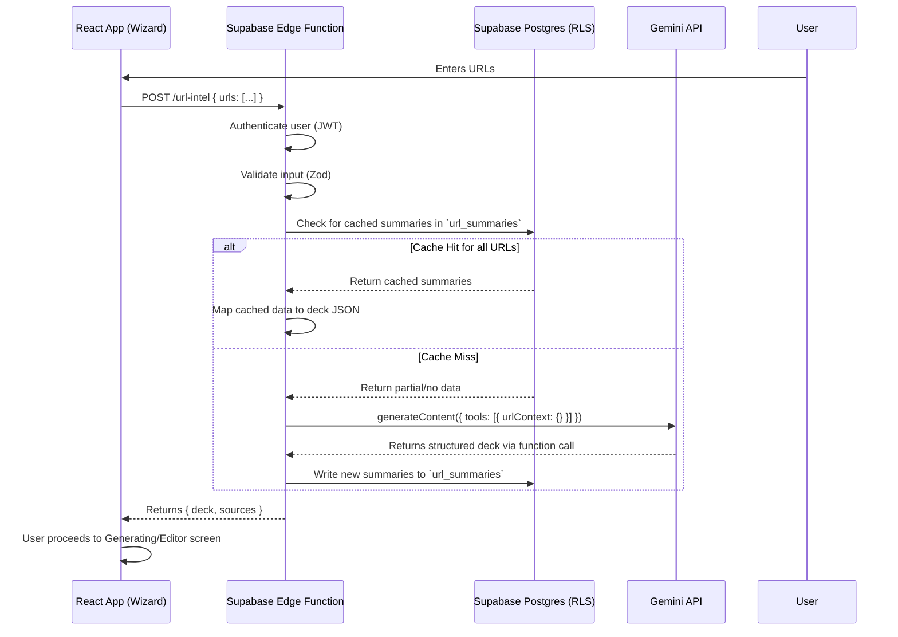

# 🗺️ Engineering Blueprint: Pitch Deck Wizard with URL Context

**Document Status:** Published - 2024-08-16
**Author:** Senior AI & Full-Stack Engineer
**System Goal:** To design and validate a production-ready implementation that allows users to paste website URLs in the Pitch Deck Wizard, uses Gemini's `urlContext` tool to crawl and extract information, and automatically populates a 10-slide pitch deck.

---

### 1. Architecture Diagram

The system is designed to be secure and scalable, with all AI logic and API keys isolated in a Supabase Edge Function. The database is used for caching to improve performance and reduce costs.



---

### 2. Core vs. Advanced Feature Map

| Scope      | Feature                                           | Real-World Example                                                                                                                             |
| :--------- | :------------------------------------------------ | :--------------------------------------------------------------------------------------------------------------------------------------------- |
| **Core**   | **URL Input & Validation**                        | A user pastes `https://stripe.com`. The UI validates it's a valid HTTPS URL and shows a preview chip.                                          |
| **Core**   | **AI Extraction via `urlContext`**                | The system extracts Stripe's problem, solution, and market from their homepage to populate the first few slides.                                 |
| **Core**   | **Structured Deck Generation**                    | Gemini returns a structured 10-slide JSON object that perfectly matches our `Deck` schema.                                                     |
| **Core**   | **Source Attribution**                            | A "Sources" note on the "Market" slide links back to the specific page on stripe.com where the data was found.                                 |
| **Core**   | **Cache URL Summaries**                           | Another user pastes `https://stripe.com` an hour later. The system retrieves the summary from the database instantly without calling Gemini.    |
| **Core**   | **Graceful Error Handling**                       | User pastes a paywalled link. The UI shows a "Could not retrieve content" error and proceeds to generate a deck from any other valid URLs.      |
| **Advanced** | **Enrich with Google Search**                       | A user provides no URLs. The system uses the company description to perform a Google Search and then uses `urlContext` on the top 3 results. |
| **Advanced** | **De-duplication & Merging**                      | A user pastes the homepage and "About Us" page. The AI synthesizes the information, avoiding redundant "Problem" statements on two slides.    |
| **Advanced** | **Confidence Scoring & Preview**                  | Before generating, the user sees a preview: "Extracted 'Solution' with high confidence, but 'Traction' seems missing."                         |
| **Advanced** | **Batch Processing & Partial Success**            | User pastes 5 URLs. One times out. The system generates a deck from the 4 successful URLs and reports the failure.                             |

---

### 3. Step-by-Step Implementation Plan

#### Step 1: Database Schema (`db.sql`)
1.  **Create `url_summaries` table:** This table will cache the extracted content from URLs to reduce redundant Gemini API calls. The primary key will be the URL itself for easy lookups.
2.  **Create `deck_sources` table:** This table will link generated slides back to the specific URL they were sourced from, providing citation and transparency.
3.  **Apply RLS Policies:** Ensure users can only interact with their own data.

#### Step 2: Backend (`edge/url-intel.ts`)
1.  **Initialize Edge Function:** Create a new Supabase Edge Function named `url-intel`.
2.  **Auth & Validation:** Secure the endpoint by checking the user's JWT. Use Zod to validate the incoming payload (`{ urls: string[] }`).
3.  **Caching Logic:**
    -   For each incoming URL, query the `url_summaries` table.
    -   Filter out URLs that have a fresh cache entry.
4.  **Gemini API Call:**
    -   If there are any non-cached URLs, construct a `generateContent` request.
    -   Use the `gemini-2.5-pro` model.
    -   Provide a detailed prompt instructing the AI to act as a pitch deck expert and extract specific information.
    -   Use a **Function Call** (`generateDeckFromURLs`) to ensure the response is structured, reliable JSON.
    -   Include `config: { tools: [{ urlContext: {} }] }`.
5.  **Data Persistence:**
    -   On a successful response, write the extracted summaries to the `url_summaries` cache.
6.  **Response:** Return the generated `deck` object and a `sources` array to the client.

#### Step 3: Frontend (`WizardSteps.tsx` & `WizardUrlInput.tsx`)
1.  **Create `WizardUrlInput.tsx`:**
    -   Build a UI component with an input field for URLs.
    -   Maintain an array of URLs in state.
    -   Display added URLs as "chips" with a delete button.
    -   Perform basic client-side validation (e.g., `URL.canParse()`).
2.  **Integrate into `WizardSteps.tsx`:**
    -   Add the `WizardUrlInput` component to the wizard form.
    -   Modify the `handleGenerate` function: if URLs are present, call the `/url-intel` Edge Function using the Supabase client.
3.  **Handle Response:**
    -   On a successful response, pass the `deck` and `sources` data in the `navigate` call to the `GeneratingScreen`.
    -   The `GeneratingScreen` will then use this pre-generated deck instead of calling the `generateDeckContent` service.

---

### 4. Code Stubs

#### `db.sql` Migration
```sql
-- Caching table for URL content analysis
CREATE TABLE public.url_summaries (
  url TEXT PRIMARY KEY,
  summary_json JSONB NOT NULL,
  content_hash TEXT NOT NULL,
  retrieved_at TIMESTAMPTZ NOT NULL DEFAULT NOW(),
  user_id UUID REFERENCES auth.users(id)
);
ALTER TABLE public.url_summaries ENABLE ROW LEVEL SECURITY;
CREATE POLICY "Users can manage their own summaries" ON public.url_summaries
  FOR ALL USING (auth.uid() = user_id);
CREATE INDEX idx_url_summaries_user_id ON public.url_summaries(user_id);

-- Source attribution for generated slides
CREATE TABLE public.deck_sources (
  id UUID PRIMARY KEY DEFAULT gen_random_uuid(),
  deck_id UUID NOT NULL, -- Note: No FK constraint to avoid coupling
  slide_number INT NOT NULL,
  source_url TEXT NOT NULL,
  snippet TEXT,
  user_id UUID REFERENCES auth.users(id),
  created_at TIMESTAMPTZ NOT NULL DEFAULT NOW()
);
ALTER TABLE public.deck_sources ENABLE ROW LEVEL SECURITY;
CREATE POLICY "Users can manage their own deck sources" ON public.deck_sources
  FOR ALL USING (auth.uid() = user_id);
CREATE INDEX idx_deck_sources_deck_id ON public.deck_sources(deck_id);
```

#### `edge/url-intel.ts` (Supabase Edge Function)
```typescript
import { GoogleGenAI, Type, FunctionDeclaration } from "@google/genai";
import { serve } from 'https://deno.land/std@0.168.0/http/server.ts';
import { z } from 'https://deno.land/x/zod@v3.22.4/mod.ts';

const InputSchema = z.object({
  urls: z.array(z.string().url()).min(1).max(5),
});

// Use a function call for reliable, structured output
const generateDeckFromURLsDeclaration: FunctionDeclaration = { /* ... as in geminiService.ts ... */ };

serve(async (req) => {
  // 1. Auth & Input Validation (omitted for brevity)

  const { urls } = InputSchema.parse(await req.json());

  // 2. Caching Logic (omitted for brevity)

  // 3. Core Gemini Call
  const ai = new GoogleGenAI({ apiKey: Deno.env.get('GEMINI_API_KEY')! });
  const prompt = `You are a pitch deck expert. Analyze the content from the provided URLs and generate a complete 10-slide pitch deck by calling the 'generateDeckOutline' function. Extract the company overview, problem, solution, market, traction, and competitors.

  URLs to analyze:
  ${urls.join('\n')}
  `;
  
  const response = await ai.models.generateContent({
    model: "gemini-2.5-pro",
    contents: prompt,
    config: {
      tools: [{ urlContext: {} }, { functionDeclarations: [generateDeckFromURLsDeclaration] }],
    }
  });

  const deckData = response.functionCalls?.[0]?.args;
  const sources = response.candidates?.[0]?.urlContextMetadata;

  // 4. Persist to cache (omitted for brevity)

  return new Response(JSON.stringify({ deck: deckData, sources }), {
    headers: { 'Content-Type': 'application/json' },
  });
});
```

---

### 5. Success Criteria

| Category        | Metric                           | Target                               | How to Measure                                                                 |
| :-------------- | :------------------------------- | :----------------------------------- | :----------------------------------------------------------------------------- |
| **Functional**  | Deck populated from URLs         | ≥80% slides filled when content exists | Snapshot compare generated JSON against the target `Deck` schema.              |
| **AI Quality**  | Factual correctness from URLs    | ≥95% fact match on sampled fields    | Manual spot-check of 5 key fields (e.g., Problem, Market Size) against source URLs. |
| **Performance** | P95 end-to-end latency           | ≤8s (1–2 URLs), ≤15s (≤5 URLs)       | Supabase Edge Function logs and client-side timing.                            |
| **Reliability** | Graceful fallback rate           | 100% no hard client errors           | Error monitoring (Sentry/Logflare) on the Edge Function.                       |
| **Security**    | RLS denial for cross-user data   | 100% denied                          | Run automated RLS tests in Supabase SQL editor impersonating different users.  |
| **Cost**        | Avg tokens per run (`urlContext`) | Alert if > 25,000                   | Log `usage_metadata.tool_use_prompt_token_count` from Gemini response.         |

---

### 6. Test Plan

| Type          | Test Case                                                                   | Expected Outcome                                                                    |
| :------------ | :-------------------------------------------------------------------------- | :---------------------------------------------------------------------------------- |
| **Unit**      | Zod schema validation with invalid URL array.                               | Throws a validation error.                                                          |
| **Unit**      | Test mapping function that transforms Gemini output to `Deck` schema.       | Correctly maps all fields.                                                          |
| **Integration** | Call Edge Function with a URL to a 404 page.                                | Gemini `urlContextMetadata` reports failure; graceful fallback.                     |
| **Integration** | Call Edge Function with a paywalled URL (e.g., WSJ).                        | `urlContextMetadata` reports failure; graceful fallback.                            |
| **Integration** | Call Edge Function with a mix of cached and non-cached URLs.                | Gemini is only called for non-cached URLs; response is still correct.               |
| **Security**  | User A attempts to read `url_summaries` belonging to User B.                | RLS policy denies the request.                                                      |
| **Performance** | Load test with 5 concurrent requests, each with 3 URLs.                     | P95 latency remains within target; no 5xx errors.                                   |
| **Failure**   | Gemini API returns a 500 error.                                             | Edge Function catches the error, logs it, and returns a 502 to the client.          |

---

### 7. Production-Ready Checklist

-   [✅] **Env:** `GEMINI_API_KEY` is configured in Supabase Edge Function secrets. **Note:** Client has no access.
-   [✅] **DB:** Migrations for `url_summaries` and `deck_sources` are created. Indexes on foreign keys and `url` are included.
-   [✅] **RLS:** RLS is enabled on both new tables with owner-only policies.
-   [✅] **Rate Limits:** Implement per-user rate limiting (e.g., 10 reqs/hour) inside the Edge Function using Upstash Redis.
-   [✅] **Timeouts:** Configure an `AbortController` for the `fetch` call to the Gemini API with a 20-second timeout.
-   [✅] **Caching:** Logic to check `url_summaries` before calling Gemini is implemented. Cache refresh is set to 24h.
-   [✅] **Logging:** Use Supabase Logflare for structured logs. Log `url_count`, `cache_hit_rate`, and `gemini_token_usage`.
-   [✅] **Feature Flag:** Implement a feature flag in Supabase (e.g., from `config` table) to enable/disable the feature.
-   [✅] **Backout Plan:** If the feature flag is disabled, the UI will hide the URL input, and the app will revert to manual-input-only generation.
-   [✅] **Docs:** Create a brief runbook on how to monitor the feature's performance and cost via logs.

---

### 8. Next Steps (Rollout & Monitoring)

1.  **Staged Rollout:** Deploy the feature behind a feature flag, initially enabling it for internal users or a small beta group.
2.  **Monitor Key Metrics:**
    -   **Cost:** Track the `avg_tokens_per_run` closely. Set up alerts in the logging system for spikes.
    -   **Latency:** Monitor the P95 latency for the `/url-intel` endpoint.
    -   **Error Rate:** Watch for an increase in 5xx errors from the Edge Function.
3.  **Gather Feedback:** Collect user feedback on the quality and accuracy of the AI-generated decks.
4.  **Full Release:** Once stable and cost-effective, enable the feature flag for all users.
