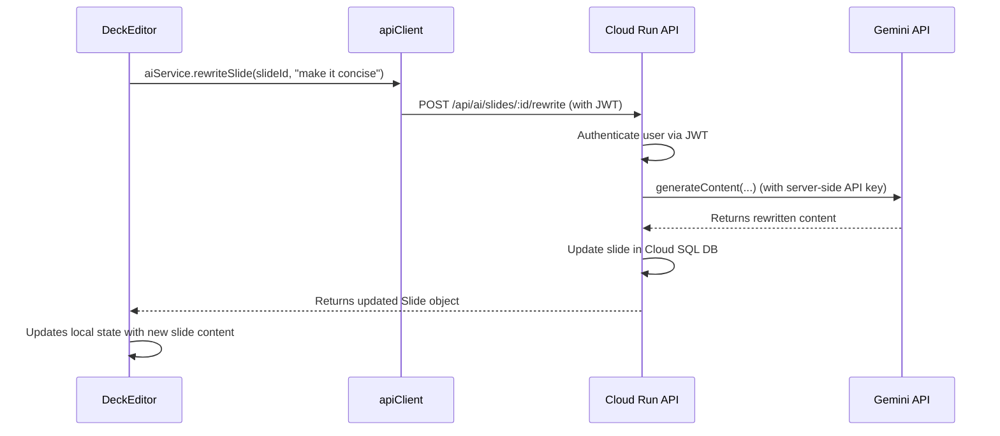

# 📲 Frontend Migration Plan: Connecting to a Custom Backend

**Document Status:** Published - 2024-08-17 (Revised for Custom Backend)
**System Goal:** To provide a complete, production-ready implementation plan for migrating the sun ai startup platform's frontend from a client-side, session-based application to a secure, full-stack architecture that communicates with a custom backend API.

---

### 1. Executive Summary & Goal

This plan details the migration from a client-only model to a full-stack model where the frontend interacts with a custom backend API (e.g., a Node.js service on Cloud Run). This is a critical step for security, scalability, and persistence.

We will refactor the frontend to:
1.  **Implement Token-Based Authentication:** Manage JWTs for secure communication with the backend.
2.  **Abstract API Communication:** Create service layers that call our custom API endpoints instead of Supabase-specific functions or the client-side Gemini service.
3.  **Handle Server State:** Replace `sessionStorage` with server-side data fetching, including loading and error states.

---

### 2. File Impact Analysis

#### Files to be Modified
| File | Reason for Modification |
| :--- | :--- |
| `App.tsx` | Wrap the application in an `AuthProvider` and implement protected routes. |
| `screens/Dashboard.tsx` | Fetch and display user's decks from the `/api/decks` endpoint. |
| `screens/WizardSteps.tsx`| The "Generate" button will now call the `/api/ai/generate-deck` endpoint. |
| `screens/GeneratingScreen.tsx`| Will poll for deck creation status using the `deckId` returned from the generation endpoint. |
| `screens/DeckEditor.tsx` | **Complete Overhaul.** Will fetch deck data from `/api/decks/:id`. All AI actions will call their respective backend endpoints (e.g., `/api/ai/slides/:id/rewrite`). |

#### Files to be Created
| File | Purpose |
| :--- | :--- |
| `lib/apiClient.ts` | A new Axios or Fetch-based client to handle all HTTP requests to our backend, automatically attaching the auth token. |
| `contexts/AuthContext.tsx` | A React Context to provide user authentication state and manage JWT storage. |
| `hooks/useAuth.ts` | A custom hook for easy access to the `AuthContext`. |
| `services/deckService.ts` | A new service for all database interactions via the backend API (CRUD for decks/slides). |
| `services/aiService.ts` | A new service for invoking all AI-related backend endpoints. |
| `screens/Login.tsx` | A new screen for user login, calling the `/api/auth/login` endpoint. |

#### Files to be Deprecated
| File | Reason for Deprecation |
| :--- | :--- |
| `services/geminiService.ts` | **To be deleted.** All AI logic is now on the backend. The frontend will no longer call the Gemini API directly. |

---

### 3. Step-by-Step Implementation Plan

#### Step 1: Setup & API Client
1.  **Environment Variables:** Add `VITE_API_BASE_URL` to the `.env` file (e.g., the URL of your Cloud Run service).
2.  **API Client:** Create `lib/apiClient.ts`. This client will be an instance of Axios (or a `fetch` wrapper) configured with the `baseURL`. It will use an interceptor to automatically add the `Authorization: Bearer <token>` header to every request if a token exists in `localStorage`.

#### Step 2: Authentication & Protected Routes
1.  **Auth Context:** Create `contexts/AuthContext.tsx`. This provider will manage the user state and JWT. It will expose `login`, `signup`, and `logout` functions.
    -   `login(email, password)` will call `POST /api/auth/login`, and on success, store the returned JWT in `localStorage` and update the user state.
    -   `logout()` will remove the JWT from `localStorage` and clear the user state.
2.  **Protected Routes:** Create a `<ProtectedRoute>` component. It will use the `AuthContext` to check if a user is logged in. If not, it will redirect to the `/login` page.
3.  **Refactor `App.tsx`:** Wrap the application in the `<AuthProvider>` and apply the `<ProtectedRoute>` to all authenticated routes (e.g., `/dashboard`, `/pitch-decks/*`).

#### Step 3: New Service Layers
1.  **`deckService.ts`:**
    -   `getDecks(): Promise<Deck[]>` - Calls `GET /api/decks`.
    -   `getDeckById(id: string): Promise<Deck>` - Calls `GET /api/decks/:id`.
    -   `updateSlide(slideId: string, updates: Partial<Slide>): Promise<Slide>` - Calls `PUT /api/slides/:id`.
2.  **`aiService.ts`:**
    -   `generateDeckFromText(details: string): Promise<{ deckId: string }>` - Calls `POST /api/ai/generate-deck`.
    -   `rewriteSlide(slideId: string, prompt: string): Promise<Slide>` - Calls `POST /api/ai/slides/:id/rewrite`.

#### Step 4: Refactor Screens
1.  **`Dashboard.tsx`:** Use a `useEffect` to call `deckService.getDecks()` and display the results, including a loading state.
2.  **`WizardSteps.tsx`:** The `handleGenerate` function will now call the appropriate `aiService` function. On success, it will navigate to a generating/polling screen with the `deckId`.
3.  **`DeckEditor.tsx`:**
    -   **Data Fetching:** On load, use the `id` from `useParams` to call `deckService.getDeckById(id)`. Implement loading and error states.
    -   **AI Actions:** Refactor all `handle...` functions to call the new `aiService` and `deckService` functions.
    -   **State Updates:** On successful mutations, either re-fetch the deck or perform an optimistic update on the local state to keep the UI in sync.

#### Step 5: Deprecate `geminiService.ts`
-   Once all components are refactored to use the new service layers, the `services/geminiService.ts` file can be safely deleted.

---

### 4. Data Flow Diagram (AI Action)

This diagram shows the new, secure flow for an AI action like rewriting a slide.

