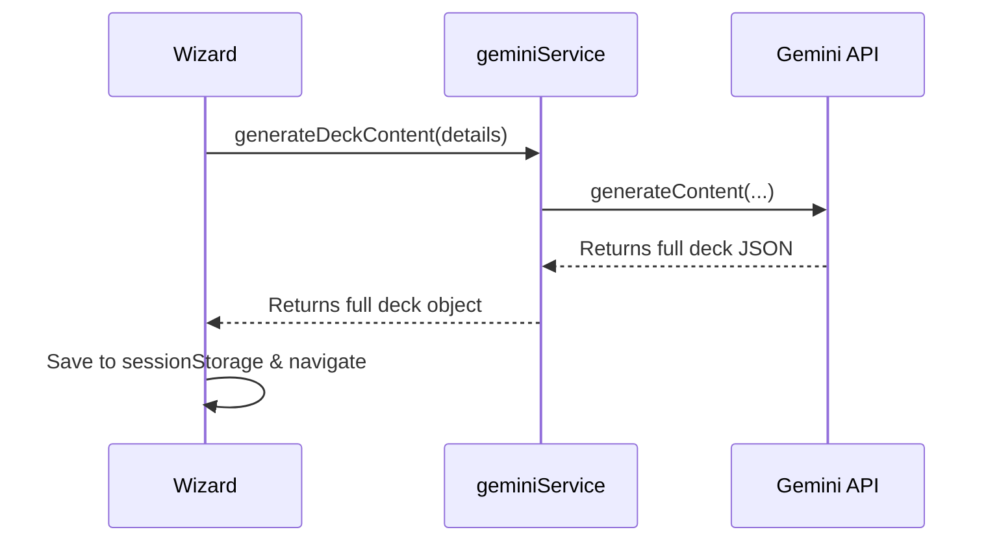
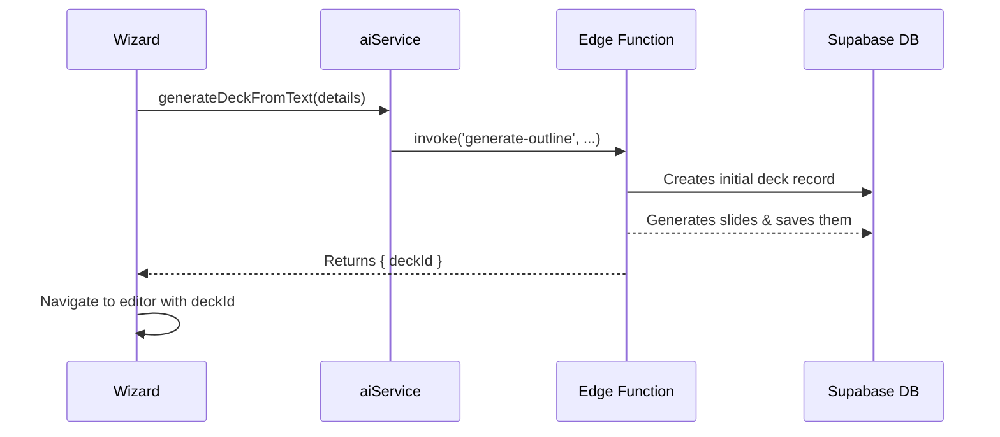

# 📲 Supabase Frontend: Architecture & Implementation Plan

**Document Status:** Published - 2024-08-17
**System Goal:** To provide a complete, production-ready implementation plan for migrating the Sun AI Pitch Deck Engine's frontend from a client-side, session-based application to a secure, full-stack architecture powered by Supabase.

---

### 1. Executive Summary & Goal

The application currently operates in a client-only mode, using `sessionStorage` for persistence and calling the Gemini API directly from a service file. This architecture is not scalable, secure, or suitable for a multi-user production environment.

This plan details the migration to a full-stack model. We will leverage Supabase for:
1.  **Authentication:** Secure user sign-up, login, and session management.
2.  **Database:** Persistent, multi-tenant storage for user-owned decks and slides.
3.  **Edge Functions:** A secure backend layer to house our `GEMINI_API_KEY` and execute all AI-related business logic, replacing the client-side `geminiService.ts`.

---

### 2. File Impact Analysis

This section outlines the required file changes to execute the migration.

#### Files to be Modified
| File | Reason for Modification |
| :--- | :--- |
| `App.tsx` | Wrap the entire application in an `AuthProvider` and implement protected routes. |
| `screens/Dashboard.tsx` | Fetch and display a list of the authenticated user's decks from the database. |
| `screens/WizardSteps.tsx`| The "Generate" button will now call a Supabase Edge Function to create the deck. |
| `screens/GeneratingScreen.tsx`| The logic will be simplified. It will now poll for the creation status of a deck in the database. |
| `screens/DeckEditor.tsx` | **Complete Overhaul.** Will fetch the deck by ID from the database on load. All AI actions will call their respective Edge Functions. Local state will be replaced with data fetched from Supabase. |

#### Files to be Created
| File | Purpose |
| :--- | :--- |
| `lib/supabaseClient.ts` | Initializes and exports a singleton Supabase client instance. |
| `contexts/AuthContext.tsx` | A new React Context to provide authentication state (`user`, `session`) to the entire application. |
| `hooks/useAuth.ts` | A custom hook for easy access to the `AuthContext`. |
| `services/deckService.ts` | A new service layer for all Supabase database interactions (CRUD for decks/slides). |
| `services/aiService.ts` | A new service layer for invoking all AI-related Supabase Edge Functions. |
| `screens/LoginScreen.tsx` | A new screen for user authentication. |

#### Files to be Deprecated
| File | Reason for Deprecation |
| :--- | :--- |
| `services/geminiService.ts` | **To be deleted.** All logic will be moved to secure Supabase Edge Functions. The frontend will no longer have direct access to the Gemini API. |

---

### 3. Step-by-Step Implementation Plan

#### Step 1: Setup & Configuration
1.  **Environment Variables:** Create a `.env` file and add `VITE_SUPABASE_URL` and `VITE_SUPABASE_ANON_KEY`.
2.  **Supabase Client:** Create `lib/supabaseClient.ts` to initialize and export the Supabase client.
3.  **Authentication Provider:** Create `contexts/AuthContext.tsx` to manage user sessions and expose auth state to the application.

#### Step 2: Authentication & Protected Routes
1.  **Wrap Application:** In `App.tsx`, wrap the `<Routes>` component with the new `<AuthProvider>`.
2.  **Create Login Screen:** Build a simple `LoginScreen.tsx` that uses `supabase.auth.signInWithPassword()` or OAuth providers.
3.  **Implement Protected Routes:** Create a `<ProtectedRoute>` component that checks for an active user session. If no session exists, it redirects to `/login`. Apply this to all authenticated routes (`/dashboard`, `/pitch-deck`, etc.).

#### Step 3: New Service Layers
1.  **`deckService.ts`:**
    -   `getDecks(): Promise<Deck[]>` - Fetches all decks for the current user.
    -   `getDeckById(id: string): Promise<Deck>` - Fetches a single deck and its slides.
    -   `updateSlide(slideId: string, updates: Partial<Slide>): Promise<Slide>` - Updates a single slide.
    -   `reorderSlides(deckId: string, slideIds: string[]): Promise<void>` - Calls the `reorder_slides` RPC.
2.  **`aiService.ts`:**
    -   This service will be a thin wrapper around `supabase.functions.invoke()`.
    -   `generateDeckFromText(details: string): Promise<{ deckId: string }>`
    -   `generateDeckFromUrls(urls: string[]): Promise<{ deckId: string }>`
    -   `rewriteSlide(slideId: string, prompt: string): Promise<Slide>`
    -   Each function will handle passing the auth token and parsing the response or error.

#### Step 4: Refactor Screens
1.  **`Dashboard.tsx`:**
    -   Use a `useEffect` hook to call `deckService.getDecks()` on load.
    -   Map over the returned decks to render a dynamic list of links to `dashboard/decks/:id/edit`.
2.  **`WizardSteps.tsx`:**
    -   The `handleGenerate` function will now call `aiService.generateDeckFromText()` or `aiService.generateDeckFromUrls()`.
    -   On success, it will receive a `deckId` and navigate to `pitch-deck/generating` with the `deckId` in the state.
3.  **`GeneratingScreen.tsx`:**
    -   On load, it will receive a `deckId`.
    -   It will enter a polling loop, calling `deckService.getDeckById(deckId)` every 2 seconds.
    -   It will continue polling until the fetched deck contains at least one slide.
    -   Once slides are present, it will navigate to `dashboard/decks/:deckId/edit`.
4.  **`DeckEditor.tsx`:**
    -   **Remove `geminiService` calls:** Delete all direct imports and calls.
    -   **Data Fetching:** On initial load, use the `id` from `useParams` to call `deckService.getDeckById(id)` and populate the `deck` state.
    -   **AI Actions:** All `handle...` functions (e.g., `handleCopilotGenerate`, `handleGenerateImage`) will be refactored to call the new `aiService` functions.
    -   **State Updates:** After a mutation (e.g., rewriting a slide), the component will either re-fetch the entire deck or perform an optimistic update on the local state with the returned data to keep the UI in sync.

#### Step 5: Deprecate `geminiService.ts`
-   Once all screen components have been refactored to use `deckService.ts` and `aiService.ts`, the `services/geminiService.ts` file will be safely deleted from the project.

---

### 4. Data Flow Diagrams (Before vs. After)

#### Before: Client-Side Generation

#### After: Secure Backend Generation

---

### 5. Production Readiness Checklist

| Category | Criteria |
| :--- | :--- |
| **Code Quality** | New services are strongly typed. All Supabase calls use `.select()` or `.rpc()` with typed returns. |
| **UI/UX** | Add loading spinners/skeletons for all data fetching operations (deck list, editor loading). Display user-friendly error messages (e.g., using toasts) for failed API calls. |
| **Error Handling** | Every `aiService` and `deckService` call is wrapped in a `try...catch` block. |
| **Security**| The `anon` key is used on the client. All sensitive operations are delegated to Edge Functions. RLS policies are manually tested by attempting to fetch another user's deck. |
| **Testing** | Manually test the full user lifecycle: Sign Up -> Create Deck -> Edit Deck -> Log Out -> Log In -> Verify Deck Persists. |
| **Regressions**| Confirm that all existing AI features and UI interactions work as expected after the migration. |
