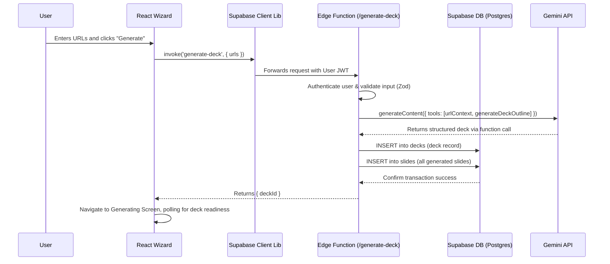

# 🚀 Best Practices Plan: Full-Stack Pitch Deck Wizard

**Document Status:** Published - 2024-08-18
**Author:** Senior Full-Stack Architect
**System Goal:** To provide a detailed, step-by-step Best Practices Plan for building the Pitch Deck Wizard end-to-end, migrating from a client-side prototype to a secure, scalable, and production-ready full-stack feature powered by Supabase and the Gemini API.

---

### 📊 **Progress Tracker: From Scratch Development**

This tracker outlines the complete development lifecycle for the Pitch Deck Wizard, starting from the initial frontend prototype and integrating a full suite of advanced Gemini capabilities.

| Phase | Feature / Task | Status | % Complete | Key Objective |
| :---- | :--- | :--- | :--- | :--- |
| **1. Frontend Scaffolding** | **Wizard UI Scaffolding (`WizardSteps.tsx`)** | 🔴 Not Started | 0% | Build the core UI, including tab switching for different input methods. |
| | **URL Input Component (`UrlInput.tsx`)** | 🔴 Not Started | 0% | Create the reusable component for adding, validating, and removing URLs. |
| | **File Input Component** | 🔴 Not Started | 0% | Create a UI for uploading documents (PDF, DOCX). |
| | **Client-Side State Management** | 🔴 Not Started | 0% | Manage form state and button logic using React hooks. |
| | **Generating Screen UI (`GeneratingScreen.tsx`)** | 🔴 Not Started | 0% | Build the loading screen with informative text for the user. |
| **2. Core AI Engine** | **Backend Edge Function (`/generate-deck`)** | 🔴 Not Started | 0% | Create the secure endpoint for all AI logic, protecting the API key. |
| | **AI Technique: Structured Outputs (Function Calling)** | 🔴 Not Started | 0% | Implement `generateDeckOutline` as a function call for 100% reliable JSON output. |
| | **Input Method: Text Generation** | 🔴 Not Started | 0% | The baseline feature: generate a deck from a user's written business context. |
| | **Input Method: URL Context** | 🔴 Not Started | 0% | Allow the AI to crawl up to 5 public URLs to gather context and generate the deck. |
| | **Input Method: Document Understanding (File Search)** | 🔴 Not Started | 0% | Allow users to upload a business plan (PDF, DOCX) to be used as the primary source. |
| | **Enrichment: Google Search** | 🔴 Not Started | 0% | Use Google Search to augment user-provided context or find relevant URLs if none are given. |
| | **Output: Image Generation Prompts** | 🔴 Not Started | 0% | The AI will generate descriptive prompts for the `imageUrl` field, preparing slides for the Visual Agent. |
| | **Output: Code Execution Snippets** | 🔴 Not Started | 0% | For technical decks, the AI can generate placeholder code snippets for product demo slides. |
| | **Configuration: Gemini Thinking** | 🔴 Not Started | 0% | Utilize `thinkingConfig` for complex analysis of source documents to improve outline quality. |
| **3. Full-Stack Integration** | **Database Schema (`decks`, `slides`)** | 🔴 Not Started | 0% | Define and migrate the core tables in Supabase for persistent storage. |
| | **Row-Level Security (RLS) Policies** | 🔴 Not Started | 0% | Implement security policies to ensure users can only access their own data. |
| | **New Service Layers (`deckService`, `aiService`)** | 🔴 Not Started | 0% | Create frontend services to interact with the Supabase DB and Edge Functions. |
| | **Refactor Wizard (`WizardSteps.tsx`)** | 🔴 Not Started | 0% | Replace any client-side generation with a call to the secure `/generate-deck` Edge Function. |
| | **Refactor Generating Screen (`GeneratingScreen.tsx`)** | 🔴 Not Started | 0% | Implement polling logic to check for deck creation status in the database. |
| **4. Validation & Polish** | **UI/UX Polish & Responsiveness** | 🔴 Not Started | 0% | Ensure the entire wizard flow is mobile-friendly and visually polished. |
| | **End-to-End (E2E) Flow Validation** | 🔴 Not Started | 0% | Perform a full smoke test of the complete full-stack user journey for all input methods. |
| | **Security & RLS Policy Testing** | 🔴 Not Started | 0% | Manually test that users cannot access or modify data from other accounts. |

---

### 1. System Analysis

-   **Current State:** The application is a feature-rich, client-side React app. The wizard exists in `WizardSteps.tsx` and calls a client-side `geminiService.ts`. This is excellent for prototyping but poses two major production risks: **security** (API key exposure) and **scalability** (no persistent user data).
-   **Target State:** A secure full-stack application where the frontend is the presentation layer, and all business logic, data persistence, and AI communication are handled by a Supabase backend. This plan aligns perfectly with the previously defined backend and frontend migration plans (`docs/17-supabase-backend-plan.md` and `docs/39-supabase-frontend-plan.md`).

---

### 2. Architecture Diagram

This sequence diagram illustrates the complete, secure workflow for generating a deck from a URL.

---

### 3. Wizard Stages & Flow

The wizard will be a single, powerful screen with a responsive two-column layout: form on the left, live-updating preview on the right.

| Stage | Purpose & UX | Frontend Components | Backend Interaction | AI & URL Context |
| :---- | :--- | :--- | :--- | :--- |
| **1. Input & Sourcing** | The user chooses their input source: providing business context via text or pasting up to 5 website URLs. | `WizardSteps.tsx`, `UrlInput.tsx` | None. This is a client-side state. | `urlContext` is prepared for the next step. |
| **2. AI Generation** | User clicks "Generate Deck". The app navigates to a loading screen while the backend works. | `GeneratingScreen.tsx` | **`POST /generate-deck` Edge Function.** | **Gemini Pro + `urlContext`.** The Edge Function securely calls Gemini, providing the URLs and asking it to generate a 10-slide outline via a function call. |
| **3. Review & Edit** | The user is navigated to the Deck Editor to review the newly created, AI-populated deck. | `DeckEditor.tsx` | **`GET /decks/:id` from `deckService.ts`.** | The user can now use all other AI agents (Copilot, Image, etc.) on the generated content. |
| **4. Finalize & Share** | The user completes their edits and can present or share the deck. | `DeckEditor.tsx`, `PresentationScreen.tsx` | Future: `POST /share-links` Edge Function. | N/A |

---

### 4. Frontend Plan

-   **Layout:** A responsive two-column layout for the wizard screen (`WizardSteps.tsx`).
    -   **Mobile:** A single-column, stacked layout.
    -   **Desktop:** Form inputs on the left, a live preview area on the right that shows a skeleton of the 10-slide deck to be generated.
-   **State Management:** A React Context (`WizardContext`) will manage the wizard's state (`inputMode`, `companyDetails`, `urls`) to avoid prop drilling.
-   **Transitions & Loading:** All backend calls will trigger loading states (e.g., disabling the "Generate" button, showing spinners). Page transitions will be handled by `react-router-dom`.
-   **Service Layers:**
    -   **`services/aiService.ts`:** Will replace `geminiService.ts`. It will contain wrappers for `supabase.functions.invoke()` for all AI tasks.
    -   **`services/deckService.ts`:** Will handle all direct database interactions (fetching, updating decks/slides).

---

### 5. Backend Plan

-   **Database Schema:** We will use the schema defined in `docs/17-supabase-backend-plan.md`. The key tables are `decks` and `slides`, linked by a foreign key. RLS policies are critical to ensure multi-tenancy.
-   **Edge Functions:**
    -   **/generate-deck:**
        -   **Method:** `POST`
        -   **Auth:** Supabase JWT required.
        -   **Input Validation (Zod):** `{ inputMode: 'text' | 'url', content: string | string[] }`
        -   **Logic:**
            1. Authenticate user.
            2. Validate input.
            3. Call Gemini API with the appropriate prompt and `urlContext` if needed.
            4. On success, start a database transaction:
                - `INSERT` a new record into the `decks` table.
                - `INSERT` all generated slides into the `slides` table, linked to the new deck ID.
            5. Return `{ deckId }`.
        -   **Security:** Rate limiting per user (e.g., 5 decks per hour) via Upstash Redis.
    -   **/save-step (For a multi-step wizard):**
        -   While our wizard is single-step, a future multi-step version would use an idempotent function that accepts `deckId` and `stepData`. It would use `UPSERT` to save progress, preventing duplicate records.

---

### 6. Testing & Validation

| Type | Test Case | Expected Outcome |
| :--- | :--- | :--- |
| **Unit (Frontend)** | `UrlInput.tsx` rejects an invalid URL. | An error message is displayed; the URL is not added to the state. |
| **Unit (Backend)** | Edge function input validation (Zod) with a malformed payload. | Returns a `400 Bad Request` error. |
| **Integration** | Frontend calls `/generate-deck` with valid URLs. | A `deckId` is returned, and the database contains the new deck and slides. |
| **Security** | User A attempts to fetch a deck belonging to User B. | Supabase RLS policy denies the request. |
| **E2E (Smoke Test)** | A new user signs up, navigates to the wizard, generates a deck from a URL, lands in the editor, and sees the populated slides. | The entire flow completes without error. |
| **Failure Test** | The Gemini API returns an error during generation. | The Edge Function catches the error, logs it, and returns a `502 Bad Gateway`. The frontend displays a user-friendly error message. |

---

### 7. Success Criteria & Summary

The wizard implementation will be considered a success when:
-   **Security:** All Gemini API keys are fully removed from the client-side code and are exclusively used within secure Edge Functions.
-   **Persistence:** A user can log in, create a deck, close their browser, log back in, and find their deck saved and accessible from the dashboard.
-   **Reliability:** The generation process is robust, transactional, and provides clear error handling for both API failures and invalid user inputs.
-   **User Experience:** The process feels fast and intuitive, with clear feedback (loading states, previews) at every step.

This plan transforms the wizard from a powerful demo into a production-grade asset, laying the groundwork for a scalable, multi-user SaaS application.
