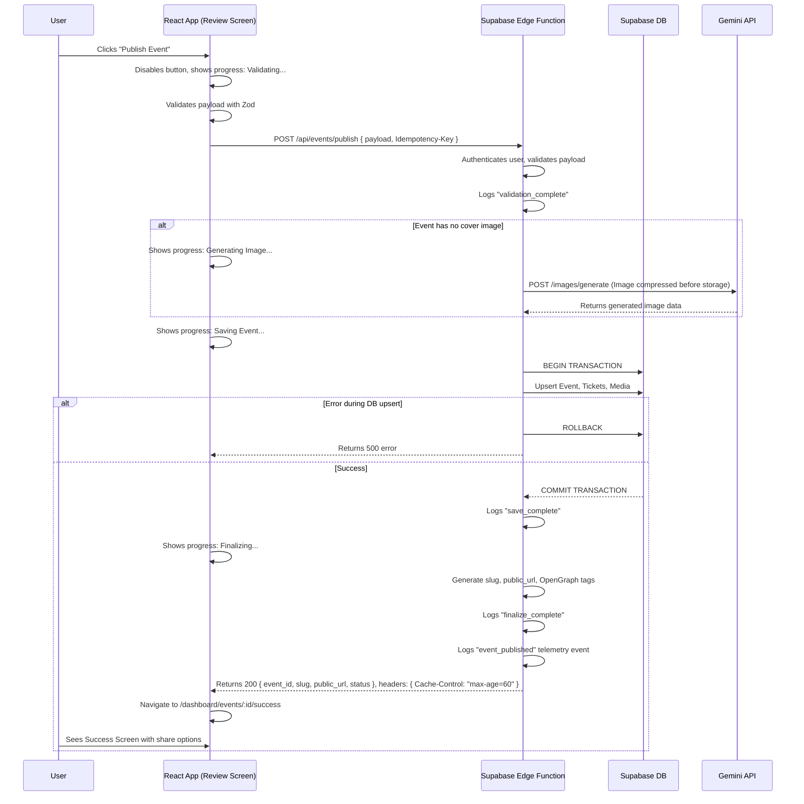

# 🚀 Engineering Blueprint: The "Publish Event" Flow

**Document Status:** Published - 2024-08-18 (Revised)
**Author:** Senior Full-Stack Architect
**System Goal:** To design and validate a complete, production-ready, and user-friendly workflow that executes when a user clicks "Publish Event." This includes data validation, secure persistence, media handling, link generation, and a clear success confirmation.

---

### 1. Executive Summary & Goal

This document outlines the end-to-end logic for the "Publish Event" action, the final step in the event creation wizard. The goal is to create a robust, secure, and reliable process that safely saves the user's event, provides immediate and useful feedback, and incorporates intelligent AI enhancements to improve the event's discoverability and shareability.

The core principle is to treat the publish action as an **atomic, idempotent transaction**. This ensures that a single click results in exactly one event, and if any part of the process fails, the entire operation is rolled back, preventing partial or corrupt data.

---

### 2. Core User & System Flow

This diagram illustrates the sequence of events from the user's click to the final success screen, showing the interaction between the client and a secure backend. The workflow is optimized to perform expensive AI operations *before* opening a database transaction to improve performance and reliability.

---

### 3. Step-by-Step Implementation Plan

#### Step 1: Client-Side Action (`ReviewScreen.tsx`)
1.  **State Management:** On "Publish" click, set a loading state (e.g., `isPublishing: true`) and a progress message state (e.g., "Validating...") to provide granular feedback.
2.  **Validation:** Perform initial client-side validation using a shared Zod schema.
3.  **Idempotency:** Generate a unique `Idempotency-Key` for the request.
4.  **API Call:** Invoke a secure Supabase Edge Function (`/api/events/publish`) with the event payload and idempotency key.
5.  **Navigation:** On a successful response, navigate the user to the success route (`/dashboard/events/:id/success`).

#### Step 2: Backend Endpoint Stubs
-   **`POST /api/events/publish`**
    -   **Behavior:** The primary transactional endpoint. It validates the payload, handles media generation/compression *before* the transaction, upserts the event and tickets atomically, and generates the public URL. Checks for the `Idempotency-Key`.
    -   **Returns:** `{ event_id, slug, public_url, status }` and a `Cache-Control` header.
-   **`POST /images.generate`**
    -   **Behavior:** Called internally if no cover image exists. Uses `gemini-2.5-flash-image` to generate a banner.
-   **`POST /emails.send`**
    -   **Behavior:** A fire-and-forget endpoint with a retry mechanism (e.g., Supabase message queue) to queue a confirmation email for the organizer.

#### Step 3: Success Screen (`/dashboard/events/:id/success`)
-   **Layout:** A clear, card-based summary of the published event.
-   **Content:** Event Title, Date/Time, Location, Ticket summary, Cover Image, and the public URL.
-   **Actions (Buttons):** `Copy Link`, `Share on Social`, `View in Dashboard`, `Create Another Event`.
-   **Meta Tags:** The public event page (`/e/:slug`) should include OpenGraph and Twitter card meta tags for optimized social sharing.

#### Step 4: AI-Powered Enhancements (within `/api/events/publish`)
Before finalizing the event data, the backend will invoke these AI enhancements:
-   **Social Captions, SEO Slug, Image Alt Text, Summaries, Audience Tags.**
-   **AI Auto-Fix Assistant (Future):** Gemini can suggest fixes for validation errors, like "It looks like you forgot to add a date. Would you like to set it for next Friday?"

---

### 4. Best Practices Checklist

| Area | Best Practice | Why It's Important |
| :--- | :--- | :--- |
| **Reliability**| **Idempotency:** Use an `Idempotency-Key` to prevent duplicate events on a flaky network. | Ensures data integrity and a predictable user experience. |
| **Data Integrity**| **Atomic Transactions:** Wrap database saves in a single transaction with `ROLLBACK` on error. | "All-or-nothing." Prevents partial or corrupt data. |
| **UX**| **Granular Feedback:** Show staged progress messages (*Validating → Generating Image → Saving...*). | Keeps the user informed and reduces perceived wait time. |
| **UX**| **Save as Draft:** Allow users to save an incomplete event and return to it later. | Prevents data loss and improves the user journey. |
| **Security**| **Server-Side Secrets:** All API keys must live exclusively in the Edge Function environment. | Prevents exposure of sensitive credentials on the client-side. |
| **Accessibility**| **Full ARIA Support & Keyboard Navigation:** Ensure all inputs, buttons, and images have labels and alt text. | Makes the application usable for everyone. |
| **Performance**| **Image Optimization:** Compress all cover images to WebP *before* uploading to storage. | Drastically reduces page load times for the public event page. |
| **Observability**| **Structured Logging & Analytics:** Log key steps ("validate," "save," "finalize") and success metrics (`event_published`). | Enables proactive monitoring, faster debugging, and business intelligence. |

---

### 5. Success Criteria

| Category | Metric | Target |
| :--- | :--- | :--- |
| **Functional**| API Response | `POST /api/events/publish` returns a `200` with `{ event_id, slug, public_url, status }`. |
| **Reliability**| Duplicate Prevention | Clicking "Publish" twice quickly results in only one event. |
| **Correctness**| Public Page | `/e/:slug` displays the correct event details and has a `Cache-Control` header. |
| **State**| Dashboard Status | The event appears in the dashboard with the correct status (`Published` or `Scheduled`). |
| **Completeness**| Media Handling | Every published event has an optimized cover image. |
| **Performance**| P95 Latency | **≤ 5s** (without image gen), **≤ 10s** (with image gen). |
| **Observability**| Analytics Event | An `event_published` event is recorded in the analytics system on success. |

---

### 6. Production-Ready Checklist

-   [ ] **Validation:** Zod schemas are enforced on client and server.
-   [ ] **Security:** RLS policies are tested to ensure users can only publish to their own account.
-   [ ] **Idempotency & Retries:** The publish endpoint is safe to call multiple times; the email endpoint has a retry queue.
-   [ ] **Rate Limiting:** Implemented and tested on the backend (e.g., 10 publishes/user/hour).
-   [ ] **Logging:** Structured logs with timing are captured for all key steps.
-   [ ] **Accessibility:** All UI elements are keyboard-navigable and have ARIA labels.
-   [ ] **Privacy:** Sensitive data is stripped from error logs.
-   [ ] **Backups:** Daily automated database backups are configured.

---

### 7. Testing Plan

-   **Manual Smoke Test (2 mins):**
    1.  Fill out wizard -> Publish -> Verify success screen and granular progress messages.
    2.  Copy public link -> Verify page loads correctly and has social media meta tags.
    3.  Click "Publish" twice -> Verify only one event was created.
-   **Automated Tests:**
    -   **Unit:** Zod schema validation; slug generation.
    -   **Integration:**
        -   Simulate DB failure -> Verify transaction is rolled back.
        -   Call endpoint twice with same `Idempotency-Key` -> Verify second call returns original `event_id`.
        -   **Test RLS:** User A attempts to publish an event for User B's account -> Verify request is denied.
    -   **E2E (Playwright):**
        -   Run a full flow without a cover image -> Assert an optimized image is present on the public page.
        -   **Test Accessibility:** Run an automated accessibility audit (e.g., `axe`) on the success screen.
        -   **Test Rate Limiting:** Make 11 publish attempts -> Verify the 11th receives a `429` error.