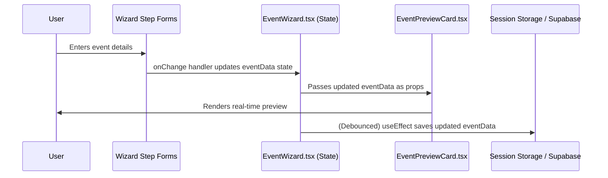

# 🗺️ Engineering Blueprint: Multi-Step Event Creation Wizard

**Document Status:** Published - 2024-08-22 (Revised & Approved)
**Author:** Senior Frontend Architect
**System Goal:** To design and implement a multi-step Event Creation Wizard, providing a clean, guided interface for users to publish community events. The wizard's design, layout, and user experience will be directly inspired by the existing Pitch Deck and Startup Profile wizards to ensure platform consistency.

---

### 1. Executive Summary & Goal

To empower the Sun AI community, users need the ability to create and promote their own events. This plan details the implementation of a five-step wizard that will guide event organizers through the creation process, from basic details to ticketing and final publication.

The core principle is **consistency and robustness**. The wizard will reuse established UI patterns while incorporating production-grade engineering practices like schema validation, robust data handling, and persistent drafts to ensure a reliable and user-friendly experience.

---

### 2. File Impact Analysis

This section outlines the new and modified files required for this feature.

#### Files to be Created
| File | Purpose |
| :--- | :--- |
| `screens/EventWizard.tsx` | The main container for the wizard, managing state, steps, and layout. |
| `components/EventPreviewCard.tsx`| A reusable component that displays a real-time preview of the event as the user fills out the form. |
| `models/event.ts` | **New:** A shared file to define the `Event` type and the Zod schema for validation. |
| `docs/45-event-wizard-plan.md` | This engineering blueprint. |

#### Files to be Modified
| File | Reason for Modification |
| :--- | :--- |
| `App.tsx` | Add the new route `/events/new` to direct users to the wizard. |
| `screens/MyEvents.tsx` | Add a primary "Create Event" button that links to the new `/events/new` route. |
| `CHANGELOG.md` | Document the addition of the new Event Creation Wizard feature. |
| `docs/44-progress-tracker.md` | Update the progress tracker to include this new, major feature. |
| `screens/Sitemap.tsx` | Update the sitemap to include the new `/events/new` route. |
| `docs/sitemap.md` | Update the sitemap documentation. |

---

### 3. Step-by-Step Implementation Plan

#### Step 1: Data Modeling & Schema (`models/event.ts`)
1.  **Define Types:** Create the `EventForm` TypeScript type based on the Zod schema.
2.  **Create Zod Schema:** Define a comprehensive `EventSchema` using Zod.
    -   It will include validations for string lengths, URL formats, and number ranges.
    -   Use a `.refine()` method to ensure `endsAtUTC` is after `startsAtUTC`.
    -   Use a `discriminatedUnion` for the `ticketing` model to handle "Free," "Paid," and "Invite Only" cases with different required fields (e.g., currency and price for paid events).

#### Step 2: Routing & Navigation
1.  **Update `App.tsx`:** Add a new route for the event wizard.
    ```tsx
    // In App.tsx, within the DashboardLayout routes
    <Route path="/events/new" element={<EventWizard />} />
    ```
2.  **Update `MyEvents.tsx`:** Add a "Create New Event" button.

#### Step 3: Build the Wizard Shell (`EventWizard.tsx`)
1.  **State Management:**
    -   Use `useState` for the current `step`.
    -   Use `useState<EventForm>` to hold all form data, initialized with default values.
    -   Use `useState` to hold validation errors formatted by Zod's `.format()` method.
2.  **Persistence:**
    -   Implement a `useEffect` hook with a **debounce** (e.g., 500ms).
    -   On change, save the `eventData` to `sessionStorage` for quick recovery.
    -   Within the debounced effect, also call a Supabase function (`upsertDraft`) to save the draft to the database, ensuring persistence across devices.
3.  **Layout & Step Guards:**
    -   Replicate the two-column layout from `StartupWizard.tsx`.
    -   Implement a `canProceed(step)` function that runs a partial Zod validation on the fields for the current step. The "Next Step" button's `disabled` attribute will be tied to this function's result.
    -   Display inline error messages from the validation state object next to each form field.

#### Step 4: Implement Wizard Steps
-   **Step 1: Overview:** Inputs for `title`, `type`, `description`.
-   **Step 2: Date & Location:** Use native date/time inputs but ensure the state is managed as **UTC ISO strings**.
-   **Step 3: Media:** Implement an upload component that validates file size (`<3MB`) and type (`jpeg`, `png`, `webp`). Show upload progress and error states.
-   **Step 4: Tickets:** Conditionally render fields based on the `ticketing.access` type selected. Prices will be input in dollars but stored in state as **integer cents**.
-   **Step 5: Review & Publish:**
    -   Display a read-only summary of all `eventData`.
    -   The "Publish" button will trigger a full `EventSchema.safeParse(eventData)`.
    -   On success, it will call a server-side function (e.g., Supabase Edge Function) to create the final event, which performs its own backend validation.

#### Step 5: Create the Live Preview (`EventPreviewCard.tsx`)
1.  This component will accept the `eventData` state object as a prop and render a real-time visual representation of the event card.

---

### 4. Data Flow & State Management



---

### 5. UI/UX & Accessibility

-   **Consistency & Responsiveness:** The UI will be visually consistent with existing wizards and fully responsive, stacking to a single column on mobile.
-   **Accessibility:**
    -   All inputs will have semantic `<label>`s.
    -   Error messages will be linked to inputs using `aria-describedby`.
    -   The stepper and all controls will be fully keyboard-navigable with clear focus states.

---

### 6. Success Criteria & Production Readiness

-   [ ] **Schema:** A complete Zod schema is implemented and used for validation.
-   [ ] **Routing & Navigation:** The wizard is accessible from `/my-events`.
-   [ ] **Functionality & Step Guards:** All steps are functional, and navigation is blocked until the current step is valid.
-   [ ] **Data Integrity:** Dates are handled in UTC, and prices are stored as integer cents.
-   [ ] **Persistence:** Drafts are saved to both `sessionStorage` and a remote database.
-   [ ] **Media:** Image uploads are validated for size and type.
-   [ ] **Responsiveness & Accessibility:** The layout is fully responsive and adheres to WCAG 2.1 AA standards.
-   [ ] **Publication:** The "Publish" action validates the full schema and calls a backend service.
-   [ ] **Observability:** Key user actions (step changes, publish success/failure) are tracked with an analytics service like PostHog.