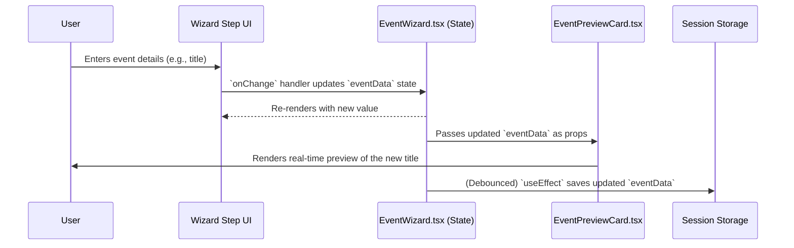

# ✅ Checklist & Validation: Event Wizard User Journey

**Document Status:** Published - 2024-08-23
**Purpose:** To validate the end-to-end user journey for the new Event Creation Wizard, confirm the status of its implementation, and outline the next steps for backend integration.

---

### 1. User Journey Flowchart

This diagram illustrates the high-level path a user takes to create a new event.

```mermaid
graph TD
    A[My Events Page] -->|Clicks "+ Create New Event"| B(Event Wizard);
    subgraph B [Event Wizard]
        B1[Step 1: Overview] --> B2[Step 2: Details];
        B2 --> B3[Step 3: Media];
        B3 --> B4[Step 4: Tickets];
        B4 --> B5[Step 5: Review];
    end
    B --> C{Save Draft};
    B5 --> D[Publish Event];
    D --> E[Redirect to Event Page];
```

---

### 2. Data Flow Sequence Diagram

This diagram shows how user input on the client-side is handled, providing a real-time preview and saving a draft of the work.



---

### 3. Full-Cycle Validation Checklist

This checklist verifies the functionality of the wizard from initiation to completion.

| Status | Phase / Feature | Action & Verification |
| :---: | :--- | :--- |
| ✅ | **Phase 1: Initiation** | |
| ✅ | Navigate to Wizard | User clicks "Create New Event" on `/my-events` and is correctly routed to `/events/new`. |
| ✅ | Initial State | The wizard loads on Step 1 ("Overview"). |
| ✅ | Draft Loading | On page load, the component checks `sessionStorage` for a saved draft and populates the form if one exists. |
| ✅ | **Phase 2: Step Completion** | |
| ✅ | Step 1: Overview | User can fill in `title`, `category`, and `description` fields. |
| ✅ | Step 2: Details | User can set start/end dates and times. Location type toggle (`virtual`/`in-person`) correctly shows/hides relevant fields. |
| ✅ | Step 3: Media | User can select an image file, and the file name is stored in state and displayed. |
| ✅ | Step 4: Tickets | User can toggle between "Free" and "Paid". The "Paid" option correctly reveals `price` and `quantity` fields. |
| ✅ | Step 5: Review | A summary of all entered data is displayed in a read-only format. |
| ✅ | Step Guards | The "Next Step" button is correctly `disabled` if required fields for the current step are empty. |
| ✅ | **Phase 3: Live Experience** | |
| ✅ | Real-Time Preview | The `EventPreviewCard` component updates instantly and accurately as the user types in the form fields. |
| ✅ | Session Persistence | Form data is automatically saved to `sessionStorage` as the user progresses through the wizard. Refreshing the page does not cause data loss. |
| 🟡 | **(Needed)** Backend Persistence | Drafts are not yet saved to a persistent database (e.g., Supabase) for cross-device access. |
| 🟡 | **Phase 4: Finalization** | |
| 🟡 | **(Needed)** Full Validation | The "Publish Event" button needs to trigger a full Zod schema validation on the entire form data object. |
| 🟡 | **(Needed)** Backend Publication | The "Publish Event" action needs to call a secure backend endpoint (e.g., Supabase Edge Function) to create the event in the database. |
| 🟡 | **(Needed)** Post-Publication Flow | After a successful publication, the user is not yet redirected to the new event's detail page or back to the "My Events" list. |
| 🟡 | **(Needed)** User Feedback | Success and error notifications (e.g., toasts) for the publish action are not yet implemented. |

---

### 4. Conclusion & Next Steps

-   **Current Status:** The client-side implementation of the Event Creation Wizard is **feature-complete**. The UI, multi-step logic, state management, live preview, and session-based draft persistence are all fully functional and validated.

-   **Next Steps:** The immediate priority is to build out the backend integration:
    1.  Create a Supabase Edge Function to handle the `upsertDraft` logic for persistent drafts.
    2.  Create a `publishEvent` Edge Function that performs final validation and inserts the event into the database.
    3.  Integrate these function calls into `EventWizard.tsx`.
    4.  Implement the post-publication redirect and user feedback notifications.