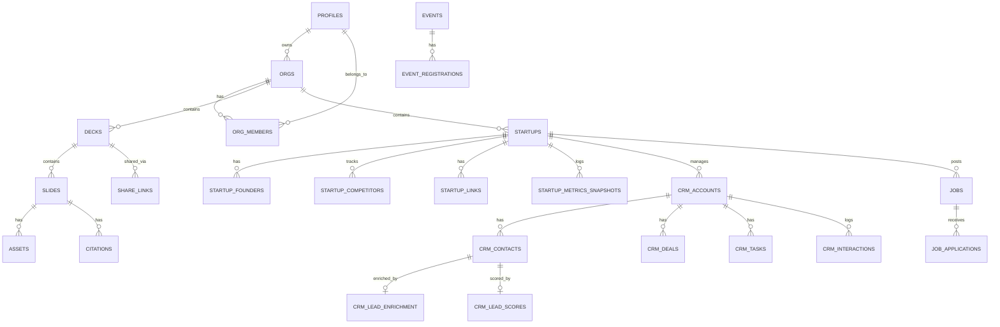

# StartupAI Database Schema

**Supabase Project:** `ouverjherohazwadfgud`  
**Total Tables:** 28  
**Last Updated:** 2025-12-06

---

## 📋 Table Overview

| Category | Tables | Rows |
|----------|--------|------|
| **Core** | orgs, profiles, org_members | 0 |
| **Startups** | startups, startup_founders, startup_competitors, startup_links, startup_metrics_snapshots | 15 |
| **Pitch Decks** | decks, slides, assets, citations, share_links | 0 |
| **CRM** | crm_accounts, crm_contacts, crm_deals, crm_tasks, crm_interactions | 55 |
| **AI Enrichment** | crm_lead_enrichment, crm_lead_scores | 12 |
| **Community** | investors, events, jobs, event_registrations, job_applications, saved_opportunities | 23 |
| **System** | ai_runs, audit_log | 0 |

---

## 🏢 Core Tables

### profiles

```sql
-- User profile information linked to Supabase Auth
-- RLS: ✅ Enabled

id              UUID PRIMARY KEY    -- References auth.users.id
full_name       TEXT
email           TEXT
bio             TEXT
avatar_url      TEXT
created_at      TIMESTAMPTZ
updated_at      TIMESTAMPTZ
```

### orgs

```sql
-- Organizations that group users for collaboration
-- RLS: ✅ Enabled

id              UUID PRIMARY KEY DEFAULT gen_random_uuid()
owner_id        UUID → profiles.id
name            TEXT NOT NULL
created_at      TIMESTAMPTZ
updated_at      TIMESTAMPTZ
```

### org_members

```sql
-- Junction table: users ↔ organizations with roles
-- RLS: ✅ Enabled

org_id          UUID → orgs.id     (PK)
user_id         UUID → profiles.id (PK)
role            TEXT CHECK (owner | admin | editor | viewer)
created_at      TIMESTAMPTZ
```

---

## 🚀 Startup Tables

### startups

```sql
-- Startup profiles created by founders
-- RLS: ✅ Enabled | Rows: 0

id                  UUID PRIMARY KEY DEFAULT gen_random_uuid()
user_id             UUID → auth.users.id
org_id              UUID → orgs.id
name                TEXT NOT NULL
tagline             TEXT
description         TEXT
website_url         TEXT
logo_url            TEXT
cover_image_url     TEXT
year_founded        INTEGER
traction_data       JSONB
team_data           JSONB
needs_data          JSONB
profile_strength    INTEGER CHECK (0-100) DEFAULT 0
is_public           BOOLEAN DEFAULT false
created_at          TIMESTAMPTZ
updated_at          TIMESTAMPTZ
```

### startup_founders

```sql
-- Founding team members
-- RLS: ✅ Enabled | Rows: 4

id              UUID PRIMARY KEY DEFAULT gen_random_uuid()
startup_id      UUID → startups.id (CASCADE DELETE)
full_name       TEXT NOT NULL
role            TEXT
bio             TEXT
created_at      TIMESTAMPTZ
```

### startup_competitors

```sql
-- Competitor tracking
-- RLS: ✅ Enabled | Rows: 5

id              UUID PRIMARY KEY DEFAULT gen_random_uuid()
startup_id      UUID → startups.id (CASCADE DELETE)
name            TEXT NOT NULL
website_url     TEXT
notes           TEXT
created_at      TIMESTAMPTZ
```

### startup_links

```sql
-- External links (pitch deck, demo, social)
-- RLS: ✅ Enabled | Rows: 6

id              UUID PRIMARY KEY DEFAULT gen_random_uuid()
startup_id      UUID → startups.id (CASCADE DELETE)
kind            TEXT CHECK (pitch_deck | demo | docs | linkedin | x | website | other)
label           TEXT
url             TEXT NOT NULL
created_at      TIMESTAMPTZ
```

### startup_metrics_snapshots

```sql
-- Historical metrics for dashboard charts
-- RLS: ✅ Enabled | Rows: 4

id                  UUID PRIMARY KEY DEFAULT gen_random_uuid()
startup_id          UUID → startups.id (CASCADE DELETE)
snapshot_date       DATE DEFAULT CURRENT_DATE
monthly_active_users INTEGER
monthly_revenue     NUMERIC
growth_rate_pct     NUMERIC
created_at          TIMESTAMPTZ
```

---

## 🎯 Pitch Deck Tables

### decks

```sql
-- Pitch deck documents
-- RLS: ✅ Enabled | Rows: 0

id              UUID PRIMARY KEY DEFAULT gen_random_uuid()
org_id          UUID → orgs.id NOT NULL
user_id         UUID → auth.users.id
startup_id      UUID → startups.id
title           TEXT NOT NULL
description     TEXT
template        TEXT DEFAULT 'default'
slides          JSONB DEFAULT '[]'
theme_config    JSONB
status          TEXT CHECK (draft | published) DEFAULT 'draft'
meta            JSONB DEFAULT '{}'
last_accessed_at TIMESTAMPTZ
created_at      TIMESTAMPTZ
updated_at      TIMESTAMPTZ
```

### slides

```sql
-- Individual slides within decks
-- RLS: ✅ Enabled | Rows: 0

id              UUID PRIMARY KEY DEFAULT gen_random_uuid()
deck_id         UUID → decks.id NOT NULL
position        INTEGER NOT NULL
title           TEXT NOT NULL
content         TEXT
image_url       TEXT
template        TEXT
chart_data      JSONB
table_data      JSONB
type            TEXT CHECK (vision | problem | solution | market | product | 
                           traction | competition | team | ask | roadmap | generic)
speaker_notes   TEXT
created_at      TIMESTAMPTZ
updated_at      TIMESTAMPTZ
```

### assets

```sql
-- Files attached to slides (Supabase Storage)
-- RLS: ✅ Enabled | Rows: 0

id              UUID PRIMARY KEY DEFAULT gen_random_uuid()
slide_id        UUID → slides.id NOT NULL
bucket_id       TEXT DEFAULT 'deck-assets'
object_path     TEXT NOT NULL
asset_type      TEXT CHECK (image | chart_spec | other)
created_at      TIMESTAMPTZ
```

### citations

```sql
-- Source URLs for slide content
-- RLS: ✅ Enabled | Rows: 0

id              UUID PRIMARY KEY DEFAULT gen_random_uuid()
slide_id        UUID → slides.id NOT NULL
source_url      TEXT NOT NULL
quote           TEXT
created_at      TIMESTAMPTZ
```

### share_links

```sql
-- Public sharing links for decks
-- RLS: ✅ Enabled | Rows: 0

id              UUID PRIMARY KEY DEFAULT gen_random_uuid()
deck_id         UUID → decks.id NOT NULL
token           TEXT UNIQUE NOT NULL
expires_at      TIMESTAMPTZ
created_at      TIMESTAMPTZ
```

---

## 👥 CRM Tables

### crm_accounts

```sql
-- Customer companies/organizations
-- RLS: ✅ Enabled | Rows: 10

id                  UUID PRIMARY KEY DEFAULT gen_random_uuid()
startup_id          UUID → startups.id NOT NULL
owner_id            UUID → auth.users.id
name                TEXT NOT NULL
logo_url            TEXT
domain              TEXT
segment             TEXT CHECK (Enterprise | SMB | Mid-Market | Partner)
status              TEXT CHECK (Active | Churned | Trial | Lead)
mrr                 NUMERIC DEFAULT 0
health_score        INTEGER CHECK (0-100) DEFAULT 50
last_interaction_at TIMESTAMPTZ
renewal_date        DATE
extended_info       JSONB DEFAULT '{}'
last_enriched_at    TIMESTAMPTZ
created_at          TIMESTAMPTZ
updated_at          TIMESTAMPTZ
```

### crm_contacts

```sql
-- Individual people (leads, prospects)
-- RLS: ✅ Enabled | Rows: 12

id              UUID PRIMARY KEY DEFAULT gen_random_uuid()
startup_id      UUID → startups.id NOT NULL
account_id      UUID → crm_accounts.id
first_name      TEXT NOT NULL
last_name       TEXT
email           TEXT
phone           TEXT
role            TEXT
title           TEXT
linkedin_url    TEXT
created_at      TIMESTAMPTZ
updated_at      TIMESTAMPTZ
```

### crm_deals

```sql
-- Sales opportunities in pipeline
-- RLS: ✅ Enabled | Rows: 10

id              UUID PRIMARY KEY DEFAULT gen_random_uuid()
startup_id      UUID → startups.id NOT NULL
account_id      UUID → crm_accounts.id
name            TEXT NOT NULL
amount          NUMERIC DEFAULT 0
stage           TEXT CHECK (Lead | Qualified | Proposal | Negotiation | Closed Won | Closed Lost)
probability     INTEGER CHECK (0-100) DEFAULT 0
expected_close  DATE
ai_score        INTEGER CHECK (0-100)
ai_reasoning    TEXT
created_at      TIMESTAMPTZ
updated_at      TIMESTAMPTZ
```

### crm_tasks

```sql
-- Follow-up tasks and reminders
-- RLS: ✅ Enabled | Rows: 10

id              UUID PRIMARY KEY DEFAULT gen_random_uuid()
startup_id      UUID → startups.id NOT NULL
account_id      UUID → crm_accounts.id
assignee_id     UUID → auth.users.id
title           TEXT NOT NULL
due             TIMESTAMPTZ
completed       BOOLEAN DEFAULT false
created_at      TIMESTAMPTZ
updated_at      TIMESTAMPTZ
```

### crm_interactions

```sql
-- Activity log (emails, calls, meetings, notes)
-- RLS: ✅ Enabled | Rows: 13

id              UUID PRIMARY KEY DEFAULT gen_random_uuid()
startup_id      UUID → startups.id NOT NULL
account_id      UUID → crm_accounts.id
user_id         UUID → auth.users.id
type            TEXT CHECK (email | call | meeting | note)
summary         TEXT NOT NULL
sentiment       TEXT CHECK (Positive | Neutral | Negative)
occurred_at     TIMESTAMPTZ DEFAULT now()
created_at      TIMESTAMPTZ
```

---

## 🤖 AI Enrichment Tables

### crm_lead_enrichment

```sql
-- AI-enriched data for leads (Gemini + Google Search)
-- RLS: ✅ Enabled | Rows: 5

id                  UUID PRIMARY KEY DEFAULT gen_random_uuid()
lead_id             UUID UNIQUE → crm_contacts.id NOT NULL
company_id          UUID → crm_accounts.id
ceo_name            TEXT
ceo_linkedin        TEXT
linkedin_company_url TEXT
recent_news         JSONB DEFAULT '[]'
funding_history     JSONB DEFAULT '[]'
hiring_trends       JSONB DEFAULT '{}'
market_presence_score INTEGER CHECK (0-100)
search_trend_score  INTEGER CHECK (0-100)
gemini_summary      TEXT
evidence_links      JSONB DEFAULT '[]'
created_at          TIMESTAMPTZ
updated_at          TIMESTAMPTZ
```

### crm_lead_scores

```sql
-- AI-predicted lead scores from Gemini 3 Pro
-- RLS: ✅ Enabled | Rows: 7

id                  UUID PRIMARY KEY DEFAULT gen_random_uuid()
lead_id             UUID UNIQUE → crm_contacts.id NOT NULL
overall_score       INTEGER CHECK (0-100)
confidence          NUMERIC CHECK (0-1)
status_band         TEXT CHECK (High | Medium | Low)
stage_recommendation TEXT

-- Fit breakdown scores (0-100)
industry_fit        INTEGER CHECK (0-100)
company_size_fit    INTEGER CHECK (0-100)
budget_fit          INTEGER CHECK (0-100)
problem_fit         INTEGER CHECK (0-100)
engagement_fit      INTEGER CHECK (0-100)
search_trend_score  INTEGER CHECK (0-100)
risk_score          INTEGER CHECK (0-100)

-- AI outputs
ai_findings             JSONB DEFAULT '[]'
risks                   JSONB DEFAULT '[]'
recommended_next_actions JSONB DEFAULT '[]'
model_version           TEXT

created_at          TIMESTAMPTZ
updated_at          TIMESTAMPTZ
```

---

## 🌐 Community Tables

### investors

```sql
-- Investor/VC directory
-- RLS: ✅ Enabled | Rows: 23

id                  UUID PRIMARY KEY DEFAULT gen_random_uuid()
name                TEXT NOT NULL
slug                TEXT UNIQUE
type                TEXT CHECK (vc | accelerator | angel_group | corporate_vc)
logo_url            TEXT
description         TEXT
website_url         TEXT
stages              TEXT[] DEFAULT '{}'
min_check_size      NUMERIC
max_check_size      NUMERIC
equity_percent_min  NUMERIC
equity_percent_max  NUMERIC
specialties         TEXT[] DEFAULT '{}'
geographies         TEXT[] DEFAULT '{}'
benefits            TEXT[] DEFAULT '{}'
time_to_decision    TEXT
notable_investments TEXT[] DEFAULT '{}'
application_link    TEXT
contact_email       TEXT
terms_summary       TEXT
social_links        JSONB DEFAULT '{}'
created_at          TIMESTAMPTZ
updated_at          TIMESTAMPTZ
```

### events

```sql
-- Community events
-- RLS: ✅ Enabled | Rows: 0

id              UUID PRIMARY KEY DEFAULT gen_random_uuid()
title           TEXT NOT NULL
description     TEXT
event_date      TIMESTAMPTZ NOT NULL
location        TEXT
event_type      TEXT
registration_url TEXT
image_url       TEXT
created_at      TIMESTAMPTZ
updated_at      TIMESTAMPTZ
```

### event_registrations

```sql
-- User event registrations
-- RLS: ✅ Enabled | Rows: 0

id              UUID PRIMARY KEY DEFAULT gen_random_uuid()
user_id         UUID → auth.users.id
event_id        UUID → events.id
status          TEXT DEFAULT 'registered'
registered_at   TIMESTAMPTZ
```

### jobs

```sql
-- Job postings from startups
-- RLS: ✅ Enabled | Rows: 0

id              UUID PRIMARY KEY DEFAULT gen_random_uuid()
startup_id      UUID → startups.id
title           TEXT NOT NULL
description     TEXT
location        TEXT
job_type        TEXT
salary_range    TEXT
application_url TEXT
created_at      TIMESTAMPTZ
updated_at      TIMESTAMPTZ
```

### job_applications

```sql
-- User job applications
-- RLS: ✅ Enabled | Rows: 0

id              UUID PRIMARY KEY DEFAULT gen_random_uuid()
user_id         UUID → auth.users.id
job_id          UUID → jobs.id
status          TEXT DEFAULT 'applied'
applied_at      TIMESTAMPTZ
```

### saved_opportunities

```sql
-- User bookmarks
-- RLS: ✅ Enabled | Rows: 0

id              UUID PRIMARY KEY DEFAULT gen_random_uuid()
user_id         UUID → auth.users.id
opportunity_type TEXT NOT NULL
opportunity_id  UUID NOT NULL
created_at      TIMESTAMPTZ
```

---

## 🔧 System Tables

### ai_runs

```sql
-- Observability log for AI operations
-- RLS: ✅ Enabled | Rows: 0

id              UUID PRIMARY KEY DEFAULT gen_random_uuid()
user_id         UUID → profiles.id NOT NULL
tool_name       TEXT NOT NULL
args_json       JSONB
status          TEXT CHECK (success | error) NOT NULL
duration_ms     INTEGER
cost_estimate   NUMERIC
created_at      TIMESTAMPTZ
```

### audit_log

```sql
-- Complete audit trail of data changes
-- RLS: ✅ Enabled | Rows: 0

id              UUID PRIMARY KEY DEFAULT gen_random_uuid()
user_id         UUID → profiles.id NOT NULL
action          TEXT NOT NULL
table_name      TEXT NOT NULL
row_id          UUID
diff            JSONB
created_at      TIMESTAMPTZ
```

---

## 🔗 Entity Relationship Diagram



---

## 🔒 Row Level Security

All tables have RLS enabled. Access patterns:

| Pattern | Implementation |
|---------|----------------|
| **Org isolation** | `org_id = auth.jwt()->>'org_id'` |
| **Startup isolation** | `startup_id` linked to user's startup |
| **User ownership** | `user_id = auth.uid()` |
| **Public read** | `is_public = true` for discovery |

---

## 📊 Table Statistics

| Table | Rows | RLS |
|-------|------|-----|
| profiles | 0 | ✅ |
| orgs | 0 | ✅ |
| org_members | 0 | ✅ |
| startups | 0 | ✅ |
| startup_founders | 4 | ✅ |
| startup_competitors | 5 | ✅ |
| startup_links | 6 | ✅ |
| startup_metrics_snapshots | 4 | ✅ |
| decks | 0 | ✅ |
| slides | 0 | ✅ |
| assets | 0 | ✅ |
| citations | 0 | ✅ |
| share_links | 0 | ✅ |
| crm_accounts | 10 | ✅ |
| crm_contacts | 12 | ✅ |
| crm_deals | 10 | ✅ |
| crm_tasks | 10 | ✅ |
| crm_interactions | 13 | ✅ |
| crm_lead_enrichment | 5 | ✅ |
| crm_lead_scores | 7 | ✅ |
| investors | 23 | ✅ |
| events | 0 | ✅ |
| event_registrations | 0 | ✅ |
| jobs | 0 | ✅ |
| job_applications | 0 | ✅ |
| saved_opportunities | 0 | ✅ |
| ai_runs | 0 | ✅ |
| audit_log | 0 | ✅ |

---

**Total:** 28 tables, all with RLS enabled

