# Sun AI - Core Sitemap & Page Prompts

**Version:** 1.0  
**Last Updated:** 2025-12-06  
**Purpose:** Site structure, page descriptions, and Google Studio AI prompts

---

## 📋 Table of Contents

1. [Sitemap Overview](#sitemap-overview)
2. [Mermaid Diagrams](#mermaid-diagrams)
3. [Page Descriptions](#page-descriptions)
4. [Google Studio Prompts](#google-studio-prompts)

---

## Sitemap Overview

### Quick Reference

| Section | Pages | Priority |
|---------|-------|----------|
| **Marketing** | 8 pages | P0 |
| **Auth** | 4 pages | P0 |
| **Dashboard** | 6 pages | P0 |
| **Pitch Deck** | 5 pages | P0 |
| **CRM** | 5 pages | P1 |
| **Documents** | 4 pages | P1 |
| **Tasks** | 3 pages | P1 |
| **Settings** | 4 pages | P2 |

**Total: ~39 pages**

---

## Mermaid Diagrams

### Full Site Architecture

```mermaid
flowchart TB
    subgraph Public["🌐 PUBLIC (Marketing)"]
        HOME["/  Home"]
        ABOUT["/about  About"]
        FEATURES["/features  Features"]
        PRICING["/pricing  Pricing"]
        HOW["/how-it-works  How It Works"]
        BLOG["/blog  Blog"]
        CONTACT["/contact  Contact"]
        LEGAL["/legal  Legal"]
    end

    subgraph Auth["🔐 AUTH"]
        LOGIN["/login  Login"]
        SIGNUP["/signup  Sign Up"]
        FORGOT["/forgot-password  Forgot"]
        RESET["/reset-password  Reset"]
    end

    subgraph App["📱 APP (Protected)"]
        DASH["/dashboard  Dashboard"]
        
        subgraph Pitch["Pitch Deck"]
            DECKS["/pitch-decks  My Decks"]
            WIZARD["/pitch-decks/new  Wizard"]
            EDITOR["/pitch-decks/:id  Editor"]
            PRESENT["/pitch-decks/:id/present  Present"]
            EXPORT["/pitch-decks/:id/export  Export"]
        end

        subgraph CRM["CRM"]
            CONTACTS["/crm/contacts  Contacts"]
            DEALS["/crm/deals  Deals"]
            PIPELINE["/crm/pipeline  Pipeline"]
            INVESTORS["/crm/investors  Investors"]
            ACTIVITIES["/crm/activities  Activities"]
        end

        subgraph Docs["Documents"]
            DOCS_HUB["/documents  Hub"]
            DOCS_NEW["/documents/new  Create"]
            DOCS_EDIT["/documents/:id  Edit"]
            DATA_ROOM["/data-room  Data Room"]
        end

        subgraph Tasks["Tasks"]
            TASKS["/tasks  All Tasks"]
            WORKFLOWS["/tasks/workflows  Workflows"]
            CALENDAR["/tasks/calendar  Calendar"]
        end

        subgraph Settings["Settings"]
            PROFILE["/settings/profile  Profile"]
            TEAM["/settings/team  Team"]
            BILLING["/settings/billing  Billing"]
            INTEGRATIONS["/settings/integrations  Integrations"]
        end
    end

    HOME --> LOGIN
    LOGIN --> DASH
    SIGNUP --> DASH
    DASH --> Pitch
    DASH --> CRM
    DASH --> Docs
    DASH --> Tasks
    DASH --> Settings
```



### Marketing Site Map


### App Navigation Structure


### User Flow: Pitch Deck Creation


### User Flow: CRM Pipeline


---

## Page Descriptions

### 🌐 Marketing Pages

| Route | Page | Description |
|-------|------|-------------|
| `/` | **Home** | Hero section, value props, features preview, testimonials, CTA |
| `/features` | **Features** | Full feature breakdown with screenshots, AI capabilities |
| `/pricing` | **Pricing** | 4 tiers (Free, Founder, Growth, Enterprise), feature comparison |
| `/how-it-works` | **How It Works** | 3-step process, demo video, use cases |
| `/about` | **About** | Mission, team, investors, press |
| `/blog` | **Blog** | Articles, guides, startup tips |
| `/contact` | **Contact** | Contact form, support links, office locations |
| `/legal` | **Legal** | Privacy, Terms, Cookie Policy |

### 🔐 Auth Pages

| Route | Page | Description |
|-------|------|-------------|
| `/login` | **Login** | Email/password, social auth, "forgot password" link |
| `/signup` | **Sign Up** | Registration form, plan selection, onboarding |
| `/forgot-password` | **Forgot Password** | Email input for reset link |
| `/reset-password` | **Reset Password** | New password form with token validation |

### 📊 Dashboard

| Route | Page | Description |
|-------|------|-------------|
| `/dashboard` | **Main Dashboard** | KPIs, recent activity, quick actions, AI insights |
| `/dashboard/overview` | **Overview Tab** | Metrics, charts, pipeline summary |
| `/dashboard/activity` | **Activity Tab** | Recent actions, team activity feed |
| `/dashboard/insights` | **AI Insights Tab** | Gemini-powered recommendations |

### 🎯 Pitch Deck Module

| Route | Page | Description |
|-------|------|-------------|
| `/pitch-decks` | **Deck List** | All decks grid, filters, search, create button |
| `/pitch-decks/new` | **Wizard** | 5-step creation wizard with AI generation |
| `/pitch-decks/:id` | **Editor** | Full deck editor with slide canvas, AI tools |
| `/pitch-decks/:id/present` | **Present Mode** | Full-screen presentation view |
| `/pitch-decks/:id/export` | **Export** | PDF, PPTX, Notion export options |

### 👥 CRM Module

| Route | Page | Description |
|-------|------|-------------|
| `/crm` | **CRM Dashboard** | Pipeline overview, key metrics, recent deals |
| `/crm/contacts` | **Contacts** | Contact list, search, filters, detail drawer |
| `/crm/deals` | **Deals Pipeline** | Kanban board, deal cards, stage management |
| `/crm/investors` | **Investor Directory** | Investor profiles, AI matching, outreach tools |
| `/crm/activities` | **Activity Feed** | All CRM activities, timeline, filters |

### 📄 Documents Module

| Route | Page | Description |
|-------|------|-------------|
| `/documents` | **Document Hub** | All docs grid, 10 document types, create wizard |
| `/documents/new` | **Create Document** | Document type selection, AI generation wizard |
| `/documents/:id` | **Document Editor** | Rich text editor with AI tools, export |
| `/data-room` | **Data Room** | Investor-ready file organization, sharing |

### ✅ Tasks Module

| Route | Page | Description |
|-------|------|-------------|
| `/tasks` | **Task Manager** | 5-step workflow, Kanban, AI generation |
| `/tasks/workflows` | **Workflows** | Workflow templates, automation rules |
| `/tasks/calendar` | **Calendar** | Calendar view of tasks and deadlines |

### ⚙️ Settings

| Route | Page | Description |
|-------|------|-------------|
| `/settings/profile` | **Profile** | User info, avatar, preferences |
| `/settings/team` | **Team** | Team members, roles, invites |
| `/settings/billing` | **Billing** | Plan management, payment, invoices |
| `/settings/integrations` | **Integrations** | Connected apps, API keys |

---

## Google Studio Prompts

### Prompt Template Structure

```
📋 PAGE: {Page Name}
📍 ROUTE: {/route}
🎯 PURPOSE: {One-line description}

PROMPT:
---
{Full prompt for Google Studio}
---

PLACEHOLDERS:
- {{placeholder_name}}: Description
```

---

### 🏠 HOME PAGE

```
📋 PAGE: Home / Landing Page
📍 ROUTE: /
🎯 PURPOSE: Convert visitors to signups

PROMPT:
---
Create a modern SaaS landing page for "Sun AI" - an AI-powered startup operating system.

## Hero Section
- Headline: {{hero_headline}} (e.g., "Launch Your Startup 10x Faster")
- Subheadline: {{hero_subheadline}} (value proposition in 1-2 sentences)
- CTA buttons: "Start Free" and "Watch Demo"
- Hero image: Abstract AI/startup illustration or product screenshot
- Stats bar: "{{stat_1}}" | "{{stat_2}}" | "{{stat_3}}"

## Problem Section
- Title: "The Problem"
- 3 pain points with icons:
  1. {{pain_1}} (e.g., "Pitch decks take weeks")
  2. {{pain_2}} (e.g., "Scattered investor tracking")
  3. {{pain_3}} (e.g., "Manual document creation")

## Solution Section
- Title: "The Solution"
- 3 benefits with screenshots:
  1. {{benefit_1}} - {{benefit_1_desc}}
  2. {{benefit_2}} - {{benefit_2_desc}}
  3. {{benefit_3}} - {{benefit_3_desc}}

## Features Preview
- 6 feature cards in 2x3 grid:
  1. AI Pitch Deck Generator
  2. Investor CRM
  3. Document Suite
  4. Task Manager
  5. Financial Tools
  6. Data Room

## Social Proof
- Logos bar: "Trusted by founders from {{logos}}"
- 3 testimonial cards with photo, name, title, quote

## Pricing Preview
- 3 plan cards: Free, Founder (${{price_founder}}/mo), Growth (${{price_growth}}/mo)
- Feature highlights per plan
- "Compare all features" link

## CTA Section
- Title: "Ready to launch faster?"
- Email input + "Get Started Free" button
- "No credit card required"

## Footer
- Logo + tagline
- Product links
- Company links
- Legal links
- Social icons
---

PLACEHOLDERS:
- {{hero_headline}}: Main headline (max 8 words)
- {{hero_subheadline}}: Supporting text (max 20 words)
- {{stat_1}}: First stat (e.g., "10,000+ Decks Created")
- {{stat_2}}: Second stat (e.g., "60+ Hours Saved")
- {{stat_3}}: Third stat (e.g., "500+ Startups")
- {{pain_1}}, {{pain_2}}, {{pain_3}}: Pain points
- {{benefit_1}}, {{benefit_2}}, {{benefit_3}}: Benefits
- {{logos}}: Company names (e.g., "Y Combinator, Techstars, 500 Startups")
- {{price_founder}}: Founder tier price
- {{price_growth}}: Growth tier price
```

---

### ✨ FEATURES PAGE

```
📋 PAGE: Features
📍 ROUTE: /features
🎯 PURPOSE: Showcase all product capabilities

PROMPT:
---
Create a comprehensive features page for "Sun AI" startup platform.

## Hero
- Title: "Everything You Need to Launch"
- Subtitle: "AI-powered tools for every stage of your startup journey"
- Illustration: Feature grid or product collage

## Feature Sections (8 sections, alternating layout)

### 1. AI Pitch Deck Generator
- Icon: 🎯
- Title: "Create Investor-Ready Decks in Minutes"
- Description: {{pitch_deck_desc}}
- Key features (4 bullets):
  - 10-slide structure optimized for investors
  - AI-generated content tailored to your business
  - 5 premium templates
  - One-click export to PDF/PPTX
- Screenshot: Deck editor interface
- CTA: "Create Your Deck"

### 2. Investor CRM
- Icon: 👥
- Title: "Track Every Investor Relationship"
- Description: {{crm_desc}}
- Key features:
  - Pipeline management
  - AI lead enrichment
  - Activity tracking
  - Email integration
- Screenshot: CRM pipeline view

### 3. Document Suite
- Icon: 📄
- Title: "Generate All 10 Essential Documents"
- Description: {{docs_desc}}
- Document types grid:
  - Pitch Deck
  - One-Pager
  - Executive Summary
  - Business Plan
  - Financial Model
  - GTM Strategy
  - Market Research
  - Product Roadmap
  - Legal Checklist
  - Data Room Checklist

### 4. Task Manager
- Icon: ✅
- Title: "5-Step Workflow System"
- Description: {{tasks_desc}}
- Workflow phases: Research → Strategy → Plan → Execute → Review
- Screenshot: Kanban board

### 5. Financial Tools
- Icon: 📊
- Title: "Build Investor-Ready Financials"
- Description: {{financial_desc}}
- Features:
  - 36-month projections
  - Burn rate calculator
  - Runway tracker
  - Valuation models

### 6. Data Room
- Icon: 🔒
- Title: "Impress Investors with Organization"
- Description: {{data_room_desc}}
- Features:
  - Secure document sharing
  - Access tracking
  - Version control
  - Investor analytics

### 7. AI Assistant
- Icon: 🤖
- Title: "Gemini 3 Powered Intelligence"
- Description: {{ai_desc}}
- Capabilities:
  - Content generation
  - Market research
  - Competitor analysis
  - Task automation

### 8. Integrations
- Icon: 🔗
- Title: "Connect Your Tools"
- Description: {{integrations_desc}}
- Integration logos: Google, Notion, Slack, etc.

## Comparison Table
- Feature comparison vs competitors
- Checkmarks for Sun AI advantages

## CTA Section
- "Start Building Your Startup"
- Free trial button
---

PLACEHOLDERS:
- {{pitch_deck_desc}}: 2-sentence description
- {{crm_desc}}: 2-sentence description
- {{docs_desc}}: 2-sentence description
- {{tasks_desc}}: 2-sentence description
- {{financial_desc}}: 2-sentence description
- {{data_room_desc}}: 2-sentence description
- {{ai_desc}}: 2-sentence description
- {{integrations_desc}}: 2-sentence description
```

---

### 💰 PRICING PAGE

```
📋 PAGE: Pricing
📍 ROUTE: /pricing
🎯 PURPOSE: Convert to paid plans

PROMPT:
---
Create a pricing page for "Sun AI" startup platform.

## Hero
- Title: "Simple, Transparent Pricing"
- Subtitle: "Start free, scale as you grow"
- Toggle: Monthly / Annual (save 20%)

## Pricing Cards (4 tiers)

### Free
- Price: $0/month
- Subtitle: "For exploring"
- Features:
  - 1 pitch deck
  - Basic templates
  - Limited AI generations
  - Community support
- CTA: "Get Started"
- Style: Outlined card

### Founder - {{price_founder}}/mo
- Price: ${{price_founder}}/month
- Subtitle: "For solo founders"
- Badge: "Most Popular"
- Features:
  - Unlimited decks
  - All templates
  - {{ai_credits_founder}} AI credits/mo
  - CRM (up to 100 contacts)
  - 5 documents
  - Email support
- CTA: "Start Free Trial"
- Style: Highlighted/featured card

### Growth - {{price_growth}}/mo
- Price: ${{price_growth}}/month
- Subtitle: "For growing teams"
- Features:
  - Everything in Founder
  - {{ai_credits_growth}} AI credits/mo
  - Unlimited contacts
  - Unlimited documents
  - Team collaboration (5 seats)
  - Data room
  - Priority support
- CTA: "Start Free Trial"

### Enterprise
- Price: Custom
- Subtitle: "For funded startups"
- Features:
  - Everything in Growth
  - Unlimited seats
  - Custom integrations
  - Dedicated success manager
  - SLA guarantee
  - SSO/SAML
- CTA: "Contact Sales"

## Feature Comparison Table
| Feature | Free | Founder | Growth | Enterprise |
|---------|------|---------|--------|------------|
| Pitch Decks | 1 | ∞ | ∞ | ∞ |
| AI Credits | 10 | {{ai_credits_founder}} | {{ai_credits_growth}} | ∞ |
| Documents | 0 | 5 | ∞ | ∞ |
| CRM Contacts | 0 | 100 | ∞ | ∞ |
| Team Seats | 1 | 1 | 5 | ∞ |
| Data Room | ❌ | ❌ | ✅ | ✅ |
| Support | Community | Email | Priority | Dedicated |

## FAQ Section
- {{faq_1_q}}: {{faq_1_a}}
- {{faq_2_q}}: {{faq_2_a}}
- {{faq_3_q}}: {{faq_3_a}}
- {{faq_4_q}}: {{faq_4_a}}

## CTA Section
- "Not sure which plan is right?"
- "Talk to us" button
---

PLACEHOLDERS:
- {{price_founder}}: Founder monthly price (e.g., 29)
- {{price_growth}}: Growth monthly price (e.g., 79)
- {{ai_credits_founder}}: AI credits for Founder (e.g., 100)
- {{ai_credits_growth}}: AI credits for Growth (e.g., 500)
- {{faq_1_q}}, {{faq_1_a}}: FAQ question and answer
- {{faq_2_q}}, {{faq_2_a}}: FAQ question and answer
- {{faq_3_q}}, {{faq_3_a}}: FAQ question and answer
- {{faq_4_q}}, {{faq_4_a}}: FAQ question and answer
```

---

### 📊 DASHBOARD

```
📋 PAGE: Main Dashboard
📍 ROUTE: /dashboard
🎯 PURPOSE: Central hub for all activity

PROMPT:
---
Create a dashboard page for "Sun AI" startup platform.

## Layout
- Left sidebar (collapsible)
- Top header bar
- Main content area

## Sidebar Navigation
- Logo + "Sun AI"
- Navigation items:
  - 📊 Dashboard (active)
  - 🎯 Pitch Decks
  - 👥 CRM
  - 📄 Documents
  - ✅ Tasks
  - 💰 Financials
  - 🔒 Data Room
  - ⚙️ Settings
- User avatar + name at bottom

## Top Header
- Page title: "Dashboard"
- Search bar
- Notification bell
- AI Assistant button (✨)
- User dropdown

## Main Content

### Welcome Section
- "Good {{time_of_day}}, {{user_name}}"
- Quick action buttons:
  - "+ New Deck"
  - "+ Add Contact"
  - "+ Create Document"

### KPI Cards Row (4 cards)
1. Decks Created: {{deck_count}} | +{{deck_change}} this week
2. Active Deals: {{deal_count}} | {{deal_value}} pipeline
3. Tasks Due: {{tasks_due}} | {{tasks_overdue}} overdue
4. Documents: {{doc_count}} | {{doc_pending}} pending

### Two-Column Layout

#### Left Column (60%)

**Recent Activity**
- Activity feed with:
  - Icon
  - Action description
  - Timestamp
  - Entity link

**Pipeline Snapshot**
- Mini Kanban with deal counts per stage
- "View Full Pipeline" link

#### Right Column (40%)

**AI Insights** (Gemini card)
- Title: "✨ AI Recommendations"
- 3 insight cards:
  - "{{insight_1}}"
  - "{{insight_2}}"
  - "{{insight_3}}"
- "Generate More" button

**Upcoming Tasks**
- 5 task rows with:
  - Task name
  - Due date
  - Priority badge
- "View All Tasks" link

### Quick Stats Row
- Mini charts:
  - Deck views this week
  - Deal conversion rate
  - Task completion rate
---

PLACEHOLDERS:
- {{time_of_day}}: morning/afternoon/evening
- {{user_name}}: User's first name
- {{deck_count}}: Number of decks
- {{deck_change}}: Change this week
- {{deal_count}}: Active deals
- {{deal_value}}: Pipeline value
- {{tasks_due}}: Tasks due today
- {{tasks_overdue}}: Overdue tasks
- {{doc_count}}: Documents count
- {{doc_pending}}: Pending documents
- {{insight_1}}, {{insight_2}}, {{insight_3}}: AI insights
```

---

### 🎯 PITCH DECK EDITOR

```
📋 PAGE: Deck Editor
📍 ROUTE: /pitch-decks/:id
🎯 PURPOSE: Edit and enhance pitch decks

PROMPT:
---
Create a pitch deck editor page for "Sun AI" platform.

## Layout: Three-panel design
- Left: Slide outline (250px)
- Center: Slide canvas (flexible)
- Right: AI tools panel (300px, collapsible)

## Top Bar (56px height)
- Back arrow + "My Decks"
- Deck title (editable): "{{deck_title}}"
- Slide counter: "Slide {{current}} of {{total}}"
- Action buttons:
  - ✨ AI (opens right panel)
  - ▶️ Present
  - ⬇️ Export

## Left Sidebar: Slide Outline
- Deck title (editable)
- Slide list:
  - Thumbnail preview
  - Slide number
  - Slide type badge
  - Drag handle for reorder
- "+ Add Slide" button at bottom
- Template selector dropdown

## Center: Slide Canvas
- Large slide preview area
- Navigation arrows (< >) on sides
- Edit mode:
  - Click to edit title
  - Click to edit content
  - Image placeholder with "Generate Image" button
- Toolbar (appears on selection):
  - Text formatting
  - Alignment
  - AI rewrite button

## Right Sidebar: AI Tools Panel
- Title: "✨ AI Assistant"
- Tabs: Enhance | Generate | Analyze

### Enhance Tab
- "Improve Headline" button
- "Rewrite Content" button
- "Suggest Layout" button
- "Fix Grammar" button

### Generate Tab
- "Generate Image" button
- "Add Chart" button
- "Create Table" button
- "Market Data" button (for market slides)

### Analyze Tab
- Slide score (clarity, impact, tone)
- Improvement suggestions
- Competitor comparison (competition slide)

## Bottom: Slide Type Bar
- Quick switch between slide types:
  - Vision, Problem, Solution, Product, Market
  - Business, Traction, Competition, Team, Ask

## Export Modal (when clicking Export)
- Format options:
  - PDF (High quality)
  - PPTX (PowerPoint)
  - Google Slides
  - Notion
- "Download" button
---

PLACEHOLDERS:
- {{deck_title}}: Name of the deck
- {{current}}: Current slide number
- {{total}}: Total slide count
```

---

### 👥 CRM PIPELINE

```
📋 PAGE: CRM Deals Pipeline
📍 ROUTE: /crm/deals
🎯 PURPOSE: Manage investor/customer deals

PROMPT:
---
Create a CRM pipeline page for "Sun AI" platform.

## Top Bar
- Title: "Deals Pipeline"
- View toggles: [Kanban] [List] [Table]
- Filters:
  - Pipeline: [All] [Fundraising] [Sales] [Hiring]
  - Owner: Dropdown
  - Stage: Dropdown
- "+ Add Deal" button
- Search

## KPI Bar (4 metrics)
1. Total Deals: {{total_deals}}
2. Pipeline Value: ${{pipeline_value}}
3. This Month: {{deals_this_month}} deals
4. Win Rate: {{win_rate}}%

## Kanban Board

### Columns
1. **Lead** ({{lead_count}})
2. **Qualified** ({{qualified_count}})
3. **Meeting** ({{meeting_count}})
4. **Proposal** ({{proposal_count}})
5. **Closed Won** ({{won_count}})
6. **Closed Lost** ({{lost_count}})

### Deal Card
- Company name/logo
- Deal name
- Deal value: ${{deal_value}}
- Contact name
- Stage badge
- Days in stage
- Next task chip
- Owner avatar
- Drag to move between stages

## Deal Detail Drawer (slide-over from right)
- Header:
  - Company logo
  - Deal name
  - Stage badge
  - Value
  - Close button

- Tabs: Overview | Tasks | Activity | AI

### Overview Tab
- Contact info
- Company info
- Deal details
- Custom fields

### Tasks Tab
- Task list
- "+ Add Task" button
- AI suggested tasks

### Activity Tab
- Timeline of all activities
- Add note/email/call buttons

### AI Tab
- Deal probability score
- Recommended next steps
- Risk factors
- Similar deals comparison
---

PLACEHOLDERS:
- {{total_deals}}: Total deal count
- {{pipeline_value}}: Total pipeline value
- {{deals_this_month}}: Deals added this month
- {{win_rate}}: Win rate percentage
- {{lead_count}}, {{qualified_count}}, etc.: Counts per stage
- {{deal_value}}: Individual deal value
```

---

### ✅ TASK MANAGER

```
📋 PAGE: Task Manager
📍 ROUTE: /tasks
🎯 PURPOSE: Manage all tasks with 5-step workflow

PROMPT:
---
Create a task manager page for "Sun AI" platform using the 5-step workflow model.

## Top Bar
- Title: "Task Manager"
- Subtitle: "Manage your workflows with AI"
- Search bar
- "+ New Task" button
- "✨ AI Generate" button

## Category Tabs
- [🚀 Startup] [🎉 Events] [🤝 Sponsors] [📣 Marketing] [⚙️ Ops]

## 5-Step Workflow Cards (horizontal scroll)

### Card Structure (repeat for each step)
- Icon in rounded container
- Step badge: "STEP {{n}}"
- Phase title: "{{phase_name}}"
- Description: "{{phase_desc}}"
- Progress: {{completed}}/{{total}} tasks
- Progress bar
- "View Tasks" button
- "✨ Generate" button

### Steps (for Startup category)
1. Ideation - Brainstorm and validate ideas
2. Research - Market and competitor analysis
3. Validation - MVP and early testing
4. Build - Development and iteration
5. Launch - Go-to-market execution

## KPI Bar (5 metrics)
1. 🔺 High Priority: {{high_count}}
2. ⏳ In Progress: {{progress_count}}
3. ✅ Completed: {{done_count}}
4. 📅 Due This Week: {{week_count}}
5. ✨ AI Suggested: {{ai_count}}

## Kanban Board

### Columns
1. Backlog ({{backlog_count}})
2. In Progress ({{progress_count}})
3. Review ({{review_count}})
4. Completed ({{completed_count}})

### Task Card
- Priority badge (🔴🟡🟢)
- Step badge (STEP 1-5)
- Due date badge
- Task title
- Description (truncated)
- Subtask count
- Owner avatar
- Category tag
- AI badge (if AI suggested)
- Expand arrow

## AI Panel (right sidebar, toggleable)
- Title: "✨ Gemini AI"
- Actions:
  - 📋 Generate Tasks
  - 📊 Analyze Timeline
  - ⚠️ Detect Risks
  - 💡 Get Insights
- Recent suggestions list
---

PLACEHOLDERS:
- {{phase_name}}: Name of workflow phase
- {{phase_desc}}: Short description
- {{completed}}, {{total}}: Task counts
- {{high_count}}, {{progress_count}}, etc.: KPI values
- {{backlog_count}}, etc.: Column counts
```

---

### 📄 DOCUMENT HUB

```
📋 PAGE: Document Hub
📍 ROUTE: /documents
🎯 PURPOSE: Access all startup documents

PROMPT:
---
Create a document hub page for "Sun AI" platform.

## Top Bar
- Title: "Documents"
- Subtitle: "Your startup document suite"
- Search bar
- View toggles: [Grid] [List]
- "+ Create Document" button

## Document Type Grid (10 cards)

### Card Structure
- Icon (large)
- Document type name
- Description (1 line)
- Count: "{{count}} documents"
- "Create" button
- "View All" link

### Document Types
1. 🎯 Pitch Deck - Investor presentation
2. 📋 One-Pager - Quick overview
3. 📝 Executive Summary - Detailed summary
4. 📊 Business Plan - Full business plan
5. 💰 Financial Model - Projections & forecasts
6. 🚀 GTM Strategy - Go-to-market plan
7. 🔍 Market Research - Industry analysis
8. 🗺️ Product Roadmap - Feature timeline
9. ⚖️ Legal Checklist - Legal requirements
10. 📁 Data Room Checklist - Due diligence prep

## Recent Documents Section
- Title: "Recent Documents"
- Table with columns:
  - Document name
  - Type
  - Last edited
  - Owner
  - Status
  - Actions (Edit, Export, Delete)

## Quick Actions Bar
- "Generate All Documents" (AI bulk action)
- "Export Data Room" (ZIP download)
- "Share with Investors"

## Create Document Modal (when clicking Create)
- Step 1: Select document type
- Step 2: Choose generation method
  - AI Generate (recommended)
  - Start from template
  - Blank document
- Step 3: Provide context
  - Business description
  - Or paste URL
- "Generate" button
---

PLACEHOLDERS:
- {{count}}: Number of documents of this type
```

---

## Summary: All Page Prompts

| Page | Route | Prompt Available |
|------|-------|-----------------|
| Home | `/` | ✅ |
| Features | `/features` | ✅ |
| Pricing | `/pricing` | ✅ |
| Dashboard | `/dashboard` | ✅ |
| Deck Editor | `/pitch-decks/:id` | ✅ |
| CRM Pipeline | `/crm/deals` | ✅ |
| Task Manager | `/tasks` | ✅ |
| Document Hub | `/documents` | ✅ |

---

## Additional Prompts (Copy-Paste Ready)

### Login Page

```
Create a login page with:
- Clean, centered card design
- Logo at top
- Email input field
- Password input with show/hide
- "Forgot password?" link
- "Log In" primary button
- Divider: "or continue with"
- Google OAuth button
- "Don't have an account? Sign up" link
- Background: Subtle gradient or pattern
```

### Sign Up Page

```
Create a signup page with:
- Multi-step form (3 steps)
- Step 1: Email + Password
- Step 2: Name + Company
- Step 3: Select Plan
- Progress indicator
- OAuth option
- Terms checkbox
- Clean, minimal design
```

### Settings Profile

```
Create a settings profile page with:
- Left sidebar: Profile, Team, Billing, Integrations
- Profile section:
  - Avatar upload
  - Name, email, company fields
  - Timezone dropdown
  - Notification preferences
- Save/Cancel buttons
- Danger zone: Delete account
```

---

**Last Updated:** 2025-12-06  
**Author:** Sun AI Team

