# StartupAI - Main Dashboard Design

**Purpose:** Founder-focused command center  
**Style:** Clean, calm, actionable

---

## 🎯 Dashboard Goals

| Goal | How |
|------|-----|
| **Overview at a glance** | 4 KPI cards, progress indicators |
| **Quick actions** | Prominent buttons for common tasks |
| **Recent context** | Activity feed, last opened items |
| **AI guidance** | Smart recommendations card |

---

## 📐 Layout Structure

```
┌─────────────────────────────────────────────────────────────┐
│  SIDEBAR (64px)  │           TOP BAR (56px)                 │
│  ─────────────── │  Search │ AI │ Notifications │ Avatar   │
│  📊 Dashboard    ├─────────────────────────────────────────│
│  🎯 Pitch Decks  │                                         │
│  👥 CRM          │     WELCOME + QUICK ACTIONS             │
│  📄 Documents    │                                         │
│  ✅ Tasks        ├─────────────────────────────────────────│
│  ⚙️ Settings     │                                         │
│                  │  KPI CARDS (4 cards in row)             │
│                  │  [Decks] [Pipeline] [Tasks] [Docs]      │
│                  │                                         │
│                  ├────────────────────┬────────────────────│
│                  │  RECENT ACTIVITY   │  AI INSIGHTS       │
│                  │  (60% width)       │  (40% width)       │
│                  │                    │                    │
│                  │  • Activity feed   │  ✨ Recommendations │
│                  │  • Quick links     │  • Next steps      │
│                  │                    │  • Opportunities   │
└──────────────────┴────────────────────┴────────────────────┘
```

---

## 🎨 Visual Hierarchy

```mermaid
flowchart TB
    subgraph Primary["👀 Primary Focus"]
        KPI[KPI Cards - Progress & Numbers]
        QUICK[Quick Action Buttons]
    end
    
    subgraph Secondary["📋 Secondary"]
        ACTIVITY[Recent Activity Feed]
        AI[AI Insights Panel]
    end
    
    subgraph Tertiary["🔗 Navigation"]
        SIDEBAR[Sidebar Menu]
        TOPBAR[Top Bar Actions]
    end
    
    Primary --> Secondary --> Tertiary
```



---

## 📊 KPI Cards Design

| Card | Content | Visual |
|------|---------|--------|
| **Pitch Decks** | Count + trend arrow | Progress ring |
| **Pipeline** | Total value + deals count | Mini bar chart |
| **Tasks Due** | Due today + overdue | Status dots |
| **Documents** | Generated + pending | Completion % |

**Card Pattern:**
```
┌────────────────────┐
│ 📊 Title           │
│                    │
│    42              │  ← Large number
│   ↑ +3 this week   │  ← Trend indicator
│                    │
│ ━━━━━━━━━━━░░░     │  ← Progress bar
│ View All →         │  ← Link
└────────────────────┘
```

---

## 🚀 User Flow


---

## Figma Make AI Prompt

### Main Dashboard (Copy-Paste Ready)

```
Design a startup founder dashboard for "StartupAI" SaaS platform.

## Layout
- Left sidebar: 64px, dark slate (#1e293b), navigation icons + labels
- Top bar: 56px, white, search input, AI button (✨), bell icon, user avatar
- Main content: Light gray background (#f8fafc)

## Sections (top to bottom)

### 1. Welcome Bar
- "Good morning, {{name}}" heading (24px, semibold)
- Row of 3 quick action buttons:
  - "+ New Deck" (indigo primary)
  - "+ Add Contact" (outline)
  - "+ Create Doc" (outline)
- Right side: Date and streak badge

### 2. KPI Cards Row (4 cards, equal width)
Each card: White background, rounded-xl, subtle shadow
- Card 1: "Pitch Decks" - number 12, +2 this week, progress ring
- Card 2: "Pipeline Value" - $250K, 8 deals, mini bar chart
- Card 3: "Tasks Due" - 5 today, 2 overdue (red dot), status indicator
- Card 4: "Documents" - 7/10 generated, completion percentage

### 3. Two-Column Layout (below KPIs)

**Left Column (60%): Recent Activity**
- Section title: "Recent Activity"
- List of 6 activity items:
  - Icon | Action text | Timestamp | Link
  - Example: "📝 Updated Series A Deck • 2h ago"
- "View All" link at bottom

**Right Column (40%): AI Insights**
- Card with gradient border (indigo/violet)
- Header: "✨ AI Recommendations"
- 3 insight cards inside:
  - Priority badge + suggestion text + action button
  - Example: "🔥 High • Follow up with Sequoia • Send Email"
- "Get More Insights" button

### 4. Quick Links Bar (bottom)
- Horizontal row of recent items:
  - Last opened deck thumbnail
  - Last viewed contact
  - Last task
- "See All Recent" link

## Style Requirements
- Colors: Indigo-600 primary (#4f46e5), Slate grays, White cards
- Typography: Inter font, clear hierarchy (24/18/14/12px)
- Spacing: 24px padding, 16px gaps between cards
- Corners: rounded-lg (8px) for cards
- Shadows: shadow-sm for cards, shadow-md on hover
- Icons: Lucide icon set, 20px size

## Responsive
- Desktop: Full 4-column KPI row
- Tablet: 2x2 KPI grid
- Mobile: Stacked single column

Make it clean, calm, and founder-friendly. No clutter.
```

---

## Component Prompts

### KPI Card

```
Design a KPI metric card:
- 200px width, white background, rounded-xl
- Top: Icon (24px) + label (14px, gray-500)
- Center: Large number (32px, bold, gray-900)
- Below: Trend indicator (↑ green or ↓ red) + change text
- Bottom: Thin progress bar or mini sparkline
- Hover: Subtle lift with shadow-md
```

### Activity Feed Item

```
Design an activity feed row:
- Height: 56px
- Left: Icon in colored circle (32px)
- Center: Action text (14px) + entity link (blue)
- Right: Timestamp (12px, gray-400)
- Hover: Light gray background
- Click: Navigate to related item
```

### AI Insight Card

```
Design an AI recommendation card:
- White background, indigo-50 left border (4px)
- Top row: Priority badge (🔥 High / ⚡ Medium / 💡 Low)
- Main: Recommendation text (14px)
- Bottom: Action button (small, outline)
- Icon: Sparkle (✨) in corner
```

---

## Best Practices Applied

| Practice | Implementation |
|----------|----------------|
| **F-pattern reading** | KPIs top, details below |
| **Progressive disclosure** | Summary → View All links |
| **Visual hierarchy** | Size + weight + color |
| **Calm interface** | Lots of white space |
| **Actionable** | Every card has a next step |
| **Personalized** | Greeting, AI recommendations |

---

## Color Palette

```
Primary:    #4f46e5 (indigo-600)
Success:    #10b981 (emerald-500)
Warning:    #f59e0b (amber-500)
Error:      #ef4444 (red-500)
Background: #f8fafc (slate-50)
Card:       #ffffff (white)
Text:       #1e293b (slate-800)
Muted:      #64748b (slate-500)
```

---

## Responsive Breakpoints

| Breakpoint | Layout |
|------------|--------|
| **Desktop** (1280px+) | Sidebar + 4-col KPIs + 2-col content |
| **Tablet** (768px) | Collapsed sidebar + 2x2 KPIs + stacked |
| **Mobile** (< 768px) | Bottom nav + single column everything |

---

**Key Principle:** Show founders what matters, hide what doesn't.

