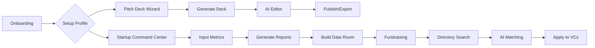
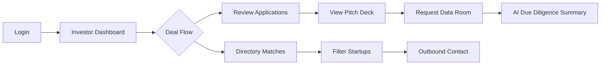
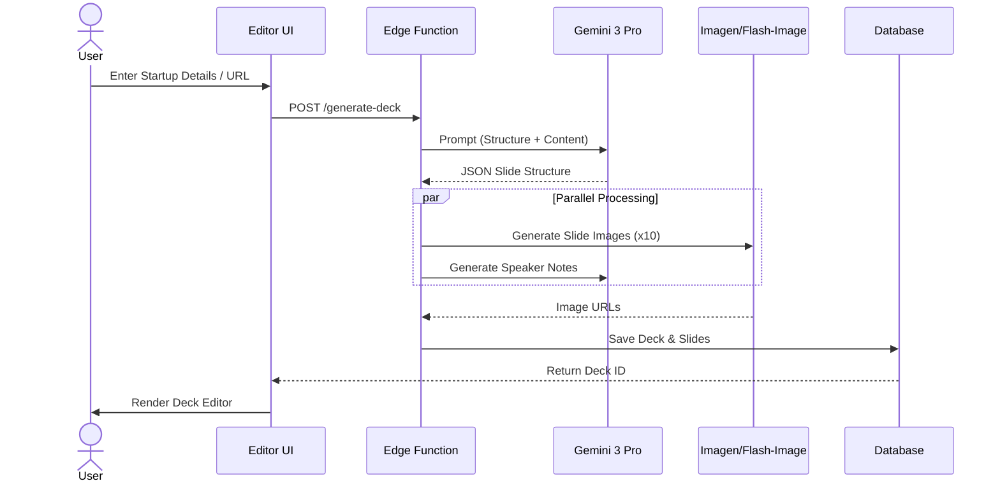
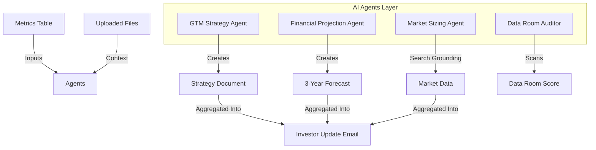
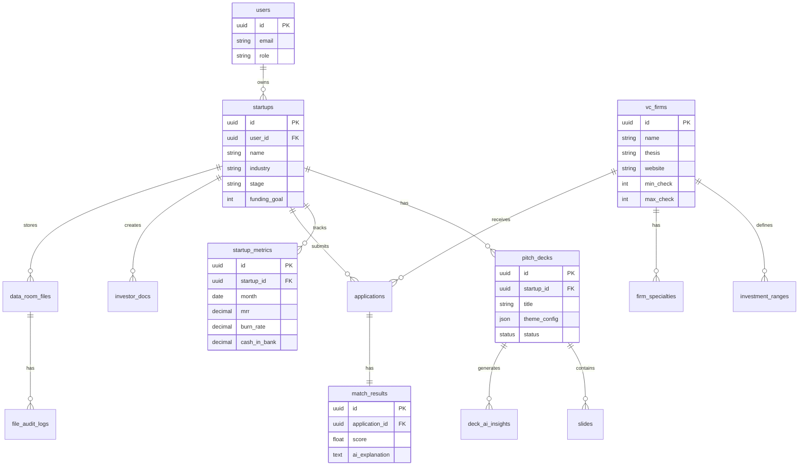
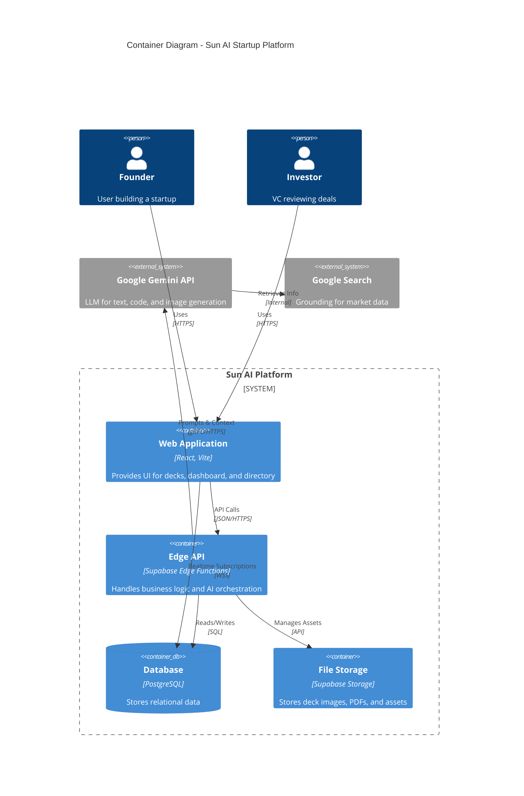

# 📐 Sun AI Startup Platform: Architectural Diagrams & Documentation

**Document Status:** Live System Map  
**Target Audience:** Engineering, Product, & System Architects  
**Scope:** Full-Stack (Frontend, Backend, Database, AI Agents)

This document contains the complete technical visualization of the Sun AI ecosystem, including the Pitch Deck Engine, Command Center, VC Matching, and Data Room.

---

## 1️⃣ High-Level Architecture

This diagram illustrates the cloud-native architecture connecting the React frontend, Supabase backend services, and the Google Gemini AI engine.

```mermaid
graph TD
    subgraph "Client Layer"
        Browser[Web Browser]
        Mobile[Mobile View]
    end

    subgraph "Hosting & CDN (Vercel)"
        Vite[React + Vite App]
    end

    subgraph "Backend Services (Supabase)"
        Auth[Supabase Auth]
        DB[(PostgreSQL Database)]
        Storage[File Storage Buckets]
        Edge[Edge Functions (Node/Deno)]
    end

    subgraph "AI Intelligence Layer (Google Cloud)"
        GeminiFlash[Gemini 2.5 Flash]
        GeminiPro[Gemini 3 Pro]
        Search[Google Search Grounding]
        Embed[Text Embeddings]
    end

    Browser -->|HTTPS| Vite
    Vite -->|API Requests| Edge
    Vite -->|Session/Auth| Auth
    Vite -->|Direct Read (RLS)| DB
    
    Edge -->|Secure Key Access| GeminiPro
    Edge -->|Vector Search| Embed
    Edge -->|Queries| DB
    Edge -->|File Mgmt| Storage
    
    GeminiPro -->|Grounding Request| Search
```

### Key Components
1.  **Frontend:** React/TypeScript hosted on Vercel.
2.  **Backend:** Supabase handles Identity, Database (Postgres), and Storage.
3.  **Middleware:** Edge Functions act as the secure gateway for AI operations.
4.  **AI Engine:** Gemini 3 Pro handles reasoning (Strategy, Matching), while Flash handles high-volume tasks (Chat, summarization).

---

## 2️⃣ User Journey Flows

### A. Founder Journey
The lifecycle of a startup founder using the platform.



### B. Investor / VC Journey
How investors interact with deal flow.



---

## 3️⃣ Workflows & Logic

### A. Pitch Deck AI Agent Workflow
The process of transforming raw ideas into a visual presentation.



### B. VC Matching Engine Logic
How we score the compatibility between a Startup and an Investor.

```mermaid
flowchart TD
    subgraph "Inputs"
        S[Startup Profile]
        V[VC Firm Profile]
    end

    subgraph "Matching Processor (Edge Function)"
        S & V --> A[Data Normalization]
        A --> B{Criteria Check}
        
        B -->|Stage Fit?| C1[Score +]
        B -->|Sector Fit?| C2[Score +]
        B -->|Check Size?| C3[Score +]
        B -->|Geo Fit?| C4[Score +]
        
        C1 & C2 & C3 & C4 --> D[Weighted Calculation]
        D --> E[Gemini Reasoning]
        E -->|Generate| F[Match Explanation]
    end

    F --> G[Final Match Score (0-100%)]
```

### C. Startup Command Center Ecosystem
How data flows between the operational tools.



---

## 4️⃣ Database Entity Relationship Diagram (ERD)

The schema powering the entire platform.



---

## 5️⃣ AI Agent Orchestration

How different specialized agents interact within the system.

```mermaid
sequenceDiagram
    participant User
    participant Orch as Orchestrator (Edge)
    participant GTM as GTM Agent
    participant Fin as Projection Agent
    participant Search as Search Tool
    
    User->>Orch: "Create Fundraising Pack"
    
    rect rgb(20, 20, 20)
        Note right of Orch: Parallel Execution
        Orch->>Search: Research Competitors
        Orch->>Fin: Analyze Historical Metrics
    end
    
    Search-->>Orch: Market Data
    Fin-->>Orch: 3-Year Forecast
    
    Orch->>GTM: Generate Strategy (using Market Data)
    GTM-->>Orch: GTM Plan
    
    Orch->>Orch: Synthesize into One-Pager
    Orch-->>User: Return Complete Data Pack
```



---

## 6️⃣ System C4 Model (Container Level)



---

## 7️⃣ Completeness & Improvements

### ✅ Completeness Checklist
- [x] **Frontend:** React architecture defined.
- [x] **Backend:** Supabase services mapped.
- [x] **Database:** Core entities and relationships defined.
- [x] **AI:** Agent flows and model usage specified.
- [x] **Core Modules:** Pitch Deck, Directory, Command Center workflows included.

### ⚠️ Missing Components List
1.  **Notification Service:** No diagram for email/push notifications (e.g., "Investor viewed your deck").
2.  **Payment Gateway:** Stripe integration architecture is implied but not explicitly diagrammed.
3.  **Analytics Pipeline:** Flow for tracking user behavior (PostHog/Mixpanel) is missing.

### 💡 Recommended Improvements
1.  **Vector Database Integration:** Explicitly map `pgvector` in the ERD for storing embedding vectors of startup descriptions and VC theses to improve matching quality beyond keyword filtering.
2.  **Async Queue System:** For heavy AI tasks (e.g., generating a full video or auditing a massive data room), introduce a job queue (Supabase/PgBoss) to prevent timeouts on Edge Functions.
3.  **Caching Layer:** Add Redis or similar caching for "Market Sizing" results to reduce API costs and latency for repeated queries on similar industries.

