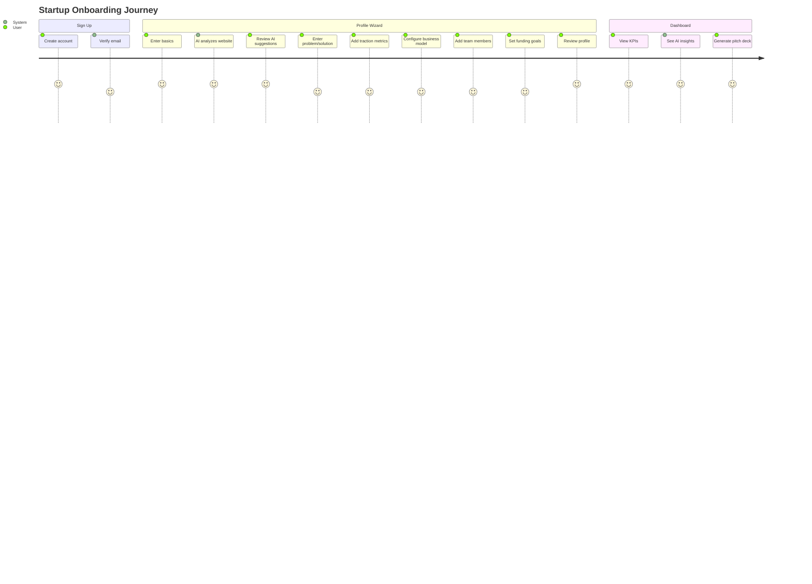
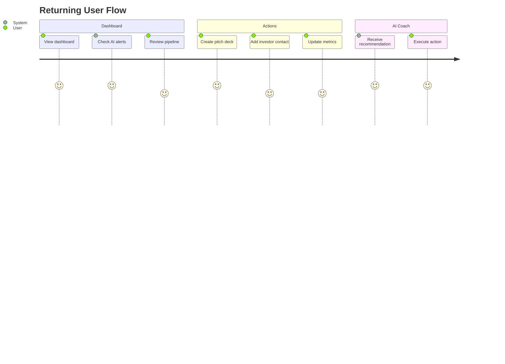
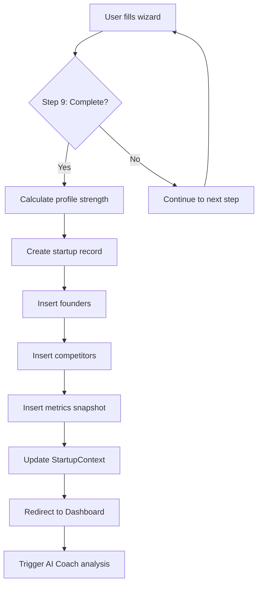
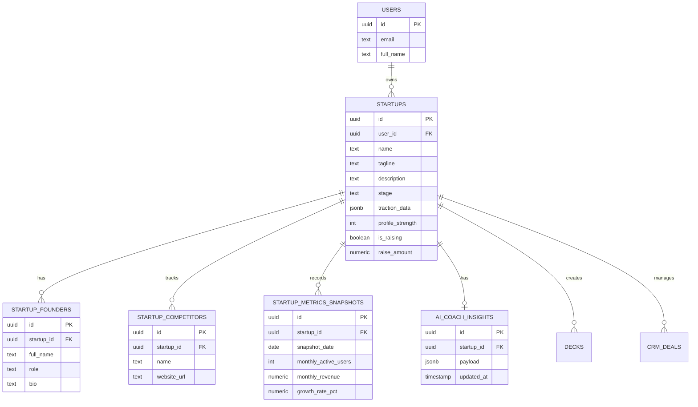
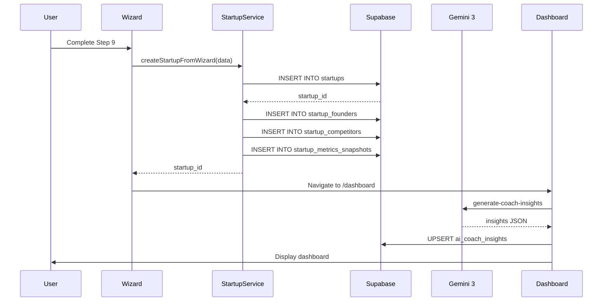
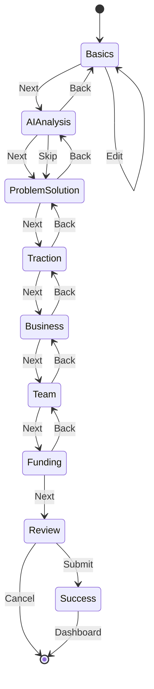

# Startup Profile Wizard & Dashboard - Implementation Plan

**Version:** 1.0  
**Last Updated:** 2025-12-06  
**Status:** 🟡 In Progress (60%)  
**Module:** 02 - Profile Wizard + 11 - Founder Profile  
**Sprint:** S1 (Days 1-7)

---

## 📋 Table of Contents

1. [Overview](#overview)
2. [Feature Matrix](#feature-matrix)
3. [User Journey](#user-journey)
4. [System Architecture](#system-architecture)
5. [Wizard Steps](#wizard-steps)
6. [Gemini 3 AI Integration](#gemini-3-ai-integration)
7. [Database Schema](#database-schema)
8. [Edge Functions](#edge-functions)
9. [Frontend Components](#frontend-components)
10. [Backend Services](#backend-services)
11. [Process Flows](#process-flows)
12. [Mermaid Diagrams](#mermaid-diagrams)
13. [Success Criteria](#success-criteria)
14. [Implementation Checklist](#implementation-checklist)

---

## Overview

### Goal

Create a comprehensive, AI-enhanced onboarding flow that captures startup data and powers the entire StartupAI ecosystem (pitch decks, CRM, documents, investor matching).

### Core Value Proposition

| Problem | Solution |
|---------|----------|
| Fragmented startup data | Single source of truth |
| Manual profile creation | AI-assisted enrichment |
| Low profile completion | Gamified progress tracking |
| Generic advice | Personalized AI Coach |

### Current Status

| Component | Exists | Status | Improvements Needed |
|-----------|--------|--------|---------------------|
| `StartupWizard.tsx` | ✅ | 90% | DB persistence, validation |
| `Dashboard.tsx` | ✅ | 85% | Real data, AI Coach sidebar |
| `FounderProfile.tsx` | ✅ | 80% | Public profile polish |
| Database tables | ✅ | 100% | All startup tables exist |
| Edge Functions | 🟡 | 40% | Need profile enrichment |
| AI Coach | ✅ | 100% | Implemented in docs |

---

## Feature Matrix

### Profile Wizard Features

| Feature | Status | Priority | AI Model |
|---------|--------|----------|----------|
| **Step 1: Basics** | ✅ | P0 | - |
| **Step 2: AI Analysis** | ✅ | P0 | Gemini 3 Pro |
| **Step 3: Problem/Solution** | ✅ | P0 | Gemini 2.5 Flash |
| **Step 4: Stage & Traction** | ✅ | P0 | - |
| **Step 5: Business Model** | ✅ | P0 | - |
| **Step 6: Team** | ✅ | P0 | - |
| **Step 7: Funding** | ✅ | P0 | - |
| **Step 8: Review** | ✅ | P0 | - |
| **Step 9: Success** | ✅ | P0 | - |
| Database Save | 🔴 | P0 | - |
| Logo Upload | 🔴 | P1 | - |
| Edit Mode | 🔴 | P1 | - |
| Profile Strength Score | 🟡 | P0 | - |

### Dashboard Features

| Feature | Status | Priority |
|---------|--------|----------|
| KPI Cards (MRR, Runway, Growth) | ✅ | P0 |
| Tabs (Overview, Workflows, Insights) | ✅ | P0 |
| Activity Timeline | ✅ | P0 |
| Fundraising Pipeline | ✅ | P0 |
| Workflow Cards | ✅ | P0 |
| AI Insights Tab | ✅ | P0 |
| Opportunity Score | ✅ | P1 |
| Next Best Action | ✅ | P1 |
| Real Data from DB | 🔴 | P0 |
| AI Coach Sidebar | 🟡 | P1 |

---

## User Journey

### New User Onboarding Flow



### Returning User Flow



---

## System Architecture

### High-Level Architecture

```
┌─────────────────────────────────────────────────────────────────────────────┐
│                         PROFILE & DASHBOARD SYSTEM                          │
├─────────────────────────────────────────────────────────────────────────────┤
│                                                                             │
│  ┌───────────────────────────────────────────────────────────────────────┐  │
│  │                         FRONTEND (React)                              │  │
│  │                                                                       │  │
│  │  ┌─────────────┐  ┌─────────────┐  ┌─────────────┐  ┌─────────────┐ │  │
│  │  │  Startup    │  │  Dashboard  │  │  Founder    │  │    AI       │ │  │
│  │  │   Wizard    │  │             │  │   Profile   │  │   Coach     │ │  │
│  │  │  (9 Steps)  │  │  (3 Tabs)   │  │  (Public)   │  │  Sidebar    │ │  │
│  │  └──────┬──────┘  └──────┬──────┘  └──────┬──────┘  └──────┬──────┘ │  │
│  │         │                │                │                │         │  │
│  │         └────────────────┼────────────────┼────────────────┘         │  │
│  │                          │                │                          │  │
│  │  ┌───────────────────────┴────────────────┴───────────────────────┐ │  │
│  │  │                    StartupContext (Global State)               │ │  │
│  │  │                                                                 │ │  │
│  │  │   profile: StartupProfile                                       │ │  │
│  │  │   updateProfile(data)                                           │ │  │
│  │  │   saveToDatabase()                                              │ │  │
│  │  │   refreshFromDatabase()                                         │ │  │
│  │  └─────────────────────────────┬───────────────────────────────────┘ │  │
│  │                                │                                     │  │
│  └────────────────────────────────┼─────────────────────────────────────┘  │
│                                   │                                        │
│  ┌────────────────────────────────┼────────────────────────────────────┐  │
│  │                         SERVICE LAYER                               │  │
│  │                                │                                    │  │
│  │  ┌─────────────────────────────┴─────────────────────────────────┐ │  │
│  │  │                   startupService.ts                           │ │  │
│  │  │                                                               │ │  │
│  │  │   createStartup(data)        getStartup(id)                   │ │  │
│  │  │   updateStartup(id, data)    getPublicProfile(username)       │ │  │
│  │  │   addFounder(startupId)      updateMetrics(id, data)          │ │  │
│  │  │   addCompetitor(startupId)   calculateProfileStrength()       │ │  │
│  │  └───────────────────────────────────────────────────────────────┘ │  │
│  │                                │                                    │  │
│  └────────────────────────────────┼────────────────────────────────────┘  │
│                                   │                                        │
│  ┌────────────────────────────────┼────────────────────────────────────┐  │
│  │                      EDGE FUNCTIONS (Deno)                          │  │
│  │                                │                                    │  │
│  │  ┌─────────────┐  ┌─────────────┐  ┌─────────────┐  ┌─────────────┐│  │
│  │  │ enrich-     │  │ generate-   │  │ strategic-  │  │ suggest-    ││  │
│  │  │ startup-    │  │ coach-      │  │ analysis    │  │ deck-       ││  │
│  │  │ profile     │  │ insights    │  │             │  │ focus       ││  │
│  │  └──────┬──────┘  └──────┬──────┘  └──────┬──────┘  └──────┬──────┘│  │
│  │         │                │                │                │        │  │
│  │         └────────────────┼────────────────┼────────────────┘        │  │
│  │                          │                │                          │  │
│  │  ┌───────────────────────┴────────────────┴────────────────────────┐│  │
│  │  │                    GEMINI 3 PRO / FLASH                         ││  │
│  │  │                                                                 ││  │
│  │  │  ✅ Thinking (High)     ✅ Google Search   ✅ URL Context       ││  │
│  │  │  ✅ Structured Output   ✅ Function Calling                     ││  │
│  │  └─────────────────────────────────────────────────────────────────┘│  │
│  │                                                                      │  │
│  └──────────────────────────────────────────────────────────────────────┘  │
│                                                                             │
│  ┌──────────────────────────────────────────────────────────────────────┐  │
│  │                           SUPABASE                                    │  │
│  │                                                                       │  │
│  │  ┌────────────┐  ┌────────────┐  ┌────────────┐  ┌────────────────┐ │  │
│  │  │  startups  │  │  startup_  │  │  startup_  │  │ ai_coach_      │ │  │
│  │  │            │  │  founders  │  │  metrics   │  │ insights       │ │  │
│  │  └────────────┘  └────────────┘  └────────────┘  └────────────────┘ │  │
│  │                                                                       │  │
│  └──────────────────────────────────────────────────────────────────────┘  │
│                                                                             │
└─────────────────────────────────────────────────────────────────────────────┘
```

---

## Wizard Steps

### Step-by-Step Breakdown

| Step | Name | Fields | AI Assist | Database Tables |
|------|------|--------|-----------|-----------------|
| 1 | **Basics** | name, website, pitch, logo | ❌ | `startups` |
| 2 | **AI Analysis** | (auto) tagline, solution, mission | ✅ Gemini 3 Pro | - |
| 3 | **Problem/Solution** | problem, solution, targetCustomers | ✅ Improve | `startups` |
| 4 | **Stage & Traction** | stage, status, MAU, revenue, growth | ❌ | `startups`, `startup_metrics_snapshots` |
| 5 | **Business Model** | model[], pricing, competitors[], UVP | ❌ | `startups`, `startup_competitors` |
| 6 | **Team** | teamSize, founders[] | ❌ | `startup_founders` |
| 7 | **Funding** | raising, amount, useOfFunds[], goals | ❌ | `startups` |
| 8 | **Review** | (all) - readonly | ❌ | - |
| 9 | **Success** | redirect to dashboard | ❌ | - |

### Wizard State Interface

```typescript
interface WizardState {
  // Step 1: Basics
  name: string;
  website: string;
  pitch: string;           // tagline
  logo: string | null;
  
  // Step 3: Problem/Solution
  problem: string;
  solution: string;
  targetCustomers: string[];
  
  // Step 4: Traction
  stage: 'Idea' | 'MVP' | 'Pre-Seed' | 'Seed' | 'Series A+' | 'Growth';
  tractionStatus: 'Pre-launch' | 'Early users' | 'Paying customers' | 'Growing revenue';
  mau: string;             // Monthly Active Users
  revenue: string;         // Monthly Revenue
  growth: string;          // Growth Rate %
  
  // Step 5: Business
  businessModel: string[];
  pricing: string;
  competitors: string[];
  uvp: string;             // Unique Value Proposition
  
  // Step 6: Team
  teamSize: 'Solo' | '2–5' | '6–15' | '16+';
  founders: Founder[];
  
  // Step 7: Funding
  raising: boolean;
  raiseAmount: number;
  useOfFunds: string[];
  goals: { short: string; mid: string; major: string };
}

interface Founder {
  name: string;
  role: 'CEO' | 'CTO' | 'COO' | 'CMO' | 'Founder';
  bio: string;
}
```

---

## Gemini 3 AI Integration

### AI Features by Step

| Step | AI Feature | Model | Tool | Output |
|------|------------|-------|------|--------|
| 2 | Profile Enrichment | Gemini 3 Pro | URL Context | tagline, description, mission |
| 3 | Problem Improvement | Gemini 2.5 Flash | - | Refined problem statement |
| Dashboard | AI Coach Insights | Gemini 3 Pro | Google Search + Thinking | insights[], alerts[], recommendations[] |
| Profile | Strategic Analysis | Gemini 3 Pro | Google Search | SWOT, market position |
| Profile | Deck Focus | Gemini 3 Pro | - | Suggested deck strategy |

### Edge Function: `enrich-startup-profile`

```typescript
// supabase/functions/enrich-startup-profile/index.ts

import { GoogleGenAI, Type } from "npm:@google/genai@1.29.0";

const enrichmentSchema = {
  type: Type.OBJECT,
  properties: {
    tagline: { type: Type.STRING, description: "A punchy, investor-ready tagline (< 140 chars)" },
    description: { type: Type.STRING, description: "2-3 sentence company description" },
    mission: { type: Type.STRING, description: "Company mission/vision statement" },
    industry: { type: Type.STRING, description: "Primary industry category" },
    targetAudience: { type: Type.ARRAY, items: { type: Type.STRING } },
    competitors: { type: Type.ARRAY, items: { type: Type.STRING } }
  },
  required: ["tagline", "description", "mission"]
};

Deno.serve(async (req) => {
  const { name, website, pitch } = await req.json();

  const ai = new GoogleGenAI({ apiKey: Deno.env.get('GEMINI_API_KEY') });

  const prompt = `
    Analyze this startup and create an investor-ready profile:
    
    Company: ${name}
    Website: ${website}
    Initial Pitch: ${pitch}
    
    If a website is provided, analyze its content to understand the product.
    Generate a professional tagline, description, and mission statement.
  `;

  const response = await ai.models.generateContent({
    model: 'gemini-3-pro-preview',
    contents: prompt,
    config: {
      tools: [{ urlContext: {} }],  // Enable website analysis
      thinkingLevel: 'high',
      responseMimeType: 'application/json',
      responseSchema: enrichmentSchema
    }
  });

  return new Response(response.text, {
    headers: { 'Content-Type': 'application/json' }
  });
});
```

### AI Coach Insights (Existing)

Reference: `01-docs/81-startup-copilot.md`

```typescript
// Output Schema
interface CoachResponse {
  insights: {
    type: 'positive' | 'negative' | 'neutral';
    category: 'growth' | 'finance' | 'fundraising';
    title: string;
    description: string;
    metric_highlight?: string;
  }[];
  alerts: {
    severity: 'high' | 'medium';
    message: string;
    subtext: string;
  }[];
  recommendations: {
    action_id: string;
    label: string;
    reason: string;
  }[];
  match_score: number;
}
```

---

## Database Schema

**Status:** ✅ Verified against Supabase (2025-12-07)

### Tables Used

#### startups (Core) ✅

```sql
-- Actual schema from Supabase (extended via migration)
CREATE TABLE startups (
  id              UUID PRIMARY KEY DEFAULT gen_random_uuid(),
  user_id         UUID REFERENCES auth.users(id),
  org_id          UUID REFERENCES orgs(id),
  
  -- Basics (Step 1)
  name            TEXT NOT NULL,
  tagline         TEXT,                    -- pitch/tagline
  description     TEXT,                    -- company description
  website_url     TEXT,
  logo_url        TEXT,
  cover_image_url TEXT,                    -- hero/banner image
  year_founded    INTEGER,
  industry        TEXT,                    -- primary industry category
  
  -- Problem/Solution (Step 3)
  problem         TEXT,                    -- problem statement
  solution        TEXT,                    -- solution description
  target_customers TEXT[],                 -- customer segments
  
  -- Traction (Step 4)
  stage           TEXT CHECK (stage IN ('Idea', 'MVP', 'Pre-Seed', 'Seed', 'Series A+', 'Growth')),
  traction_data   JSONB DEFAULT '{}',      -- {status, mau, revenue, growth}
  
  -- Business (Step 5)
  business_model  TEXT[],                  -- ['SaaS', 'Marketplace', etc.]
  pricing_model   TEXT,
  unique_value    TEXT,                    -- UVP
  
  -- Team (Step 6)
  team_data       JSONB DEFAULT '{}',      -- {size: 'Solo'|'2-5'|'6-15'|'16+'}
  
  -- Funding (Step 7)
  is_raising      BOOLEAN DEFAULT false,
  raise_amount    NUMERIC,
  use_of_funds    TEXT[],
  needs_data      JSONB DEFAULT '{}',      -- {short, mid, major goals}
  
  -- Meta
  profile_strength INTEGER DEFAULT 0 CHECK (profile_strength >= 0 AND profile_strength <= 100),
  is_public       BOOLEAN DEFAULT false,
  created_at      TIMESTAMPTZ DEFAULT NOW(),
  updated_at      TIMESTAMPTZ DEFAULT NOW()
);

-- RLS Policy (enabled)
ALTER TABLE startups ENABLE ROW LEVEL SECURITY;
CREATE POLICY "Users can manage own startups" ON startups
  FOR ALL USING (user_id = auth.uid());
```

#### startup_founders ✅

```sql
CREATE TABLE startup_founders (
  id          UUID PRIMARY KEY DEFAULT gen_random_uuid(),
  startup_id  UUID REFERENCES startups(id) ON DELETE CASCADE,
  full_name   TEXT NOT NULL,
  role        TEXT,                       -- CEO, CTO, COO, CMO, Founder
  bio         TEXT,
  linkedin_url TEXT,
  email       TEXT,
  avatar_url  TEXT,
  created_at  TIMESTAMPTZ DEFAULT NOW()
);
```

#### startup_competitors ✅

```sql
CREATE TABLE startup_competitors (
  id          UUID PRIMARY KEY DEFAULT gen_random_uuid(),
  startup_id  UUID REFERENCES startups(id) ON DELETE CASCADE,
  name        TEXT NOT NULL,
  website_url TEXT,
  notes       TEXT,
  created_at  TIMESTAMPTZ DEFAULT NOW()
);
```

#### startup_metrics_snapshots ✅

```sql
CREATE TABLE startup_metrics_snapshots (
  id              UUID PRIMARY KEY DEFAULT gen_random_uuid(),
  startup_id      UUID REFERENCES startups(id) ON DELETE CASCADE,
  snapshot_date   DATE DEFAULT CURRENT_DATE,
  monthly_active_users INTEGER,
  monthly_revenue NUMERIC,
  growth_rate_pct NUMERIC,
  created_at      TIMESTAMPTZ DEFAULT NOW()
);
```

#### startup_links ✅

```sql
-- Additional links table (exists in DB)
CREATE TABLE startup_links (
  id          UUID PRIMARY KEY DEFAULT gen_random_uuid(),
  startup_id  UUID REFERENCES startups(id) ON DELETE CASCADE,
  kind        TEXT CHECK (kind IN ('pitch_deck', 'demo', 'docs', 'linkedin', 'x', 'website', 'other')),
  label       TEXT,
  url         TEXT NOT NULL,
  created_at  TIMESTAMPTZ DEFAULT NOW()
);
```

#### ai_coach_insights ✅

```sql
CREATE TABLE ai_coach_insights (
  id              UUID PRIMARY KEY DEFAULT gen_random_uuid(),
  startup_id      UUID REFERENCES startups(id) ON DELETE CASCADE,
  payload         JSONB NOT NULL DEFAULT '{}',
  insights        JSONB DEFAULT '[]',      -- [{type, category, title, description}]
  alerts          JSONB DEFAULT '[]',      -- [{severity, message, subtext}]
  recommendations JSONB DEFAULT '[]',      -- [{action_id, label, reason}]
  match_score     INTEGER CHECK (match_score >= 0 AND match_score <= 100),
  created_at      TIMESTAMPTZ DEFAULT NOW(),
  updated_at      TIMESTAMPTZ DEFAULT NOW(),
  UNIQUE(startup_id)
);

-- RLS Policy
ALTER TABLE ai_coach_insights ENABLE ROW LEVEL SECURITY;
CREATE POLICY "Users can manage coach insights for own startups" ON ai_coach_insights
  FOR ALL USING (
    startup_id IN (SELECT id FROM startups WHERE user_id = auth.uid())
  );
```

### Schema Comparison

| Field | Doc | DB | Status |
|-------|-----|-----|--------|
| `name` | ✅ | ✅ | ✅ Match |
| `tagline` | ✅ | ✅ | ✅ Match |
| `website_url` | ✅ | ✅ | ✅ Match |
| `logo_url` | ✅ | ✅ | ✅ Match |
| `cover_image_url` | ❌ | ✅ | ⚠️ Added to DB |
| `year_founded` | ❌ | ✅ | ⚠️ Added to DB |
| `industry` | ✅ | ✅ | ✅ Match |
| `problem` | ✅ | ✅ | ✅ Match |
| `solution` | ✅ | ✅ | ✅ Match |
| `target_customers` | ✅ | ✅ | ✅ Match |
| `stage` | ✅ | ✅ | ✅ Match |
| `business_model` | ✅ | ✅ | ✅ Match |
| `pricing_model` | ✅ | ✅ | ✅ Match |
| `unique_value` | ✅ | ✅ | ✅ Match |
| `is_raising` | ✅ | ✅ | ✅ Match |
| `raise_amount` | ✅ | ✅ | ✅ Match |
| `use_of_funds` | ✅ | ✅ | ✅ Match |
| `profile_strength` | ✅ | ✅ | ✅ Match |

---

## Edge Functions

### Required Functions

| Function | Model | Purpose | Status |
|----------|-------|---------|--------|
| `enrich-startup-profile` | Gemini 3 Pro | Website analysis + profile generation | 🔴 |
| `generate-coach-insights` | Gemini 3 Pro | AI Coach insights | ✅ |
| `improve-problem-statement` | Gemini 2.5 Flash | Refine problem/solution text | 🔴 |
| `strategic-analysis` | Gemini 3 Pro | SWOT + market position | ✅ (in investor-ai) |
| `suggest-deck-focus` | Gemini 3 Pro | Deck strategy based on profile | ✅ (in investor-ai) |

---

## Frontend Components

### Component Tree

```
📁 screens/
├── StartupWizard.tsx        ✅ (9 steps, needs DB save)
├── Dashboard.tsx            ✅ (3 tabs, needs real data)
└── FounderProfile.tsx       ✅ (public profile)

📁 components/wizard/
├── WizardCard.tsx           ✅ (card container)
├── WizardInput.tsx          ✅ (form input)
├── WizardTextArea.tsx       ✅ (textarea)
├── SelectChip.tsx           ✅ (multi-select chip)
├── NavButton.tsx            ✅ (next/back buttons)
└── StepProgress.tsx         🔴 (progress indicator)

📁 components/dashboard/
├── KPICard.tsx              ✅ (metric card)
├── WorkflowCard.tsx         ✅ (action card)
├── AIInsightCard.tsx        ✅ (insight card)
├── ActivityItem.tsx         ✅ (timeline item)
├── OpportunityScore.tsx     ✅ (circular progress)
└── NextBestAction.tsx       ✅ (CTA card)

📁 components/founder/
├── ProfileSidebar.tsx       ✅ (left sidebar)
├── StartupMainCard.tsx      ✅ (main info card)
├── StrategicAnalysisSection.tsx ✅ (AI analysis)
└── DeckStrategySection.tsx  ✅ (deck focus)

📁 components/coach/
├── StartupCoachSidebar.tsx  🔴 (AI coach panel)
├── InsightCard.tsx          🔴 (insight display)
├── AlertBadge.tsx           🔴 (alert indicator)
└── ActionButton.tsx         🔴 (recommendation CTA)
```

---

## Backend Services

### startupService.ts

```typescript
// src/services/startupService.ts

import { supabase } from '@/lib/supabaseClient';
import { WizardState, Founder } from '@/types/startup';

// Create startup from wizard
export async function createStartupFromWizard(data: WizardState): Promise<string> {
  const { data: { user } } = await supabase.auth.getUser();
  if (!user) throw new Error('Not authenticated');

  // 1. Create startup record
  const { data: startup, error } = await supabase
    .from('startups')
    .insert({
      user_id: user.id,
      name: data.name,
      tagline: data.pitch,
      description: data.solution,
      website_url: data.website,
      logo_url: data.logo,
      stage: data.stage,
      traction_data: {
        status: data.tractionStatus,
        mau: parseInt(data.mau) || 0,
        revenue: parseInt(data.revenue) || 0,
        growth: parseInt(data.growth) || 0
      },
      business_model: data.businessModel,
      pricing_model: data.pricing,
      unique_value: data.uvp,
      team_data: { size: data.teamSize },
      is_raising: data.raising,
      raise_amount: data.raising ? data.raiseAmount : null,
      use_of_funds: data.useOfFunds,
      needs_data: data.goals,
      profile_strength: calculateProfileStrength(data)
    })
    .select()
    .single();

  if (error) throw error;

  // 2. Insert founders
  if (data.founders.length > 0) {
    const founders = data.founders.map(f => ({
      startup_id: startup.id,
      full_name: f.name,
      role: f.role,
      bio: f.bio
    }));
    
    await supabase.from('startup_founders').insert(founders);
  }

  // 3. Insert competitors
  const competitors = data.competitors.filter(c => c.trim());
  if (competitors.length > 0) {
    await supabase.from('startup_competitors').insert(
      competitors.map(name => ({
        startup_id: startup.id,
        name
      }))
    );
  }

  // 4. Insert initial metrics snapshot
  await supabase.from('startup_metrics_snapshots').insert({
    startup_id: startup.id,
    monthly_active_users: parseInt(data.mau) || 0,
    monthly_revenue: parseInt(data.revenue) || 0,
    growth_rate_pct: parseInt(data.growth) || 0
  });

  return startup.id;
}

// Calculate profile strength (0-100)
export function calculateProfileStrength(data: Partial<WizardState>): number {
  let score = 0;
  const weights = {
    name: 10,
    website: 5,
    pitch: 10,
    logo: 5,
    problem: 10,
    solution: 10,
    stage: 5,
    mau: 5,
    revenue: 5,
    businessModel: 10,
    competitors: 5,
    founders: 10,
    raising: 5,
    goals: 5
  };

  if (data.name) score += weights.name;
  if (data.website) score += weights.website;
  if (data.pitch && data.pitch.length > 20) score += weights.pitch;
  if (data.logo) score += weights.logo;
  if (data.problem && data.problem.length > 50) score += weights.problem;
  if (data.solution && data.solution.length > 50) score += weights.solution;
  if (data.stage) score += weights.stage;
  if (data.mau) score += weights.mau;
  if (data.revenue) score += weights.revenue;
  if (data.businessModel?.length) score += weights.businessModel;
  if (data.competitors?.filter(c => c).length) score += weights.competitors;
  if (data.founders?.length && data.founders[0]?.name) score += weights.founders;
  if (typeof data.raising === 'boolean') score += weights.raising;
  if (data.goals?.short || data.goals?.mid) score += weights.goals;

  return Math.min(100, score);
}

// Get startup by ID
export async function getStartup(id: string) {
  const { data, error } = await supabase
    .from('startups')
    .select(`
      *,
      startup_founders(*),
      startup_competitors(*),
      startup_metrics_snapshots(*)
    `)
    .eq('id', id)
    .single();

  if (error) throw error;
  return data;
}

// Update startup
export async function updateStartup(id: string, data: Partial<WizardState>) {
  const { error } = await supabase
    .from('startups')
    .update({
      name: data.name,
      tagline: data.pitch,
      description: data.solution,
      website_url: data.website,
      stage: data.stage,
      profile_strength: calculateProfileStrength(data),
      updated_at: new Date().toISOString()
    })
    .eq('id', id);

  if (error) throw error;
}
```

---

## Process Flows

### Wizard Completion Flow



### AI Enrichment Flow

```mermaid
flowchart TD
    A[User enters basics] --> B[Click "Analyze"]
    B --> C[Call enrich-startup-profile]
    C --> D{Website provided?}
    
    D -->|Yes| E[Gemini 3 Pro + URL Context]
    D -->|No| F[Gemini 3 Pro text-only]
    
    E --> G[Parse website content]
    G --> H[Generate enriched profile]
    
    F --> H
    
    H --> I[Return JSON]
    I --> J[Display suggestions]
    J --> K{User accepts?}
    
    K -->|Yes| L[Update wizard state]
    K -->|No| M[Keep original]
    
    L --> N[Continue wizard]
    M --> N
```

### Dashboard Data Flow

```mermaid
flowchart TD
    A[Dashboard mounts] --> B[Check StartupContext]
    B --> C{Has startup?}
    
    C -->|No| D[Show "Create Profile" CTA]
    C -->|Yes| E[Fetch startup data]
    
    E --> F[Load KPIs]
    F --> G[Load activity]
    G --> H[Load pipeline]
    H --> I[Load AI insights]
    
    I --> J{Insights fresh?}
    J -->|No| K[Trigger AI Coach refresh]
    K --> L[Update cache]
    L --> M[Render dashboard]
    
    J -->|Yes| M
```

---

## Mermaid Diagrams

### ERD: Startup Profile System



### Sequence: Wizard Completion



### State Machine: Profile Wizard



---

## Success Criteria

### Functional Requirements

| Criteria | Target | Test |
|----------|--------|------|
| Wizard completion rate | > 80% | Analytics |
| Profile strength avg | > 70% | DB query |
| AI enrichment usage | > 60% | Analytics |
| Dashboard load time | < 2s | Performance |
| AI Coach refresh | < 10s | Timing |

### Acceptance Tests

- [ ] User can complete all 9 wizard steps
- [ ] Data persists to database on completion
- [ ] AI enrichment generates valid suggestions
- [ ] Profile strength calculates correctly
- [ ] Dashboard shows real startup data
- [ ] AI Coach displays insights
- [ ] Public profile page works
- [ ] Edit mode allows updates
- [ ] Logo upload works
- [ ] Metrics snapshots record history

---

## Implementation Checklist

### Phase 1: Database Persistence (Day 1-2)

- [ ] Add `createStartupFromWizard()` to service
- [ ] Connect wizard Step 9 to service
- [ ] Test full wizard → database flow
- [ ] Implement profile strength calculation
- [ ] Add logo upload (Supabase Storage)

### Phase 2: AI Enrichment (Day 3)

- [ ] Create `enrich-startup-profile` Edge Function
- [ ] Test URL Context with real websites
- [ ] Connect wizard Step 2 to Edge Function
- [ ] Handle AI errors gracefully

### Phase 3: Dashboard Real Data (Day 4-5)

- [ ] Connect KPIs to startup metrics
- [ ] Connect activity to audit_log
- [ ] Connect pipeline to crm_deals
- [ ] Implement AI Coach sidebar
- [ ] Add refresh functionality

### Phase 4: Polish (Day 6-7)

- [ ] Edit mode for existing startups
- [ ] Improve mobile responsiveness
- [ ] Add loading states everywhere
- [ ] Error handling + retry logic
- [ ] E2E testing

---

## Quick Reference

### Key Files

| File | Purpose |
|------|---------|
| `screens/StartupWizard.tsx` | 9-step onboarding wizard |
| `screens/Dashboard.tsx` | Main dashboard (3 tabs) |
| `screens/FounderProfile.tsx` | Public profile page |
| `src/services/startupService.ts` | Database operations |
| `src/contexts/StartupContext.tsx` | Global state |
| `supabase/functions/enrich-startup-profile` | AI enrichment |
| `supabase/functions/generate-coach-insights` | AI coach |

### API Endpoints

| Edge Function | Method | Input | Output |
|--------------|--------|-------|--------|
| `enrich-startup-profile` | POST | name, website, pitch | EnrichedProfile |
| `generate-coach-insights` | POST | startup_id | CoachResponse |
| `improve-problem-statement` | POST | text | improved_text |

---

## Figma Make AI Prompts

### Prompt 1: Startup Profile Dashboard

```markdown
Design a clean, modern, responsive **Startup Profile Dashboard** for founders.  

Use SaaS aesthetics (Linear / Notion / Vercel), soft shadows, white cards, violet/indigo accents for AI features, and Inter/Söhne typography.

Include clear hierarchy, auto-layout, card grids, right-side AI Assistant panel, and sample startup data.

---

# 🧭 DASHBOARD LAYOUT STRUCTURE

## 1. Header

- Logo + "StartupAI"
- Global search: "Search projects…"
- Notifications icon
- User avatar dropdown (name: Alex D.)
- Subtle divider

---

## 2. Hero Section (Startup Snapshot)

Top left card summarizing the startup:

**Card Title:** Startup Profile  

**Content:**
- Logo placeholder (circle)  
- Name: *SkyOffice*  
- Tagline: *Virtual HQ for async & remote-first teams*  
- Tags: SaaS / Seed Stage / B2B  
- Edit Profile button (secondary)  

---

## 3. Quick Actions Row (Horizontal)

Design 6 small action cards with icons:

1. **✨ Generate Pitch Deck**  
2. **📝 Create One-Pager**  
3. **📊 Market Sizing (TAM/SAM/SOM)**  
4. **🚀 GTM Strategy**  
5. **📁 Data Room Setup**  
6. **📬 Investor Outreach Tools**

Each card: icon + title + small subtitle + hover elevation.

---

## 4. AI Insights Panel (Right Sidebar)

Title: **Gemini 3 — AI Insights**  
Accent background: subtle violet gradient.

### Content:

**Startup Summary**  
- "SkyOffice provides virtual HQ rooms to improve remote team collaboration."

**Detected Risks**  
- Low pricing clarity  
- Missing competitor detail  
- No traction metrics added

**Recommended Next Steps**  
- Add competitors for stronger positioning  
- Provide traction for better investor readiness  
- Generate your pitch deck

**Buttons:**  
- Generate Tasks  
- Improve Profile  
- Ask Gemini Anything

---

## 5. Cards Section — 3 Columns (Core Startup Data)

### A. Problem & Solution Card

**Title:** Problem + Solution  

**Sample Data:**  
- Problem: "Remote teams struggle with fragmented workflows and async burnout."  
- Solution: "A virtual HQ that unifies communication, standups, and task workflows."

---

### B. Target Market Card

**Title:** Target Market  

**Content:**  
- SMB + Mid-market tech companies  
- 20–500 employees  
- Regions: USA, Canada, Europe  
- AI note: "Based on your industry, typical TAM is $4.5B."

---

### C. Key Features Card

**Title:** Product Features  

Bullet list with icons:  
- Virtual HQ Rooms  
- Async Standups  
- Unified Activity Feed  
- Meeting Playback  
- Integrations: Slack, Notion, Jira

---

## 6. Additional Cards Row (Business Model + Team + Metrics)

### A. Business Model Card

**Title:** Business Model  

Sample data:  
- Pricing: Subscription (per team, per workspace)  
- Revenue: $49 / month starter  
- Customer Type: B2B SaaS  
- AI Suggestion: "Consider annual billing incentives."

---

### B. Founder & Team Card

**Title:** Founder & Team  

Sample Data:
- **Alex Johnson — CEO**  
  Background: ex-Slack PM / Remote systems expert  
- **Maria Chen — CTO**  
  Background: ML Engineer, ex-Notion  

Button: Add Co-Founder

---

### C. Traction & Metrics Card

**Title:** Traction  

Sample Data:
- Monthly Active Users: **1,250**  
- MRR: **$12,400**  
- Growth (MoM): **14%**  
- Waitlist: **3,100** users  
- Partners: RemoteWorks, Async.org  

AI Insight: "Growth rate indicates strong early traction."

---

## 7. Competitors Card (Full Width)

**Competitors:**  
- Slack  
- Zoom  
- Gather  
- Microsoft Teams  

**Positioning Notes**  
- Differentiator: "More async-first and task-integrated than Slack or Zoom."

Add competitor comparison toggle button.

---

## 8. Recommended Workflows Section

Horizontal workflow cards for:

1. **Fundraising Workflow**  
   "Get ready to pitch investors. Generates tasks, pitch deck, and updates."  

2. **GTM Workflow**  
   "Launch your product with channel strategy, messaging, and ICP analysis."  

3. **Product Roadmap Workflow**  
   "Define features, prioritization, and milestone planning."  

Each card: icon + title + CTA.

---

## 9. Footer Section

Small links:  
- Docs  
- Support  
- Privacy  
- Terms

---

# 🎨 COMPONENTS TO GENERATE

- Card layouts (SaaS style)  
- Right sidebar AI panel  
- 3-column responsive grid  
- Quick action buttons  
- Icons for features + workflows  
- Tags + pills + status indicators  
- Data visualization placeholders (simple bar or sparkline for metrics)  

---

# 📱 RESPONSIVE RULES

- Desktop: main content left, AI sidebar right  
- Tablet: sidebar collapses under content  
- Mobile: stacked cards, simplified header  

---

# ✔️ FINAL INSTRUCTIONS

Create the **entire Startup Profile Dashboard UI**, including:  
- Hero card  
- All sections, cards, grids  
- AI Insights sidebar  
- Quick actions row  
- Sample data  
- Clean spacing & alignment  

Use auto-layout, minimal noise, and professional SaaS design patterns.
```

---

### Prompt 2: Startup Profile Wizard (5 Steps)

```markdown
Design a complete, modern, responsive **Startup Profile Wizard** with 5 steps.  

Use clean SaaS UI patterns (Linear / Notion style), clear hierarchy, and integrated **Gemini 3 AI features** (URL Context Extraction, Search Grounding, File Search, AI Reasoning, Structured Outputs).

Use auto-layout, minimal spacing (8–32px), rounded corners (12–16px), and Inter/Söhne typography.  
Use subtle violet/indigo accents for AI-related elements.

---

# 🧭 WIZARD OVERVIEW (5 STEPS)

1. **Context**  
2. **Founder & Team**  
3. **Business Fundamentals**  
4. **Traction & Metrics**  
5. **AI Summary**

Each step must include hero title, description, content card, sidebar AI panel (where applicable), and bottom navigation (Back / Continue).

---

# 🔵 STEP 1 — CONTEXT  

**Goal:** Capture raw startup description + website for Gemini extraction.

### Layout

- Large multiline text box with placeholder:  
  "Describe your startup…"
- Website URL field with Analyze button
- Under the text box: **AI Structured Output Tags**  
  - Problem  
  - Target Audience  
  - Core Solution  
  - Features  
  - Pricing Model  
  (Inactive → Active when AI detects them)

### Right-Side AI Panel (Gemini 3)

- AI Reasoning bubble: "Analyzing your description…"  
- URL Context Extraction card: tagline, features, pricing, product summary  
- Suggestion buttons:  
  - Improve clarity  
  - Rewrite for investors  
  - Make concise

---

# 🟣 STEP 2 — FOUNDER & TEAM  

**Goal:** Gather founder info for pitch decks & personalization.

### Fields

- Founder Name  
- Role / Title  
- Short Bio  
- LinkedIn URL  
- Email  
- Optional: Add Co-founder button

### AI Enhancements

- "Rewrite bio in investor-ready tone"  
- "Summarize founder background into one sentence"

### Layout

Split layout: form left, AI rewrite panel right.

---

# 🟡 STEP 3 — BUSINESS FUNDAMENTALS  

**Goal:** Collect core business attributes.

### Fields (Two-column layout)

- Industry  
- Stage (Idea → Seed → Growth)  
- Business Model (SaaS, Marketplace, etc.)  
- Pricing Model  
- Target Region  
- Customer Segments  
- Key Features (tags)  
- Primary Competitors  
- Differentiator (1 sentence)

### AI Search Grounding Panel

- Real-time competitor list  
- Market keywords  
- TAM/SAM/SOM hints  
- Label: "Powered by Google Search Grounding"

### AI Micro-interactions

- "Detected similar companies…"  
- "Common pricing for this category is…"

---

# 🟢 STEP 4 — TRACTION & METRICS  

**Goal:** Provide validation signals to help AI generate strong investor content.

### Fields

- Monthly Revenue (MRR)  
- # Users / Customers  
- Growth Rate (MoM %)  
- Waitlist Size  
- Partners / Integrations  
- Funding Raised (optional)  
- Milestones Reached (tags or list)

### Optional AI Extraction

"Detected metrics from uploaded files…" (File Search)

---

# 🟣 STEP 5 — AI SUMMARY  

**Goal:** Show the auto-generated startup profile with refinement tools.

### Summary Sections (cards)

- Problem & Solution  
- Target Market  
- Key Features  
- Competitors  
- Business Model  
- Traction (if provided)  
- Founder Bio  
- AI Recommendations

### Right-Side AI Controls

Buttons:
- Regenerate all  
- Expand details  
- Make concise  
- Rewrite for investors  
- Adjust tone: Professional / Bold / Friendly / Visionary

### Add explanation block:

"Gemini structured your profile using your inputs, website context, search grounding, and extracted signals."

### Final CTA

- **Finish & Save Profile**  
- Link: Edit previous steps

---

# 🎨 COMPONENTS TO GENERATE

- Horizontal 5-step progress bar with active/complete states  
- Input fields, dropdowns, tag inputs  
- Multiline text areas  
- Structured Output Tags (toggle-style chips)  
- AI panels (URL Context / Search Grounding / Reasoning)  
- Suggestion buttons  
- Navigation footer (Back / Continue)  
- Summary cards with icons and dividers

---

# 📱 RESPONSIVE RULES

- Desktop: two-column layout (content left, AI panel right)  
- Tablet: AI panel collapses to bottom drawer  
- Mobile: full vertical stack with sticky bottom nav  

---

# ✔️ FINAL INSTRUCTIONS

Generate all 5 wizard screens, components, workflows, AI side panels, and sample content using auto-layout.  
Prioritize clarity, hierarchy, and a smooth user journey.  
Ensure all AI features (URL Context, Search Grounding, File Search, Reasoning) are visually represented with clean UI patterns and micro-interactions.
```

---

### Additional Prompt Options

**Generate mobile version:**
```
Design a mobile-responsive version of the Startup Profile Dashboard.
Stack all cards vertically, collapse AI sidebar to bottom sheet.
Use bottom navigation with 4 icons: Home, Decks, CRM, Profile.
Keep SaaS aesthetic with violet AI accents.
```

**Generate dark mode version:**
```
Design a dark mode version of the Startup Profile Dashboard.
Background: #0A0A0A, Cards: #1A1A1A, Borders: #2A2A2A
Text: #FAFAFA (primary), #A0A0A0 (secondary)
AI accents: violet gradient (#7C3AED → #A78BFA)
Keep same layout and components.
```

**Generate design system tokens:**
```
Create a design system for StartupAI:

Colors:
- Background: #FAFAFA
- Card: #FFFFFF
- Border: #E5E7EB
- Primary: #4F46E5 (indigo-600)
- AI Accent: #7C3AED (violet-600)
- Success: #10B981
- Warning: #F59E0B
- Error: #EF4444
- Text Primary: #111827
- Text Secondary: #6B7280

Typography:
- Font: Inter / System
- H1: 32px / bold
- H2: 24px / semibold
- H3: 18px / semibold
- Body: 14px / regular
- Caption: 12px / regular

Spacing:
- 4px, 8px, 12px, 16px, 24px, 32px, 48px

Border Radius:
- Small: 4px
- Medium: 8px
- Large: 12px
- XL: 16px

Shadows:
- Card: 0 1px 3px rgba(0,0,0,0.1)
- Elevated: 0 4px 6px rgba(0,0,0,0.1)
- Modal: 0 10px 15px rgba(0,0,0,0.1)
```

---

**Legend:**
- ✅ Done
- 🟡 In Progress
- 🔴 Todo

**Estimated Effort:** 7 days
**Dependencies:** Auth system, Supabase setup
